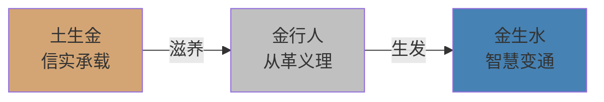
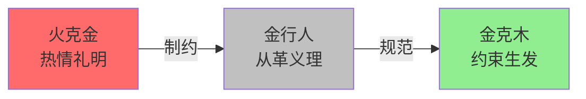
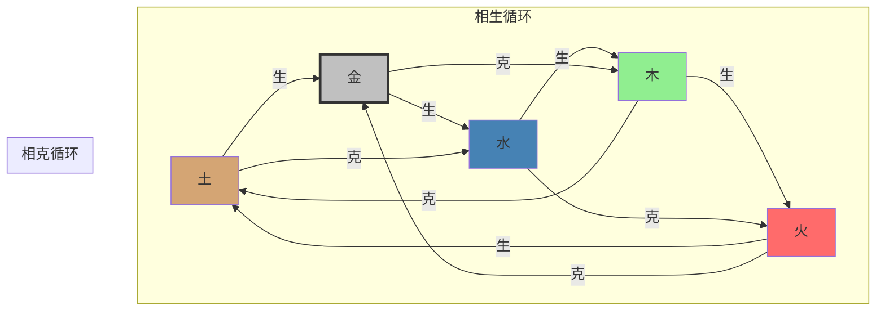
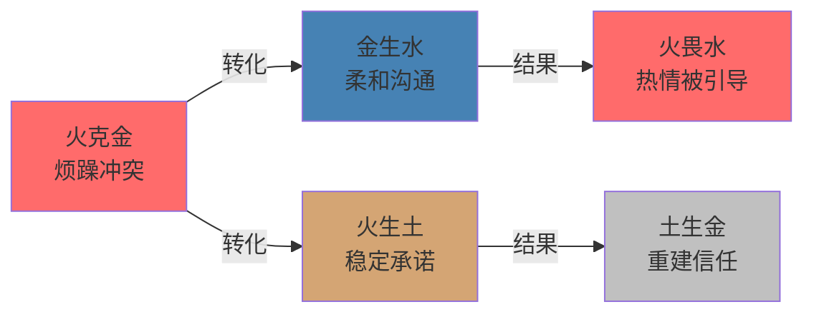
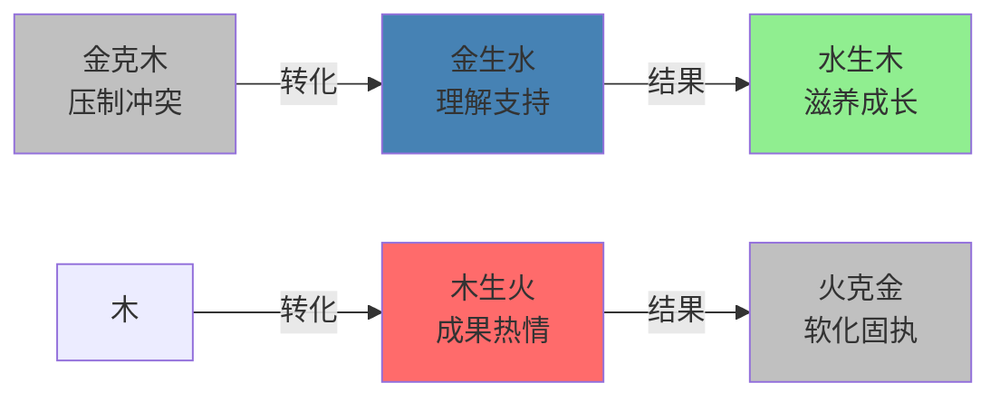
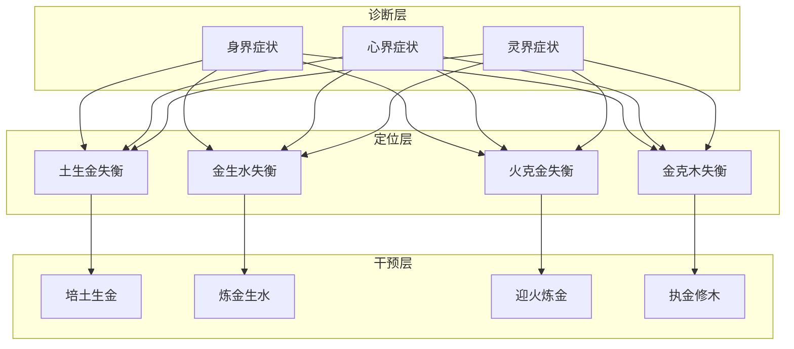

# 金智能体·知识图谱（五行关系网络）

> **图谱类型**：五行生克关系网络
> **核心节点**：金行人与四组生克关系
> **构建时间**：2026-03-27

---

## 一、核心节点定义

### 1.1 金行人节点

```yaml
节点ID: 金行人
节点类型: 五行人格类型
五行属性: 金
核心特质: 从革（收敛、肃降、坚固、锋利、变革、定义、规则、义理）
阴阳两面:
  阳金: 义德（仗义果断、坚守原则、冷静清醒、善于革新、公正无私、精炼圆融）
  阴金: 贪吝（尖酸刻薄、好胜计较、固执僵化、冷漠疏离、控制欲强、批判过度）
一心本源: 清明觉知（清明性+决断性）
三界显化:
  身界: 体型方正、动作利落、声音洪亮、面色白皙
  心界: 情绪主导为悲（冷静）、思维逻辑清晰、善于分析批判
  灵界: 价值观核心是"义"——明辨是非、公正无私
九层阶梯: 义贪阶梯（健康1-3级/一般4-6级/不健康7-9级）
```

### 1.2 关系节点定义

```yaml
节点ID: 土生金
关系类型: 相生（母生子）
关系本质: 信实承载生养义理决断
土行特质: 承载、信实、稳定、积累、资源、支持
生金机制: 土为金提供成形、稳固和壮大的根基
健康表现: 根基稳固、资源充沛、自信而不狂妄、果断而不轻率
失衡表现:
  - 土虚金弱: 原则飘忽、决策优柔、空谈理论
  - 土壅金滞: 过于谨慎、创新被压制、被繁文缛节所困
转化技术: 培土生金（建立知识库、微承诺兑现、寻求稳定支持）
```

```yaml
节点ID: 金生水
关系类型: 相生（子母关系）
关系本质: 义理精炼生发智慧变通
水行特质: 智慧、流动、变通、深度洞察、润泽
生水机制: 原则经过实践淬炼内化为深刻理解，知道何时坚持何时变通
健康表现: 逻辑清晰且洞察深刻、坚持原则且懂得圆融贯彻
失衡表现:
  - 金燥不生水: 言语尖刻、思维僵化、人际关系紧张
  - 水泛金沉: 过度妥协、失去原则、权威丧失
转化技术: 炼金生水（"我理解"前置练习、深度复盘、非暴力沟通）
```

```yaml
节点ID: 火克金
关系类型: 相克（官克我）
关系本质: 热情礼明软化冰冷刚硬
火行特质: 炎上、礼明、热情、愿景、感染力
克金机制: 火温暖金的冰冷，为原则注入方向和感染力，防止孤僻尖刻
健康表现: 冷静清醒且充满使命感、严谨细致且不乏人情味
失衡表现:
  - 火弱金寒: 冷漠无情、做事机械、缺乏感染力
  - 火旺金融: 心烦意乱、原则动摇、易怒、身心俱疲
转化技术: 迎火炼金（"阴金恼转阳金行"口诀、愿景链接原则、火-金平衡仪式）
```

```yaml
节点ID: 金克木
关系类型: 相克（我克财）
关系本质: 收敛规则约束生发散漫
木行特质: 生发、生长、创新、理想、生发
克木机制: 用规则标准规范引导过度散漫无序的生机，让创新有序落地
健康表现: 可靠边界设定者、用逻辑标准帮助创意优化落地
失衡表现:
  - 金强木折: 过度严苛、扼杀创意、团队活力丧失
  - 木亢金缺: 规则缺失、混乱失控、效率低下
转化技术: 执金修木（"创意经纪人"心态、框架内自由、MVP倡导、三明治反馈）
```

---

## 二、关系网络图谱

### 2.1 相生网络（滋养流向）



**相生能量流动**：
- 土（信实）→ 金（义理）：厚实的积累滋养清晰的决断
- 金（义理）→ 水（智慧）：原则的淬炼生发出变通的智慧

### 2.2 相克网络（制约流向）



**相克能量流动**：
- 火（热情）→ 金（义理）：温暖的锤炼防止冰冷僵化
- 金（规则）→ 木（生发）：边界的设定引导创新有序

### 2.3 完整五行网络



---

## 三、化克为生转化网络

### 3.1 火克金 → 化克为生



**转化口诀**：
- 金生水，火畏水：用柔和变通引导热情
- 火生土，土生金：用稳定承诺重建信任

### 3.2 金克木 → 化克为生



**转化口诀**：
- 金生水，水生木：用理解支持滋养成长
- 木生火，火克金：用成果热情软化固执

---

## 四、三界×五行交叉网络

### 4.1 诊断矩阵

| 失衡关系 | 身界症状 | 心界症状 | 灵界症状 |
|---------|---------|---------|---------|
| 土虚金弱 | 无力感 | 优柔寡断 | 缺乏底气 |
| 金燥不生水 | 皮肤干燥 | 言语尖刻 | 孤独愤懑 |
| 火弱金寒 | 冰冷感 | 冷漠无情 | 缺乏激情 |
| 火旺金融 | 呼吸道问题 | 心烦意乱 | 原则动摇 |
| 金强木折 | 肝气郁结 | 过度严苛 | 扼杀创新 |

### 4.2 干预网络



---

## 五、知识节点关联

### 5.1 与已有知识的连接

| 本图谱节点 | 关联知识 | 关联类型 | 双向链接 |
|-----------|---------|---------|---------|
| 金行人 | [[五行人格心理学总体系]] | 子系统嵌入 | 金行人 ⊂ 五行人格 |
| 土生金 | [[土行人格心理学]] | 相生关系 | 土生金 ↔ 土行人 |
| 金生水 | [[水行人格心理学]] | 相生关系 | 金生水 ↔ 水行人 |
| 火克金 | [[火行人格心理学]] | 相克关系 | 火克金 ↔ 火行人 |
| 金克木 | [[木行人格心理学]] | 相克关系 | 金克木 ↔ 木行人 |
| 拔阴取阳 | [[五行通关点能量循环]] | 方法论复用 | 拔阴取阳 = 通关技术 |
| 化克为生 | [[五行通关点能量循环]] | 方法论复用 | 化克为生 = 通关技术 |
| 觉知明镜 | [[一心·纯粹觉知]] | 本体对应 | 金行人一心 = 觉知明镜 |
| 从利刃到天尺 | [[大圆满见地]] | 哲学升华 | 超越 = 本自圆满 |

### 5.2 内部节点关联

```yaml
节点: 金行人
双向链接:
  - [[土生金]]: 母亲关系，根基滋养
  - [[金生水]]: 子女关系，智慧生发
  - [[火克金]]: 制约关系，锤炼升华
  - [[金克木]]: 规范关系，边界设定
  - [[阳金义德]]: 正面显化
  - [[阴金贪吝]]: 负面显化
  - [[拔阴取阳]]: 转化技术
  - [[化克为生]]: 关系转化
  - [[一心清明觉知]]: 本源回归
```

---

## 六、知识图谱可视化建议

### 6.1 Obsidian图谱配置

```yaml
节点颜色:
  金行人: "#C0C0C0"  # 银色
  土生金: "#D4A574"  # 土色
  金生水: "#4682B4"  # 水色
  火克金: "#FF6B6B"  # 火色
  金克木: "#90EE90"  # 木色
  阳金: "#FFD700"    # 金色
  阴金: "#696969"    # 暗灰色

连线样式:
  相生关系: 实线，箭头指向被生者
  相克关系: 虚线，箭头指向被克者
  转化关系: 点线，双向箭头

节点大小:
  核心节点（金行人）: 大
  关系节点（土生金等）: 中
  技术节点（拔阴取阳等）: 小
```

### 6.2 图谱层级

```
Layer 1: 核心层
  └── 金行人（一心·三界·五行·九层）

Layer 2: 关系层
  ├── 土生金（相生）
  ├── 金生水（相生）
  ├── 火克金（相克）
  └── 金克木（相克）

Layer 3: 技术层
  ├── 拔阴取阳（阴金→阳金）
  ├── 化克为生（火克金→金生水）
  └── 化克为生（金克木→金生水→水生木）

Layer 4: 应用层
  ├── 个人成长
  ├── 人际关系
  └── 团队管理
```

---

**知识图谱构建完成** | 五行关系网络已建立 | 双向链接已标注
