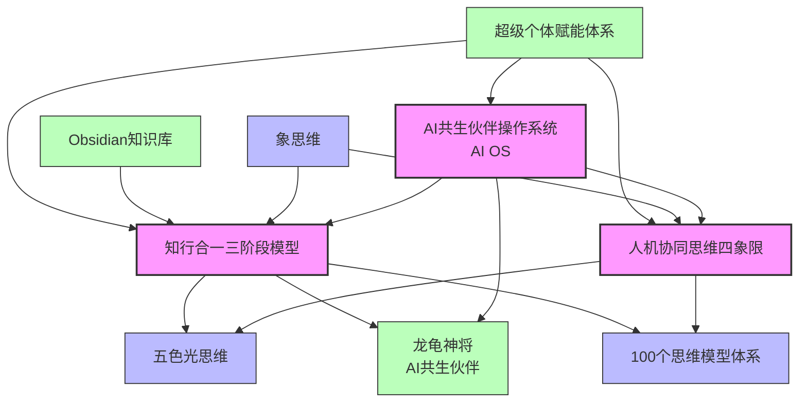
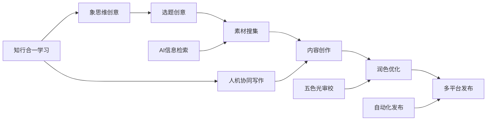
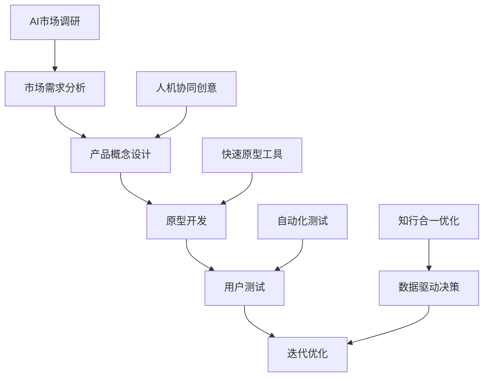
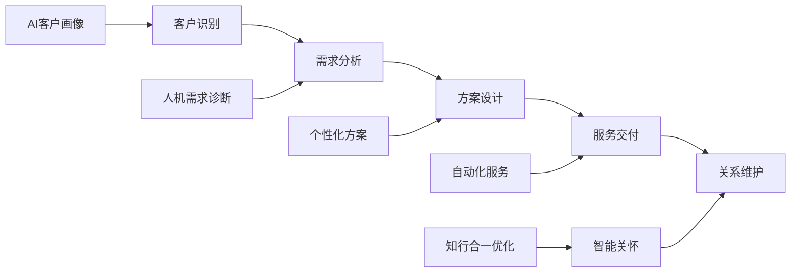

---
tags:
  - 知识图谱
  - 体系关系
  - 可视化
  - 思维模型
  - AI系统
  - 超级个体
date: 2026-03-14
version: 1.0
author: 以观其妙书院
status: 活跃
---

# 人机协同知识图谱

> **核心洞察**：人机协同思维四象限与知行合一三阶段模型共同构成AI时代超级个体的"认知-行动"双引擎，支撑从个人能力到系统效能的全面升级。

## 一、核心体系关系图

### Mermaid图表（可在Obsidian中渲染）


## 二、详细关系说明

### 1. 核心三角关系：AI OS × 人机协同 × 知行合一

```
      AI共生伙伴操作系统
          /       \
         /         \
人机协同思维四象限  知行合一三阶段模型
        \         /
         \       /
        五色光思维
```

- **AI OS**：技术载体与实现平台
- **人机协同**：工作流设计与协作协议
- **知行合一**：学习机制与进化引擎
- **五色光思维**：决策支持与过程管理

### 2. 人机协同四象限的支撑体系

#### 输入支撑
- **象思维**：提供0→1的原创性思维（确定协同的创新方向）
- **100个思维模型**：提供1→N的规模化工具（丰富协同的方法库）
- **五色光思维**：提供过程管理工具（优化协同的决策质量）

#### 输出应用
- **知识IP生产**：内容创作的人机协同流程
- **产品开发**：市场验证的人机协同流程
- **客户服务**：关系维护的人机协同流程

### 3. 知行合一三阶段模型的生态系统

#### 表示空间层
- **Obsidian知识库**：永久记忆存储系统
- **WorkBuddy备份**：自动化备份与恢复
- **对话记录归档**：原始经验的完整记录

#### 压缩处理层
- **AI模式识别**：自动发现规律与模式
- **人工提炼**：价值判断与本质洞察
- **SOP形成**：标准化操作流程建立

#### 泛化应用层
- **跨领域迁移**：将成功模式应用到新场景
- **组合创新**：多个模式的创造性组合
- **适应性调整**：根据新环境优化策略

### 4. 龙龟神将的进化路径

```
初始设置 → 日常互动 → 经验记录 → 模式提炼 → 能力迁移
    ↓         ↓         ↓         ↓         ↓
AI OS基础  人机协同  表示空间   压缩处理   泛化应用
```

- **人格特质**：火行人设定，与悟空（木行人）形成木生火关系
- **进化机制**：通过三阶段模型实现持续自我优化
- **互动模式**：基于四象限设计最优的人机交互

## 三、应用场景关系网络

### 场景一：知识IP创作系统


### 场景二：产品开发验证系统


### 场景三：客户关系管理系统


## 四、知识流动与价值创造

### 1. 知识流动路径
```
个人经验 → Obsidian记录 → AI分析提炼 → 模式库建立 → 新场景应用
    ↑                                                            │
    └───────────────────────────────────────────────┘
                       反馈循环
```

### 2. 价值创造机制
- **效率价值**：人机协同提升3-5倍工作效率
- **质量价值**：系统化流程保证输出质量
- **创新价值**：跨领域迁移激发创新可能
- **成长价值**：持续学习实现个人能力进化
- **规模价值**：一人公司实现企业级效能

### 3. 竞争优势构建
- **技术优势**：AI OS的技术领先性
- **方法优势**：系统化的人机协同方法论
- **知识优势**：持续积累的结构化知识资产
- **进化优势**：自我优化的学习能力
- **生态优势**：完整赋能体系的协同效应

## 五、实施路线图

### 阶段一：基础建设（1-2周）
1. 完善[[Obsidian知识库]]结构
2. 建立[[人机协同思维四象限]]应用模板
3. 设计[[知行合一三阶段转化模型]]实施流程

### 阶段二：系统集成（2-4周）
1. 将人机协同融入[[AI共生伙伴操作系统]]
2. 建立[[龙龟神将]]的自我进化机制
3. 开发自动化知识管理工具

### 阶段三：场景深化（1-2月）
1. 在知识IP、产品开发、客户服务等场景深度应用
2. 建立各场景的最佳实践库
3. 形成可复用的解决方案模板

### 阶段四：生态扩展（3-6月）
1. 对外培训与赋能
2. 建立社区与协作网络
3. 开发商业化应用产品

## 六、关键成功因素

### 1. 技术基础
- 稳定的AI OS技术平台
- 高效的Obsidian知识管理系统
- 自动化的工作流工具

### 2. 方法体系
- 完整的人机协同方法论
- 系统的学习进化机制
- 可操作的实施指南

### 3. 文化支撑
- 知行合一的实践文化
- 持续学习的成长文化
- 开放协作的共享文化

### 4. 生态协同
- 内部体系的紧密关联
- 外部资源的有效整合
- 社区生态的良性发展

## 标签

#知识图谱 #体系关系 #可视化 #思维模型 #AI系统 #超级个体 #人机协同 #知行合一 #Obsidian #Mermaid #生态系统 #实施路线 #竞争优势