# 企业家精神知识图谱

```mermaid
graph TB
    %% 核心节点 - 企业家精神
    ES[企业家精神构成与价值] 
    
    %% 五个核心精神
    ES --> 创新[创新精神-木]
    ES --> 冒险[冒险精神-火]
    ES --> 诚信[诚信精神-土]
    ES --> 敬业[敬业精神-金]
    ES --> 应变[应变精神-水]
    
    %% 创新精神子节点
    创新 --> 创新特征[核心特征]
    创新特征 --> 对现状不满[对现状不满]
    创新特征 --> 对未知好奇[对未知好奇]
    创新特征 --> 用户导向[用户导向思维]
    创新特征 --> 跨界整合[跨界整合能力]
    
    创新 --> 创新实践[实践维度]
    创新实践 --> 技术创新[技术创新]
    创新实践 --> 模式创新[模式创新]
    创新实践 --> 产品创新[产品创新]
    创新实践 --> 市场创新[市场创新]
    
    创新 --> 创新案例[经典案例]
    创新案例 --> 马斯克[马斯克-特斯拉]
    创新案例 --> 乔布斯[乔布斯-iPhone]
    创新案例 --> 马云[马云-阿里巴巴]
    创新案例 --> 雷军[雷军-小米]
    创新案例 --> 海底捞[海底捞-服务创新]
    
    %% 冒险精神子节点
    冒险 --> 冒险特征[核心特征]
    冒险特征 --> 理性评估[理性风险评估]
    冒险特征 --> 风险控制[风险控制能力]
    冒险特征 --> 抗压韧性[抗压与韧性]
    
    冒险 --> 冒险实践[实践维度]
    冒险实践 --> 战略冒险[战略冒险]
    冒险实践 --> 运营冒险[运营冒险]
    
    冒险 --> 冒险案例[经典案例]
    冒险案例 --> 任正非[任正非-华为研发]
    冒险案例 --> 比亚迪[比亚迪-新能源]
    
    %% 诚信精神子节点
    诚信 --> 诚信特征[核心特征]
    诚信特征 --> 客户诚信[对客户诚信]
    诚信特征 --> 员工诚信[对员工诚信]
    诚信特征 --> 伙伴诚信[对合作伙伴诚信]
    诚信特征 --> 长期主义[长期主义导向]
    
    诚信 --> 诚信价值[实践价值]
    诚信价值 --> 交易成本[降低交易成本]
    诚信价值 --> 市场规模[扩大市场规模]
    诚信价值 --> 危机应对[危机应对能力]
    
    诚信 --> 诚信案例[经典案例]
    诚信案例 --> 华为诚信[华为-以客户为中心]
    诚信案例 --> 同仁堂[同仁堂-古训坚守]
    诚信案例 --> 海底捞诚[海底捞-员工关怀]
    
    %% 敬业精神子节点
    敬业 --> 敬业特征[核心特征]
    敬业特征 --> 责任感[企业责任感]
    敬业特征 --> 事业热爱[事业热爱]
    敬业特征 --> 细节追求[细节追求]
    敬业特征 --> 专业精神[专业精神]
    
    敬业 --> 敬业实践[实践维度]
    敬业实践 --> 战略敬业[战略层面的敬业]
    敬业实践 --> 运营敬业[运营层面的敬业]
    敬业实践 --> 产品敬业[产品层面的敬业]
    敬业实践 --> 人才敬业[人才层面的敬业]
    
    敬业 --> 敬业案例[经典案例]
    敬业案例 --> 任正非敬[任正非-华为使命]
    敬业案例 --> 稻盛和夫[稻盛和夫-敬天爱人]
    敬业案例 --> 乔布斯敬[乔布斯-完美主义]
    敬业案例 --> 张勇[张勇-海底捞服务]
    
    %% 应变精神子节点
    应变 --> 应变特征[核心特征]
    应变特征 --> 渗透洞察[渗透式洞察]
    应变特征 --> 灵活适配[灵活适配性]
    应变特征 --> 韧性重生[韧性重生力]
    应变特征 --> 顺势而为[顺势而为]
    
    应变 --> 应变实践[实践维度]
    应变实践 --> 市场应变[市场应变]
    应变实践 --> 战略应变[战略应变]
    应变实践 --> 运营应变[运营应变]
    应变实践 --> 创新应变[创新应变]
    
    应变 --> 应变案例[经典案例]
    应变案例 --> 马云应变[马云-移动转型]
    应变案例 --> 王兴[王兴-美团拓展]
    应变案例 --> 雷军应变[雷军-小米调整]
    应变案例 --> 俞敏洪[俞敏洪-东方甄选]
    应变案例 --> 诺基亚[诺基亚-通信转型]
    
    %% 理论基础连接
    ES --> 理论基础[理论基础]
    理论基础 --> 张维迎[张维迎企业家理论]
    理论基础 --> 五行哲学[五行哲学]
    理论基础 --> 市场经济[市场经济原理]
    
    %% 实践应用连接
    ES --> 实践应用[实践应用]
    实践应用 --> 企业文化[企业文化建设]
    实践应用 --> 战略管理[战略管理]
    实践应用 --> 创新管理[创新管理]
    
    %% 关联知识体系连接
    ES --> 关联体系[关联知识体系]
    关联体系 --> 五行人格[五行人格心理学]
    关联体系 --> 思维模型[思维模型体系]
    关联体系 --> 文化智慧[文化智慧体系]
    
    %% 五行人格具体连接
    五行人格 --> 木型[木型人格特征]
    五行人格 --> 火型[火型人格特征]
    五行人格 --> 土型[土型人格特征]
    五行人格 --> 金型[金型人格特征]
    五行人格 --> 水型[水型人格特征]
    
    %% 思维模型连接
    思维模型 --> 五色光思维[五色光思维]
    思维模型 --> 五色光方法[教员方法论]
    思维模型 --> 自主进化[自主进化系统]
    
    %% 样式定义
    classDef core fill:#e1f5fe,stroke:#01579b,stroke-width:2px
    classDef element fill:#f3e5f5,stroke:#4a148c,stroke-width:1.5px
    classDef feature fill:#e8f5e8,stroke:#1b5e20,stroke-width:1px
    classDef practice fill:#fff3e0,stroke:#e65100,stroke-width:1px
    classDef case fill:#fce4ec,stroke:#880e4f,stroke-width:1px
    classDef theory fill:#e0f2f1,stroke:#004d40,stroke-width:1.5px
    classDef system fill:#f9fbe7,stroke:#827717,stroke-width:1.5px
    
    class ES core
    class 创新,冒险,诚信,敬业,应变 element
    class 创新特征,冒险特征,诚信特征,敬业特征,应变特征 feature
    class 创新实践,冒险实践,诚信价值,敬业实践,应变实践 practice
    class 创新案例,冒险案例,诚信案例,敬业案例,应变案例 case
    class 理论基础 theory
    class 实践应用,关联体系 system
```

## 图谱说明

### 核心节点
- **企业家精神构成与价值**：整个知识体系的核心和起点
- **五个核心精神**：创新（木）、冒险（火）、诚信（土）、敬业（金）、应变（水）

### 层次结构
1. **核心特征层**：每个精神的内在特质和表现
2. **实践维度层**：精神在具体业务中的应用领域
3. **经典案例层**：成功企业的实践案例
4. **理论基础层**：支撑理论体系
5. **实践应用层**：在企业管理和文化建设中的应用
6. **关联体系层**：与其他知识体系的连接

### 颜色编码
- **蓝色**：核心节点和概念
- **紫色**：五个核心精神（五行元素）
- **绿色**：特征描述和内在特质
- **橙色**：实践方法和应用维度
- **粉色**：具体案例和实例
- **青色**：理论基础和学术支撑
- **黄色**：系统应用和关联体系

### 知识关联路径
1. **纵向深入**：核心精神 → 特征 → 实践 → 案例
2. **横向扩展**：精神之间相互影响和支撑
3. **跨体系连接**：与五行人格、思维模型、文化智慧的关联

## 使用建议
1. **学习路径**：从核心节点开始，按颜色层次逐步深入
2. **关联思考**：注意不同颜色节点之间的连接关系
3. **实践应用**：将案例与具体工作场景结合思考
4. **体系整合**：理解企业家精神在整个知识体系中的位置

## 更新说明
本知识图谱基于[[企业家精神构成与价值]]体系创建，展示了五个核心精神的完整结构及其与其他知识体系的关联关系。图谱支持在Obsidian中通过Mermaid插件可视化展示。

## 标签
#知识图谱 #企业家精神 #五行框架 #可视化 #思维导图 #知识管理 #Obsidian #Mermaid