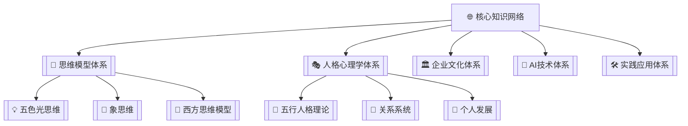
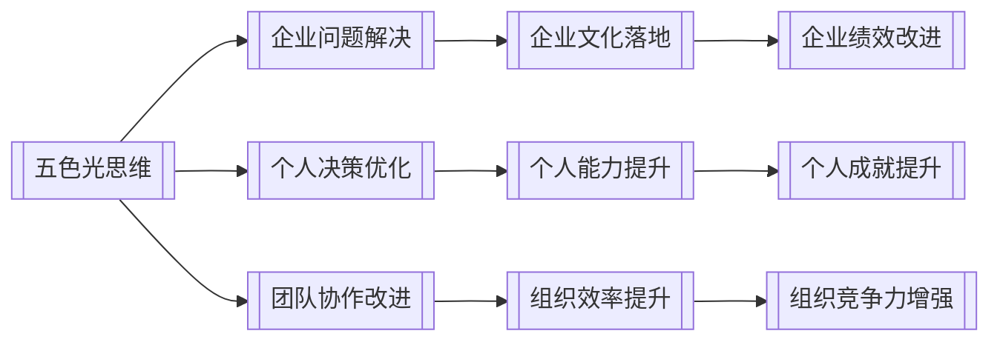
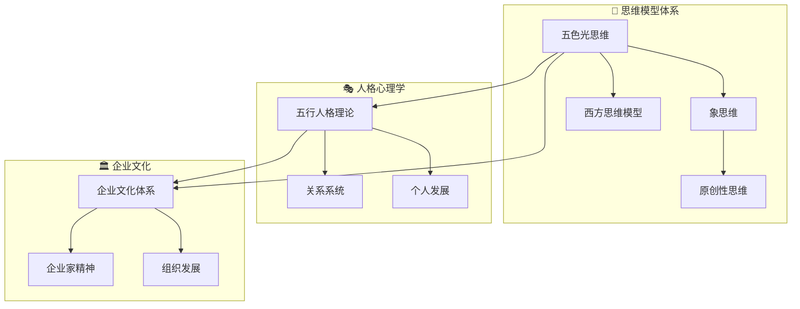
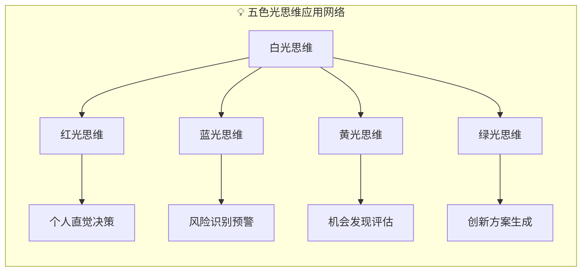
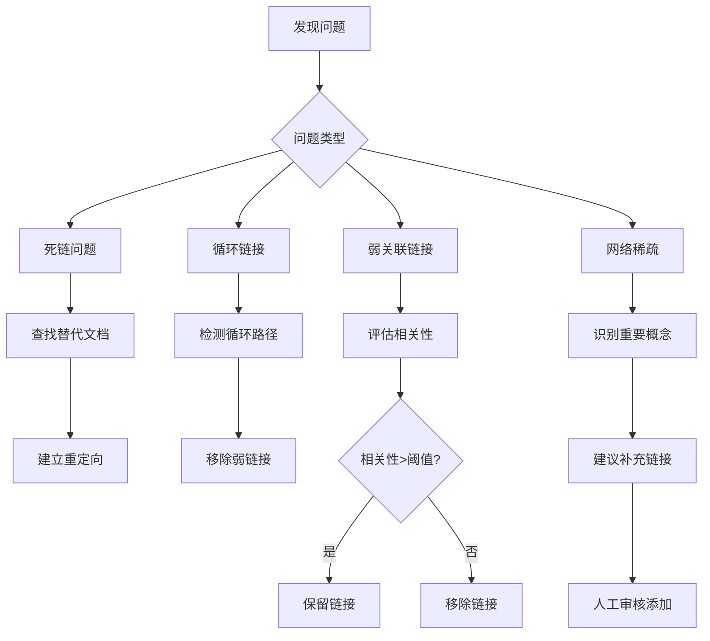

# 🔗 双向链接网络系统

---
**系统版本**: v1.0  
**核心功能**: 知识关联与网络构建  
**技术基础**: Obsidian双向链接 + Mermaid图表  
**维护周期**: 每日自动更新  

---

## 🎯 一、系统概述

### 1.1 设计理念
建立一个**自生长、自优化**的知识网络系统，通过双向链接将孤立的知识点连接成**有机的知识体**，实现知识的**涌现效应**和**智能检索**。

### 1.2 核心价值
- **知识关联**: 发现隐藏的知识连接
- **思维扩展**: 激发新的思考角度
- **学习加速**: 通过关联加速理解
- **创新激发**: 连接产生新的创意

### 1.3 系统架构
```
📁 双向链接网络系统/
├── 🔗 链接规则库/          # 链接建立规则和标准
├── 🌐 网络拓扑图/          # 可视化网络结构
├── 📊 关联分析器/          # 链接强度和质量分析
├── 🔄 自动链接器/          # 自动化链接建立
├── 🛡️ 链接验证器/          # 链接完整性和正确性验证
└── 📈 网络优化器/          # 网络密度和结构优化
```

---

## 📋 二、链接类型规范

### 2.1 基础链接类型
#### 概念链接
- **格式**: `[[概念名称]]`
- **说明**: 指向核心概念定义文档
- **示例**: `[[五色光思维]]`, `[[大圆满体系]]`

#### 方法链接
- **格式**: `[[方法名称-方法]]`
- **说明**: 指向具体方法文档
- **示例**: `[[知行合一三阶段转化模型-方法]]`

#### 案例链接
- **格式**: `[[案例名称-案例]]`
- **说明**: 指向案例分析文档
- **示例**: `[[企业文化建设成功-案例]]`

#### 人物链接
- **格式**: `[[人物名称-人物]]`
- **说明**: 指向人物档案文档
- **示例**: `[[龙龟神将-人物]]`, `[[悟空-人物]]`

#### 工具链接
- **格式**: `[[工具名称-工具]]`
- **说明**: 指向工具使用文档
- **示例**: `[[WorkBuddy-工具]]`, `[[Obsidian-工具]]`

### 2.2 高级链接类型
#### 关系链接
- **格式**: `[[文档A]] → [[文档B]]`
- **说明**: 表示文档间的特定关系
- **示例**: `[[五行人格心理学]] → [[个人发展路径]]`

#### 层次链接
- **格式**: `[[父概念]]/[[子概念]]`
- **说明**: 表示概念的层次关系
- **示例**: `[[思维模型体系]]/[[五色光思维]]`

#### 对比链接
- **格式**: `[[概念A]] vs [[概念B]]`
- **说明**: 表示概念间的对比关系
- **示例**: `[[象思维]] vs [[逻辑思维]]`

### 2.3 链接强度标记
#### 强度级别
1. **强链接** (🔴): 核心关联，必须建立
   - 格式: `[[核心概念|🔴]]`
   
2. **中链接** (🟡): 重要关联，建议建立
   - 格式: `[[重要概念|🟡]]`
   
3. **弱链接** (🔵): 扩展关联，可选建立
   - 格式: `[[扩展概念|🔵]]`

#### 关系类型标记
- **包含关系**: `[[子概念|⊂]]`
- **被包含关系**: `[[父概念|⊃]]`
- **相似关系**: `[[相似概念|≈]]`
- **对立关系**: `[[对立概念|≠]]`
- **因果关系**: `[[原因|→]]`, `[[结果|←]]`

---

## 🏗️ 三、网络构建规则

### 3.1 核心网络结构
#### 中心节点网络


#### 交叉关联网络


### 3.2 链接建立标准
#### 必须建立的链接
1. **概念定义链接**: 文档中首次提到的核心概念
2. **方法引用链接**: 文档中使用的具体方法
3. **案例参考链接**: 文档中引用的案例
4. **工具使用链接**: 文档中使用的工具
5. **人物提及链接**: 文档中提到的重要人物

#### 建议建立的链接
1. **背景知识链接**: 理解文档需要的背景知识
2. **扩展阅读链接**: 深入学习的相关资料
3. **相关领域链接**: 相关的其他知识领域
4. **实践应用链接**: 具体的实践应用场景

#### 避免建立的链接
1. **过度链接**: 同一概念在同一文档中出现多次只链接第一次
2. **无关链接**: 与文档内容无关的概念
3. **死链链接**: 指向不存在的文档
4. **循环链接**: 造成循环引用的链接

### 3.3 链接质量评估
#### 质量指标
- **相关性**: 链接内容与当前文档的相关程度
- **必要性**: 链接对理解文档的必要程度
- **准确性**: 链接指向的正确性
- **完整性**: 链接网络覆盖的完整程度

#### 评分标准
```yaml
高质量链接:
  - 相关性: >0.8
  - 必要性: 高
  - 准确性: 100%
  - 价值: 显著提升理解

中等质量链接:
  - 相关性: 0.5-0.8
  - 必要性: 中
  - 准确性: >95%
  - 价值: 有帮助但非必须

低质量链接:
  - 相关性: <0.5
  - 必要性: 低
  - 准确性: <95%
  - 价值: 可有可无
```

---

## 🔧 四、自动化链接系统

### 4.1 自动链接规则
#### 基于关键词的自动链接
```yaml
规则组1: 核心概念自动链接
  触发词: ["五色光", "象思维", "五行人格", "大圆满"]
  链接到: 对应的概念定义文档
  强度: 强链接

规则组2: 方法工具自动链接
  触发词: ["WorkBuddy", "Obsidian", "Python", "自动化"]
  链接到: 对应的工具文档
  强度: 中链接

规则组3: 人物角色自动链接
  触发词: ["龙龟神将", "悟空", "企业家", "学习者"]
  链接到: 对应的人物档案
  强度: 强链接
```

#### 基于上下文的智能链接
```yaml
上下文分析:
  输入: 文档全文内容
  输出: 建议链接列表
  算法: 
    - TF-IDF关键词提取
    - 语义相似度计算
    - 知识图谱路径分析
```

### 4.2 链接维护自动化
#### 每日自动任务
1. **新文档链接分析**: 分析新文档，建议链接
2. **死链检测修复**: 检测并修复死链
3. **链接质量评估**: 评估现有链接质量
4. **网络密度优化**: 优化网络连接密度

#### 每周自动任务
1. **网络拓扑更新**: 更新可视化图谱
2. **链接强度调整**: 基于使用频率调整链接强度
3. **关联模式发现**: 发现新的关联模式
4. **系统性能优化**: 优化链接检索性能

### 4.3 自动化工具集成
#### Python链接管理脚本
```python
# 主要功能模块
1. link_analyzer.py      # 链接分析器
2. auto_linker.py        # 自动链接器
3. link_validator.py     # 链接验证器
4. network_visualizer.py # 网络可视化器
5. report_generator.py   # 报告生成器
```

#### 配置参数
```yaml
auto_link:
  enabled: true
  min_relevance: 0.6
  max_links_per_doc: 20
  excluded_terms: ["的", "是", "在", "和"]
  
validation:
  check_dead_links: true
  check_circular_refs: true
  check_link_quality: true
  
visualization:
  update_frequency: daily
  layout_algorithm: force-directed
  node_size: based_on_centrality
```

---

## 📊 五、网络可视化系统

### 5.1 知识图谱类型
#### 全局知识图谱


#### 专题知识图谱


#### 时序知识图谱
```mermaid
timeline
    title 知识演进时间线
    section 第一阶段: 基础建立
        2025-Q1 : 思维模型体系搭建
        2025-Q2 : 人格心理学引入
    section 第二阶段: 体系完善
        2025-Q3 : 企业文化体系建立
        2025-Q4 : AI技术体系整合
    section 第三阶段: 应用深化
        2026-Q1 : 实践应用体系完善
        2026-Q2 : 系统优化升级
```

### 5.2 可视化参数配置
#### 节点参数
```yaml
节点样式:
  核心节点: 
    shape: circle
    size: 40
    color: #FF6B6B
    
  重要节点:
    shape: ellipse
    size: 30
    color: #4ECDC4
    
  普通节点:
    shape: rectangle
    size: 20
    color: #45B7D1
```

#### 连线参数
```yaml
连线样式:
  强关联:
    width: 3
    color: #FF6B6B
    style: solid
    
  中关联:
    width: 2
    color: #4ECDC4
    style: solid
    
  弱关联:
    width: 1
    color: #45B7D1
    style: dotted
```

#### 布局参数
```yaml
布局算法:
  全局图: force-directed
  专题图: hierarchical
  时序图: timeline
  
显示选项:
  显示标签: true
  显示方向: true
  交互模式: enabled
```

---

## 🛠️ 六、维护与优化

### 6.1 日常维护任务
#### 每日检查
- [ ] 新文档链接完整性检查
- [ ] 死链检测与修复
- [ ] 链接质量快速评估
- [ ] 网络密度监控

#### 每周优化
- [ ] 链接强度重新评估
- [ ] 网络拓扑结构优化
- [ ] 关联模式分析
- [ ] 系统性能调优

#### 每月深度维护
- [ ] 全面链接质量评估
- [ ] 网络结构重构
- [ ] 自动化规则更新
- [ ] 用户反馈分析

### 6.2 问题诊断与修复
#### 常见问题
1. **死链问题**: 链接目标文档不存在
   - **原因**: 文档重命名、移动或删除
   - **修复**: 自动重定向或建议新链接

2. **循环链接**: A→B→C→A的循环引用
   - **原因**: 过度链接或错误链接
   - **修复**: 检测并打破循环

3. **弱关联链接**: 相关性低的链接
   - **原因**: 自动链接误判或手动错误
   - **修复**: 移除或降级链接强度

4. **网络稀疏**: 重要概念连接不足
   - **原因**: 新内容未充分链接
   - **修复**: 建议补充链接

#### 修复流程


### 6.3 性能优化策略
#### 检索性能优化
- **索引优化**: 建立链接索引数据库
- **缓存策略**: 常用链接结果缓存
- **并行处理**: 多线程链接分析
- **增量更新**: 只更新变化部分

#### 存储优化
- **压缩存储**: 链接数据压缩存储
- **分区存储**: 按主题分区存储
- **备份策略**: 定期备份链接数据
- **清理策略**: 清理无效链接数据

---

## 📈 七、效果评估体系

### 7.1 评估指标
#### 网络质量指标
- **链接密度**: 平均每个文档的链接数
- **网络连通性**: 文档间的连接程度
- **聚类系数**: 网络中的簇集程度
- **平均路径长度**: 文档间的最短路径

#### 使用效果指标
- **检索效率**: 查找相关文档的速度
- **学习效果**: 通过链接学习的效果
- **创新激发**: 链接带来的新创意数量
- **用户满意度**: 用户对链接系统的评价

### 7.2 评估方法
#### 定量评估
```python
# 计算网络质量指标
def calculate_network_metrics(network):
    metrics = {
        'link_density': total_links / total_docs,
        'connectivity': connected_components / total_docs,
        'clustering_coefficient': calculate_clustering(network),
        'average_path_length': calculate_path_length(network)
    }
    return metrics
```

#### 定性评估
1. **用户调研**: 收集用户反馈意见
2. **专家评审**: 领域专家质量评估
3. **案例研究**: 具体应用效果分析
4. **对比实验**: 与传统方法的对比

### 7.3 改进策略
#### 基于评估的改进
- **密度不足**: 增加自动链接规则
- **质量不高**: 优化链接评估算法
- **性能不佳**: 优化检索和存储
- **体验不好**: 改进用户界面和交互

---

## 🚀 八、未来发展方向

### 8.1 短期目标（3个月）
- [ ] 实现基础自动化链接系统
- [ ] 建立完整的可视化体系
- [ ] 开发链接质量评估工具
- [ ] 优化用户交互体验

### 8.2 中期目标（6个月）
- [ ] 引入AI智能链接推荐
- [ ] 实现实时网络可视化
- [ ] 开发移动端链接应用
- [ ] 建立链接效果追踪系统

### 8.3 长期目标（12个月）
- [ ] 构建智能知识网络大脑
- [ ] 实现跨平台链接同步
- [ ] 开发个性化链接推荐
- [ ] 建立知识网络生态

---

## 📝 九、使用指南

### 9.1 快速上手
#### 第一步：理解链接类型
1. 学习基础链接格式
2. 了解不同链接类型
3. 掌握链接强度标记

#### 第二步：建立链接
1. 识别文档中的关键概念
2. 使用正确格式建立链接
3. 标记链接强度和关系

#### 第三步：维护链接
1. 定期检查链接质量
2. 修复死链和循环链接
3. 优化网络密度

### 9.2 最佳实践
#### 文档编写时的链接策略
1. **首次提及必链接**: 核心概念第一次出现时建立链接
2. **适度链接原则**: 避免过度链接，保持文档可读性
3. **链接类型匹配**: 使用正确的链接类型和标记
4. **链接质量优先**: 质量优于数量

#### 网络维护的最佳实践
1. **定期巡检**: 每周检查链接系统
2. **及时修复**: 发现问题立即修复
3. **持续优化**: 基于评估持续改进
4. **用户反馈**: 重视用户意见和建议

---

## 🔗 十、相关资源

### 核心文档
- [[标准化文档模板]]
- [[知识库文件夹体系规范]]
- [[对话记录归档模板]]

### 工具脚本
- [[链接管理Python脚本]]
- [[网络可视化配置]]
- [[自动化链接规则]]

### 学习资源
- [[双向链接使用教程]]
- [[知识网络构建指南]]
- [[网络优化最佳实践]]

---

> **系统设计理念**: 通过智能化的双向链接网络，将知识从孤立的信息点连接成有机的知识体，实现知识的自组织、自生长和自优化，为人机协同的知识创造提供基础设施。