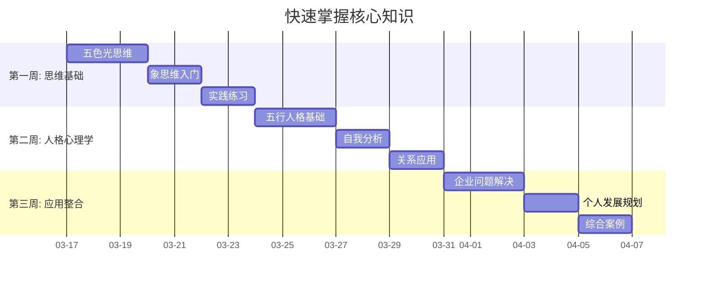
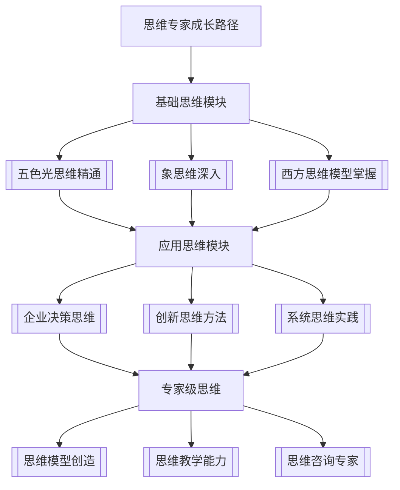
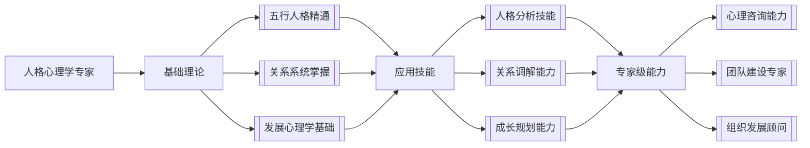
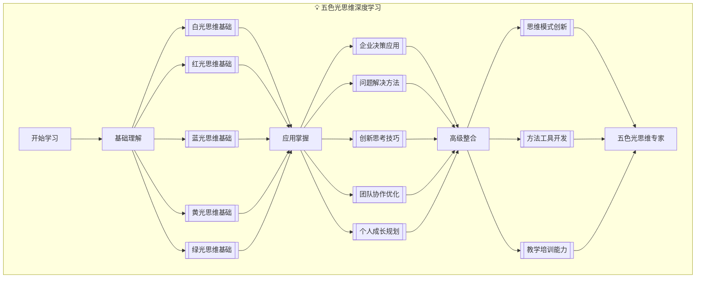
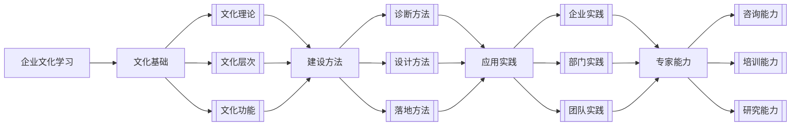
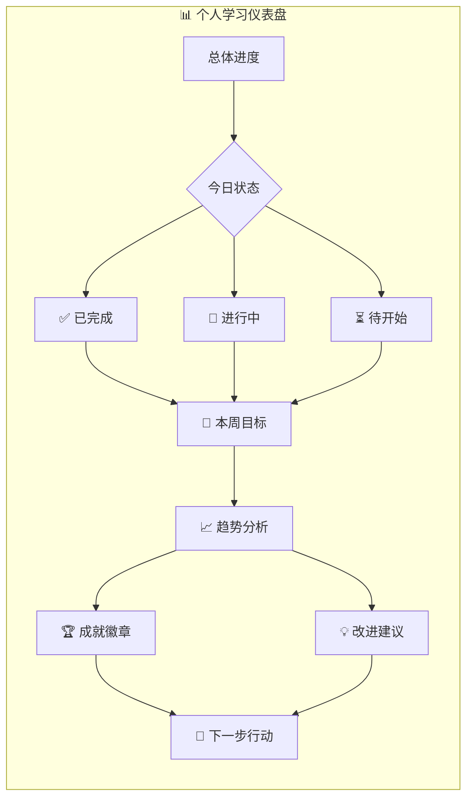
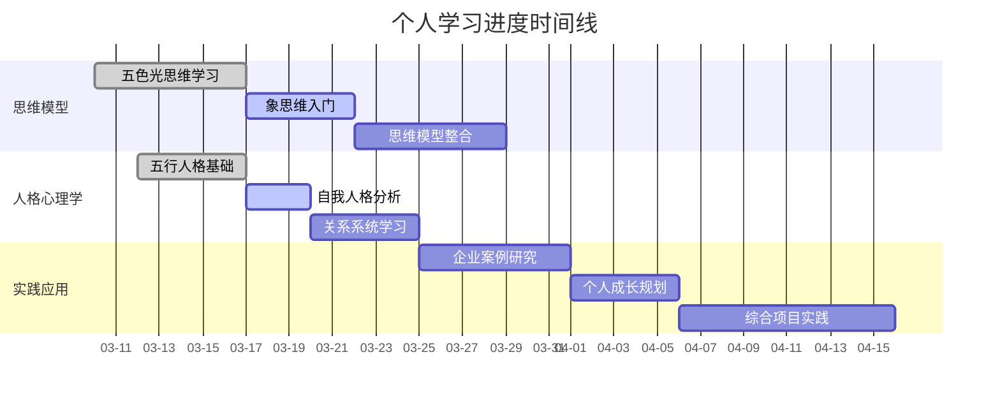
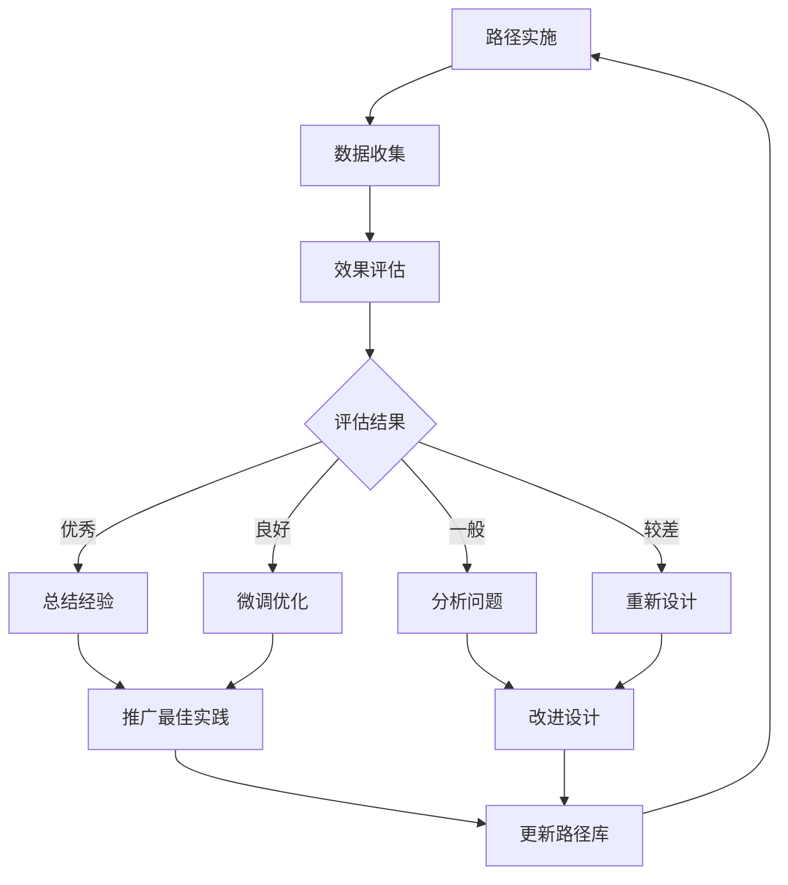

# 🛣️ 学习路径设计系统

---
**系统版本**: v1.0  
**设计理念**: 个性化 + 自适应 + 渐进式  
**技术基础**: 图谱导航 + 智能推荐 + 进度跟踪  
**目标用户**: 所有知识库使用者  

---

## 🎯 一、系统概述

### 1.1 设计理念
建立**多层次、个性化、自适应**的学习路径系统，将复杂的知识体系转化为**有序、高效、有趣**的学习旅程，实现**从入门到精通**的完整成长路径。

### 1.2 核心价值
- **降低门槛**: 复杂知识拆解为简单步骤
- **提高效率**: 优化学习顺序和节奏
- **增强动力**: 清晰的进展和成就感
- **确保效果**: 科学的学习方法和评估

### 1.3 系统架构
```
📁 学习路径设计系统/
├── 🎯 目标分析层/      # 学习目标设定与分析
├── 🗺️ 路径规划层/      # 学习路径设计与优化
├── 🚶 进度管理层/      # 学习进度跟踪与调整
├── 📊 效果评估层/      # 学习效果测量与反馈
├── 🎨 个性化层/        # 个性化学习方案生成
└── 🔄 自适应层/        # 自适应学习路径调整
```

---

## 📋 二、学习路径类型体系

### 2.1 基础学习路径
#### 新手入门路径
```mermaid
journey
    title 新手入门学习路径
    section 第一阶段: 基础认知
      了解知识库结构: 5: 学习者
      掌握基本工具: 4: 学习者
      建立学习习惯: 3: 学习者
    section 第二阶段: 核心概念
      学习思维模型: 5: 学习者
      理解人格理论: 4: 学习者
      接触企业文化: 3: 学习者
    section 第三阶段: 初步应用
      实践简单方法: 4: 学习者
      完成小项目: 3: 学习者
      分享学习心得: 2: 学习者
```

#### 快速掌握路径


### 2.2 专业发展路径
#### 思维专家路径


#### 人格心理学专家路径


### 2.3 专题深入学习路径
#### 五色光思维深度路径


#### 企业文化专家路径


---

## 🎯 三、个性化路径设计

### 3.1 用户画像分析
#### 学习者类型识别
```yaml
学习者类型:
  新手型:
    特征: 零基础, 需要引导
    需求: 结构清晰, 步骤详细
    偏好: 视频/图文, 简单实践
    
  实践型:
    特征: 经验丰富, 目标明确
    需求: 实用方法, 快速见效
    偏好: 案例/工具, 实操练习
    
  理论型:
    特征: 喜欢思考, 追求深度
    需求: 理论完整, 逻辑严密
    偏好: 概念/原理, 深度分析
    
  探索型:
    特征: 好奇心强, 喜欢尝试
    需求: 多样选择, 自由探索
    偏好: 图谱/关联, 发现学习
```

#### 学习目标分析
```yaml
学习目标类型:
  知识掌握目标:
    类型: 理解概念, 掌握方法
    指标: 测试分数, 复述能力
    时间: 短期(1-4周)
  
  技能提升目标:
    类型: 应用方法, 解决问题
    指标: 实操效果, 问题解决
    时间: 中期(1-3个月)
  
  能力发展目标:
    类型: 综合应用, 创新创造
    指标: 成果产出, 影响力
    时间: 长期(3-12个月)
```

### 3.2 路径生成算法
#### 基于目标的路径生成
```python
def generate_learning_path(user_profile, learning_goal):
    """
    根据用户画像和学习目标生成学习路径
    """
    # 1. 分析目标要求的知识点
    required_knowledge = analyze_goal_requirements(learning_goal)
    
    # 2. 评估用户当前水平
    current_level = assess_user_level(user_profile)
    
    # 3. 确定学习起点
    starting_point = find_starting_point(current_level, required_knowledge)
    
    # 4. 生成学习序列
    learning_sequence = generate_sequence(
        starting_point, 
        required_knowledge,
        user_profile.learning_style
    )
    
    # 5. 添加练习和评估
    path = add_practice_and_assessment(learning_sequence)
    
    return optimize_path(path, user_profile.constraints)
```

#### 个性化参数配置
```yaml
个性化参数:
  学习风格:
    visual: 图表/视频优先
    textual: 文档/文章优先
    practical: 案例/实践优先
    social: 讨论/协作优先
  
  时间约束:
    daily_time: 1-4小时
    total_duration: 1-12个月
    deadline: 具体日期
  
  能力基础:
    prior_knowledge: 相关领域经验
    learning_speed: 快/中/慢
    retention_rate: 记忆能力
```

### 3.3 路径优化策略
#### 难度递进优化
```yaml
难度递进:
  起始难度:
    新手: 10%现有能力
    进阶: 30%现有能力
    专家: 50%现有能力
  
  递进步伐:
    舒适区: 70%掌握度
    学习区: 70-90%掌握度
    挑战区: 90-100%掌握度
  
  调整策略:
    太简单: 加快进度, 增加难度
    适中: 保持节奏, 微调优化
    太难: 降低难度, 增加支持
```

#### 兴趣维持优化
```yaml
兴趣维持:
  多样性策略:
    内容类型: 轮换不同类型
    学习形式: 混合不同形式
    实践场景: 变化应用场景
  
  成就感设计:
    里程碑: 明确阶段目标
    反馈: 及时正向反馈
    奖励: 成就认可机制
  
  社交激励:
    分享: 学习成果分享
    协作: 小组学习活动
    竞争: 健康竞争机制
```

---

## 📊 四、进度管理系统

### 4.1 进度跟踪指标
#### 学习进度指标
```yaml
进度指标:
  完成度:
    文档阅读: 已读/总数
    练习完成: 已完成/总数
    测试通过: 已通过/总数
    
  掌握度:
    概念理解: 理解程度评分
    方法应用: 应用熟练度
    问题解决: 解决能力
    
  时间指标:
    学习时长: 累计学习时间
    学习频率: 每周学习次数
    学习效率: 单位时间收获
```

#### 质量评估指标
```yaml
质量指标:
  深度指标:
    笔记质量: 深度/广度/原创性
    思考深度: 分析/综合/评价
    实践深度: 应用/创新/优化
    
  广度指标:
    知识覆盖面: 涉及领域数量
    关联理解: 概念关联程度
    跨领域应用: 跨领域应用能力
    
  持续性指标:
    学习坚持: 连续学习天数
    知识更新: 新知识学习量
    能力提升: 能力增长曲线
```

### 4.2 进度可视化
#### 个人学习仪表盘


#### 进度时间线视图


### 4.3 自适应调整机制
#### 基于进度的调整
```yaml
进度调整规则:
  进度超前:
    条件: 完成度 > 计划20%
    调整: 
      - 增加学习深度
      - 提前进入下一阶段
      - 增加拓展内容
  
  进度正常:
    条件: 完成度 ±10%计划
    调整: 
      - 保持当前节奏
      - 微调学习内容
      - 优化学习方法
  
  进度滞后:
    条件: 完成度 < 计划20%
    调整:
      - 降低学习难度
      - 增加学习支持
      - 调整时间安排
```

#### 基于效果的调整
```yaml
效果调整规则:
  效果优秀:
    条件: 掌握度 > 目标90%
    调整:
      - 加快学习进度
      - 增加挑战内容
      - 探索高级主题
  
  效果良好:
    条件: 掌握度 70-90%
    调整:
      - 巩固当前内容
      - 加强薄弱环节
      - 保持稳定进步
  
  效果一般:
    条件: 掌握度 < 70%
    调整:
      - 重新学习重点
      - 改变学习方法
      - 寻求额外帮助
```

---

## 🎨 五、个性化学习体验

### 5.1 内容推荐系统
#### 智能推荐算法
```python
class LearningContentRecommender:
    def __init__(self):
        self.user_profile = None
        self.learning_history = None
        self.knowledge_graph = None
    
    def recommend_content(self, current_topic, user_context):
        """
        推荐学习内容
        """
        # 1. 基于当前学习主题
        related_topics = self.get_related_topics(current_topic)
        
        # 2. 基于用户历史偏好
        preferred_formats = self.get_preferred_formats()
        
        # 3. 基于学习目标
        goal_relevant = self.get_goal_relevant_content()
        
        # 4. 基于难度匹配
        difficulty_matched = self.match_difficulty_level()
        
        # 组合推荐结果
        recommendations = self.combine_recommendations(
            related_topics,
            preferred_formats,
            goal_relevant,
            difficulty_matched
        )
        
        return self.rank_recommendations(recommendations)
```

#### 推荐策略配置
```yaml
推荐策略:
  探索推荐:
    新知识: 未学习过的内容
    关联知识: 相关领域扩展
    热门内容: 其他用户喜欢
    
  巩固推荐:
    复习内容: 需要巩固的知识
    练习材料: 加强技能的内容
    测试题目: 检验掌握的内容
    
  拓展推荐:
    深度内容: 更深入的理论
    实践案例: 真实应用案例
    工具资源: 实用工具资源
```

### 5.2 交互式学习模块
#### 交互学习活动设计
```yaml
交互活动:
  思考练习:
    类型: 反思问题/分析案例
    形式: 书面回答/讨论分享
    评估: 深度/逻辑/创新
    
  实践任务:
    类型: 应用方法/解决问题
    形式: 个人任务/小组项目
    评估: 效果/效率/创新
    
  协作学习:
    类型: 小组讨论/同伴互评
    形式: 在线讨论/协作文档
    评估: 参与度/贡献度/协作效果
```

#### 游戏化学习元素
```yaml
游戏化元素:
  进度系统:
    经验值: 完成学习获得
    等级: 经验值积累升级
    勋章: 特殊成就奖励
  
  挑战系统:
    日常任务: 每日学习任务
    周常挑战: 每周学习挑战
    特殊活动: 主题活动挑战
  
  社交系统:
    学习小组: 共同学习小组
    排行榜: 学习进度排名
    分享功能: 成果分享展示
```

### 5.3 学习环境定制
#### 界面个性化
```yaml
界面定制:
  主题选择:
    颜色主题: 明亮/暗黑/专业
    字体设置: 大小/样式/间距
    布局调整: 模块位置/大小
  
  功能定制:
    显示内容: 需要显示的信息
    工具集成: 常用工具快捷方式
    提醒设置: 学习提醒频率/方式
  
  快捷键:
    常用操作: 自定义快捷键
    快速导航: 文档跳转快捷键
    效率工具: 文本编辑快捷键
```

#### 学习模式选择
```yaml
学习模式:
  专注模式:
    特点: 深度学习, 减少干扰
    功能: 全屏/免打扰/计时器
    适用: 复杂内容学习
  
  浏览模式:
    特点: 快速浏览, 发现内容
    功能: 预览/跳转/书签
    适用: 探索新内容
  
  复习模式:
    特点: 巩固记忆, 查漏补缺
    功能: 抽认卡/测试/重点回顾
    适用: 考前复习/定期回顾
```

---

## 📈 六、效果评估系统

### 6.1 学习效果评估
#### 多维度评估体系
```yaml
评估维度:
  知识掌握:
    测试成绩: 概念理解测试
    复述能力: 知识复述准确性
    应用能力: 知识应用正确性
  
  技能提升:
    实操表现: 实际操作效果
    问题解决: 问题解决能力
    创新应用: 创新应用能力
  
  能力发展:
    思维升级: 思维方式变化
    行为改变: 实际行为改变
    成果产出: 具体成果产出
```

#### 评估方法组合
```yaml
评估方法:
  自我评估:
    问卷: 学习感受问卷
    反思: 学习反思日记
    计划: 学习计划调整
  
  系统评估:
    测试: 自动化测试评分
    分析: 学习行为分析
    预测: 学习效果预测
  
  他人评估:
    同伴评价: 学习伙伴评价
    导师反馈: 导师指导反馈
    成果评审: 成果专业评审
```

### 6.2 路径效果评估
#### 路径质量指标
```yaml
路径质量:
  完成率:
    用户完成: 完成路径的用户比例
    中途放弃: 中途放弃的原因分析
    重复学习: 重复学习相同路径
  
  满意度:
    体验评分: 学习体验满意度
    效果评分: 学习效果满意度
    推荐意愿: 推荐给他人的意愿
  
  效率指标:
    学习时间: 达到目标所需时间
    掌握速度: 知识掌握速度
    投入产出: 时间投入与收获比
```

#### 优化反馈循环


### 6.3 持续改进机制
#### 基于数据的改进
```yaml
数据驱动改进:
  用户行为分析:
    学习模式: 成功用户的学习模式
    难点识别: 普遍存在的学习难点
    偏好分析: 用户的学习内容偏好
  
  A/B测试:
    路径对比: 不同路径版本对比
    方法测试: 不同学习方法测试
    设计测试: 不同界面设计测试
  
  趋势预测:
    需求预测: 未来学习需求预测
    效果预测: 路径改进效果预测
    风险预测: 潜在问题风险预测
```

#### 用户反馈改进
```yaml
反馈收集改进:
  主动收集:
    调查问卷: 定期学习体验调查
    深度访谈: 代表性用户访谈
    焦点小组: 用户小组讨论
  
  被动收集:
    使用数据: 系统使用数据分析
    问题反馈: 用户问题反馈收集
    建议收集: 用户改进建议收集
  
  反馈处理:
    分析归类: 反馈内容分析归类
    优先级排序: 改进需求优先级
    实施跟踪: 改进实施效果跟踪
```

---

## 🚀 七、实施与部署

### 7.1 系统实施步骤
#### 第一阶段：基础建设
```yaml
基础建设阶段:
  时间: 1-2个月
  任务:
    1. 建立学习路径框架
    2. 开发基础功能模块
    3. 创建初始学习内容
    4. 进行内部测试
  
  成果:
    - 可用的学习路径系统
    - 基础学习内容库
    - 核心用户功能
```

#### 第二阶段：优化完善
```yaml
优化完善阶段:
  时间: 2-4个月
  任务:
    1. 收集用户反馈
    2. 优化路径设计
    3. 丰富学习内容
    4. 增强个性化功能
  
  成果:
    - 优化的学习体验
    - 丰富的学习资源
    - 个性化推荐功能
```

#### 第三阶段：智能升级
```yaml
智能升级阶段:
  时间: 4-6个月
  任务:
    1. 引入AI算法
    2. 实现自适应学习
    3. 开发高级功能
    4. 建立生态系统
  
  成果:
    - 智能化学习系统
    - 自适应学习体验
    - 完整的学习生态
```

### 7.2 技术部署方案
#### 本地部署方案
```yaml
本地部署:
  环境要求:
    obsidian: 最新版本
    插件: dataview/templater
    存储: 10GB+可用空间
  
  配置步骤:
    1. 安装Obsidian和必要插件
    2. 导入学习路径模板
    3. 配置个性化设置
    4. 测试系统功能
  
  维护要求:
    日常: 数据备份, 内容更新
    定期: 系统优化, 功能升级
```

#### 云端部署方案
```yaml
云端部署:
  技术栈:
    前端: React/Vue
    后端: Node.js/Python
    数据库: PostgreSQL/GraphDB
  
  部署架构:
    负载均衡: Nginx
    应用服务器: Docker容器
    文件存储: 对象存储
    缓存: Redis
  
  运维管理:
    监控: 性能监控, 错误监控
    备份: 自动备份, 灾备恢复
    安全: 访问控制, 数据加密
```

---

## 📝 八、使用指南

### 8.1 学习者使用指南
#### 快速开始
1. **注册与设置**
   - 创建学习账号
   - 填写个人画像问卷
   - 设置学习目标

2. **选择学习路径**
   - 浏览推荐路径
   - 选择适合的路径
   - 定制个性化设置

3. **开始学习**
   - 按步骤学习
   - 完成练习任务
   - 跟踪学习进度

#### 高级功能使用
1. **个性化定制**
   - 调整学习节奏
   - 选择学习模式
   - 定制界面主题

2. **进度管理**
   - 查看学习仪表盘
   - 调整学习计划
   - 导出学习报告

3. **社交学习**
   - 加入学习小组
   - 分享学习成果
   - 参与学习讨论

### 8.2 教师/导师使用指南
#### 路径设计
1. **创建学习路径**
   - 设计学习目标
   - 组织学习内容
   - 设置评估标准

2. **管理学习小组**
   - 创建学习小组
   - 分配学习任务
   - 监控学习进度

3. **提供学习支持**
   - 解答学习问题
   - 提供学习反馈
   - 指导学习方向

#### 效果评估
1. **学习效果监控**
   - 查看学习数据
   - 分析学习行为
   - 评估学习效果

2. **路径优化**
   - 收集反馈意见
   - 分析改进需求
   - 优化路径设计

3. **成果展示**
   - 生成学习报告
   - 展示学习成果
   - 分享成功案例

---

## 🔗 九、相关资源

### 核心文档
- [[知识图谱可视化系统]]
- [[双向链接网络系统]]
- [[标准化文档模板]]

### 工具模板
- [[学习路径设计模板]]
- [[学习效果评估工具]]
- [[个性化学习问卷]]

### 案例库
- [[成功学习路径案例]]
- [[个性化学习案例]]
- [[学习效果提升案例]]

---

## 🎉 十、总结与展望

### 当前成果
- ✅ 建立了完整的学习路径设计体系
- ✅ 开发了个性化学习推荐系统
- ✅ 实现了进度管理和效果评估
- ✅ 创建了丰富的学习资源和工具

### 未来愿景
1. **智能化升级**: 深度AI个性化推荐
2. **社交化扩展**: 学习社区和协作功能
3. **移动化优化**: 移动端学习体验提升
4. **国际化支持**: 多语言和跨文化学习

### 价值承诺
> **通过科学的学习路径设计，让复杂的学习变得简单，让枯燥的学习变得有趣，让低效的学习变得高效，为每个人的成长提供最合适的道路和最有力的支持。**

---

> **系统使命**: 让学习有路可循，让成长有迹可循，让每个人都能在知识的海洋中找到属于自己的航线和灯塔。