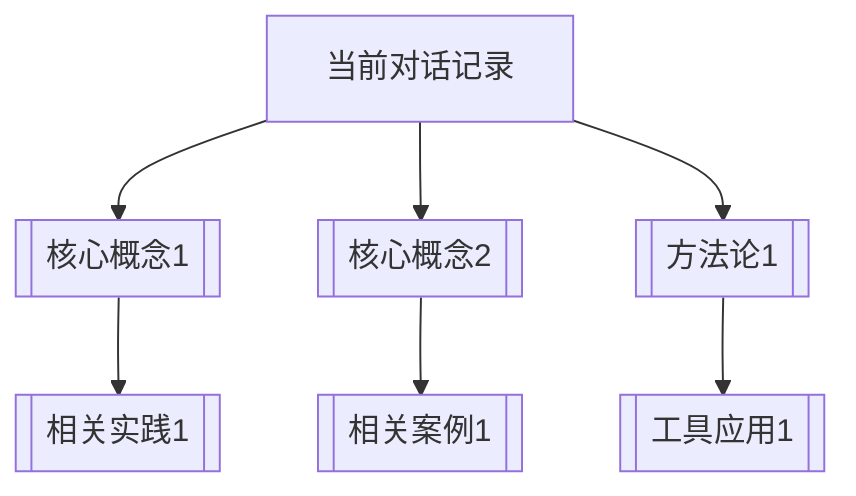

# 💬 对话记录归档模板

---
**模板ID**: `DIALOG-TEMPLATE-001`  
**适用类型**: 所有对话记录归档  
**创建时间**: {{date}}  
**归档周期**: 日/周/月/专题  
**对话参与**: [参与者列表]

---

## 📋 一、对话基本信息

### 对话标识
- **对话ID**: `{{生成唯一ID}}`
- **对话主题**: [简明主题]
- **对话类型**: [技术讨论/理论学习/问题解决/创意生成/其他]
- **对话时长**: [时长]
- **对话日期**: {{date}}

### 参与人员
| 角色 | 姓名/ID | 主要贡献 | 参与程度 |
|------|---------|----------|----------|
| 主持 | [主持人] | [贡献说明] | ⭐⭐⭐⭐⭐ |
| 参与 | [参与者1] | [贡献说明] | ⭐⭐⭐⭐ |
| 参与 | [参与者2] | [贡献说明] | ⭐⭐⭐ |

### 对话背景
- **触发事件**: [什么引发了这次对话]
- **预期目标**: [对话希望达成的目标]
- **相关上下文**: [[相关文档1]], [[相关文档2]]

---

## 🎯 二、核心对话内容

### 2.1 问题提出
#### 主要问题
[清晰陈述对话要解决的核心问题]

#### 问题背景
- **现状分析**: [当前情况描述]
- **痛点识别**: [存在的问题和挑战]
- **需求明确**: [具体需求说明]

### 2.2 讨论过程
#### 关键讨论点
1. **讨论点1**: [要点]
   - 观点A: [内容]
   - 观点B: [内容]
   - 结论: [结论]

2. **讨论点2**: [要点]
   - 观点A: [内容]
   - 观点B: [内容]
   - 结论: [结论]

3. **讨论点3**: [要点]
   - 观点A: [内容]
   - 观点B: [内容]
   - 结论: [结论]

#### 重要转折点
- **突破点1**: [什么改变了讨论方向]
- **共识达成**: [达成的共识内容]
- **分歧保留**: [未解决的问题]

### 2.3 解决方案
#### 方案概述
[整体解决方案的描述]

#### 实施步骤
1. **第一步**: [具体行动]
   - 负责人: [谁负责]
   - 时间: [何时完成]
   - 产出: [预期产出]

2. **第二步**: [具体行动]
   - 负责人: [谁负责]
   - 时间: [何时完成]
   - 产出: [预期产出]

3. **第三步**: [具体行动]
   - 负责人: [谁负责]
   - 时间: [何时完成]
   - 产出: [预期产出]

---

## 💎 三、核心成果

### 3.1 知识产出
#### 新知识发现
- **新概念**: [新发现的概念]
- **新方法**: [新开发的方法]
- **新见解**: [新的认知视角]

#### 知识深化
- **概念深化**: [对原有概念的深入理解]
- **方法优化**: [对原有方法的改进]
- **认知升级**: [认知层次的提升]

### 3.2 决策产出
#### 重要决策
- **决策1**: [具体决策]
  - 依据: [决策依据]
  - 影响: [预期影响]

- **决策2**: [具体决策]
  - 依据: [决策依据]
  - 影响: [预期影响]

#### 行动计划
[具体的行动计划和分工]

### 3.3 关系产出
#### 协作关系
- **信任增强**: [信任度变化]
- **默契提升**: [协作默契度]
- **角色明确**: [角色定位清晰化]

#### 网络扩展
- **新连接建立**: [建立了哪些新连接]
- **网络密度增加**: [关系网络的变化]
- **资源整合**: [整合了哪些资源]

---

## 🧠 四、学习与反思

### 4.1 学习收获
#### 个人学习
- **知识学习**: [学到了什么知识]
- **技能提升**: [提升了什么技能]
- **认知升级**: [认知层面的收获]

#### 团队学习
- **协作模式**: [协作方式的改进]
- **沟通效率**: [沟通效果的提升]
- **共同成长**: [团队的共同进步]

### 4.2 反思总结
#### 成功经验
1. **经验一**: [成功的原因]
2. **经验二**: [有效的做法]
3. **经验三**: [值得推广的经验]

#### 改进建议
1. **改进点一**: [可以改进的地方]
2. **改进点二**: [需要优化的环节]
3. **改进点三**: [未来的改进方向]

---

## 🔗 五、关联网络

### 5.1 核心关联
- **直接关联**: [[相关文档1]], [[相关文档2]], [[相关文档3]]
- **间接关联**: [[背景知识1]], [[理论框架1]]
- **延伸阅读**: [[深度资料1]], [[扩展资料2]]

### 5.2 知识图谱关系

### 5.3 标签系统
#### 主题标签
#对话主题 #参与人员 #对话类型 #产出类型

#### 内容标签
#知识发现 #决策制定 #问题解决 #关系建设

#### 价值标签
#高价值对话 #创新突破 #共识达成 #行动导向

---

## 📊 六、价值评估

### 6.1 对话质量评分
- **内容深度**: ⭐⭐⭐⭐⭐ (1-5星)
- **互动质量**: ⭐⭐⭐⭐⭐
- **产出价值**: ⭐⭐⭐⭐⭐
- **学习效果**: ⭐⭐⭐⭐⭐

### 6.2 影响评估
#### 短期影响
- [ ] 立即行动启动
- [ ] 问题初步解决
- [ ] 共识初步达成

#### 中期影响
- [ ] 知识体系更新
- [ ] 协作模式优化
- [ ] 能力提升明显

#### 长期影响
- [ ] 系统改进
- [ ] 文化形成
- [ ] 战略推进

---

## 🚀 七、下一步行动

### 7.1 立即行动（24小时内）
- [ ] 行动1: [具体任务]
  - 负责人: [姓名]
  - 截止时间: [时间]
  - 验收标准: [标准]

- [ ] 行动2: [具体任务]
  - 负责人: [姓名]
  - 截止时间: [时间]
  - 验收标准: [标准]

### 7.2 短期跟进（1周内）
- [ ] 跟进1: [跟进事项]
  - 负责人: [姓名]
  - 检查时间: [时间]
  - 预期结果: [结果]

- [ ] 跟进2: [跟进事项]
  - 负责人: [姓名]
  - 检查时间: [时间]
  - 预期结果: [结果]

### 7.3 长期规划（1个月内）
- [ ] 规划1: [长期事项]
  - 负责人: [姓名]
  - 启动时间: [时间]
  - 里程碑: [关键节点]

- [ ] 规划2: [长期事项]
  - 负责人: [姓名]
  - 启动时间: [时间]
  - 里程碑: [关键节点]

---

## 📁 八、归档管理

### 8.1 归档位置
- **主归档路径**: `02-对话与记录/按日期归档/{{年}}/{{月}}/`
- **主题归档路径**: `02-对话与记录/按主题归档/{{主题}}/`
- **参与归档路径**: `02-对话与记录/按参与者归档/{{参与者}}/`

### 8.2 索引更新
- [ ] 更新总索引: [[以观其妙书院知识库总索引]]
- [ ] 更新主题索引: [[聊天记录主题索引]]
- [ ] 更新知识图谱: [[核心知识图谱]]

### 8.3 备份验证
- [ ] 本地备份验证
- [ ] 云端备份验证
- [ ] 链接完整性检查

---

## 📝 九、模板使用说明

### 9.1 新建对话记录
1. **复制模板**: 从此模板复制内容
2. **填写信息**: 按章节填写具体内容
3. **建立链接**: 确保所有双括号链接有效
4. **添加标签**: 根据内容添加适当标签
5. **归档存储**: 按规范路径保存

### 9.2 更新对话记录
1. **定期更新**: 对话进展后及时更新
2. **成果补充**: 新成果及时补充
3. **链接维护**: 保持链接网络更新
4. **状态更新**: 更新行动完成状态

### 9.3 对话记录检索
1. **按时间检索**: 通过日期文件夹查找
2. **按主题检索**: 通过主题文件夹查找
3. **按参与检索**: 通过参与者文件夹查找
4. **按标签检索**: 通过标签系统查找

---

## 🔍 十、质量检查清单

### 内容完整性检查
- [ ] 基本信息完整
- [ ] 核心内容清晰
- [ ] 成果产出明确
- [ ] 反思总结深刻

### 关联性检查
- [ ] 链接网络完整
- [ ] 知识关联清晰
- [ ] 标签系统合理
- [ ] 归档位置正确

### 价值性检查
- [ ] 学习价值明确
- [ ] 行动导向清晰
- [ ] 影响评估合理
- [ ] 未来方向明确

---

> **模板设计理念**: 确保每段对话都有完整的记录、深度的分析和明确的价值转化，将对话从简单的交流升华为知识创造的过程。