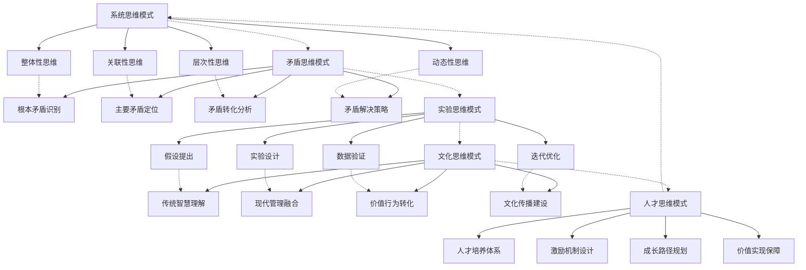
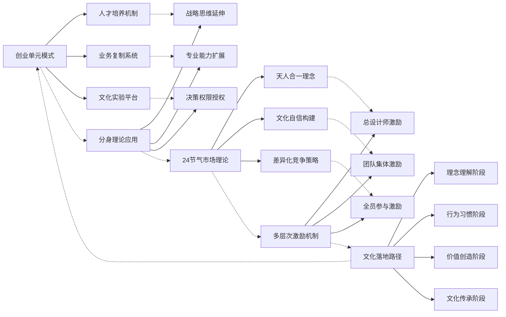
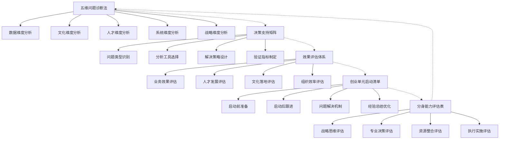
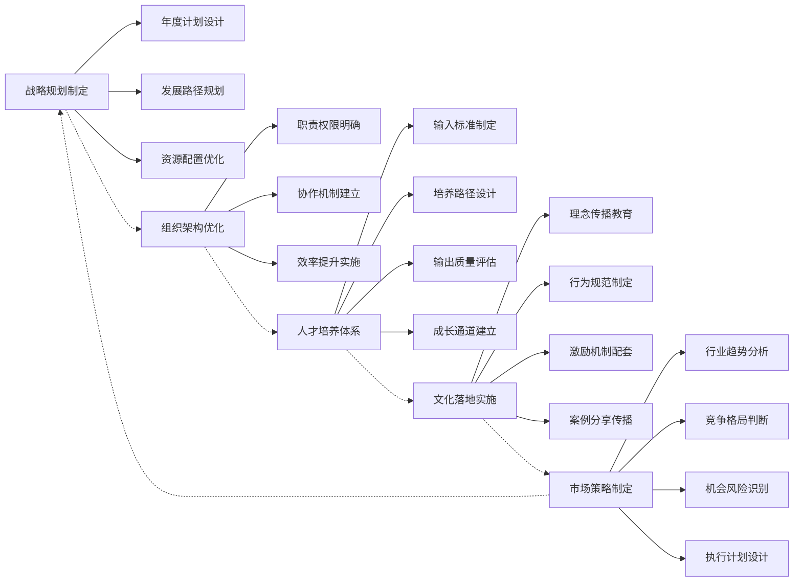
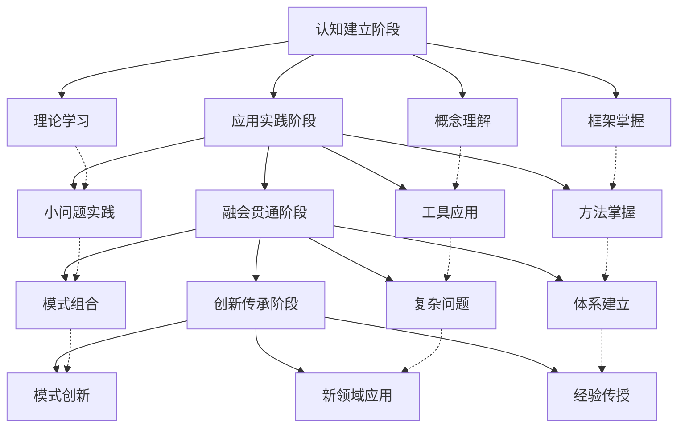
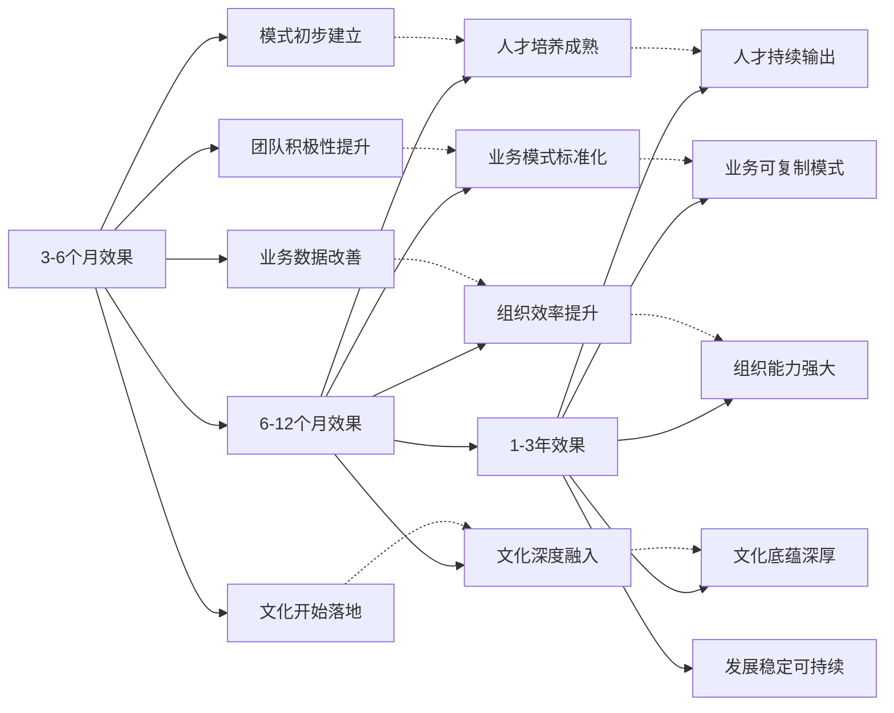
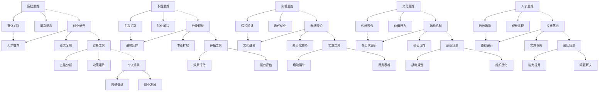

# 思维模式图谱

## 🗺️ 图谱概述
本图谱可视化展示了从聊天记录3中提取的所有思维模式、管理方法和工具之间的关联关系，帮助理解和应用完整的认知框架。

## 🧭 核心思维模式网络

## 🔗 管理方法关联图

## 🛠️ 工具方法网络

## 🎯 应用场景关联图

## 🔄 学习成长路径图

## 📊 效果评估关联图

## 🌐 完整知识体系图

## 🎨 图谱使用指南

### 阅读顺序建议
1. **从核心思维模式开始**：理解五种核心思维模式的基本概念
2. **学习管理方法**：掌握创业单元、分身理论等管理方法
3. **熟悉工具方法**：学习各种诊断、评估、实施工具的使用
4. **探索应用场景**：了解在企业、团队、个人不同场景的应用
5. **跟踪学习路径**：按照学习成长路径逐步提升能力
6. **关注效果评估**：了解短期、中期、长期的效果预期

### 图谱应用方法
1. **问题诊断**：使用思维模式图谱分析问题的思维层面
2. **方案设计**：参考管理方法关联图设计解决方案
3. **工具选择**：根据工具方法网络选择适合的工具
4. **场景匹配**：对照应用场景关联图确定适用场景
5. **路径规划**：按照学习成长路径图规划个人发展
6. **效果预期**：参考效果评估关联图设定合理预期

### 交互使用方法
1. **双向链接跳转**：点击图谱中的链接跳转到详细文档
2. **图谱导航**：使用图谱作为知识体系的导航工具
3. **关联发现**：通过图谱发现知识之间的隐藏关联
4. **路径规划**：使用图谱规划学习和应用路径
5. **体系理解**：通过图谱理解完整知识体系的架构
6. **更新维护**：根据实践反馈更新和维护图谱

### 图谱维护建议
1. **定期更新**：每季度更新一次图谱，反映最新知识
2. **案例补充**：添加新的应用案例和实践经验
3. **关联优化**：优化知识之间的关联关系和路径
4. **工具完善**：补充新的工具方法和使用技巧
5. **场景扩展**：扩展新的应用场景和使用方法
6. **效果跟踪**：跟踪实际应用效果，优化效果评估

---

**图谱类型**：思维模式和管理方法可视化图谱  
**数据来源**：聊天记录3分析和知识提炼  
**更新日期**：2026年3月16日  
**维护周期**：每季度更新维护  
**关联系统**：Obsidian知识库双向链接系统  
**使用价值**：知识体系可视化、关联关系理解、应用路径规划  
**交互功能**：支持双向链接跳转和知识导航