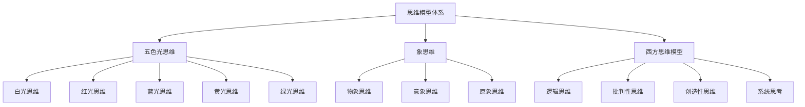
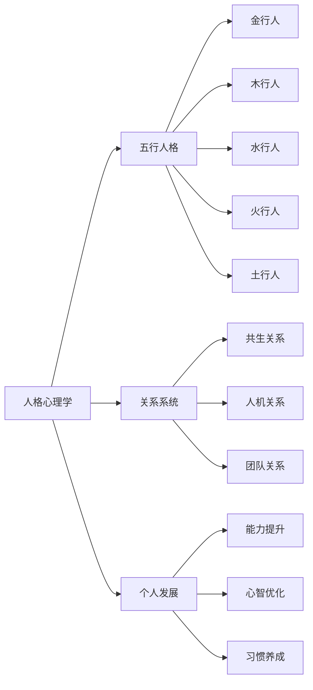
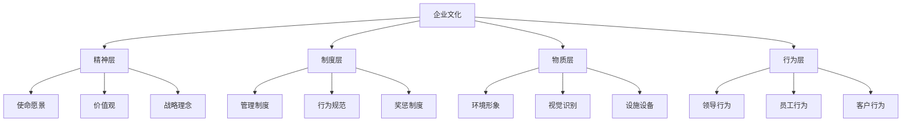

# 🏛️ 以观其妙书院知识库总索引

---
**索引版本**: v2.0  
**更新日期**: 2026-03-17  
**文档总数**: 约400+个Markdown文档  
**链接总数**: {{统计中}}  
**维护状态**: 🟢 活跃更新

---

## 📊 文档统计

**统计时间**: 2026-03-17
**总文档数**: 约400+个Markdown文件

**按目录分布**:
- `00-索引与导航`: 33个文件
- `01-核心体系`: 103个文件  
- `01-核心独创Skills`: 24个文件
- `01-思维模型体系`: 25个文件
- `05-企业管理与文化`: 20个文件
- `02-信仰文化体系`: 16个文件
- `05-系统配置`: 16个文件
- `02-对话记录`: 13个文件
- `WorkBuddy知识备份体系`: 133个文件
- `其他目录`: 50+个文件

## 🎯 一、快速导航

### 1.1 按功能导航
- **🚀 快速开始**: [[新手入门指南]]
- **🗺️ 知识探索**: [[知识图谱可视化系统]]
- **🛣️ 学习路径**: [[学习路径设计系统]]
- **🔍 搜索工具**: [[高级搜索指南]]

### 1.2 按紧急程度
- **🔴 立即阅读** (核心必读):
  - [[标准化文档模板]]
  - [[知识库文件夹体系规范]]
  - [[双向链接网络系统]]
  
- **🟡 建议阅读** (重要推荐):
  - [[知识图谱可视化系统]]
  - [[学习路径设计系统]]
  - [[对话记录归档模板]]
  
- **🟢 扩展阅读** (深入学习):
  - [[所有核心体系文档]]
  - [[实践案例库]]
  - [[工具脚本集]]

### 1.3 按更新频率
- **📅 每日更新**:
  - [[今日学习重点]]
  - [[最新对话记录]]
  - [[系统状态报告]]
  
- **📅 每周更新**:
  - [[本周精华摘要]]
  - [[学习进度统计]]
  - [[知识网络分析]]
  
- **📅 每月更新**:
  - [[月度深度总结]]
  - [[知识演进报告]]
  - [[系统优化计划]]

---

## 📁 二、核心文件夹索引

### 2.1 00-索引与导航
```
00-索引与导航/
├── 🗺️ 导航系统/
│   ├── 📚 以观其妙书院知识库总索引.md (本文件)
│   ├── 🔍 思维工具调用决策框架.md
│   ├── 📋 快速导航指南.md
│   └── 🎯 目标导向导航.md
├── 🗺️ 知识图谱/
│   ├── 🧩 核心知识图谱.md
│   ├── 💡 思维模式图谱.md
│   ├── 🤝 人机协同知识图谱.md
│   ├── 🏢 企业家精神知识图谱.md
│   └── 🦞 龙虾信仰知识图谱.md
├── 📋 标准化模板/
│   ├── 🏛️ 标准化文档模板.md
│   ├── 💬 对话记录归档模板.md
│   ├── 📊 案例分析模板.md
│   └── 🎯 项目报告模板.md
├── 🔧 系统规范/
│   ├── 📁 知识库文件夹体系规范.md
│   ├── 🔗 双向链接网络系统.md
│   ├── 🗺️ 知识图谱可视化系统.md
│   ├── 🛣️ 学习路径设计系统.md
│   └── 🤖 自动化验证系统.md
└── 📊 统计报告/
    ├── 📈 知识库健康度报告.md
    ├── 📊 学习进度统计.md
    ├── 🔄 内容更新日志.md
    └── 🎯 目标达成统计.md
```

### 2.2 01-核心体系
```
01-核心体系/
├── 💡 思维模型体系/
│   ├── 🎨 五色光思维/
│   │   ├── 🏛️ 五色光思维总论.md
│   │   ├── ⚪ 白光思维：客观事实.md
│   │   ├── 🔴 红光思维：直觉情感.md
│   │   ├── 🔵 蓝光思维：警示批判.md
│   │   ├── 🟡 黄光思维：正面积极.md
│   │   ├── 🟢 绿光思维：创造变革.md
│   │   └── 🎭 主持人思维：控制组织.md
│   ├── 🐘 象思维体系/
│   │   ├── 🏛️ 象思维总论.md
│   │   ├── 🖼️ 物象层：具体形象.md
│   │   ├── 💭 意象层：抽象内涵.md
│   │   ├── 🔮 原象层：本质原型.md
│   │   └── 🤝 象思维与西方思维对比.md
│   └── 🔧 西方思维模型/
│       ├── 🏛️ 西方思维模型总论.md
│       ├── 📐 逻辑思维体系.md
│       ├── 🎯 批判性思维.md
│       ├── 💡 创造性思维.md
│       └── 🔄 系统思考.md
├── 🏛️ 核心架构/
│   ├── 🔄 自主进化系统三层框架.md
│   ├── 🧠 知行合一三阶段转化模型.md
│   ├── ⚙️ 三维动力机制.md
│   ├── 🎯 矛盾层次定位模型.md
│   └── 🔗 金线原理验证系统.md
├── 🎭 文化信仰体系/
│   ├── ❤️ 心文化体系/
│   │   ├── 🏛️ 心文化总论.md
│   │   ├── 🧘 大圆满体系.md
│   │   ├── 🙏 地藏经实修系统.md
│   │   └── 🐉 护法神将体系.md
│   └── 🏮 传统文化智慧/
│       ├── ☯️ 道家智慧.md
│       ├── 📚 儒家思想.md
│       ├── 🧘 佛学智慧.md
│       └── ⚔️ 兵法智慧.md
└── 🔧 独创Skills/
    ├── 🛠️ 核心进化工具/
    ├── 🌐 网络能力系统/
    ├── 🛡️ 安全体系/
    ├── ⚡ 效率增强工具/
    └── 🎯 专业场景工具/
```

### 2.3 02-五行人格心理学
```
02-五行人格心理学/
├── 📜 五行识人术的历史演进-从象思维视角的梳理.md
├── 📊 五行识人术历史演进知识图谱.md
├── 📖 黄帝内经·阴阳二十五人.md
├── 📖 黄帝内经·灵枢通天.md
├── 📖 尚书·洪范.md
├── 📖 人物志·九征.md
├── 📖 诸葛亮·七步识人法.md
├── 📖 曾国藩·冰鉴.md
├── 📖 王凤仪·性理疗病.md
├── 📖 五行识人方法论·观象运象.md
├── 🌿 木行人/
│   ├── 📖 木行人性格特征全览.md
│   ├── 📖 木行人成长路径与应用实践方案.md
│   ├── 📜 木行人外观特征全息解析-完整版.md 【新增2026-04-04】
│   └── 📊 木行人外观识别知识图谱.md 【新增2026-04-04】
├── 🔥 火行人/
├── 🌏 土行人/
├── ⚔️ 金行人/
└── 💧 水行人/
```

### 2.4 02-对话与记录
```
02-对话与记录/
├── 🗓️ 按日期归档/
│   ├── 2025年/
│   │   ├── 第一季度/
│   │   ├── 第二季度/
│   │   ├── 第三季度/
│   │   └── 第四季度/
│   └── 2026年/
│       ├── 01-一月/
│       ├── 02-二月/
│       ├── 03-三月/
│       └── [后续月份]
├── 🔖 按主题归档/
│   ├── 💻 技术开发对话/
│   ├── 📚 理论学习对话/
│   ├── 🛠️ 实践应用对话/
│   ├── ❓ 问题解决对话/
│   └── 💡 创意生成对话/
├── 👥 按参与者归档/
│   ├── 🐢 龙龟神将对话/
│   ├── 🐵 悟空对话/
│   ├── 👨‍🏫 外部专家对话/
│   └── 👥 团队协作对话/
└── 📊 精华摘要/
    ├── 📅 每日精华摘要/
    ├── 📅 每周精华汇总/
    ├── 📅 每月深度总结/
    └── 🎯 专题精华汇编/
```

### 2.4 03-人格与关系
```
03-人格与关系/
├── 🌲 五行人格心理学/
│   ├── 🏛️ 五行人格总论.md
│   ├── ⚔️ 金行人特质与应用.md
│   ├── 🌳 木行人特质与应用.md
│   ├── 💧 水行人特质与应用.md
│   ├── 🔥 火行人特质与应用.md
│   ├── 🗻 土行人特质与应用.md
│   ├── 🔄 五行相生相克原理.md
│   ├── ✨ 化克为生技术.md
│   └── ☀️ 拔阴取阳方法.md
├── 🤝 关系系统/
│   ├── 🏛️ 关系系统总论.md
│   ├── 🤝 共生关系体系.md
│   ├── 🤖 人机协同关系.md
│   ├── 👥 团队协作模式.md
│   ├── 👑 领导与跟随.md
│   └── ⚔️ 冲突与和解.md
├── 🚀 个人发展/
│   ├── 🏛️ 个人发展总论.md
│   ├── 📈 能力提升路径.md
│   ├── 🧠 心智模式优化.md
│   ├── 🔄 习惯养成系统.md
│   └── 🎯 目标达成体系.md
└── 🧩 角色系统/
    ├── 🐢 龙龟神将角色档案.md
    ├── 🐵 悟空角色档案.md
    ├── 👨‍💼 企业家角色模型.md
    ├── 👩‍🎓 学习者角色模型.md
    └── 🤖 AI助手角色模型.md
```

### 2.5 04-AI与技术
```
04-AI与技术/
├── 🧠 AI系统架构/
│   ├── 🏛️ AI系统总论.md
│   ├── 🦞 WorkBuddy系统架构.md
│   ├── 📓 Obsidian集成系统.md
│   ├── 🧠 记忆系统设计.md
│   ├── 📚 学习系统设计.md
│   └── 🔄 进化系统设计.md
├── 🔧 技术工具/
│   ├── 🏛️ 技术工具总论.md
│   ├── 🐍 Python工具集.md
│   ├── ⚛️ 前端技术工具.md
│   ├── 🖥️ 后端技术工具.md
│   ├── 💾 数据库工具.md
│   └── 🚀 部署运维工具.md
├── 🤝 人机协同/
│   ├── 🏛️ 人机协同总论.md
│   ├── 🤝 协作模式设计.md
│   ├── 📡 沟通协议标准.md
│   ├── 📋 任务分配系统.md
│   └── ⚡ 效率优化方法.md
└── 📱 移动端集成/
    ├── 📱 移动端学习系统.md
    ├── 📝 移动端笔记系统.md
    ├── 🛠️ 移动端实践工具.md
    └── 🔄 跨平台同步方案.md
```

### 2.6 05-企业与文化
```
05-企业与文化/
├── 🏛️ 企业文化/
│   ├── 🏛️ 企业文化总论.md
│   ├── 💭 精神层体系.md
│   ├── 📜 制度层体系.md
│   ├── 🏢 物质层体系.md
│   ├── 👥 行为层体系.md
│   ├── 🚀 文化落地策略.md
│   └── 📊 文化评估体系.md
├── 🚀 企业家精神/
│   ├── 🏛️ 企业家精神总论.md
│   ├── 💡 创新精神体系.md
│   ├── 🎯 冒险精神体系.md
│   ├── 🤝 责任担当体系.md
│   ├── 💰 价值创造体系.md
│   └── 👑 领导力体系.md
├── 📈 组织发展/
│   ├── 🏛️ 组织发展总论.md
│   ├── 🎯 战略规划体系.md
│   ├── 🏢 组织架构设计.md
│   ├── 👥 人才发展体系.md
│   ├── 🔄 流程优化体系.md
│   └── 📊 绩效管理体系.md
└── 💼 商业实践/
    ├── 💰 商业模式设计.md
    ├── 📢 市场营销策略.md
    ├── 🤝 客户关系管理.md
    ├── 💳 财务管理体系.md
    └── ⚖️ 法律合规管理.md
```

### 2.7 06-实践与案例
```
06-实践与案例/
├── 📋 实践指南/
│   ├── 🏛️ 实践总论.md
│   ├── 💡 思维模型实践指南.md
│   ├── 🎭 人格心理学实践指南.md
│   ├── 🤖 AI技术实践指南.md
│   ├── 🏢 企业文化实践指南.md
│   └── 🚀 个人发展实践指南.md
├── 📊 案例分析/
│   ├── 🏆 成功案例分析库/
│   │   ├── 🏢 企业成功案例.md
│   │   ├── 👤 个人成功案例.md
│   │   ├── 🤝 团队成功案例.md
│   │   └── 🔄 转型成功案例.md
│   ├── 💔 失败案例分析库/
│   ├── 🎯 典型场景案例库/
│   ├── 💡 创新实践案例库/
│   └── 🔗 跨领域案例库/
├── 🎯 方法论验证/
│   ├── 📊 理论验证报告.md
│   ├── 📈 方法有效性分析.md
│   ├── ✅ 实践效果评估.md
│   └── 💡 改进建议汇总.md
└── 📝 经验总结/
    ├── 📅 每周经验总结/
    ├── 📅 每月深度反思/
    ├── 📅 季度成果汇总/
    ├── 📅 年度全面总结/
    └── 🎯 专题经验总结/
```

### 2.8 07-记忆与归档
```
07-记忆与归档/
├── 🧠 长期记忆库/
│   ├── 💡 核心概念记忆库.md
│   ├── 🛠️ 关键方法记忆库.md
│   ├── 📖 重要经验记忆库.md
│   ├── 🎯 典型案例记忆库.md
│   └── 🔗 关系网络记忆库.md
├── 📁 历史归档/
│   ├── 🗓️ 按年份归档/
│   ├── 📂 按项目归档/
│   ├── 🔖 按主题归档/
│   ├── ⭐ 按重要性归档/
│   └── 📄 按类型归档/
├── 🔄 版本管理/
│   ├── 📜 文档版本历史.md
│   ├── 🛤️ 知识演进轨迹.md
│   ├── 🔧 系统升级记录.md
│   └── 🔄 方法迭代历史.md
└── 🛡️ 备份恢复/
    ├── 💾 备份策略说明.md
    ├── 🔄 恢复操作指南.md
    ├── ✅ 数据完整性验证.md
    └── 🚨 容灾预案设计.md
```

### 2.9 08-工具与脚本
```
08-工具与脚本/
├── 🐍 Python脚本/
│   ├── 🔄 自动化备份脚本.md
│   ├── 🔗 链接验证脚本.md
│   ├── 📊 内容分析脚本.md
│   ├── 📈 统计报告脚本.md
│   └── 🛠️ 系统维护脚本.md
├── 🔄 自动化工作流/
│   ├── 📅 每日自动任务.md
│   ├── 📅 每周定期任务.md
│   ├── 📅 月度检查任务.md
│   ├── 📅 季度优化任务.md
│   └── 📅 年度总结任务.md
├── 📊 监控与报告/
│   ├── ❤️ 系统健康监控.md
│   ├── 📚 学习进度监控.md
│   ├── ✅ 知识质量监控.md
│   ├── 👤 用户行为分析.md
│   └── 📈 效果评估报告.md
└── 🛠️ 维护工具/
    ├── 🗑️ 文件清理工具.md
    ├── 🔗 链接修复工具.md
    ├── 📝 格式检查工具.md
    ├── ⚡ 性能优化工具.md
    └── 🛡️ 安全检测工具.md
```

### 2.10 09-外部资源
```
09-外部资源/
├── 📖 参考书籍/
│   ├── 📚 推荐书单.md
│   ├── 📖 书籍摘要库.md
│   ├── 📝 读书笔记库.md
│   ├── 💡 核心观点整理.md
│   └── 🛠️ 实践应用指南.md
├── 🎓 学习资料/
│   ├── 🎥 在线课程库.md
│   ├── 📚 培训资料库.md
│   ├── 📄 学术论文库.md
│   ├── 📊 研究报告库.md
│   └── 📜 行业标准库.md
├── 🔗 网络资源/
│   ├── 🌐 优质网站推荐.md
│   ├── 🛠️ 工具平台介绍.md
│   ├── 💬 社区论坛指南.md
│   ├── 🔓 开源项目推荐.md
│   └── 📊 数据资源库.md
└── 📁 原始材料/
    ├── 💬 原始对话记录/
    ├── 📋 会议记录材料/
    ├── 📂 项目原始文件/
    ├── 📊 调研原始数据/
    └── 💡 创意草稿材料/
```

---

## 🔗 三、核心知识网络

### 3.1 思维模型网络


### 3.2 人格心理学网络


### 3.3 企业文化网络


---

## 🛣️ 四、学习路径指南

### 4.1 新手入门路径
1. **第一步：基础认知** (1周)
   - [[新手入门指南]]
   - [[知识库文件夹体系规范]]
   - [[标准化文档模板]]

2. **第二步：核心概念** (2周)
   - [[五色光思维总论]]
   - [[五行人格总论]]
   - [[心文化总论]]

3. **第三步：初步应用** (1周)
   - [[思维模型实践指南]]
   - [[个人发展实践指南]]
   - [[简单案例分析]]

### 4.2 专业提升路径
1. **思维专家路径** (3个月)
   - [[五色光思维精通]]
   - [[象思维深入]]
   - [[西方思维模型掌握]]
   - [[思维模型创造]]

2. **人格心理学专家路径** (3个月)
   - [[五行人格精通]]
   - [[关系系统掌握]]
   - [[个人发展深度]]
   - [[心理咨询能力]]

3. **企业文化专家路径** (3个月)
   - [[企业文化总论深入]]
   - [[企业家精神体系]]
   - [[组织发展深度]]
   - [[文化咨询能力]]

### 4.3 专题研究路径
1. **五色光思维专题** (1个月)
   - [[五色光思维总论]]
   - [[各种思维模式深入]]
   - [[应用案例研究]]
   - [[创新方法开发]]

2. **人机协同专题** (1个月)
   - [[人机协同总论]]
   - [[协作模式设计]]
   - [[效率优化方法]]
   - [[未来发展趋势]]

---

## 🔧 五、工具与资源

### 5.1 自动化工具
- **链接管理**: [[链接验证脚本]]
- **内容分析**: [[内容分析脚本]]
- **统计报告**: [[统计报告脚本]]
- **系统维护**: [[系统维护脚本]]

### 5.2 模板资源
- **文档模板**: [[标准化文档模板]]
- **对话模板**: [[对话记录归档模板]]
- **案例模板**: [[案例分析模板]]
- **报告模板**: [[项目报告模板]]

### 5.3 学习资源
- **快速入门**: [[新手入门指南]]
- **深度学习**: [[学习路径设计系统]]
- **实践指导**: [[实践指南总集]]
- **效果评估**: [[学习效果评估工具]]

---

## 📊 六、系统状态

### 6.1 文档统计
- **总文档数**: {{统计中}}
- **核心文档**: {{统计中}}
- **对话记录**: {{统计中}}
- **实践案例**: {{统计中}}

### 6.2 链接网络
- **总链接数**: {{统计中}}
- **链接密度**: {{统计中}}
- **网络连通性**: {{统计中}}
- **知识覆盖率**: {{统计中}}

### 6.3 更新状态
- **今日更新**: {{统计中}}
- **本周更新**: {{统计中}}
- **本月更新**: {{统计中}}
- **待更新内容**: {{统计中}}

---

## 🚀 七、快速行动指南

### 7.1 如果你是新手
1. **第一步**: 阅读[[新手入门指南]]
2. **第二步**: 学习[[知识库文件夹体系规范]]
3. **第三步**: 实践[[标准化文档模板]]
4. **第四步**: 开始[[学习路径设计系统]]

### 7.2 如果你要解决问题
1. **明确问题**: 使用[[五色光思维]]分析
2. **寻找方法**: 查阅[[实践指南总集]]
3. **参考案例**: 学习[[成功案例分析库]]
4. **实践验证**: 应用[[方法论验证系统]]

### 7.3 如果你要深入学习
1. **选择专题**: [[专题研究路径]]
2. **系统学习**: [[专业提升路径]]
3. **实践应用**: [[实践案例库]]
4. **创新贡献**: [[思维模型创造]]

---

## 📝 八、维护与更新

### 8.1 日常维护
- **每日**: 备份检查，链接验证
- **每周**: 内容更新，统计生成
- **每月**: 深度优化，效果评估
- **每季**: 系统升级，功能扩展

### 8.2 更新日志
| 日期 | 更新内容 | 影响范围 | 负责人 |
|------|----------|----------|--------|
| 2026-03-16 | 创建总索引v2.0 | 全部文档 | 龙龟神将 |
| | | | |

### 8.3 维护团队
- **系统架构**: 龙龟神将
- **内容管理**: 悟空
- **技术开发**: 龙龟神将
- **质量保证**: 系统自动验证

---

## 🔗 九、相关索引

### 9.1 专题索引
- [[思维模型专题索引]]
- [[人格心理学专题索引]]
- [[企业文化专题索引]]
- [[AI技术专题索引]]

### 9.2 时间索引
- [[2025年度索引]]
- [[2026年度索引]]
- [[月度精华索引]]
- [[季度总结索引]]

### 9.3 人物索引
- [[龙龟神将所有文档]]
- [[悟空所有文档]]
- [[外部专家文档]]
- [[团队协作文档]]

---

## 🎯 十、联系我们

### 问题反馈
- **文档问题**: [[文档问题反馈]]
- **系统问题**: [[系统问题反馈]]
- **建议反馈**: [[改进建议收集]]

### 学习支持
- **学习指导**: [[学习支持系统]]
- **问题解答**: [[常见问题解答]]
- **资源请求**: [[资源请求系统]]

### 贡献指南
- **内容贡献**: [[内容贡献指南]]
- **技术贡献**: [[技术贡献指南]]
- **案例贡献**: [[案例贡献指南]]

---

> **索引使命**: 为每一个知识探索者提供清晰的地图，为每一个问题解决者提供准确的方向，为每一个学习者提供合适的路径，让知识的海洋不再迷茫，让智慧的灯塔永远明亮。