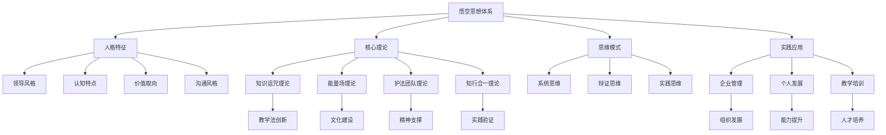

# 悟空思想体系总索引

## 概述
本索引系统整理了基于2026年3月16日聊天记录深度分析的悟空思想体系，包含人格特征、思维模式、核心理论和实践方法，为后续学习和应用提供系统导航。

## 核心文档体系

### 一、人格特征分析
- [[悟空人格与企业文化深度分析]] - 悟空的人格特征、领导风格、价值取向全面分析

### 二、核心理论体系

#### 1. 知识管理理论
- [[知识诅咒理论与教学法]] - 知识诅咒现象、心理学机制和突破方法

#### 2. 文化建设理论
- [[企业文化能量场构建]] - 企业文化能量场的理论框架和构建方法

#### 3. 精神支撑理论
- [[护法团队与企业精神支撑]] - 传统文化能量与现代企业的融合实践

#### 4. 实践方法论
- [[知行合一实践体系]] - 知行合一的理论基础和实践路径

### 三、思维模式体系

#### 1. 系统思维
- 整体视角思考
- 要素关联分析
- 动态平衡管理

#### 2. 辩证思维
- 理想现实统一
- 传统现代融合
- 理性感性平衡

#### 3. 实践思维
- 理论实践循环
- 问题解决导向
- 结果验证标准

### 四、实践应用体系

#### 1. 企业管理应用
- **文化建设**：文化落地四步法
- **组织发展**：创业单元人才复制
- **领导力发展**：深度思考与文化引领

#### 2. 个人发展应用
- **学习转化**：突破知识诅咒
- **能量提升**：个人能量场建设
- **知行合一**：理论到实践的转化

#### 3. 教学培训应用
- **教学设计**：基于知识诅咒的教学法
- **文化传承**：故事化与场景化教学
- **能量传递**：情感共鸣与能量共振

## 知识图谱

## 核心概念索引

### A. 知识管理相关
- **知识诅咒**：专家忘记学习困难，导致教学无效
- **学习过程复盘**：重现学习过程的教学方法
- **渐进式教学**：小步骤、即时反馈的教学策略

### B. 文化建设相关
- **文化能量场**：通过理念、仪式、信念构建的组织能量系统
- **三体理论**：物质体、能量体、信息体的平衡发展
- **知行合一**：理论知识与实践行动的统一

### C. 精神支撑相关
- **护法团队**：传统文化能量与现代企业的链接
- **能量链接**：通过仪式和实践建立能量通道
- **诚信守约**：护法关系的基础原则

### D. 思维模式相关
- **系统思维**：整体视角和要素关联
- **辩证思维**：对立统一的思考方式
- **实践思维**：问题解决和结果验证

## 应用场景指南

### 1. 企业管理者
- **文化建设**：参考[[企业文化能量场构建]]
- **人才培养**：参考[[知识诅咒理论与教学法]]
- **精神引领**：参考[[护法团队与企业精神支撑]]

### 2. 培训师/教师
- **教学设计**：参考[[知识诅咒理论与教学法]]
- **文化传承**：参考[[知行合一实践体系]]
- **能量传递**：参考[[企业文化能量场构建]]

### 3. 个人学习者
- **学习突破**：参考[[知识诅咒理论与教学法]]
- **能力提升**：参考[[知行合一实践体系]]
- **能量管理**：参考[[企业文化能量场构建]]

### 4. 文化研究者
- **传统智慧**：参考[[护法团队与企业精神支撑]]
- **现代转化**：参考[[知行合一实践体系]]
- **创新实践**：参考[[悟空人格与企业文化深度分析]]

## 学习路径建议

### 初级学习路径（1-2周）
1. 阅读[[悟空人格与企业文化深度分析]]了解基本框架
2. 学习[[知识诅咒理论与教学法]]掌握核心理论
3. 实践[[知行合一实践体系]]中的基础方法

### 中级学习路径（1-2月）
1. 深入学习[[企业文化能量场构建]]理论体系
2. 探索[[护法团队与企业精神支撑]]的实践应用
3. 将各理论整合应用到实际工作和生活中

### 高级学习路径（3-6月）
1. 系统整合所有理论，形成个人思想体系
2. 创新应用悟空思想到新的领域和场景
3. 贡献新的实践案例和理论发展

## 更新与维护

### 文档更新机制
- **定期更新**：每月检查更新一次
- **实践反馈**：根据实际应用反馈更新内容
- **理论发展**：跟踪相关理论新发展

### 贡献指南
1. **案例贡献**：提交成功的应用案例
2. **理论发展**：提出新的理论见解和发展
3. **实践创新**：分享创新的实践方法

## 标签系统

### 主要标签
#悟空思想 #企业文化 #知识管理 #能量场 #知行合一 #领导力 #组织发展 #传统文化 #现代管理 #学习理论

### 子标签
#知识诅咒 #护法团队 #系统思维 #辩证思维 #实践思维 #文化落地 #精神支撑 #教学法 #个人发展 #团队建设

## 联系与支持
如有问题或建议，请联系：
- 文档维护者：[您的姓名]
- 更新日期：2026年3月16日
- 版本：1.0

---

*本索引系统将持续更新和完善，欢迎贡献智慧和实践经验。*