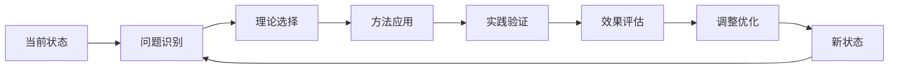

# 悟空思想知识图谱

## 图谱概述
本知识图谱可视化展示了悟空思想体系的完整结构、各理论之间的关联关系，以及在实际应用中的转化路径。

## 完整知识图谱

```mermaid
graph TB
    %% 中心节点：悟空思想体系
    A[悟空思想体系] --> A1[人格特征分析]
    A --> A2[核心理论体系]
    A --> A3[思维模式体系]
    A --> A4[实践应用体系]
    
    %% 人格特征分支
    A1 --> B1[领导风格]
    A1 --> B2[认知特点]
    A1 --> B3[价值取向]
    A1 --> B4[沟通风格]
    A1 --> B5[学习模式]
    
    B1 --> B11[深度思考型]
    B1 --> B12[文化引领者]
    B1 --> B13[知行合一实践者]
    
    B2 --> B21[系统化思维]
    B2 --> B22[抽象到具体]
    B2 --> B23[辩证统一]
    
    B3 --> B31[传统文化现代应用]
    B3 --> B32[组织长远发展]
    B3 --> B33[个人组织协同]
    
    B4 --> B41[本质导向]
    B4 --> B42[故事化表达]
    B4 --> B43[情感共鸣]
    
    B5 --> B51[持续学习]
    B5 --> B52[开放接纳]
    B5 --> B53[转化应用]
    
    %% 核心理论分支
    A2 --> C1[知识诅咒理论]
    A2 --> C2[能量场理论]
    A2 --> C3[护法团队理论]
    A2 --> C4[知行合一理论]
    
    C1 --> C11[心理学机制]
    C1 --> C12[表现形式]
    C1 --> C13[突破方法]
    
    C2 --> C21[三体理论]
    C2 --> C22[构建要素]
    C2 --> C23[调频技术]
    
    C3 --> C31[传统文化基础]
    C3 --> C32[护法构成]
    C3 --> C33[链接方法]
    
    C4 --> C41[理论基础]
    C4 --> C42[实践路径]
    C4 --> C43[评估体系]
    
    %% 思维模式分支
    A3 --> D1[系统思维]
    A3 --> D2[辩证思维]
    A3 --> D3[实践思维]
    
    D1 --> D11[整体视角]
    D1 --> D12[要素关联]
    D1 --> D13[动态平衡]
    
    D2 --> D21[理想现实统一]
    D2 --> D22[传统现代融合]
    D2 --> D23[理性感性平衡]
    
    D3 --> D31[理论实践循环]
    D3 --> D32[问题解决导向]
    D3 --> D33[结果验证标准]
    
    %% 实践应用分支
    A4 --> E1[企业管理应用]
    A4 --> E2[个人发展应用]
    A4 --> E3[教学培训应用]
    
    E1 --> E11[文化建设]
    E1 --> E12[组织发展]
    E1 --> E13[领导力发展]
    
    E2 --> E21[学习转化]
    E2 --> E22[能量提升]
    E2 --> E23[知行合一]
    
    E3 --> E31[教学设计]
    E3 --> E32[文化传承]
    E3 --> E33[能量传递]
    
    %% 理论间关联关系
    C1 -.-> E31[支持教学设计]
    C2 -.-> E11[指导文化建设]
    C3 -.-> E13[支撑领导力发展]
    C4 -.-> E23[促进知行合一]
    
    D1 -.-> C21[应用于三体理论]
    D2 -.-> C31[理解传统文化]
    D3 -.-> C42[指导实践路径]
    
    B21 -.-> D11[思维特点影响]
    B33 -.-> E13[价值取向应用]
    B53 -.-> C42[学习模式支持]
    
    %% 应用转化路径
    E11 --> F1[文化落地率提升]
    E12 --> F2[组织效率提升]
    E13 --> F3[领导效能提升]
    
    E21 --> F4[个人能力提升]
    E22 --> F5[能量状态改善]
    E23 --> F6[实践效果提升]
    
    E31 --> F7[教学效果改善]
    E32 --> F8[文化传承加强]
    E33 --> F9[能量传递有效]
    
    %% 最终成果
    F1 --> G[组织竞争优势]
    F2 --> G
    F3 --> G
    
    F4 --> H[个人价值实现]
    F5 --> H
    F6 --> H
    
    F7 --> I[人才培养质量]
    F8 --> I
    F9 --> I
    
    G --> J[可持续发展]
    H --> J
    I --> J
```

## 关键关系说明

### 1. 人格特征与思维模式的关系
- **系统化思维**（B21）直接影响**系统思维**（D1）的形成
- **辩证统一**（B23）是**辩证思维**（D2）的基础
- **转化应用**（B53）的学习模式支持**实践思维**（D3）

### 2. 理论与实践的转化路径
- **知识诅咒理论**（C1）直接应用于**教学设计**（E31）
- **能量场理论**（C2）指导**文化建设**（E11）实践
- **知行合一理论**（C4）促进**个人知行合一**（E23）实践

### 3. 思维模式对理论的理解支持
- **系统思维**（D1）帮助理解**三体理论**（C21）的系统性
- **辩证思维**（D2）有助于理解**传统文化**（C31）的现代价值
- **实践思维**（D3）指导**实践路径**（C42）的设计

### 4. 应用成果的聚合效应
- 企业管理、个人发展、教学培训三方面的成果最终聚合为：
  - **组织竞争优势**（G）
  - **个人价值实现**（H）
  - **人才培养质量**（I）
- 这些成果共同支持**可持续发展**（J）

## 应用导航

### 根据需求选择起点

#### 如果您是：
- **企业管理者**：从E1（企业管理应用）开始
- **培训师/教师**：从E3（教学培训应用）开始
- **个人学习者**：从E2（个人发展应用）开始
- **理论研究**：从A2（核心理论体系）开始

#### 常见问题解决路径：

**问题**：企业文化难以落地
**解决路径**：E11（文化建设）← C2（能量场理论）← D1（系统思维）

**问题**：教学效果不佳
**解决路径**：E31（教学设计）← C1（知识诅咒理论）← C13（突破方法）

**问题**：个人成长缓慢
**解决路径**：E23（知行合一）← C4（知行合一理论）← C42（实践路径）

## 动态发展路径

### 发展循环说明：
1. **当前状态**：识别个人或组织的当前状态
2. **问题识别**：明确需要解决的问题
3. **理论选择**：选择适合的悟空思想理论
4. **方法应用**：应用理论中的具体方法
5. **实践验证**：在实践中验证方法有效性
6. **效果评估**：评估实践效果
7. **调整优化**：根据评估结果调整优化
8. **新状态**：达到新的发展状态，开始新的循环

## 知识整合建议

### 初级整合（表层整合）
- 将相关概念和理论进行关联
- 建立基础的知识网络
- 理解各理论的基本关系

### 中级整合（深度整合）
- 深入理解理论间的内在逻辑
- 建立完整的思维框架
- 能够灵活应用相关理论

### 高级整合（创新整合）
- 创造新的理论组合和应用
- 发展个性化的思想体系
- 贡献新的实践案例和见解

## 更新与扩展

### 知识图谱更新
- **理论发展**：当有新的理论发展时更新图谱
- **实践创新**：当有创新的实践应用时扩展图谱
- **关系深化**：当发现新的关系时完善图谱

### 个性化扩展
您可以根据自己的理解和实践：
1. 添加新的节点和关系
2. 创建个性化的应用路径
3. 发展专门领域的知识图谱

---

*本知识图谱是一个动态发展的工具，它将随着悟空思想体系的发展而不断更新和完善。建议定期回顾和更新您的个人知识图谱。*