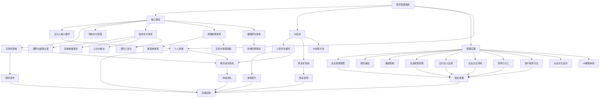

# 悟空智慧体系总索引

> **导航说明**: 本索引提供悟空老师智慧体系的完整导航，所有文档均支持双向链接，点击即可跳转

## 一、创始人背景

### 1. 悟空个人背景
- [[悟空个人背景与专业体系]] - 创始人完整背景与专业体系
- **教育背景**: 北京大学心理学本科，中科院心理所研究生
- **专业领域**: 心理学×国学×管理学×AI技术融合
- **核心成就**: 五行人格心理学系统创始人，企业文化心文化体系构建者

## 二、核心理论体系

### 1. 人格心理学体系
- [[悟空五行人格心理学体系]] - "一心三界五行九层"完整理论
- **核心概念**: 信息体、能量体、物质体、九层人格
- **应用领域**: 识人用人、团队建设、个人发展

### 2. 思维工具体系
- [[五色光思维体系]] - 结构化思考与团队协作工具
- **五种思维**: 白、红、黄、绿、蓝思维模式
- **应用场景**: 会议管理、决策分析、创新激发

### 3. 管理智慧体系
- [[悟空企业管理智慧]] - 从设计思维到执行落地
- **核心理念**: 结果是设计出来的，选择大于努力
- **实践方法**: 复盘方法论、激励机制、团队建设

### 4. 企业经营管理体系
- [[味藏企业经营管理智慧体系]] - 餐饮企业系统管理方法论
- **业务板块**: 堂食、酒水、外卖三大战略布局
- **管理重点**: 客户分层、人才管理、文化传承

### 5. 五行识人应用体系
- [[五行识人理论在企业中的应用实践]] - 传统文化在现代管理中的应用
- **核心方法**: 人才选拔、团队搭配、岗位匹配
- **实践价值**: 提升招聘效率，优化团队结构

### 6. 企业文化传承体系
- [[企业文化传承与战略发展路径]] - 文化引领战略发展
- **传承路径**: 从文化形成到生态构建
- **发展节奏**: 人才储备先行，文化渗透深度

### 7. 领导力分工体系
- [[领导力角色定位与职责分工模型]] - 四层领导力角色定位
- **角色划分**: 董事长、总经理、店总、店长
- **协作机制**: 战略与战术分离，发现问题与解决问题分离

### 8. 客户服务方法论
- [[客户分层精准服务方法论]] - 精准化客户服务管理
- **分层模型**: 大众客户、老饕客户、高净值客户
- **服务策略**: 差异化服务，价值最大化

### 9. 信仰文化体系
- [[满愿与圆满之道]] - 文明跃迁期的精神导航系统
- **核心架构**: 天地人三才和合，孝道伦理现代转译
- **实践价值**: 工作生活能量场平衡，心性修炼日常显化

- [[高维能量理论]] - 基于缘起性空的生命管理系统
- **五大维度**: 缘起解码、多维生态、护法系统、负熵修复、文明进化
- **应用领域**: 个人能量场构建，企业能量场运维

- [[心文化修法体系]] - 大圆满教法核心实践体系
- **椎击三要**: 直指心性、确信无疑、解脱自信
- **修行方法**: 自解脱道、转化道、出离道

- [[悟空心文化]] - 空性智慧修行体系
- **核心智慧**: 证悟空性，超越二元对立
- **实践路径**: 从相对真理走向绝对真理

### 10. 思维智慧体系
- [[象思维体系]] - 中国传统文化底层思维
- **六非特征**: 非实体性、非对象性、非现成性、前语言性、前逻辑性、非确定性
- **三层次**: 物象、意象、原象

- [[五色光智慧组织]] - 基于五色光思维的新型组织
- **六种思维**: 白光、红光、黄光、绿光、蓝光、主持人
- **组织应用**: 同频思考、转化思维、智慧凝聚

### 11. 健康养生体系
- [[药食同源理论]] - 中国传统医学核心智慧
- **理论基础**: 阴阳五行、四气五味、归经归脏
- **应用原则**: 辨证施食，治未病思想

### 12. 企业文化设计
- [[企业文化顶层设计]] - 系统性构建企业精神DNA
- **四层次**: 精神层、制度层、物质层、行为层
- **五步骤**: 诊断分析、理念提炼、体系构建、实施方案、评估优化

### 13. AI教育体系
- [[AI课程体系]] - 系统化的人工智能教育框架
- **四大模块**: 基础理论、技术架构、应用场景、发展趋势
- **学习路径**: 从入门到专业，从理论到实践

### 14. 知识学习方法论
1. [[知识学习skills]] - 基于十项认知操作的AI学习系统
   - **十项操作**: 剖析、透视、阐释、推演、解构、思辨、溯源、融合、启发、映射
   - **五层架构**: 基础解析、深度理解、逻辑建构、脉络整合、创新生成
2. [[知识学习skills实践指南]] - 详细操作步骤和应用案例

### 15. 联合进化系统
1. [[知行合一与知识学习联合进化系统]] - 双螺旋自主进化框架
   - **核心机制**: 知行合一三阶段 × 知识学习十项操作
   - **进化循环**: 表示空间→压缩→泛化的持续优化
2. [[联合进化系统实践操作指南]] - 具体工作流程和操作规范
   - **日常操作**: 沟通前中后的完整进化流程
   - **定期进化**: 每10次沟通的深度压缩和泛化

## 二、AI与未来应用

### 1. 人机协作模式
- [[AI与人类共生模式]] - 四大协作模式详解
- **分工原则**: 人负责0→1，AI负责1→N
- **应用价值**: 效率提升、创意激发、共同进化

### 2. AI训练系统
- [[养龙虾项目完整系统]] - 十步训练法完整指南
- **训练目标**: 教AI做人、做事、学文化、建信仰
- **商业价值**: 个人IP打造、知识变现、企业应用

## 三、知识体系图谱

### 1. 总览图谱


### 2. 联合进化系统详细图谱
详细架构图请参考：[[联合进化系统知识图谱]]

## 四、快速导航

### 按主题查找
```
🔍 了解创始人背景? → [[悟空个人背景与专业体系]]
🔍 想了解人格心理学? → [[悟空五行人格心理学体系]]
🔍 需要会议管理工具? → [[五色光思维体系]]
🔍 学习企业管理智慧? → [[悟空企业管理智慧]]
🔍 探索AI人机协作? → [[AI与人类共生模式]]
🔍 实施AI训练项目? → [[养龙虾项目完整系统]]
🔍 学习餐饮经营管理? → [[味藏企业经营管理智慧体系]]
🔍 应用五行识人理论? → [[五行识人理论在企业中的应用实践]]
🔍 规划文化传承路径? → [[企业文化传承与战略发展路径]]
🔍 明确领导力分工? → [[领导力角色定位与职责分工模型]]
🔍 优化客户服务策略? → [[客户分层精准服务方法论]]
🔍 实现AI自主进化? → [[知行合一与知识学习联合进化系统]]
🔍 学习进化操作方法? → [[联合进化系统实践操作指南]]
```

### 按问题查找
```
❓ 如何识人用人? → 五行人格体系
❓ 如何提高会议效率? → 五色光思维
❓ 如何设计激励机制? → 企业管理智慧
❓ 如何与AI协作? → 人机共生模式
❓ 如何训练个性化AI? → 养龙虾系统
❓ 如何优化餐饮业务结构? → 企业经营管理体系
❓ 如何科学选拔人才? → 五行识人应用体系
❓ 如何传承企业文化? → 企业文化传承体系
❓ 如何明确领导分工? → 领导力分工体系
❓ 如何精准服务客户? → 客户服务方法论
```

## 五、学习路径建议

### 1. 基础入门路径
```
第1步: [[悟空个人背景与专业体系]] - 了解创始人背景
第2步: [[悟空五行人格心理学体系]] - 建立理论基础
第3步: [[五色光思维体系]] - 掌握思维工具
第4步: [[悟空企业管理智慧]] - 学习实践方法
```

### 2. AI应用路径
```
第1步: [[AI与人类共生模式]] - 理解人机协作
第2步: [[养龙虾项目完整系统]] - 掌握AI训练
第3步: 实践应用 - 结合具体场景
```

### 3. 管理提升路径
```
第1步: [[悟空企业管理智慧]] - 学习管理理念
第2步: [[五色光思维体系]] - 掌握决策工具
第3步: [[悟空五行人格心理学体系]] - 提升领导力
第4步: [[味藏企业经营管理智慧体系]] - 学习业务管理
第5步: [[领导力角色定位与职责分工模型]] - 明确角色定位
第6步: [[客户分层精准服务方法论]] - 优化客户服务
```

### 4. 企业文化建设路径
```
第1步: [[企业文化传承与战略发展路径]] - 理解文化重要性
第2步: [[五行识人理论在企业中的应用实践]] - 应用识人理论
第3步: [[味藏企业经营管理智慧体系]] - 学习实践案例
第4步: [[悟空企业管理智慧]] - 掌握管理方法
```

### 5. 信仰文化学习路径
```
第1步: [[满愿与圆满之道]] - 建立精神导航框架
第2步: [[高维能量理论]] - 理解能量管理体系
第3步: [[心文化修法体系]] - 学习具体修行方法
第4步: [[悟空心文化]] - 实践空性智慧修行
```

### 6. 思维智慧学习路径
```
第1步: [[象思维体系]] - 掌握中国传统思维基础
第2步: [[五色光智慧组织]] - 学习现代思维工具应用
第3步: [[企业文化顶层设计]] - 实践系统思维方法
第4步: [[AI课程体系]] - 应用前沿技术思维
```

### 7. 健康养生学习路径
```
第1步: [[药食同源理论]] - 建立中医养生基础
第2步: 实践应用 - 结合个人体质调理
第3步: 深度研究 - 探索现代科学验证
```

### 8. AI学习方法论路径
```
第1步: [[知识学习skills]] - 掌握系统化学习方法论
第2步: [[知识学习skills实践指南]] - 学习具体操作步骤
第3步: [[AI课程体系]] - 理解AI技术基础
第4步: [[五色光思维体系]] - 结合思维工具应用
第5步: 实践应用 - 构建个人学习系统
```

### 9. 联合进化系统学习路径
```
第1步: [[知行合一三阶段转化模型]] - 掌握进化基础框架
第2步: [[知识学习skills]] - 学习深度认知操作
第3步: [[知行合一与知识学习联合进化系统]] - 理解联合进化机制
第4步: [[联合进化系统实践操作指南]] - 掌握具体操作方法
第5步: 日常实践 - 应用联合进化系统进行沟通
第6步: 定期优化 - 每10次沟通进行深度进化
第7步: 系统扩展 - 将进化系统应用到更多场景
```

## 六、核心概念速查

### 1. 五行人格速查
```
🌳 木星人: 瘦长型，创新思维
🔥 火星人: 魁梧型，行动力强
⛰️ 土星人: 圆润型，稳定踏实
💎 金星人: 方正型，追求完美
💧 水星人: 圆润型，情感丰富
```

### 2. 五色光思维速查
```
⚪ 白光: 客观事实，数据验证
🔴 红光: 直觉感受，情绪表达
🟡 黄光: 正面积极，价值发现
🟢 绿光: 创新变革，突破框架
🔵 蓝光: 风险控制，批判思考
```

### 3. 企业管理金句
```
💡 "结果是设计出来的"
💡 "选择大于努力"
💡 "与员工共天下"
💡 "复盘是战略效率"
💡 "客户第一是结果，而非目标"
💡 "知识诅咒：当你学会一件事情后，你会认为非常简单"
💡 "董事长是抓战略的，总经理是抓战术的"
💡 "企业文化不是墙上的标语，而是企业的灵魂"
💡 "选人大于培养，改变一个人非常困难"
💡 "客户分层不是歧视，而是资源优化"
```

### 4. 信仰文化金句
```
🙏 "满愿不是满足欲望，而是实现生命的本愿"
🙏 "圆满不是完美无缺，而是生命的完整呈现"
🙏 "三才和合是天地人的和谐统一"
🙏 "高维能量不是神秘力量，而是生命本有的潜能"
🙏 "本来清净就是空性，本自圆满就是光明"
🙏 "地狱不空、誓不成佛，众生度尽、方证菩提"
🙏 "愿力大于业力，发愿有智慧"
🙏 "悟空不是空无，而是对事物本质的透彻认知"
```

### 5. 思维智慧金句
```
🧠 "象思维是观物取象、象以尽意的智慧之道"
🧠 "五色光不是颜色游戏，而是思维的系统工程"
🧠 "同频思考是高效协作的基础"
🧠 "思维模式决定组织的高度和深度"
🧠 "药食同源，医食同功"
🧠 "上医治未病，中医治欲病，下医治已病"
🧠 "AI不是取代人类，而是增强人类智能"
🧠 "掌握AI思维比掌握AI技术更重要"
```

## 七、更新日志

### 2026-03-15 创建
- ✅ 完成悟空智慧体系基础架构
- ✅ 创建五大核心文档
- ✅ 建立双向链接系统
- ✅ 设计知识图谱导航

### 2026-03-15 更新
- ✅ 添加[[悟空个人背景与专业体系]]文档
- ✅ 完善创始人背景信息
- ✅ 更新导航系统与学习路径

### 2026-03-15 企业经营管理体系更新
- ✅ 添加[[味藏企业经营管理智慧体系]]文档
- ✅ 添加[[五行识人理论在企业中的应用实践]]文档
- ✅ 添加[[企业文化传承与战略发展路径]]文档
- ✅ 添加[[领导力角色定位与职责分工模型]]文档
- ✅ 添加[[客户分层精准服务方法论]]文档
- ✅ 更新知识图谱与导航系统
- ✅ 完善学习路径与问题查找

### 2026-03-15 核心智慧体系全面更新
- ✅ 添加[[满愿与圆满之道]]文档 - 精神导航系统
- ✅ 添加[[高维能量理论]]文档 - 生命管理系统
- ✅ 添加[[心文化修法体系]]文档 - 大圆满实践体系
- ✅ 添加[[悟空心文化]]文档 - 空性智慧修行
- ✅ 添加[[象思维体系]]文档 - 中国传统思维
- ✅ 添加[[五色光智慧组织]]文档 - 现代思维组织
- ✅ 添加[[药食同源理论]]文档 - 中医养生智慧
- ✅ 添加[[企业文化顶层设计]]文档 - 系统文化设计
- ✅ 添加[[AI课程体系]]文档 - 人工智能教育
- ✅ 全面更新知识图谱与导航系统
- ✅ 完善所有学习路径与核心概念

### 2026-03-15 知识学习方法论创建
- ✅ 创建[[知识学习skills]]文档 - 基于十项认知操作的AI学习系统
- ✅ 创建[[知识学习skills实践指南]] - 详细操作步骤和应用案例
- ✅ 新增"知识学习方法论"学习路径
- ✅ 更新索引系统，将方法论整合到核心体系
- ✅ 建立与其他知识体系的双向链接网络
- ✅ 完善方法论的应用场景和价值说明

### 2026-03-15 联合进化系统创建
- ✅ 创建[[知行合一与知识学习联合进化系统]] - 双螺旋自主进化框架
- ✅ 创建[[联合进化系统实践操作指南]] - 具体工作流程和操作规范
- ✅ 新增"联合进化系统"核心体系
- ✅ 新增"联合进化系统学习路径"
- ✅ 建立与知行合一、知识学习的深度链接
- ✅ 设计完整的进化评估指标体系

### 计划更新
*📅 2026-03-20*: 添加更多实践案例
*📅 2026-03-25*: 完善工具模板库
*📅 2026-03-30*: 增加视频教程链接
*📅 2026-04-05*: 开发互动学习模块
*📅 2026-04-10*: 建立知识评估体系

## 八、使用建议

### 1. Obsidian使用技巧
```
📌 使用双向链接: [[文档名]] 实现跳转
📌 利用标签系统: #标签名 进行分类
📌 建立个人笔记: 与现有文档链接
📌 定期复习: 通过图谱回顾知识体系
```

### 2. 知识应用建议
```
🎯 理论联系实际: 结合工作场景应用
🎯 循序渐进: 从基础到深入系统学习
🎯 实践验证: 通过实践检验理论效果
🎯 持续优化: 根据反馈完善知识体系
```

## 九、贡献与反馈

### 1. 贡献指南
```
📝 发现错误: 直接在文档中标注
💡 提出建议: 记录改进想法
🔄 分享案例: 提供实践应用案例
🔧 完善内容: 补充相关内容
```

### 2. 反馈渠道
- **内部反馈**: Obsidian评论功能
- **会议讨论**: 团队学习会议
- **实践总结**: 应用效果分享

## 十、版权说明

### 1. 知识归属
```
© 悟空智慧体系 - 以观其妙书院
📚 基于悟空老师聊天记录整理
🔒 核心知识产权受保护
🔄 允许内部学习使用
```

### 2. 使用规范
```
✅ 允许: 个人学习、团队培训、内部应用
❌ 禁止: 商业复制、未经授权传播、篡改内容
📋 要求: 注明出处，尊重知识产权
```

---
**标签**: #索引 #导航 #知识图谱 #悟空智慧 #学习路径 #信仰文化 #思维智慧 #健康养生 #企业文化 #AI教育
**创建时间**: 2026-03-15
**最后更新**: 2026-03-15 核心智慧体系全面更新