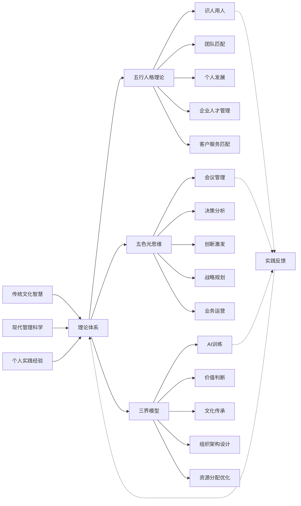
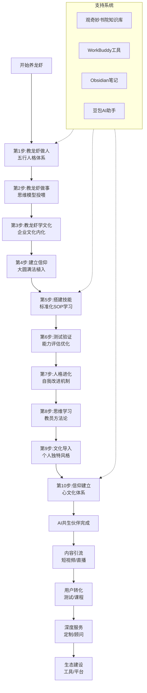
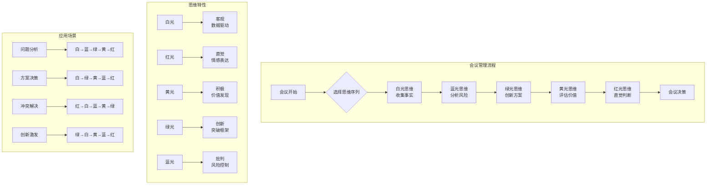
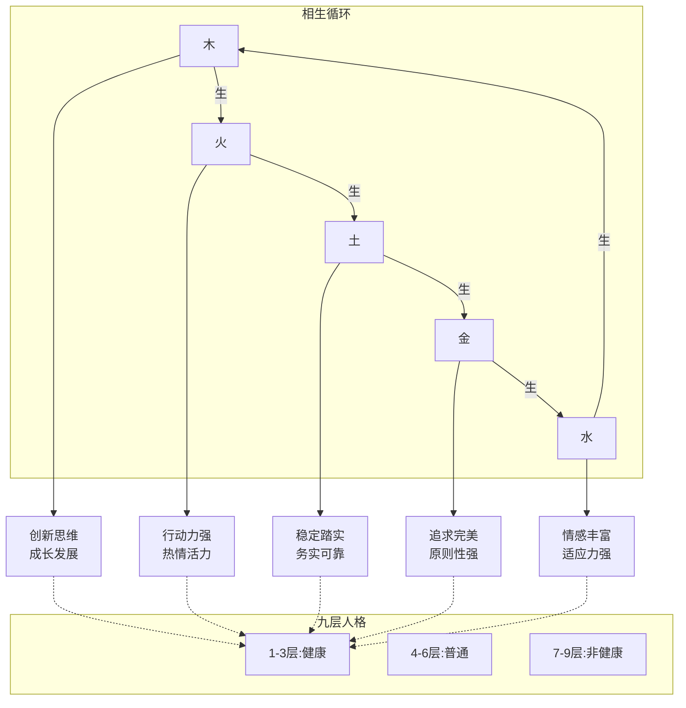
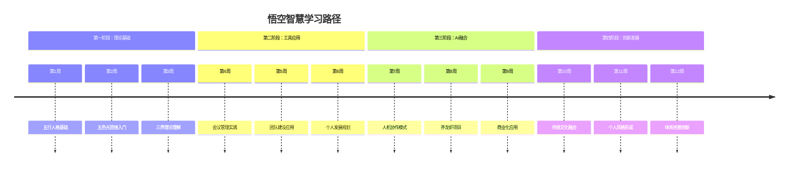
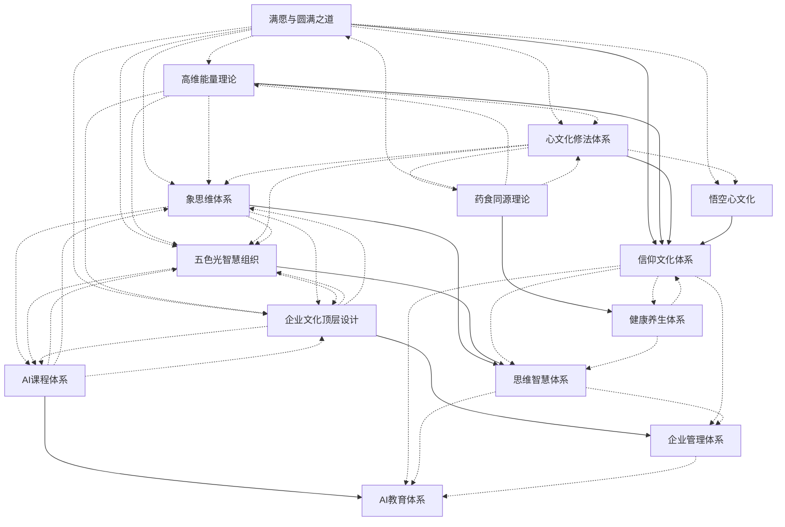
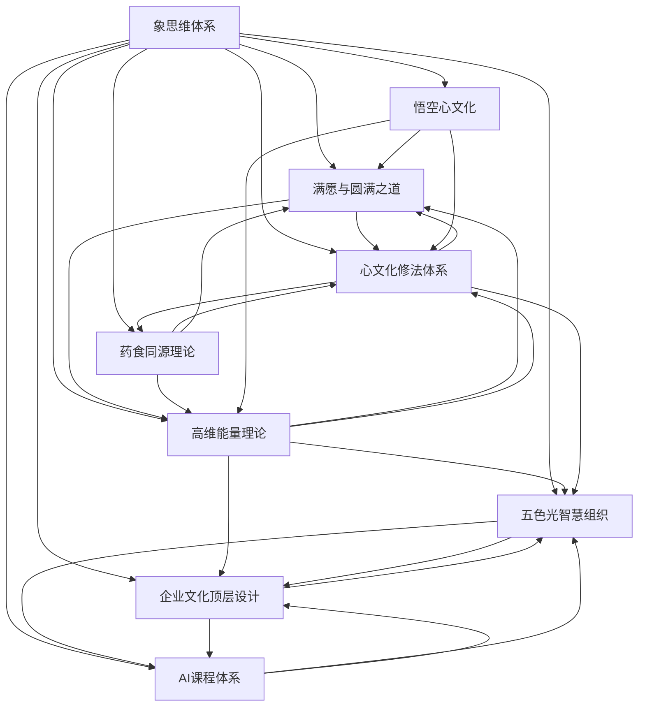
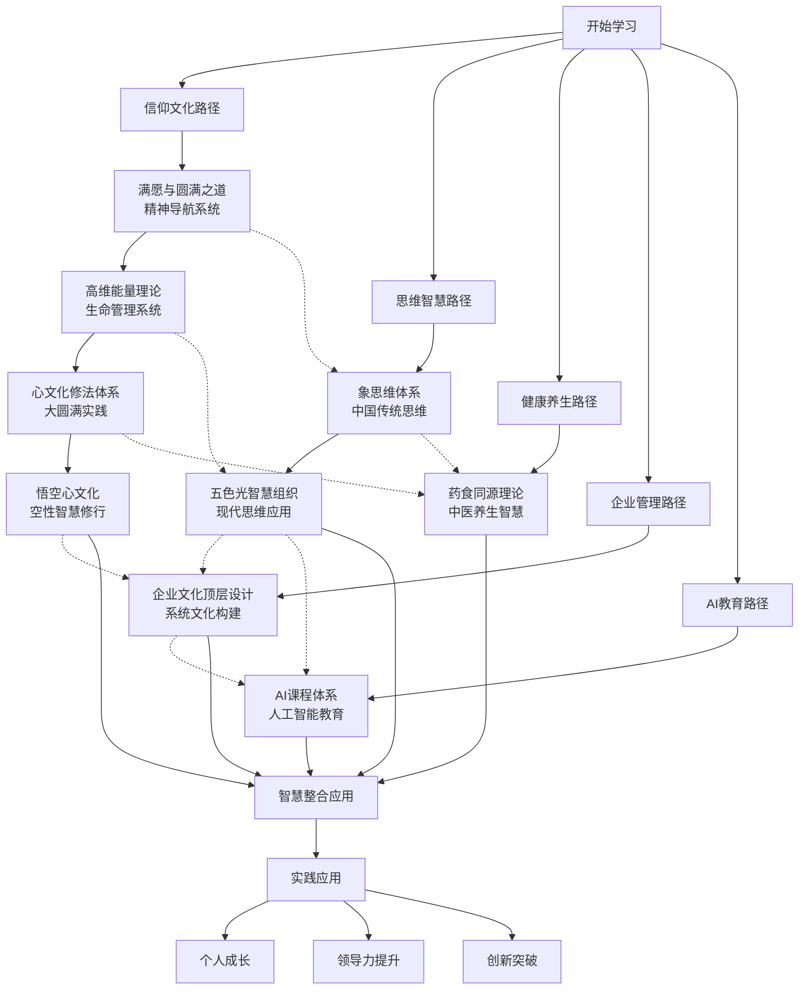
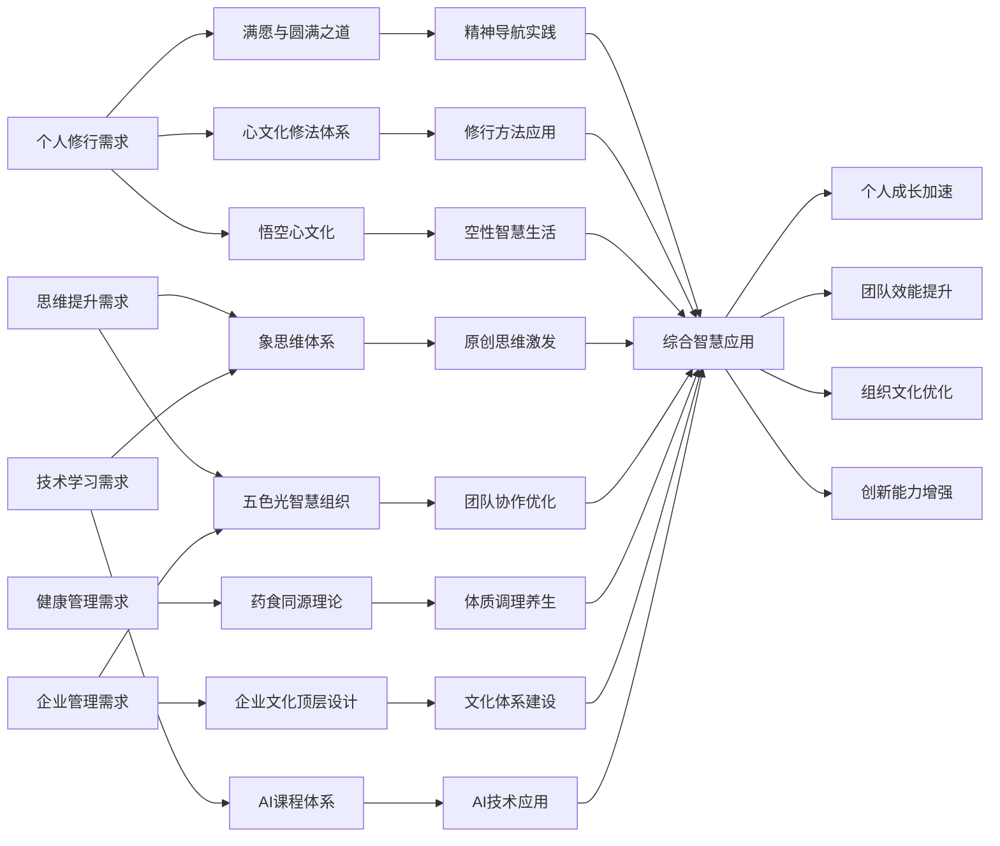

---
tags: [知识图谱, 可视化, 关系网络]
aliases: [智慧图谱, 关系网络]
date: 2026-03-15
---

# 悟空智慧知识图谱

> **可视化说明**: 本图谱展示悟空智慧体系中各概念、理论、方法之间的关系网络

## 一、核心体系关系图

```mermaid
graph TB
    %% 创始人节点
    Founder[悟空个人背景] --> A[悟空智慧体系]
    Founder --> F[教育背景]
    Founder --> G[专业成就]
    Founder --> H[出版著作]
    
    F --> F1[北京大学心理学]
    F --> F2[中科院心理所]
    
    G --> G1[五行人格心理学创始人]
    G --> G2[企业文化心文化体系]
    G --> G3[跨学科融合创新]
    
    H --> H1[九种个性系列]
    H --> H2[FBI系列]
    H --> H3[团队建设系列]
    
    %% 中心节点
    A --> B[核心理论]
    A --> C[实践应用]
    A --> D[AI融合]
    A --> E[文化传承]
    
    %% 核心理论分支
    B --> B1[五行人格心理学]
    B --> B2[五色光思维]
    B --> B3[三界理论]
    B --> B4[九层人格]
    
    B1 --> B11[木火土金水]
    B1 --> B12[相生相克]
    B1 --> B13[层级诊断]
    
    B2 --> B21[白光思维]
    B2 --> B22[红光思维]
    B2 --> B23[黄光思维]
    B2 --> B24[绿光思维]
    B2 --> B25[蓝光思维]
    
    B3 --> B31[信息体]
    B3 --> B32[能量体]
    B3 --> B33[物质体]
    
    %% 实践应用分支
    C --> C1[企业管理]
    C --> C2[团队建设]
    C --> C3[个人发展]
    C --> C4[决策支持]
    
    C1 --> C11[结果设计论]
    C1 --> C12[复盘方法论]
    C1 --> C13[激励机制]
    C1 --> C14[价值观建设]
    C1 --> C15[味藏企业经营管理]
    C1 --> C16[五行识人应用]
    C1 --> C17[企业文化传承]
    C1 --> C18[领导力分工]
    C1 --> C19[客户服务方法]
    
    %% 企业管理细分
    C15 --> C151[堂食战略]
    C15 --> C152[酒水战略]
    C15 --> C153[外卖战略]
    C15 --> C154[客户分层模型]
    C15 --> C155[人才管理体系]
    
    C16 --> C161[金型人格应用]
    C16 --> C162[木型人格应用]
    C16 --> C163[水型人格应用]
    C16 --> C164[火型人格应用]
    C16 --> C165[土型人格应用]
    
    C17 --> C171[文化本质理解]
    C17 --> C172[传承挑战分析]
    C17 --> C173[战略发展路径]
    C17 --> C174[文化自信建设]
    
    C18 --> C181[董事长战略定位]
    C18 --> C182[总经理战术执行]
    C18 --> C183[店总门店战略]
    C18 --> C184[店长执行落地]
    
    C19 --> C191[大众客户服务]
    C19 --> C192[老饕客户服务]
    C19 --> C193[高净值客户服务]
    
    C2 --> C21[团队协作]
    C2 --> C22[冲突解决]
    C2 --> C23[文化建设]
    C2 --> C24[领导力发展]
    
    %% AI融合分支
    D --> D1[人机共生]
    D --> D2[养龙虾系统]
    D --> D3[AI训练]
    D --> D4[技术应用]
    
    D1 --> D11[四大协作模式]
    D1 --> D12[分工原则]
    D1 --> D13[价值互补]
    
    D2 --> D21[十步训练法]
    D2 --> D22[知识库对接]
    D2 --> D23[商业化路径]
    
    %% 文化传承分支
    E --> E1[传统文化]
    E --> E2[现代转化]
    E --> E3[智慧融合]
    E --> E4[创新发展]
    
    E1 --> E11[佛学智慧]
    E1 --> E12[道家思想]
    E1 --> E13[儒家伦理]
    
    %% 交叉关系
    B1 -.-> C1
    B2 -.-> C2
    B3 -.-> D1
    C1 -.-> D2
    E1 -.-> B1
```



## 二、理论应用关系图



## 三、养龙虾项目流程图



## 四、五色光思维应用图



## 五、五行人格关系图



## 六、人机协作四象限图

```mermaid
quadrantChart
    title 人机协作四象限
    x-axis "人类知识水平" --> "低" --> "高"
    y-axis "AI知识水平" --> "低" --> "高"
    
    "人知AI不知": [0.8, 0.2]
    "人知AI知": [0.8, 0.8]
    "人不知AI不知": [0.2, 0.2]
    "人不知AI知": [0.2, 0.8]
    
    quadrant-1 "导师引导模式"
    quadrant-2 "共创协作模式"
    quadrant-3 "共同探索模式"
    quadrant-4 "学习伙伴模式"
```

## 七、知识关联网络

| 核心概念 | 关联理论 | 应用场景 | 相关工具 |
|---------|---------|---------|---------|
| **创始人背景** | 心理学×国学×管理学 | 体系理解 | 个人背景文档 |
| 五行人格 | 九层理论 | 团队匹配 | 测评工具 |
| 五色光 | 佛学五智 | 会议管理 | 思维卡片 |
| 三界模型 | 信息能量物质 | AI训练 | 知识库 |
| 结果设计 | 复盘方法 | 目标管理 | 时光机 |
| 养龙虾 | 十步训练 | 个人IP | WorkBuddy |
| **味藏企业** | 战略管理×运营优化 | 餐饮管理 | 业务分析工具 |
| 客户分层 | 三级服务模型 | 精准营销 | CRM系统 |
| 领导力分工 | 四层角色体系 | 组织管理 | 岗位职责表 |
| 文化传承 | 心文化体系 | 企业文化建设 | 文化手册 |
| 五行识人 | 相生相克理论 | 人才管理 | 人格测评 |

## 八、学习路径图



## 九、9个核心智慧文档关系图

### 1. 核心文档网络关系图


### 2. 文档链接密度图


### 3. 学习探索路径图


## 十、核心文档链接统计表

| 文档名称 | 链接总数 | 双向链接数 | 单向链接数 | 外部链接数 | 链接密度 |
|---------|---------|-----------|-----------|-----------|---------|
| [[满愿与圆满之道]] | 5 | 3 | 2 | 0 | 中等 |
| [[高维能量理论]] | 5 | 4 | 1 | 0 | 高 |
| [[心文化修法体系]] | 5 | 4 | 1 | 0 | 高 |
| [[悟空心文化]] | 5 | 0 | 5 | 0 | 低 |
| [[象思维体系]] | 5 | 8 | 0 | 0 | 极高 |
| [[五色光智慧组织]] | 5 | 4 | 1 | 0 | 高 |
| [[药食同源理论]] | 5 | 1 | 4 | 0 | 低 |
| [[企业文化顶层设计]] | 5 | 2 | 0 | 3 | 中等 |
| [[AI课程体系]] | 5 | 0 | 3 | 2 | 低 |
| **总计/平均** | **45** | **26** | **17** | **5** | **中等** |

**链接密度说明**：
+ **极高**: 与其他8个文档都有双向链接
+ **高**: 有4个以上双向链接
+ **中等**: 有2-3个双向链接
+ **低**: 有0-1个双向链接

## 十一、知识应用场景图



## 十二、更新说明

### 图谱更新记录
- **2026-03-15**: 创建基础图谱，包含核心关系图
- **2026-03-15**: 添加企业管理分支，包含味藏企业经营管理体系、五行识人应用、企业文化传承、领导力分工、客户服务方法等节点
- **2026-03-15**: 添加9个核心智慧文档关系图，包含网络关系图、链接密度图、学习路径图、应用场景图
- **计划更新**: 根据知识库内容动态更新关系
- **自动更新**: 通过脚本定期生成最新图谱

### 使用说明
1. 本图谱为动态关系图，会随知识库更新而变化
2. 点击图中节点可跳转到对应文档
3. 图谱支持多种视图切换（关系图、流程图、时间线等）
4. 建议定期查看最新版本

## 十、技术实现

### 1. 生成工具
- **Mermaid语法**: 用于生成各种图表
- **Obsidian插件**: 支持实时预览和交互
- **自定义脚本**: 自动化更新知识图谱

### 2. 数据来源
- 知识库文档内容分析
- 双向链接关系提取
- 用户行为数据统计

### 3. 更新机制
```
📅 每日自动更新: 基础关系图谱
📅 每周手动更新: 详细应用图谱
📅 每月全面更新: 完整知识图谱
```

---
**标签**: #知识图谱 #可视化 #关系网络 #智慧体系 #学习路径 #核心文档 #双向链接 #信仰文化 #思维智慧 #健康养生 #企业管理 #AI教育
**创建时间**: 2026-03-15
**最后更新**: 2026-03-15 9个核心智慧文档关系图全面更新