# 成功案例分析知识图谱

```mermaid
graph TD
    %% 核心框架层
    SCA[成功案例分析体系] --> FRAMEWORK[分析框架]
    SCA --> METHOD[方法论]
    SCA --> TOOLS[分析工具]
    
    %% 分析框架节点
    FRAMEWORK --> DIMENSIONS[分析维度]
    FRAMEWORK --> PROCESS[分析流程]
    FRAMEWORK --> PRINCIPLES[分析原则]
    
    DIMENSIONS --> STRATEGY[战略层面]
    DIMENSIONS --> EXECUTION[执行层面]
    DIMENSIONS --> RESULTS[结果层面]
    
    PROCESS --> SELECTION[案例选择]
    PROCESS --> ANALYSIS[深度分析]
    PROCESS --> APPLICATION[应用转化]
    
    %% 方法论节点
    METHOD --> SELF_EVOLUTION[知行合一自我进化]
    METHOD --> KNOWLEDGE_LEARN[知识学习能力]
    METHOD --> HUMAN_AI_COLLAB[人机协同四象限]
    
    SELF_EVOLUTION --> REPRESENTATION[表示空间]
    SELF_EVOLUTION --> COMPRESSION[压缩]
    SELF_EVOLUTION --> GENERALIZATION[泛化]
    
    KNOWLEDGE_LEARN --> INSIGHT[洞察]
    KNOWLEDGE_LEARN --> ANALYSIS_C[剖析]
    KNOWLEDGE_LEARN --> PERSPECTIVE[透视]
    KNOWLEDGE_LEARN --> INTERPRET[阐释]
    KNOWLEDGE_LEARN --> DEDUCTION[推演]
    KNOWLEDGE_LEARN --> DECONSTRUCT[解构]
    KNOWLEDGE_LEARN --> REASONING[思辨]
    KNOWLEDGE_LEARN --> TRACING[溯源]
    KNOWLEDGE_LEARN --> INTEGRATION[融合]
    KNOWLEDGE_LEARN --> INSPIRATION[启发]
    
    HUMAN_AI_COLLAB --> EFFICIENT_ASSIST[高效助理模式]
    HUMAN_AI_COLLAB --> KNOWLEDGE_TUTOR[知识导师模式]
    HUMAN_AI_COLLAB --> CO_CREATION[共创合伙人模式]
    HUMAN_AI_COLLAB --> LEARNING_ASSIST[学习型助手模式]
    
    %% 分析工具节点
    TOOLS --> SWOT[SWOT分析]
    TOOLS --> FIVE_FORCES[五力模型]
    TOOLS --> VALUE_CHAIN[价值链分析]
    TOOLS --> BUSINESS_CANVAS[商业模式画布]
    TOOLS --> USER_JOURNEY[用户旅程地图]
    
    %% 具体案例层
    SCA --> CASE_STUDIES[具体案例库]
    
    CASE_STUDIES --> OPENCLAW_CASE[[OpenClaw成功案例分析]]
    CASE_STUDIES --> WECHAT_ARTICLE[[公众号文章成功因素分析]]
    CASE_STUDIES --> ENTREPRENEUR_SPIRIT[[企业家精神案例]]
    
    %% OpenClaw案例详情
    OPENCLAW_CASE --> OC_MARKET[市场定位]
    OPENCLAW_CASE --> OC_TECH[技术创新]
    OPENCLAW_CASE --> OC_COMMUNITY[社区生态]
    OPENCLAW_CASE --> OC_VALUE[用户价值]
    OPENCLAW_CASE --> OC_EDUCATION[市场教育]
    
    OC_MARKET --> OC_PAIN_POINT[解决核心痛点]
    OC_MARKET --> OC_MARKET_GAP[填补市场空白]
    OC_MARKET --> OC_THRESHOLD[降低使用门槛]
    
    OC_TECH --> OC_AGENT_LOOP[Agent Loop架构]
    OC_TECH --> OC_LOCAL_RUN[本地化运行]
    OC_TECH --> OC_EXTENSIBILITY[可扩展性]
    
    OC_COMMUNITY --> OC_USER_DIVERSITY[多元用户群体]
    OC_COMMUNITY --> OC_COMMUNITY_GROWTH[快速社群扩张]
    OC_COMMUNITY --> OC_USER_SPREAD[用户自发传播]
    
    OC_VALUE --> OC_DEVELOPER[开发者案例]
    OC_VALUE --> OC_PM[产品经理案例]
    OC_VALUE --> OC_LAWYER[律师案例]
    OC_VALUE --> OC_ADMIN[行政人员案例]
    OC_VALUE --> OC_ENGINEER[算法工程师案例]
    
    OC_EDUCATION --> OC_PROBLEMS[不回避问题]
    OC_EDUCATION --> OC_BALANCE[平衡宣传]
    OC_EDUCATION --> OC_FORWARD_LOOK[前瞻性视角]
    
    %% 公众号文章案例详情
    WECHAT_ARTICLE --> WA_TITLE[标题策略]
    WECHAT_ARTICLE --> WA_CONTENT[内容结构]
    WECHAT_ARTICLE --> WA_VALUE[价值深度]
    WECHAT_ARTICLE --> WA_CASES[用户案例]
    WECHAT_ARTICLE --> WA_SPREAD[传播设计]
    
    WA_TITLE --> WA_METAPHOR[比喻巧妙]
    WA_TITLE --> WA_SUSPENSE[悬念设置]
    WA_TITLE --> WA_HOT_SPOT[热点结合]
    WA_TITLE --> WA_EMOTION[情感共鸣]
    
    WA_CONTENT --> WA_LOGIC[逻辑清晰]
    WA_CONTENT --> WA_HIERARCHY[层次分明]
    WA_CONTENT --> WA_CASE_RICH[案例丰富]
    WA_CONTENT --> WA_DATA_SUPPORT[数据支撑]
    
    WA_VALUE --> WA_TECH_INSIGHT[技术洞察]
    WA_VALUE --> WA_INDUSTRY_VIEW[行业视角]
    WA_VALUE --> WA_RISK_REVEAL[风险揭示]
    WA_VALUE --> WA_RATIONAL[理性判断]
    
    WA_CASES --> WA_DIVERSITY[多样性]
    WA_CASES --> WA_AUTHENTICITY[真实性]
    WA_CASES --> WA_PRACTICALITY[实用性]
    WA_CASES --> WA_RESONANCE[共鸣性]
    
    WA_SPREAD --> WA_TOPIC[话题性]
    WA_SPREAD --> WA_CONTROVERSY[争议性]
    WA_SPREAD --> WA_UTILITY[实用性]
    WA_SPREAD --> WA_PROFESSIONAL[专业性]
    
    %% 关联知识体系
    SCA --> RELATED_KNOWLEDGE[关联知识体系]
    
    RELATED_KNOWLEDGE --> THINKING_MODELS[思维模型]
    RELATED_KNOWLEDGE --> PERSONALITY_TRAITS[人格特质]
    RELATED_KNOWLEDGE --> PRACTICE_METHODS[实践方法]
    
    THINKING_MODELS --> FIVE_COLORS[五色光思维]
    THINKING_MODELS --> IMAGE_THINKING[象思维]
    THINKING_MODELS --> 100_MODELS[100个实战思维模型]
    
    PERSONALITY_TRAITS --> FIVE_ELEMENTS[五行人格心理学]
    PERSONALITY_TRAITS --> ENTREPRENEUR_SPIRIT_D[企业家精神]
    PERSONALITY_TRAITS --> LEADERSHIP[领导力发展]
    
    PRACTICE_METHODS --> KNOWING_DOING[知行合一]
    PRACTICE_METHODS --> HUMAN_AI[人机协同]
    PRACTICE_METHODS --> SELF_EVOLUTION_SYS[自主进化系统]
    
    %% 样式定义
    classDef framework fill:#e1f5fe,stroke:#01579b,stroke-width:2px
    classDef method fill:#f3e5f5,stroke:#4a148c,stroke-width:2px
    classDef tools fill:#e8f5e8,stroke:#1b5e20,stroke-width:2px
    classDef cases fill:#fff3e0,stroke:#e65100,stroke-width:2px
    classDef knowledge fill:#fce4ec,stroke:#880e4f,stroke-width:2px
    classDef detail fill:#f5f5f5,stroke:#616161,stroke-width:1px
    
    class FRAMEWORK,DIMENSIONS,PROCESS,PRINCIPLES,STRATEGY,EXECUTION,RESULTS,SELECTION,ANALYSIS,APPLICATION framework
    class METHOD,SELF_EVOLUTION,KNOWLEDGE_LEARN,HUMAN_AI_COLLAB,REPRESENTATION,COMPRESSION,GENERALIZATION method
    class TOOLS,SWOT,FIVE_FORCES,VALUE_CHAIN,BUSINESS_CANVAS,USER_JOURNEY tools
    class CASE_STUDIES,OPENCLAW_CASE,WECHAT_ARTICLE,ENTREPRENEUR_SPIRIT cases
    class RELATED_KNOWLEDGE,THINKING_MODELS,PERSONALITY_TRAITS,PRACTICE_METHODS knowledge
    class OC_MARKET,OC_TECH,OC_COMMUNITY,OC_VALUE,OC_EDUCATION,WA_TITLE,WA_CONTENT,WA_VALUE,WA_CASES,WA_SPREAD detail
```

## 图谱解读

### 第一层：核心体系结构
- **成功案例分析体系**：整个知识图谱的中心节点
- 包含三大支柱：分析框架、方法论、分析工具

### 第二层：分析框架维度
- **分析维度**：战略、执行、结果三个层面
- **分析流程**：案例选择→深度分析→应用转化
- **分析原则**：系统性、深度性、实用性原则

### 第三层：方法论体系
基于自主进化系统的三层嵌套认知增强框架：
1. **知行合一自我进化能力**：表示空间-压缩-泛化三阶段
2. **知识学习能力**：十大认知操作指令
3. **人机协同四象限**：四种协作模式

### 第四层：具体案例库
- **OpenClaw成功案例分析**：AI Agent开源项目
- **公众号文章成功因素分析**：3万+浏览量内容
- **企业家精神案例**：精神层面的成功分析

### 第五层：案例详情分析
每个具体案例都包含多个维度的深度分析，如：
- 市场定位、技术创新、社区生态等
- 标题策略、内容结构、传播设计等

### 第六层：关联知识体系
- **思维模型**：五色光思维、象思维等
- **人格特质**：五行人格、企业家精神等
- **实践方法**：知行合一、人机协同等

## 使用说明

### 1. 知识探索路径
- **新手路径**：核心体系 → 分析框架 → 具体案例
- **深度路径**：具体案例 → 案例详情 → 关联知识
- **应用路径**：方法论 → 分析工具 → 实践应用

### 2. 图谱导航功能
- 蓝色节点：核心框架和方法论
- 橙色节点：具体案例分析
- 绿色节点：分析工具
- 紫色节点：关联知识体系
- 灰色节点：详细分析维度

### 3. 知识关联发现
通过图谱可以直观看到：
- 不同案例之间的共同成功因素
- 方法论在具体案例中的应用
- 分析工具与案例分析的对应关系
- 成功案例与关联知识的深度连接

## 更新说明
本知识图谱会随着新案例的添加和知识体系的完善而持续更新。每个节点的详细信息都可以通过点击相应的Obsidian文档链接进行深度探索。

---

**可视化提示**：在Obsidian中打开本文件，即可看到完整的交互式知识图谱。通过图谱可以快速了解成功案例分析的知识体系结构，并找到深度学习的路径。