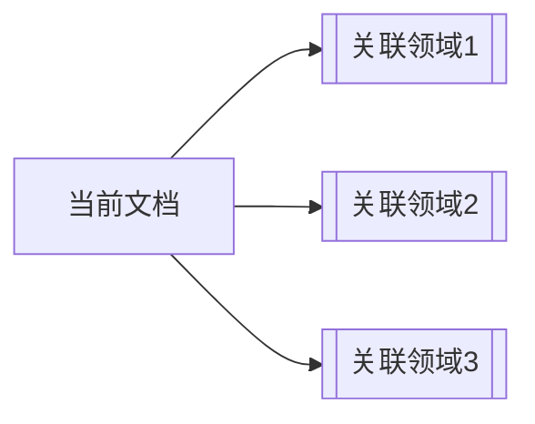

# 🏛️ 标准化文档模板

---
**文件模板ID**: `DOC-TEMPLATE-001`  
**适用类型**: 所有知识文档  
**创建时间**: {{date}}  
**最后更新**: {{date}}  
**模板版本**: v1.0  

---

## 📋 一、文档基本信息

### 文档标题
[简明扼要的文档标题]

### 核心概念
- **中文定义**: 
- **英文翻译**: 
- **领域分类**: [知识领域，如：思维模型/企业文化/人格心理学]
- **重要程度**: ⭐⭐⭐⭐⭐ (1-5星)

### 文档摘要
[200字以内简要说明文档的核心价值和主要内容]

---

## 🎯 二、核心定义

### 2.1 基本定义
[清晰、准确的概念定义，不超过100字]

### 2.2 核心理念
- **理念一**: [说明]
- **理念二**: [说明]  
- **理念三**: [说明]

### 2.3 关键特征
1. **特征1**: [描述]
2. **特征2**: [描述]
3. **特征3**: [描述]

---

## 📖 三、详细内容

### 3.1 核心原理
#### 3.1.1 理论基础
[阐述理论背景和学术支撑]

#### 3.1.2 运作机制
[描述工作原理和运行逻辑]

### 3.2 实践应用
#### 3.2.1 适用场景
- 场景1: [说明]
- 场景2: [说明]
- 场景3: [说明]

#### 3.2.2 实施步骤
1. **步骤一**: [具体操作]
2. **步骤二**: [具体操作]
3. **步骤三**: [具体操作]

### 3.3 案例分析
#### 案例一：[案例名称]
- **背景**: 
- **应用**: 
- **效果**: 
- **经验总结**: 

---

## 🔗 四、关联网络

### 4.1 核心关联文件
- [[相关文档1]]
- [[相关文档2]]
- [[相关文档3]]

### 4.2 扩展阅读
- **深度阅读**: [[高级主题文档]]
- **实践指导**: [[实操手册]]
- **背景知识**: [[基础知识文档]]

### 4.3 相关领域

---

## 💎 五、核心金句

### 5.1 精华提炼
> "最具启发性的一句话"
> *— 来源/作者*

### 5.2 关键要点
1. **要点一**: [一句话总结]
2. **要点二**: [一句话总结]
3. **要点三**: [一句话总结]

### 5.3 记忆口诀
[便于记忆的简短口诀或公式]

---

## 🏷️ 六、标签系统

### 6.1 核心标签
#核心概念 #领域分类 #重要程度 

### 6.2 功能标签
#学习材料 #实践指南 #理论框架 #案例分析

### 6.3 关联标签
#相关主题1 #相关主题2 #相关主题3

---

## 📊 七、评估指标

### 7.1 知识质量评分
- **完整性**: ⭐⭐⭐⭐⭐
- **准确性**: ⭐⭐⭐⭐⭐  
- **实用性**: ⭐⭐⭐⭐⭐
- **可读性**: ⭐⭐⭐⭐⭐

### 7.2 学习价值
- **入门难度**: [低/中/高]
- **学习时长**: [分钟/小时]
- **实践周期**: [天/周/月]

---

## 🚀 八、下一步行动

### 8.1 立即应用
- [ ] 行动1: [具体行动]
- [ ] 行动2: [具体行动]
- [ ] 行动3: [具体行动]

### 8.2 深入学习
- 推荐阅读: [[相关书籍]]
- 推荐课程: [[相关课程]]
- 推荐工具: [[相关工具]]

### 8.3 贡献反馈
- **疑问反馈**: [联系方式或反馈渠道]
- **内容改进**: [改进建议提交方式]
- **案例分享**: [案例提交渠道]

---

## 📝 九、更新记录

| 版本 | 日期 | 更新内容 | 更新人 |
|------|------|----------|--------|
| v1.0 | {{date}} | 初始创建 | 系统 |
| | | | |

---

## 🔍 十、文档状态

### 当前状态
- [x] 内容完整
- [x] 链接正确  
- [x] 格式规范
- [ ] 案例丰富
- [ ] 实践验证

### 维护计划
- **下次审核**: [日期]
- **维护人员**: [负责人]
- **更新频率**: [月/季度/年]

---

## 📌 使用说明

1. **复制模板**: 创建新文档时复制此模板内容
2. **填写内容**: 按章节要求填写具体内容
3. **建立链接**: 确保所有双括号链接指向真实文档
4. **添加标签**: 根据文档内容添加合适的标签
5. **更新记录**: 每次修改后更新版本记录

---

> **模板设计理念**: 确保每篇文档都是完整的结构化知识单元，支持快速检索、深度学习和实践应用。