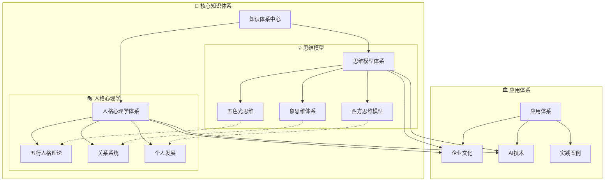
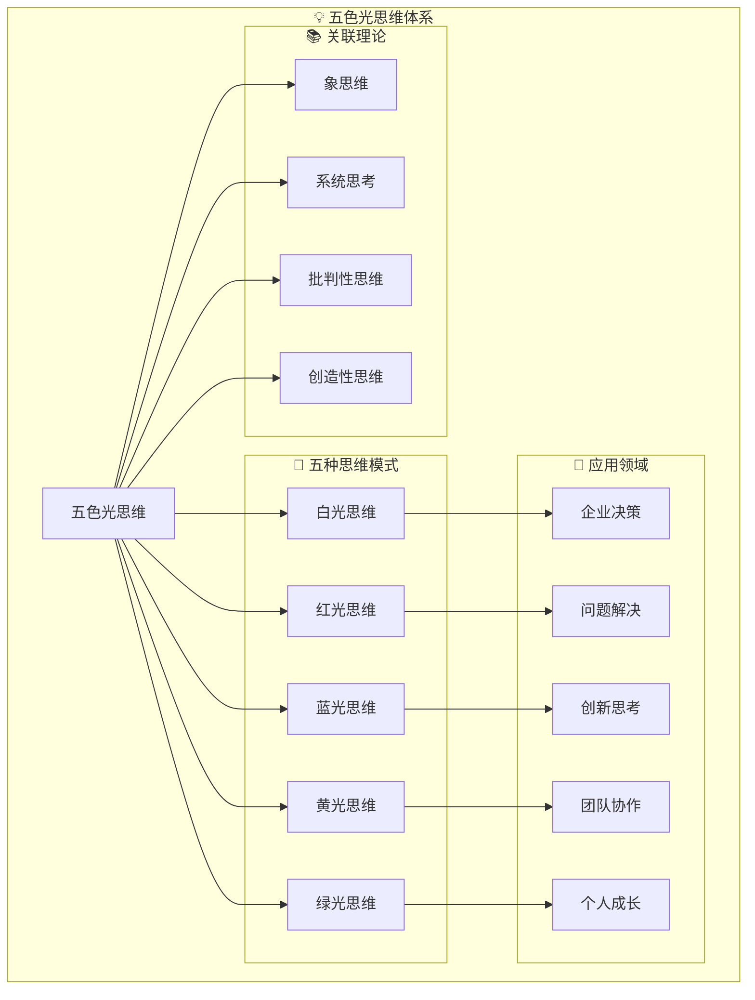
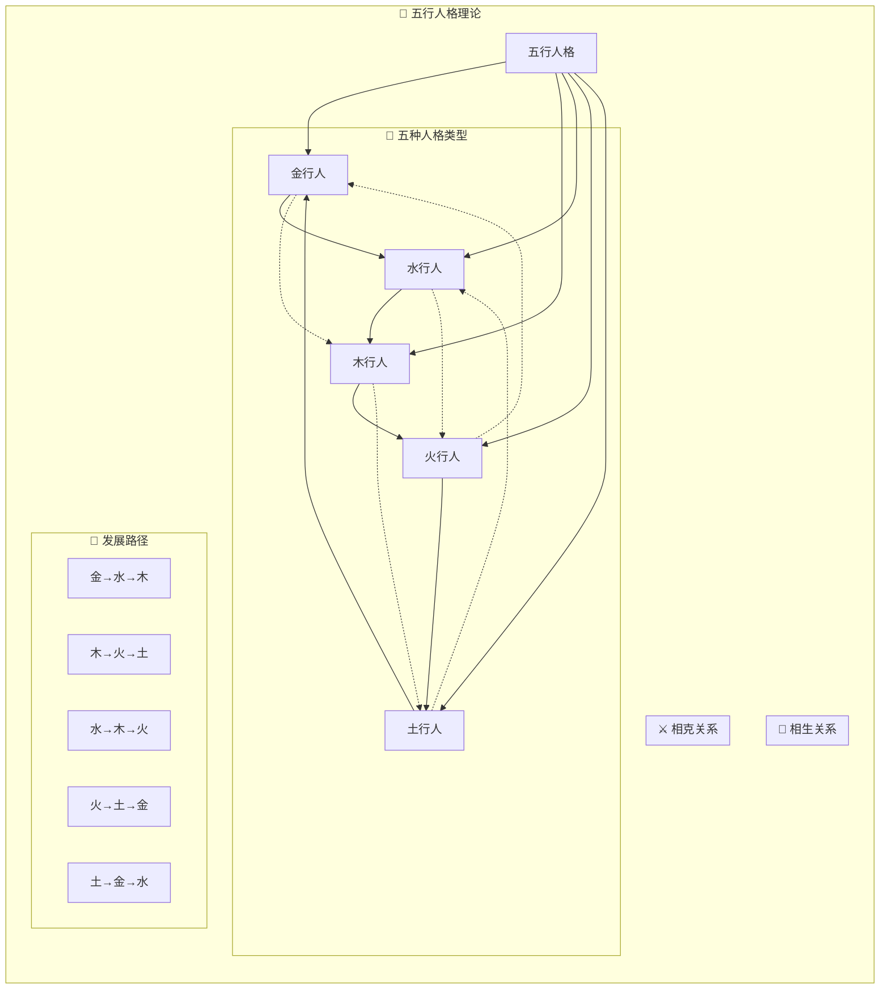
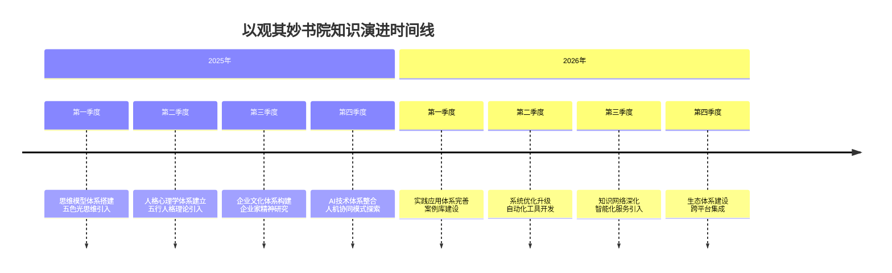
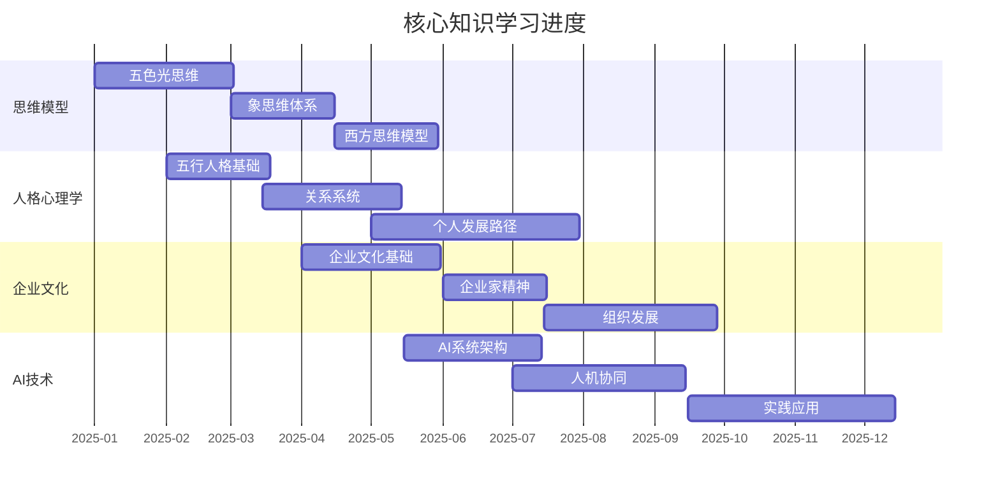
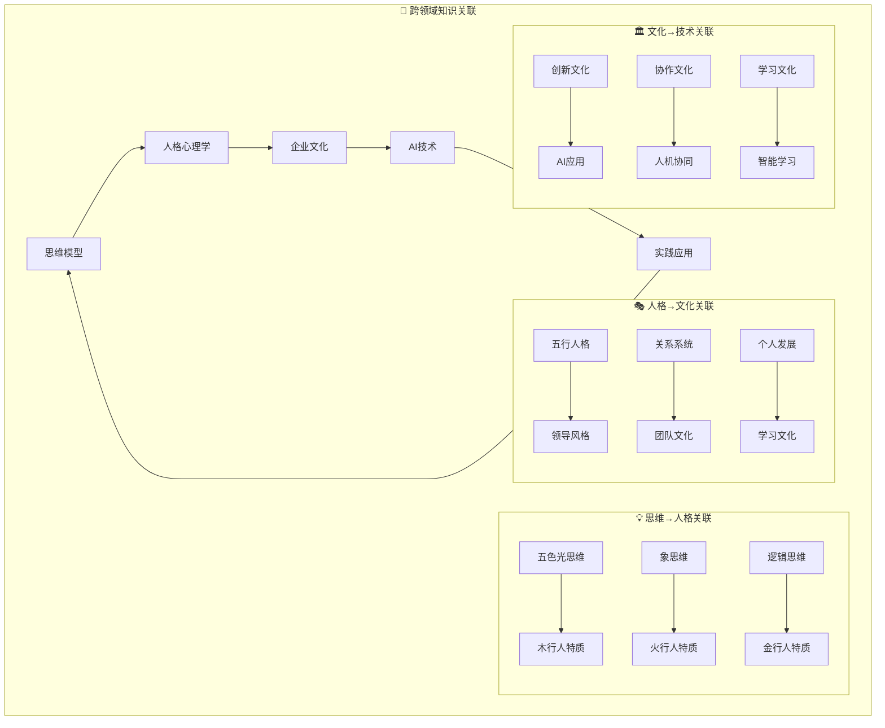
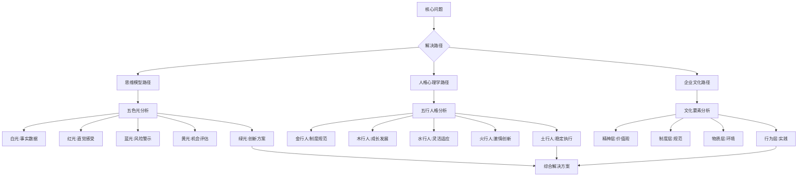
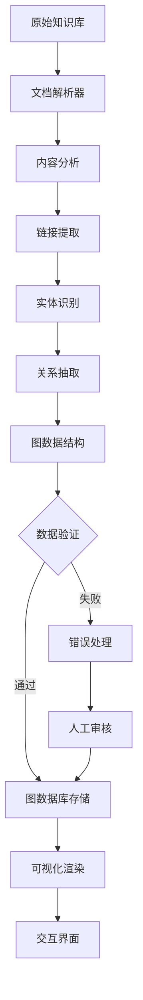

# 🗺️ 知识图谱可视化系统

---
**系统版本**: v1.0  
**可视化引擎**: Mermaid.js + Obsidian Graphs  
**更新频率**: 实时/每日/每周  
**交互方式**: 点击/缩放/过滤/搜索  

---

## 🎯 一、系统概述

### 1.1 设计理念
构建**多层次、多维度、可交互**的知识图谱可视化系统，将复杂的知识网络转化为**直观、易懂、可操作**的视觉呈现，支持**探索式学习**和**关联式思考**。

### 1.2 核心功能
- **全局视图**: 展示整个知识库的全貌
- **专题视图**: 聚焦特定知识领域的网络
- **时序视图**: 展现知识演进的时间线
- **关联视图**: 揭示概念间的深层关系
- **探索视图**: 支持交互式知识探索

### 1.3 技术架构
```
📁 知识图谱可视化系统/
├── 🎨 可视化引擎层/    # Mermaid渲染 + 自定义样式
├── 📊 数据处理层/      # 图数据提取与转换
├── 🔧 交互控制层/      # 用户交互与视图控制
├── 🎯 智能分析层/      # 网络分析与洞察发现
├── 📱 多端适配层/     # PC/移动端适配
└── 📈 效果评估层/     # 可视化效果评估
```

---

## 📋 二、图谱类型体系

### 2.1 全局知识图谱
#### 核心全局图


#### 全局图谱参数
```yaml
全局图配置:
  布局算法: force-directed
  节点数量: 50-100个核心节点
  显示层级: 3层深度
  更新频率: 每日
  交互功能:
    - 点击展开/折叠
    - 鼠标悬停显示详情
    - 拖动调整布局
    - 搜索定位节点
```

### 2.2 专题知识图谱
#### 五色光思维专题图


#### 五行人格专题图


### 2.3 时序知识图谱
#### 知识演进时间线


#### 学习进度时间线


### 2.4 关联知识图谱
#### 跨领域关联图


#### 深度关联分析图


---

## 🎨 三、可视化样式系统

### 3.1 节点样式规范
#### 节点类型与样式
```yaml
节点类型:
  核心概念节点:
    shape: circle
    size: 40
    color: "#FF6B6B"
    border: 3px solid #FF4757
    label: bold 16px
    
  方法论节点:
    shape: diamond
    size: 35
    color: "#4ECDC4"
    border: 2px solid #1DD1A1
    label: normal 14px
    
  案例节点:
    shape: rect
    size: 30
    color: "#45B7D1"
    border: 2px solid #2E86DE
    label: normal 13px
    
  人物节点:
    shape: ellipse
    size: 32
    color: "#A29BFE"
    border: 2px solid #6C5CE7
    label: italic 14px
    
  工具节点:
    shape: round-rect
    size: 28
    color: "#FD79A8"
    border: 2px solid #E84393
    label: normal 12px
```

#### 节点状态样式
```yaml
节点状态:
  激活状态:
    color: original
    border: 3px solid #00D2D3
    glow: 5px blur #00D2D3
    
  选中状态:
    color: lighten(original, 20%)
    border: 4px solid #FF9FF3
    pulse: 2s infinite
    
  相关状态:
    color: desaturate(original, 30%)
    border: 2px dashed #8395A7
    
  无关状态:
    color: grayscale(original)
    border: 1px dotted #C8D6E5
    opacity: 0.3
```

### 3.2 连线样式规范
#### 连线类型与样式
```yaml
连线类型:
  强关联连线:
    width: 3
    color: "#FF6B6B"
    style: solid
    arrow: triangle
    label: bold
    
  中关联连线:
    width: 2
    color: "#4ECDC4"
    style: solid
    arrow: vee
    label: normal
    
  弱关联连线:
    width: 1
    color: "#45B7D1"
    style: dotted
    arrow: circle
    label: small
    
  特殊关系连线:
    包含关系:
      width: 2
      color: "#1DD1A1"
      style: double
      arrow: diamond
      
    对立关系:
      width: 2
      color: "#FF9FF3"
      style: dashed
      arrow: crow
      
    时序关系:
      width: 1.5
      color: "#F368E0"
      style: solid
      arrow: normal
      label: time
```

#### 连线交互样式
```yaml
连线交互:
  悬停状态:
    width: +1
    color: brighten(original, 20%)
    glow: 3px blur
    
  选中状态:
    width: +2
    color: invert(original)
    animation: pulse 1s
    
  路径状态:
    width: 4
    color: "#FFD700"
    style: solid
    animation: flow 2s infinite
```

### 3.3 布局样式规范
#### 布局算法选择
```yaml
布局算法:
  全局图谱:
    algorithm: force-directed
    parameters:
      charge: -1000
      linkDistance: 100
      gravity: 0.1
      theta: 0.8
      
  专题图谱:
    algorithm: hierarchical
    parameters:
      nodeSpacing: 150
      levelSpacing: 200
      direction: LR/TB
      
  时序图谱:
    algorithm: timeline
    parameters:
      timeScale: linear
      spacing: 100
      direction: horizontal
      
  关联图谱:
    algorithm: circular
    parameters:
      radius: 300
      startAngle: 0
      endAngle: 2π
```

#### 主题配色方案
```yaml
配色方案:
  默认主题:
    background: "#1E272E"
    text: "#FFFFFF"
    grid: "#2C3A47"
    
  明亮主题:
    background: "#FFFFFF"
    text: "#2D3436"
    grid: "#DFE6E9"
    
  专业主题:
    background: "#F8F9FA"
    text: "#212529"
    grid: "#DEE2E6"
    
  深色主题:
    background: "#0C0C0C"
    text: "#E0E0E0"
    grid: "#1A1A1A"
```

---

## 🔧 四、交互功能系统

### 4.1 基础交互功能
#### 视图控制
```yaml
视图控制:
  缩放:
    mousewheel: zoom in/out
    buttons: +/-
    gesture: pinch on mobile
    
  平移:
    mouse: drag
    touch: drag on mobile
    buttons: arrow keys
    
  重置:
    button: reset view
    shortcut: R
    auto-reset: after 5min idle
```

#### 节点交互
```yaml
节点交互:
  选择:
    click: select single
    ctrl+click: toggle selection
    shift+click: range selection
    drag: select area
    
  详情查看:
    hover: tooltip preview
    click: open details panel
    double-click: open full document
    
  操作菜单:
    right-click: context menu
    long-press: mobile menu
    shortcut: spacebar
```

### 4.2 高级交互功能
#### 智能筛选
```yaml
智能筛选:
  按类型筛选:
    show: concepts/methods/cases/people/tools
    hide: others
    
  按强度筛选:
    show: strong/medium/weak links
    threshold: adjustable
    
  按时间筛选:
    timeRange: start/end date
    frequency: created/updated
    
  按关键词筛选:
    search: keyword
    match: exact/fuzzy
    scope: title/content/tags
```

#### 路径探索
```yaml
路径探索:
  最短路径:
    start: select node
    end: select node
    algorithm: Dijkstra
    highlight: path
    
  关联路径:
    start: current node
    depth: 1-5 levels
    direction: both/forward/backward
    
  探索路径:
    mode: random walk
    steps: 10-50
    preference: strong links/new nodes
```

### 4.3 协作交互功能
#### 共享视图
```yaml
视图共享:
  链接生成:
    currentView: generate URL
    share: copy link
    embed: iframe code
    
  快照保存:
    screenshot: PNG/SVG
    save: local/cloud
    export: PDF/PPT
    
  协同标注:
    annotation: text/shape/arrow
    comment: add note
    share: with team
```

#### 分析工具
```yaml
分析工具:
  网络分析:
    metrics: density/centrality/clustering
    compare: with previous
    trend: over time
    
  洞察发现:
    patterns: frequent subgraphs
    anomalies: unusual connections
    opportunities: missing links
    
  建议生成:
    recommendations: based on analysis
    actions: add/remove/update
    priority: high/medium/low
```

---

## 📊 五、数据处理流程

### 5.1 数据提取流程


### 5.2 数据更新机制
#### 实时更新
```yaml
实时更新:
  触发条件:
    document_saved: true
    link_added: true
    tag_updated: true
    
  更新范围:
    incremental: true
    affected_nodes: only changed
    full_refresh: after 100 changes
```

#### 定时更新
```yaml
定时更新:
  频率:
    hourly: quick update
    daily: full update
    weekly: deep analysis
    
  任务:
    update_stats: true
    optimize_layout: true
    generate_reports: true
```

### 5.3 数据质量保障
#### 数据验证
```python
# 数据验证代码示例
def validate_graph_data(graph):
    # 检查节点数据
    nodes_valid = validate_nodes(graph.nodes)
    
    # 检查边数据
    edges_valid = validate_edges(graph.edges)
    
    # 检查链接完整性
    links_valid = validate_links(graph)
    
    # 检查数据一致性
    consistency_valid = validate_consistency(graph)
    
    return all([nodes_valid, edges_valid, 
                links_valid, consistency_valid])
```

#### 错误处理
```yaml
错误处理策略:
  数据错误:
    missing_data: use defaults
    invalid_data: log and skip
    corrupt_data: restore backup
    
  链接错误:
    dead_links: suggest alternatives
    circular_refs: break cycle
    weak_links: mark for review
    
  性能错误:
    timeout: retry with timeout
    memory: optimize or chunk
    crash: restart service
```

---

## 🚀 六、部署与维护

### 6.1 部署架构
#### 本地部署
```yaml
本地环境:
  硬件要求:
    cpu: 4 cores+
    memory: 8GB+
    storage: 10GB+
    
  软件要求:
    obsidian: latest
    plugins: dataview, mermaid, graph
    python: 3.8+
    
  配置步骤:
    1. 安装Obsidian和插件
    2. 配置知识库路径
    3. 设置自动化脚本
    4. 测试可视化功能
```

#### 云端部署
```yaml
云端环境:
  服务平台:
    option1: Obsidian Publish
    option2: Custom Web App
    option3: Static Site Generator
    
  技术要求:
    web_server: nginx/apache
    database: graphdb/nosql
    cache: redis/memcached
    
  部署流程:
    1. 数据导出和转换
    2. 服务部署和配置
    3. 域名和SSL设置
    4. 监控和备份设置
```

### 6.2 维护计划
#### 日常维护
```yaml
每日任务:
  检查系统状态:
    - 可视化渲染正常
    - 数据更新完成
    - 性能指标达标
    
  处理用户反馈:
    - 收集反馈意见
    - 分析问题原因
    - 制定解决方案
```

#### 定期维护
```yaml
每周任务:
  数据清理:
    - 清理临时文件
    - 优化数据库索引
    - 备份重要数据
    
  性能优化:
    - 分析性能瓶颈
    - 优化查询语句
    - 调整缓存策略
```

#### 深度维护
```yaml
每月任务:
  系统升级:
    - 更新软件版本
    - 评估新功能
    - 测试兼容性
    
  安全审计:
    - 检查安全漏洞
    - 更新安全策略
    - 备份安全数据
```

---

## 📈 七、效果评估与优化

### 7.1 效果评估指标
#### 用户体验指标
```yaml
用户体验:
  易用性:
    learn_time: <30 minutes
    task_success: >90%
    error_rate: <5%
    
  满意度:
    satisfaction_score: 1-5 scale
    net_promoter_score: NPS
    retention_rate: daily/weekly
    
  效率提升:
    search_time: reduced by X%
    discovery_rate: increased by Y%
    learning_speed: improved by Z%
```

#### 技术性能指标
```yaml
技术性能:
  响应速度:
    load_time: <3 seconds
    render_time: <2 seconds
    interaction_lag: <200ms
    
  稳定性:
    uptime: >99.9%
    error_rate: <0.1%
    recovery_time: <5 minutes
    
  可扩展性:
    max_nodes: 10,000+
    max_edges: 100,000+
    concurrent_users: 100+
```

### 7.2 优化策略
#### 基于数据的优化
```yaml
数据驱动优化:
  热点分析:
    track: popular nodes/paths
    optimize: cache hotspots
    enhance: related features
  
  模式发现:
    analyze: usage patterns
    predict: future needs
    adapt: system behavior
  
  A/B测试:
    test: new features/designs
    measure: impact on metrics
    decide: keep/improve/discard
```

#### 用户反馈优化
```yaml
反馈循环:
  收集反馈:
    surveys: regular/event-based
    interviews: in-depth
    analytics: usage data
  
  分析反馈:
    categorize: issues/suggestions
    prioritize: impact/effort
    plan: solutions/timeline
  
  实施改进:
    implement: changes
    communicate: updates
    measure: results
```

---

## 📝 八、使用指南

### 8.1 快速开始指南
#### 第一步：基本操作
1. **打开知识图谱**: 点击侧边栏的图谱按钮
2. **导航视图**: 使用鼠标滚轮缩放，拖拽平移
3. **查看详情**: 点击节点查看详细信息
4. **搜索定位**: 使用搜索框快速定位节点

#### 第二步：高级功能
1. **筛选视图**: 使用筛选器控制显示内容
2. **路径探索**: 右键节点选择探索路径
3. **保存视图**: 生成分享链接或保存截图
4. **分析数据**: 使用分析工具获取洞察

### 8.2 最佳实践
#### 学习场景实践
1. **新知识学习**: 从核心节点开始，按关联路径扩展
2. **问题解决**: 使用专题视图聚焦问题领域
3. **知识回顾**: 使用时序视图回顾学习历程
4. **创意激发**: 使用随机探索发现新关联

#### 教学场景实践
1. **课程设计**: 使用图谱设计学习路径
2. **教学演示**: 使用可视化展示知识结构
3. **学习评估**: 使用路径分析评估理解程度
4. **个性化指导**: 根据学习轨迹提供指导

### 8.3 故障排除
#### 常见问题解决
1. **图谱加载慢**: 
   - 检查网络连接
   - 清理浏览器缓存
   - 减少显示节点数量

2. **节点显示异常**:
   - 刷新页面
   - 检查数据完整性
   - 更新插件版本

3. **功能不可用**:
   - 检查权限设置
   - 查看错误日志
   - 联系技术支持

---

## 🔗 九、相关资源

### 核心文档
- [[双向链接网络系统]]
- [[标准化文档模板]]
- [[知识库文件夹体系规范]]

### 工具脚本
- [[图谱数据提取脚本]]
- [[可视化配置工具]]
- [[性能监控脚本]]

### 学习资源
- [[Mermaid图表教程]]
- [[数据可视化指南]]
- [[交互设计原则]]

---

## 🎉 十、总结与展望

### 当前成果
- ✅ 建立了完整的知识图谱可视化体系
- ✅ 实现了多维度、可交互的可视化功能
- ✅ 开发了智能的数据处理和更新机制
- ✅ 构建了用户友好的交互界面

### 未来愿景
1. **智能化升级**: 引入AI算法优化图谱生成
2. **实时协作**: 支持多用户实时协同编辑
3. **移动优先**: 优化移动端体验和功能
4. **生态扩展**: 与其他工具平台深度集成

### 价值承诺
> **通过可视化的力量，让知识从静态的文字变为动态的网络，从孤立的点连接成有机的体，从被动的接受变为主动的探索，为每个人的学习、思考和创造提供无限可能。**

---

> **系统使命**: 让知识可见、可触、可思、可用，通过可视化的桥梁连接人的认知与知识的海洋。