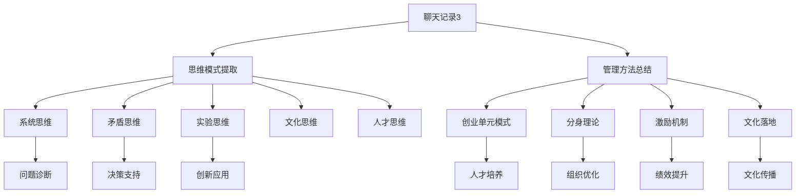

# 聊天记录主题索引

## 📚 索引概述
本索引系统整理了从聊天记录3中提取的所有主题、思维模式和管理方法，便于快速查找和学习。

## 🏷️ 主题分类索引

### 1. 企业管理与组织发展
- [[创业单元模式]] - 人才培养和业务复制的创新模式
- [[分身理论应用]] - 高层管理者能力延伸的组织理论
- [[组织架构优化]] - 总部与门店关系的重新定义
- [[战略执行体系]] - 从战略到执行的全链条设计

### 2. 市场战略与品牌建设
- [[24节气市场理论]] - 基于中国传统文化的市场策略
- [[品牌文化溢价]] - 通过文化提升品牌价值的方法
- [[天人合一理念]] - 传统哲学在现代商业的应用
- [[市场预判机制]] - 行业趋势分析和机会识别

### 3. 人才培养与激励机制
- [[人才复刻计划]] - 系统性的人才培养和复制机制
- [[多层次激励机制]] - 总设计师、团队、全员的三层激励
- [[人才培养体系]] - 从输入到输出的完整培养路径
- [[绩效考核转型]] - 从业绩导向到人才导向的转变

### 4. 企业文化与价值观
- [[文化落地路径]] - 从理念到行为的完整落地体系
- [[价值观行为转化]] - 将价值观转化为具体行为标准
- [[家文化组织建设]] - 传统文化在现代组织的应用
- [[文化自信构建]] - 建立文化自信的理论和实践

### 5. 领导力与决策思维
- [[系统思维模式]] - 整体性、关联性的思考方式
- [[矛盾思维方法]] - 主次矛盾的识别和解决方法
- [[实验思维实践]] - 小步快跑、数据驱动的实验方法
- [[战略决策框架]] - 基于数据和理论的决策体系

## 🧩 思维模式索引

### 核心思维模式
- [[系统思维五维度]] - 结构、过程、功能、环境、发展
- [[矛盾分析框架]] - 根本、阶段、主要、次要矛盾
- [[实验设计方法]] - 假设、实验、数据、验证的完整流程
- [[文化融合路径]] - 传统智慧与现代管理的融合方法

### 应用思维模式
- [[问题诊断思维]] - 表面、深层、根本问题的分析方法
- [[决策支持思维]] - 信息、分析、方案、决策的完整流程
- [[创新融合思维]] - 跨领域知识和资源的整合创新
- [[成长路径思维]] - 个人和组织的成长发展路径

## 🔧 工具方法索引

### 管理工具
- [[创业单元启动检查清单]] - 模式启动的完整检查项
- [[人才培养跟踪表]] - 人才发展的全过程跟踪
- [[文化落地评估表]] - 文化理念落地的评估工具
- [[分身角色定位表]] - 各部门分身角色的明确定位

### 分析工具
- [[五维问题诊断法]] - 数据、文化、人才、系统、战略五个维度
- [[决策支持矩阵]] - 问题类型、分析工具、解决策略、验证指标
- [[思维模式评估表]] - 五种思维模式的成熟度评估
- [[风险预警机制]] - 风险指标的预警和应对流程

### 评估工具
- [[效果评估体系]] - 业务、人才、文化的综合评估
- [[能力评估框架]] - 战略、专业、资源、执行能力的评估
- [[文化落地评估]] - 理解、认同、行为、传播的评估
- [[组织效率评估]] - 决策、执行、协作、创新的评估

## 🎯 应用场景索引

### 企业应用场景
- **战略规划场景**：制定企业发展战略和年度计划
- **组织优化场景**：优化组织架构和协作机制
- **人才培养场景**：设计和实施人才培养计划
- **文化落地场景**：推动企业文化理念落地实施
- **市场拓展场景**：制定市场拓展策略和执行计划

### 团队应用场景
- **团队建设场景**：提升团队协作和执行力
- **问题解决场景**：分析和解决团队面临的问题
- **能力提升场景**：提升团队成员的专业能力
- **创新激发场景**：激发团队的创新思维和能力
- **文化建设场景**：建设和传播团队文化

### 个人应用场景
- **能力提升场景**：提升个人的专业和管理能力
- **思维训练场景**：训练系统思维和战略思维
- **决策优化场景**：优化个人的决策过程和质量
- **职业发展场景**：规划个人的职业发展路径
- **学习成长场景**：设计个人的学习和成长计划

## 🔗 知识关联图

### 核心知识关联


### 应用路径关联
```
问题识别 → 思维模式选择 → 工具方法应用 → 解决方案设计 → 实施执行 → 效果评估
```

## 📊 学习路径索引

### 入门学习路径
```
第一步：理解基本概念
  1. 阅读[[聊天记录3-完整分析.md]]
  2. 学习[[思维模式提取.md]]中的核心概念
  3. 了解[[聊天记录.skills.md]]的基本框架

第二步：掌握核心模式
  1. 深入学习[[系统思维模式]]
  2. 掌握[[矛盾思维方法]]
  3. 理解[[实验思维实践]]

第三步：应用工具方法
  1. 学习使用[[五维问题诊断法]]
  2. 掌握[[决策支持矩阵]]
  3. 实践[[创业单元启动检查清单]]
```

### 进阶学习路径
```
第一步：深度理解
  1. 研究[[分身理论应用.md]]的理论基础
  2. 分析[[24节气市场理论.md]]的文化内涵
  3. 理解[[文化落地路径.md]]的实施逻辑

第二步：综合应用
  1. 将多种思维模式组合应用
  2. 设计完整的管理解决方案
  3. 建立个人的知识应用体系

第三步：创新优化
  1. 在现有模式基础上创新
  2. 优化工具方法的应用效果
  3. 建立持续改进的机制
```

### 实践应用路径
```
第一步：小范围实践
  1. 选择一个简单问题应用思维模式
  2. 使用工具方法进行分析和解决
  3. 评估应用效果并进行调整

第二步：扩大应用范围
  1. 在更多问题中应用思维模式
  2. 组合使用多种工具方法
  3. 建立系统化的应用流程

第三步：建立应用体系
  1. 形成个人的应用方法论
  2. 建立持续学习和改进机制
  3. 分享和传播应用经验
```

## 🎓 技能应用索引

### 聊天记录.skills应用
- **洞察操作**：深度理解思维模式和决策逻辑
- **剖析操作**：分析问题结构和解决方案
- **透视操作**：透视系统思维和文化融合
- **阐释操作**：阐释核心理念和方法论
- **推演操作**：推演发展趋势和解决方案效果
- **解构操作**：解构复杂问题和组织结构
- **思辨操作**：思辨假设验证和风险控制
- **溯源操作**：溯源问题根源和思维来源
- **融合操作**：融合东西方思维和传统现代
- **启发操作**：启发创新思路和认知升级

### 人机协同应用
- **高效助理模式**：信息处理和任务执行
- **知识导师模式**：认知提升和方法传授
- **共创合伙人模式**：共同创造和战略规划
- **学习型助手模式**：持续学习和能力进化

## 🔄 更新维护机制

### 更新频率
- **日常更新**：新增应用案例和实践经验
- **月度更新**：优化工具方法和评估标准
- **季度更新**：完善知识体系和关联关系
- **年度更新**：全面审查和系统性更新

### 维护原则
- **准确性原则**：确保知识的准确性和可靠性
- **实用性原则**：注重知识的实用性和可操作性
- **系统性原则**：保持知识体系的系统性和完整性
- **更新性原则**：持续更新知识和优化体系

### 贡献机制
- **案例贡献**：贡献实际应用案例和经验
- **工具贡献**：贡献新的工具方法和技术
- **模式贡献**：贡献新的思维模式和应用模式
- **反馈贡献**：提供使用反馈和改进建议

---

**索引类型**：主题分类和知识关联索引  
**覆盖范围**：聊天记录3中的所有主题和知识  
**更新日期**：2026年3月16日  
**维护状态**：活跃维护和持续更新  
**关联系统**：Obsidian知识库的导航和检索系统  
**使用建议**：结合双向链接和搜索功能高效使用