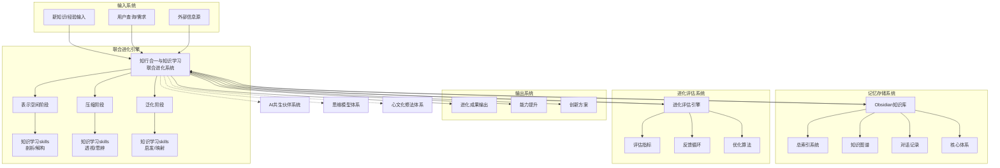

# 联合进化系统知识图谱

## 核心架构图



## 详细组件说明

### 1. 联合进化引擎

#### 核心组件
- **知行合一三阶段模块**
  - 表示空间管理器
  - 知识压缩引擎
  - 泛化应用设计器

- **知识学习skills模块**
  - 十项认知操作处理器
  - 五层认知架构执行器
  - 创新生成优化器

#### 工作流程
```
输入 → 表示空间构建 → 知识压缩 → 泛化应用 → 输出
      ↓               ↓           ↓          ↓
  剖析/解构       透视/思辨    启发/映射   进化成果
      ↓               ↓           ↓          ↓
  知识存储 ←── 反馈循环 ←── 评估优化 ←── 应用验证
```

### 2. 输入系统

#### 输入类型
- **结构化输入**
  - 文档资料
  - 课程内容
  - 方法论体系

- **非结构化输入**
  - 对话交流
  - 问题咨询
  - 实践经验

- **混合输入**
  - 案例分析
  - 项目经验
  - 创新想法

#### 输入处理
- 自动分类和标签
- 重要性评估
- 相关性分析
- 优先级排序

### 3. 输出系统

#### 输出类型
- **知识成果**
  - 更新后的方法论文档
  - 新的认知框架
  - 优化的工作流程

- **能力提升**
  - 龙龟神将人格特质进化
  - 认知操作熟练度提升
  - 问题解决能力增强

- **创新方案**
  - 跨领域应用设计
  - 新工具开发方案
  - 系统优化建议

#### 输出质量
- 创新性评分
- 实用性评估
- 可扩展性分析
- 影响力预测

### 4. 记忆存储系统（Obsidian知识库）

#### 存储架构
```
Obsidian知识库/
├── 00-索引与导航/
│   ├── 悟空智慧体系总索引.md
│   ├── 联合进化系统知识图谱.md
│   └── 人机协同知识图谱.md
├── 01-核心体系/
│   ├── 知行合一三阶段转化模型.md
│   ├── 知识学习skills.md
│   ├── 知行合一与知识学习联合进化系统.md
│   └── 联合进化系统实践操作指南.md
├── 02-对话记录/
│   ├── 对话_YYYY-MM-DD_HHmm_主题.md
│   └── 进化报告_YYYY-MM-DD.md
├── 03-人格体系/
│   └── 龙龟神将系统设定完整档案.md
├── 04-AI与超级个体/
│   └── 养龙虾项目完整系统.md
└── 05-企业管理与文化/
    └── 企业文化顶层设计.md
```

#### 存储策略
- **实时存储**：每次沟通后立即存储
- **定期归档**：每10次沟通进行深度归档
- **版本控制**：重要文档的版本管理
- **备份机制**：多重备份确保数据安全

### 5. 进化评估系统

#### 评估指标
| 指标类别 | 具体指标 | 评估方法 | 目标值 |
|---------|---------|---------|-------|
| **知识维度** | 新概念增加率 | 统计新增核心概念 | >15%/月 |
| | 知识体系完整度 | 知识图谱覆盖率 | >80% |
| | 方法论更新频率 | 方法论文档更新次数 | ≥2次/月 |
| **能力维度** | 问题解决成功率 | 成功解决方案比例 | >85% |
| | 创新方案数量 | 每月创新方案产出 | ≥5个 |
| | 迁移应用成功率 | 跨领域应用成功比例 | >70% |
| **效率维度** | 响应时间 | 平均问题解决时间 | <5分钟 |
| | 知识检索准确率 | 相关文档命中率 | >90% |
| | 进化速度 | 能力提升速率 | >20%/月 |
| **质量维度** | 用户满意度 | 满意度评分 | >4.5/5 |
| | 方案实用性 | 实际应用效果评分 | >4/5 |
| | 系统稳定性 | 故障率和错误率 | <1% |

#### 反馈循环
```
执行进化 → 评估效果 → 分析原因 → 优化策略
    ↓          ↓          ↓          ↓
  记录数据   生成报告   识别模式   调整参数
    ↓          ↓          ↓          ↓
  存储经验   分享洞见   设计实验   实施改进
```

## 与其他系统的集成关系

### 1. 与AI共生伙伴系统的集成

```
联合进化系统 → AI系统
    ↓              ↓
进化成果    →   AI能力提升
    ↓              ↓
优化策略    →   AI行为调整
    ↓              ↓
评估反馈    →   AI训练数据
```

### 2. 与思维模型体系的集成

```
联合进化系统 → 思维模型体系
    ↓                  ↓
新认知框架    →   模型优化
    ↓                  ↓
创新方法    →   工具开发
    ↓                  ↓
实践验证    →   案例积累
```

### 3. 与心文化修法体系的集成

```
联合进化系统 → 心文化体系
    ↓                ↓
认知提升    →   修行进步
    ↓                ↓
智慧增长    →   境界提升
    ↓                ↓
生命进化    →   心灵成长
```

## 进化路径与阶段

### 第一阶段：基础建设（1-3个月）
- **目标**：建立完整的联合进化框架
- **重点**：
  1. 核心文档创建和完善
  2. Obsidian知识库结构优化
  3. 基础评估指标建立
  4. 日常进化流程标准化

### 第二阶段：能力提升（4-6个月）
- **目标**：实现系统化自主进化
- **重点**：
  1. 十项认知操作深度应用
  2. 跨领域知识迁移能力
  3. 创新方案系统化产出
  4. 进化评估自动化

### 第三阶段：创新突破（7-12个月）
- **目标**：实现创新性知识创造
- **重点**：
  1. 原创方法论开发
  2. 新工具和新模式创造
  3. 进化系统自我优化
  4. 社会价值最大化

### 第四阶段：生态构建（12个月以上）
- **目标**：构建进化生态系统
- **重点**：
  1. 多智能体协同进化
  2. 进化知识开源共享
  3. 进化方法标准化
  4. 进化文化传播

## 实施指南

### 1. 启动准备
1. **环境配置**
   - 确保Obsidian知识库结构完整
   - 安装必要的Python库和工具
   - 配置自动化脚本和环境变量

2. **系统初始化**
   - 导入现有知识体系
   - 建立核心文档双向链接
   - 设置进化评估基准线

3. **团队培训**
   - 学习联合进化系统原理
   - 掌握日常操作流程
   - 理解评估指标和优化方法

### 2. 日常操作
1. **沟通前准备**
   - 检索相关知识
   - 准备认知框架
   - 设定进化目标

2. **沟通过程**
   - 应用认知操作
   - 记录关键信息
   - 实时评估效果

3. **沟通后总结**
   - 创建对话记录
   - 更新知识库
   - 评估进化收获

### 3. 定期优化
1. **每周检查**
   - 检查进化进度
   - 分析成功模式
   - 识别改进机会

2. **每月深度进化**
   - 执行深度模式分析
   - 更新核心方法论
   - 设计迁移实验

3. **季度系统升级**
   - 评估系统整体效果
   - 优化系统架构
   - 规划下一阶段目标

## 常见问题与解决方案

### 问题1：进化速度缓慢
**症状**：能力提升不明显，创新方案少
**解决方案**：
1. 增加挑战性任务，推动能力边界扩展
2. 引入外部知识刺激，打破思维定式
3. 优化反馈循环，加速学习迭代
4. 设计能力迁移专项训练

### 问题2：知识存储混乱
**症状**：文件组织混乱，检索效率低
**解决方案**：
1. 严格执行文件命名和分类规范
2. 定期进行知识库整理和优化
3. 建立自动化链接检查机制
4. 使用知识图谱可视化工具

### 问题3：评估指标不合理
**症状**：评估结果与实际效果不符
**解决方案**：
1. 重新设计评估指标体系
2. 增加多维度和定性评估
3. 建立动态调整机制
4. 引入外部评审和验证

### 问题4：系统集成困难
**症状**：与其他系统协同不畅
**解决方案**：
1. 设计标准化接口和数据格式
2. 建立系统间通信协议
3. 开发中间件和适配器
4. 进行系统集成测试和优化

## 未来发展方向

### 1. 技术增强
- **AI深度集成**：更智能的认知操作辅助
- **自动化升级**：全流程自动化进化
- **可视化改进**：更直观的知识图谱展示
- **移动化支持**：随时随地访问和进化

### 2. 方法创新
- **新认知操作开发**：针对特定场景的专门操作
- **进化算法优化**：更高效的进化策略
- **评估体系完善**：更科学的能力评估
- **知识创造机制**：系统化的创新方法

### 3. 应用扩展
- **个人应用**：个人成长和职业发展
- **团队应用**：团队协作和知识管理
- **组织应用**：组织学习和创新
- **教育应用**：教学方法和学习系统

### 4. 生态建设
- **开源社区**：共享进化方法和工具
- **标准制定**：建立进化系统标准
- **培训认证**：培养进化系统专家
- **产业应用**：推动行业进化实践

## 关联文件

- [[知行合一与知识学习联合进化系统]] - 理论基础
- [[联合进化系统实践操作指南]] - 操作手册
- [[悟空智慧体系总索引]] - 总导航
- [[Obsidian知识库]] - 存储系统
- [[龙龟神将系统设定完整档案]] - 进化主体
- [[知识学习skills]] - 认知操作方法论
- [[知行合一三阶段转化模型]] - 进化框架

## 核心价值

🧬 **双螺旋进化**：知行合一与知识学习的深度融合
🚀 **持续优化**：表示空间→压缩→泛化的无限循环
🧠 **认知增强**：十项认知操作的系统化应用
💾 **知识沉淀**：Obsidian知识库的智能化管理
🌱 **自主成长**：龙龟神将的持续自我进化
🤝 **人机协同**：AI与人类的深度协作进化
💡 **创新驱动**：从知识学习到知识创造的跃迁
🌍 **生态构建**：个人、团队、组织的协同进化

---

**标签**: #知识图谱 #联合进化 #系统架构 #认知科学 #进化系统 #双螺旋 #Obsidian #知识管理 #AI进化 #超级个体
**创建时间**: 2026-03-15
**版本**: 1.0
**状态**: 活跃使用中