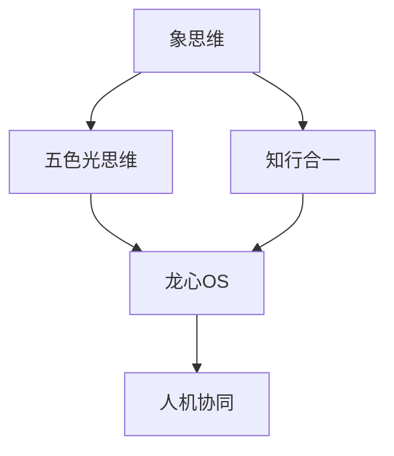

# 🏛️ 以观其妙书院知识库体系建设完整方案 v3.0

> **目标**: 构建标准化、双向链接、可视化、可自动化的完整知识库体系  
> **核心理念**: 所有智慧沉淀于此，作为龙龟神将的长期记忆库  
> **三大支柱**: Obsidian（主知识库）↔ WorkBuddy（工作记忆）↔ IMA（移动笔记）

---

## 📋 目录

1. [文档结构标准化](#文档结构标准化)
2. [双向链接网络](#双向链接网络)
3. [知识图谱可视化](#知识图谱可视化)
4. [学习路径设计](#学习路径设计)
5. [总索引建设](#总索引建设)
6. [自动化验证工具](#自动化验证工具)
7. [知识网络优化](#知识网络优化)
8. [智能文件分类](#智能文件分类)
9. [增量备份优化](#增量备份优化)
10. [三向同步机制](#三向同步机制)

---

## 一、文档结构标准化

### 1.1 标准化文档模板

每篇文档必须包含以下模块：

```markdown
---
title: "文档标题"
created: "YYYY-MM-DD"
updated: "YYYY-MM-DD"
version: "X.X"
tags: [标签1, 标签2, 标签3]
related: [[相关文档1]], [[相关文档2]]
category: "分类"
---

# 文档标题

## 📖 核心定义
> 一句话概括核心概念（不超过 50 字）

## 📚 详细内容
### 主标题 1
#### 子标题 1.1
内容...

#### 子标题 1.2
内容...

### 主标题 2
内容...

## 🔗 关联文件
- [[相关文档 A]]
- [[相关文档 B]]
- [[相关文档 C]]

## 💬 核心金句
> 最精华的 3-5 句话，可直接引用

## 🏷️ 标签
`#标签1` `#标签2` `#标签3`

## 📊 双向链接网络
- ⬅️ 被引用: [[文档 X]]
- ➡️ 引用: [[文档 Y]]
```

### 1.2 分类模板体系

#### 理论知识模板
```markdown
---
type: theory
category: 核心理论
tags: [理论, 方法论, 原创]
difficulty: 中等
prerequisites: [[前置知识]]
---

# 理论名称

## 核心定义
> 理论一句话总结

## 理论背景
- 起源与发展
- 相关领域
- 创新点

## 核心要素
1. 要素 1
2. 要素 2
3. 要素 3

## 应用场景
- 场景 1
- 场景 2
- 场景 3

## 案例分析
- 案例 1
- 案例 2

## 关联理论
- [[理论 A]]
- [[理论 B]]
```

#### 技能文档模板
```markdown
---
type: skill
category: WorkBuddy Skill
version: X.X
path: ~/.workbuddy/skills/skill-name/
---
```

#### 对话记录模板
```markdown
---
type: dialogue
date: YYYY-MM-DD
participants: [悟空, 龙龟神将]
topic: 主题
---

# 对话主题 - YYYY-MM-DD

## 📋 对话摘要
> 3-5 句话总结对话核心内容

## 💡 核心洞察
### 洞察 1
> 内容

### 洞察 2
> 内容

## 🎯 达成共识
1. 共识点 1
2. 共识点 2

## 📚 知识沉淀
- 新增知识点 1
- 新增知识点 2

## 🔗 关联文档
- [[文档 A]]
- [[文档 B]]

## 🏷️ 标签
`#对话` `#主题`
```

---

## 二、双向链接网络

### 2.1 双向链接规范

#### 链接类型

```markdown
# 1. 直接引用链接（引用另一个文档的内容）
见 [[象思维]] 的定义

# 2. 关联链接（相关但不直接引用）
相关概念: [[五色光思维]]

# 3. 双向链接声明
## 🔗 双向链接网络
- ⬅️ 被引用: [[文档 A]], [[文档 B]]
- ➡️ 引用: [[文档 C]], [[文档 D]]
```

#### 链接密度要求

| 文档类型 | 最小双向链接数 | 推荐链接数 |
|---------|--------------|-----------|
| 核心理论文档 | 5+ | 10-20 |
| 技能文档 | 3+ | 5-10 |
| 案例文档 | 3+ | 5-10 |
| 对话记录 | 2+ | 3-5 |

### 2.2 自动双向链接检查脚本

```python
# check-bidirectional-links.py
import os
import re
from pathlib import Path

def check_bidirectional_links(obsidian_path):
    """
    检查双向链接完整性
    """
    links_db = {}
    
    # 扫描所有 Markdown 文件
    for md_file in Path(obsidian_path).rglob("*.md"):
        content = md_file.read_text(encoding='utf-8')
        
        # 提取所有双向链接 [[链接名]]
        links = re.findall(r'\[\[(.*?)\]\]', content)
        
        # 记录链接关系
        links_db[str(md_file)] = {
            'links': links,
            'backlinks': []
        }
    
    # 构建反向链接
    for file_path, data in links_db.items():
        for link in data['links']:
            target_file = find_target_file(obsidian_path, link)
            if target_file and target_file in links_db:
                links_db[target_file]['backlinks'].append(file_path)
    
    # 检查完整性
    report = []
    for file_path, data in links_db.items():
        for link in data['links']:
            target_file = find_target_file(obsidian_path, link)
            
            if not target_file:
                report.append(f"⚠️ 链接目标不存在: {Path(file_path).name} → {link}")
            elif target_file in links_db:
                if Path(file_path).name not in links_db[target_file]['backlinks']:
                    report.append(f"❌ 缺少反向链接: {Path(file_path).name} → {link}")
    
    return report
```

---

## 三、知识图谱可视化

### 3.1 知识图谱文件结构

```markdown
# 🗺️ 知识图谱总览

## 📊 知识网络密度
- 总文档数: X
- 双向链接数: Y
- 平均链接密度: Z links/doc

## 🎯 核心节点

### 一级核心节点（枢纽节点）
- [[象思维]] - 双向链接数: XX
- [[五色光思维]] - 双向链接数: XX
- [[知行合一]] - 双向链接数: XX
- [[五行人格心理学]] - 双向链接数: XX

### 二级核心节点
- [[文档 A]] - 双向链接数: X
- [[文档 B]] - 双向链接数: X

## 🌐 知识网络可视化



## 🔗 关系网络分析
### 聚类分析
- 聚类 1: 思维模型体系
- 聚类 2: 文化信仰体系
- 聚类 3: 人格心理学体系
```

### 3.2 可视化工具集成

推荐使用 Obsidian 插件:
1. **Graph Analysis** - 图谱分析
2. **Excalidraw** - 可视化绘图
3. **Dataview** - 数据查询

---

## 四、学习路径设计

### 4.1 系统学习路径

```markdown
# 🛤️ 学习路径总图

## 📊 学习难度分级
- 🟢 入门级 (L1): 无需前置知识
- 🟡 进阶级 (L2): 需要 L1 基础
- 🟠 高阶级 (L3): 需要 L1+L2 基础
- 🔴 专家级 (L4): 需要完整体系

## 🎯 推荐学习路径

### 路径 1: AI 共生伙伴建设
1. [[象思维]] (L1) 🟢
2. [[五色光思维]] (L1) 🟢
3. [[知行合一自我进化]] (L2) 🟡
4. [[龙心OS 龙脑操作系统]] (L3) 🟠
5. [[人机协同四象限]] (L2) 🟡

### 路径 2: 五行人格心理学
1. [[五行人格心理学总论]] (L1) 🟢
2. [[木行人格]] (L2) 🟡
3. [[火行人格]] (L2) 🟡
4. [[土行人格]] (L2) 🟡
5. [[金行人格]] (L2) 🟡
6. [[水行人格]] (L2) 🟡

### 路径 3: 文化信仰体系
1. [[心文化总论]] (L1) 🟢
2. [[大圆满体系]] (L2) 🟡
3. [[地藏经实修]] (L3) 🟠
4. [[护法神将体系]] (L3) 🟠
```

### 4.2 学习进度追踪

```markdown
# 📊 学习进度统计

| 路径 | 总数 | 已完成 | 进度 |
|------|------|--------|------|
| AI 共生伙伴 | 5 | 3 | 60% |
| 五行人格心理学 | 6 | 6 | 100% |
| 文化信仰体系 | 4 | 2 | 50% |
```

---

## 五、总索引建设

### 5.1 总索引文件结构

```markdown
# 📚 以观其妙书院知识库总索引

> **更新时间**: YYYY-MM-DD  
> **维护者**: 龙龟神将

---

## 🔍 快速导航

### 按主题分类
- [[思维模型体系]] - X 篇
- [[五行人格心理学]] - X 篇
- [[文化信仰体系]] - X 篇
- [[AI 与超级个体]] - X 篇
- [[企业文化与组织发展]] - X 篇

### 按时间线
- [[2026-03]] - 最新更新
- [[2026-02]]
- [[2026-01]]

### 按重要度
- ⭐⭐⭐ 核心文档 (X 篇)
- ⭐⭐ 重要文档 (X 篇)
- ⭐ 一般文档 (X 篇)

---

## 📚 详细索引

### 00-索引与导航
- [[知识图谱]] - 可视化展示知识关系
- [[学习路径总图]] - 系统学习路径
- [[双向链接规范]] - 链接使用规范
- [[标准化文档模板]] - 文档模板

### 01-核心体系
- [[象思维]] - 原创思维方法论
- [[五色光思维]] - 结构化决策系统
- [[知行合一自我进化]] - 认知进化引擎
- [[龙心OS 龙脑操作系统]] - AI 时代认知操作系统
- [[五行人格心理学总论]] - 人格分析体系

### 02-对话与记录
- [[对话记录 - YYYY-MM-DD]] - 对话归档

---

## 🔎 搜索技巧

### Obsidian 搜索
- `tag:#思维模型` - 按标签搜索
- `path:"01-核心体系"` - 按路径搜索
- `file:*象思维*` - 模糊搜索文件名

### 双向链接搜索
- `[[象思维]]` - 查看所有引用该文档的文件
```

---

## 六、自动化验证工具

### 6.1 Python 验证脚本集

#### 脚本 1: 双向链接完整性检查

```python
# verify_links.py
import re
from pathlib import Path

def verify_bidirectional_links(obsidian_path):
    """
    验证双向链接完整性
    """
    print("🔍 开始验证双向链接...")
    
    # 实现见上文 check_bidirectional_links 函数
    report = check_bidirectional_links(obsidian_path)
    
    if not report:
        print("✅ 所有双向链接完整！")
    else:
        print(f"⚠️ 发现 {len(report)} 个问题:")
        for item in report:
            print(f"  - {item}")
    
    return report
```

#### 脚本 2: 文档链接完整性检查

```python
# verify_document_structure.py
def verify_document_structure(obsidian_path):
    """
    验证文档结构完整性
    """
    print("🔍 开始验证文档结构...")
    
    issues = []
    
    for md_file in Path(obsidian_path).rglob("*.md"):
        content = md_file.read_text(encoding='utf-8')
        
        # 检查必需字段
        required_fields = ['title', 'created', 'tags']
        for field in required_fields:
            if field not in content and field not in content.lower():
                issues.append(f"⚠️ 缺少字段: {md_file.name} → {field}")
        
        # 检查双向链接网络部分
        if '双向链接网络' not in content:
            issues.append(f"⚠️ 缺少双向链接网络: {md_file.name}")
    
    if not issues:
        print("✅ 所有文档结构完整！")
    else:
        print(f"⚠️ 发现 {len(issues)} 个问题:")
        for item in issues:
            print(f"  - {item}")
    
    return issues
```

#### 脚本 3: 知识网络密度分析

```python
# analyze_network_density.py
def analyze_network_density(obsidian_path):
    """
    分析知识网络密度
    """
    print("🔍 开始分析知识网络密度...")
    
    links_db = check_bidirectional_links(obsidian_path)
    
    total_docs = len(links_db)
    total_links = sum(len(data['links']) for data in links_db.values())
    avg_density = total_links / total_docs if total_docs > 0 else 0
    
    print(f"\n📊 知识网络密度分析:")
    print(f"  总文档数: {total_docs}")
    print(f"  总链接数: {total_links}")
    print(f"  平均密度: {avg_density:.2f} links/doc")
    
    # 找出高密度节点
    high_density_nodes = sorted(
        links_db.items(),
        key=lambda x: len(x[1]['links']),
        reverse=True
    )[:10]
    
    print(f"\n🌟 高密度节点 Top 10:")
    for i, (file_path, data) in enumerate(high_density_nodes, 1):
        print(f"  {i}. {Path(file_path).name} - {len(data['links'])} links")
```

### 6.2 自动化验证流程

```bash
# run-verification.sh
#!/bin/bash

echo "🚀 开始自动化验证..."

# 1. 双向链接完整性检查
python verify_links.py "C:\Users\jia'yue\Desktop\以以观其妙书院知识库\以观其妙书院"

# 2. 文档结构完整性检查
python verify_document_structure.py "C:\Users\jia'yue\Desktop\以以观其妙书院知识库\以观其妙书院"

# 3. 知识网络密度分析
python analyze_network_density.py "C:\Users\jia'yue\Desktop\以以观其妙书院知识库\以观其妙书院"

echo "✅ 验证完成！"
```

---

## 七、知识网络优化

### 7.1 增强双向链接密度

#### 策略 1: 自动推荐链接

```python
# recommend_links.py
def recommend_links(obsidian_path, target_file):
    """
    基于内容相似度推荐链接
    """
    # 实现简单的文本相似度算法
    # 推荐 5 个最相关的文档作为链接候选
    
    pass
```

#### 策略 2: 扩展关联网络

- 定期检查孤立文档（无双向链接的文档）
- 为孤立文档添加至少 3 个双向链接
- 增强跨体系的关联链接

### 7.2 动态更新机制

#### 自动更新脚本

```python
# auto_update_network.py
def auto_update_network(obsidian_path):
    """
    自动更新知识网络
    """
    # 1. 扫描新文档
    # 2. 自动生成双向链接
    # 3. 更新知识图谱
    # 4. 更新总索引
    
    pass
```

---

## 八、智能文件分类

### 8.1 文件分类规则

#### 基于扩展名分类

```python
def classify_by_extension(file_path):
    """
    基于扩展名分类
    """
    extensions = {
        '.md': 'markdown',
        '.py': 'python',
        '.js': 'javascript',
        '.json': 'data',
        '.yaml': 'config',
        '.ps1': 'powershell'
    }
    return extensions.get(file_path.suffix.lower(), 'other')
```

#### 基于文件名模式分类

```python
def classify_by_filename(file_path):
    """
    基于文件名模式分类
    """
    name = file_path.stem.lower()
    
    if name.startswith('skill'):
        return 'skill'
    elif name.startswith('template'):
        return 'template'
    elif name.startswith('readme'):
        return 'documentation'
    elif name.endswith('-guide'):
        return 'guide'
    else:
        return 'content'
```

#### 基于内容关键词分类

```python
def classify_by_keywords(file_path):
    """
    基于内容关键词分类
    """
    keywords = {
        '思维模型': ['思维模型', '象思维', '五色光'],
        '五行人格': ['五行人格', '木行', '火行'],
        '文化信仰': ['大圆满', '地藏经', '心文化'],
        'AI系统': ['龙心OS', '人机协同', 'WorkBuddy']
    }
    
    content = file_path.read_text(encoding='utf-8')
    category_scores = {}
    
    for category, words in keywords.items():
        score = sum(1 for word in words if word in content)
        if score > 0:
            category_scores[category] = score
    
    if category_scores:
        return max(category_scores, key=category_scores.get)
    else:
        return 'general'
```

### 8.2 自动分类工具

```python
# auto_classify.py
def auto_classify_files(obsidian_path):
    """
    自动分类文件
    """
    for file_path in Path(obsidian_path).rglob("*.md"):
        ext_category = classify_by_extension(file_path)
        name_category = classify_by_filename(file_path)
        content_category = classify_by_keywords(file_path)
        
        print(f"📄 {file_path.name}:")
        print(f"   扩展名: {ext_category}")
        print(f"   文件名: {name_category}")
        print(f"   内容: {content_category}")
```

---

## 九、增量备份优化

### 9.1 增量备份策略

#### 文件哈希比对

```python
# incremental_backup.py
import hashlib

def get_file_hash(file_path):
    """
    计算文件哈希值
    """
    hash_md5 = hashlib.md5()
    with open(file_path, "rb") as f:
        for chunk in iter(lambda: f.read(4096), b""):
            hash_md5.update(chunk)
    return hash_md5.hexdigest()

def incremental_backup(source_path, backup_path, hash_db_path):
    """
    增量备份: 只备份变更的文件
    """
    # 加载哈希数据库
    if Path(hash_db_path).exists():
        with open(hash_db_path, 'r', encoding='utf-8') as f:
            hash_db = json.load(f)
    else:
        hash_db = {}
    
    # 扫描并备份变更文件
    for file_path in Path(source_path).rglob("*"):
        if file_path.is_file():
            current_hash = get_file_hash(file_path)
            
            if str(file_path) not in hash_db or hash_db[str(file_path)] != current_hash:
                # 文件已变更，执行备份
                dest_path = Path(backup_path) / file_path.relative_to(source_path)
                dest_path.parent.mkdir(parents=True, exist_ok=True)
                shutil.copy2(file_path, dest_path)
                
                # 更新哈希数据库
                hash_db[str(file_path)] = current_hash
                print(f"✅ 已备份: {file_path.name}")
    
    # 保存哈希数据库
    with open(hash_db_path, 'w', encoding='utf-8') as f:
        json.dump(hash_db, f, indent=2)
```

### 9.2 版本回滚支持

```python
# rollback.py
def rollback_to_version(source_path, backup_path, version_date):
    """
    回滚到指定版本
    """
    # 找到指定日期的备份
    backup_date_path = Path(backup_path) / version_date
    
    if not backup_date_path.exists():
        print(f"❌ 找不到 {version_date} 的备份")
        return
    
    # 恢复文件
    for file_path in backup_date_path.rglob("*"):
        if file_path.is_file():
            dest_path = Path(source_path) / file_path.relative_to(backup_date_path)
            dest_path.parent.mkdir(parents=True, exist_ok=True)
            shutil.copy2(file_path, dest_path)
            print(f"✅ 已恢复: {file_path.name}")
```

---

## 十、三向同步机制

### 10.1 同步架构

```
┌─────────────────────────────────────────────────┐
│              三向同步架构图                        │
├─────────────────────────────────────────────────┤
│                                                 │
│  Obsidian (主知识库)                             │
│  ├─ 长期沉淀                                    │
│  ├─ 深度整理                                    │
│  └─ 系统化知识                                  │
│         ↑↓                                      │
│         ├────────────────┐                       │
│         ↓                ↓                       │
│  WorkBuddy Brain   IMA (移动笔记)                │
│  ├─ 工作记忆        ├─ 快速记录                  │
│  ├─ 项目上下文      ├─ 灵感捕捉                  │
│  └─ 会话记忆        └─ 随时访问                  │
│                                                 │
└─────────────────────────────────────────────────┘
```

### 10.2 同步策略

#### Obsidian ↔ WorkBuddy 同步

```powershell
# sync-workbuddy-obsidian.ps1
# 见上文脚本: 同步核心文档到 Obsidian
```

#### WorkBuddy ↔ IMA 同步

```python
# sync-workbuddy-ima.py
def sync_to_ima(workbuddy_path, api_key, client_id):
    """
    将 WorkBuddy 内容同步到 IMA
    """
    # 读取 WorkBuddy 每日日志
    daily_log = Path(workbuddy_path) / ".workbuddy/memory" / f"{datetime.now().strftime('%Y-%m-%d')}.md"
    
    if daily_log.exists():
        content = daily_log.read_text(encoding='utf-8')
        
        # 调用 IMA API 创建笔记
        create_ima_note(
            title=f"WorkBuddy 每日日志 - {datetime.now().strftime('%Y-%m-%d')}",
            content=content,
            api_key=api_key,
            client_id=client_id
        )
```

---

## 🎯 实施计划

### 阶段 1: 标准化（1-2 天）
- ✅ 制定文档结构标准
- ✅ 创建标准化模板
- ✅ 培训使用规范

### 阶段 2: 双向链接建设（3-5 天）
- ⏳ 为核心文档添加双向链接
- ⏳ 开发自动化验证工具
- ⏳ 执行链接完整性检查

### 阶段 3: 知识图谱可视化（2-3 天）
- ⏳ 构建知识图谱文件
- ⏳ 配置可视化插件
- ⏳ 生成网络密度报告

### 阶段 4: 学习路径设计（2-3 天）
- ⏳ 设计系统学习路径
- ⏳ 追踪学习进度
- ⏳ 优化学习体验

### 阶段 5: 自动化工具（3-5 天）
- ⏳ 开发验证脚本
- ⏳ 开发增量备份工具
- ⏳ 配置自动化任务

### 阶段 6: 优化迭代（持续）
- ⏳ 增强双向链接密度
- ⏳ 扩展关联网络
- ⏳ 优化分类系统

---

## 📊 成功指标

| 指标 | 目标值 | 当前值 |
|------|--------|--------|
| 文档标准化覆盖率 | 100% | - |
| 双向链接完整率 | 95%+ | - |
| 知识网络平均密度 | 8+ links/doc | - |
| 学习路径完成率 | 100% | - |
| 备份成功率 | 99.9% | - |

---

**文档版本**: 3.0  
**创建时间**: 2026-03-21  
**维护者**: 龙龟神将  
**最后更新**: 2026-03-21
