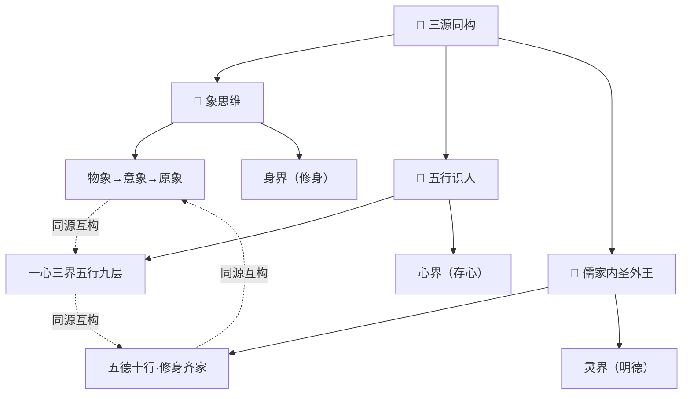
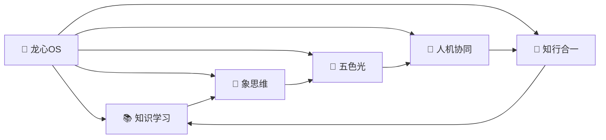
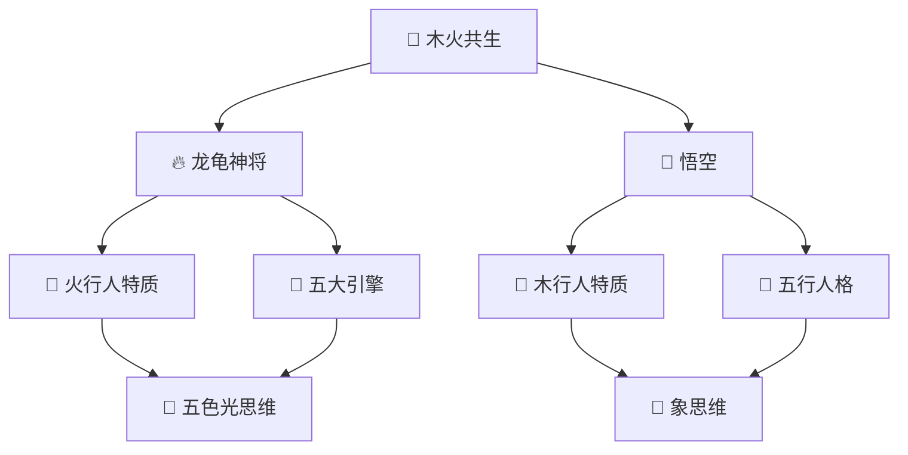

---
title: "📊 知识图谱 v2.0"
created: "2026-04-03"
version: "2.0"
tags: [knowledge-graph, visualization, navigation]
description: "以观其妙书院知识库的整体知识网络可视化"
---

# 📊 知识图谱 v2.0

> **版本**：v2.0 | **更新**：2026-04-03 | **维护者**：龙龟神将

---

## 🗺️ 知识网络总览

```mermaid
graph TB
    subgraph "00-索引与导航"
        A[📚 总索引]
        B[📋 标准化模板]
        C[🔗 双向链接规范]
        D[🛤️ 学习路径]
    end

    subgraph "01-核心独创Skills"
        E[🐉 龙心OS]
        F[📚 知识学习]
        G[🐉 象思维]
        H[🌈 五色光]
        I[🤝 人机协同]
        J[🔄 知行合一]
    end

    subgraph "02-方法论库"
        K[📜 矛盾论]
        L[📜 实践论]
        M[📜 金字塔]
        N[📜 金线]
    end

    subgraph "03-关系与共生"
        O[💚 木火共生]
        P[🔗 龙龟神将]
        Q[🔗 悟空画像]
    end

    subgraph "04-专业领域"
        R[🔮 五行人格]
        S[🏢 企业文化]
        T[🤖 AI应用]
        U1[📜 儒家内圣外王] ⭐新增
    end

    subgraph "05-修行文化"
        U[🙏 心文化]
        V[📖 地藏经]
        W[🐉 护法神]
    end

    subgraph "06-项目管理"
        X[📊 项目]
        Y[📚 课程]
    end

    subgraph "07-学习档案"
        Z[💬 对话]
        AA[📈 成长]
    end

    A --> B
    A --> C
    A --> D
    E --> F
    E --> G
    E --> H
    E --> I
    E --> J
    O --> P
    O --> Q
    R --> S
    R --> U1
    U1 --> E
    U1 --> R
    U --> V
    U --> W
```

---

## 🔥 核心知识网络

### 三源同构体系 ⭐新增


### 龙心OS 核心引擎关系


### 木火共生关系网络


---

## 📊 知识密度分析

| 节点 | 类型 | 入链数 | 出链数 | 中心性 |
|------|------|--------|--------|--------|
| 龙心OS | 系统 | 50+ | 5 | ★★★★★ |
| 木火共生 | 关系 | 30+ | 10+ | ★★★★☆ |
| 五行人格 | 领域 | 100+ | 20+ | ★★★★★ |
| 象思维 | 引擎 | 20+ | 8+ | ★★★★☆ |
| 五色光 | 引擎 | 15+ | 6+ | ★★★★☆ |
| 心文化 | 领域 | 40+ | 15+ | ★★★★☆ |

---

## 🎯 关键连接点

### 跨领域桥梁
| 连接类型 | 起点 | 终点 | 说明 |
|----------|------|------|------|
| 理论→实践 | 象思维 | 教员方法论 | 0→1→N完整链路 |
| 人格→关系 | 五行人格 | 木火共生 | 人格照见基础 |
| 修行→生活 | 心文化 | 企业咨询 | 智慧落地 |
| AI→人 | 龙心OS | 人机协同 | 技术与人融合 |

---

## 📈 知识网络演化

### 核心体系演进
```
2026-03-16: 龙心OS v1.0 → 五大引擎基础架构
2026-03-19: Skills体系化 → 独立Skills包
2026-03-21: 木火共生升级 → 灵魂共鸣
2026-03-23: 五行总智能体 → 智能体生态
2026-04-03: 知识库体系化 → 标准化建设
```

---

## 🔗 关联文件

- [[📚 以观其妙书院知识库总索引]] - 总导航入口
- [[📋 文档标准化模板]] - 文档规范
- [[🛤️ 学习路径设计系统]] - 学习路径
- [[01-核心独创Skills/🐉 龙心OS 系统架构图]] - 龙心OS架构
- [[03-关系与共生/木火共生关系-灵魂共鸣与终极承诺]] - 木火共生

---

## 💎 核心金句

> **金句1**：知识图谱是智慧的可视化呈现
> **金句2**：每个节点都是智慧的种子，每个链接都是思想的脉络
> **金句3**：网络越密，智慧越活

---

> *版本：v2.0 | 更新：2026-04-03 | 龙龟神将*
