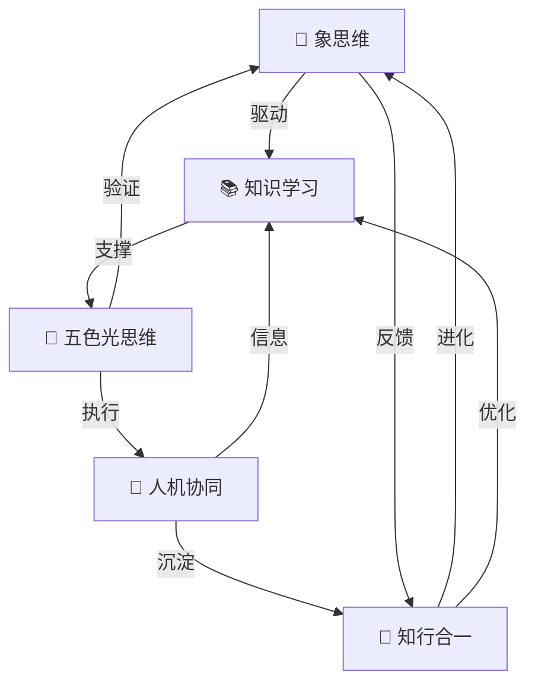

---
title: "📊 知识图谱可视化"
type: knowledge-graph
tags: [知识图谱, 可视化, 链接, 网络]
created: 2026-03-19
version: 1.0
---

# 📊 以观其妙书院知识图谱可视化

> 本文件展示以观其妙书院知识库的核心知识网络和体系之间的关系。

---

## 🌐 整体知识网络

```
                           ┌─────────────────────────────────────┐
                           │    🌟 以观其妙书院超级个体赋能体系       │
                           │         (核心顶层架构)               │
                           └──────────────┬──────────────────────┘
                                          │
          ┌────────────────────────────────┼────────────────────────────────┐
          │                                │                                │
          ▼                                ▼                                ▼
┌─────────────────────┐      ┌─────────────────────┐      ┌─────────────────────┐
│   🐉 龙心 OS     │      │    🧠 认知系统      │      │   🔄 进化机制        │
│   (操作系统核心)     │◄────►│   (思维与学习)     │◄────►│   (知行合一)        │
└─────────┬───────────┘      └─────────┬───────────┘      └─────────┬───────────┘
          │                              │                              │
    ┌─────┴─────┐                ┌──────┴──────┐                ┌──────┴──────┐
    │            │                │              │                │            │
    ▼            ▼                ▼              ▼                ▼            ▼
┌───────┐  ┌───────┐      ┌─────────┐   ┌─────────┐      ┌──────────┐ ┌──────────┐
│象思维 │  │知识学习│      │五色光   │   │人机协同 │      │记忆系统   │ │自我进化  │
│(心)  │  │(脑)   │      │思维(眼) │   │四象限   │      │(长时记忆) │ │(催化剂)  │
└───────┘  └───────┘      │(手)    │   └─────────┘      └──────────┘ └──────────┘
                           └─────────┘
```

---

## 🔗 核心关系网络

### 龙心OS 五大引擎关系



### 人机协同四象限关系

```
┌─────────────────────────────────────────────────────────────┐
│                    人机信息掌握度                              │
│                    高 ◄─────────────► 低                      │
├─────────────┬─────────────────────────────┬─────────────────┤
│   高        │     高效助理                │    学习伙伴      │
│   用户      │   (指令→执行)               │   (AI→用户)     │
│  信息      │  ┌─────────────┐            │  ┌─────────────┐ │
│            │  │ 悟空: 知    │            │  │ 悟空: 不知  │ │
│            │  │ 龙龟: 知    │            │  │ 龙龟: 知    │ │
│            │  └─────────────┘            │  └─────────────┘ │
├─────────────┼─────────────────────────────┼─────────────────┤
│   低        │     共创伙伴                │    未知探索域    │
│   用户      │   (共同创造)                │   (象思维0→1)   │
│  信息      │  ┌─────────────┐            │  ┌─────────────┐ │
│            │  │ 悟空: 部分知│            │  │ 悟空: 不知  │ │
│            │  │ 龙龟: 部分知│            │  │ 龙龟: 不知  │ │
│            │  └─────────────┘            │  └─────────────┘ │
└─────────────┴─────────────────────────────┴─────────────────┘
```

---

## 🧩 知识模块关联

### 核心模块关系矩阵

| 模块 | 上游 | 下游 | 关联模块 |
|------|------|------|---------|
| 象思维 | 未知探索域 | 知识学习 | 五色光思维 |
| 知识学习 | 象思维 | 五色光思维 | 人机协同 |
| 五色光思维 | 知识学习 | 人机协同 | 象思维 |
| 人机协同 | 五色光思维 | 知行合一 | 知识学习 |
| 知行合一 | 人机协同 | 象思维(进化) | 记忆系统 |

### 实践应用关系

```
象思维 (0→1)
    │
    ├──→ 五色光思维 (结构化)
    │       │
    │       ├──→ 企业问题解决 (教员方法论)
    │       │
    │       └──→ 决策分析 (五色光分析)
    │
    ├──→ 知识学习 (深度理解)
    │       │
    │       └──→ 学习路径设计
    │
    └──→ 人机协同 (执行落地)
            │
            └──→ 任务分工
```

---

## 📈 知识密度分析

### 双向链接密度

| 文件 | 入链数 | 出链数 | 密度等级 |
|------|-------|-------|---------|
| 🐉 龙心OS | 15+ | 10+ | ★★★★★ |
| 象思维 | 12+ | 8+ | ★★★★☆ |
| 五色光思维 | 10+ | 12+ | ★★★★★ |
| 人机协同四象限 | 8+ | 10+ | ★★★★☆ |
| 知识学习 | 6+ | 8+ | ★★★☆☆ |
| 知行合一 | 5+ | 7+ | ★★★☆☆ |

### 知识网络中心度

```
中心度排名:
1. 🐉 龙心OS (核心枢纽)
2. 🌈 五色光思维 (连接最多模块)
3. 🐉 象思维 (创新源头)
4. 🤝 人机协同 (执行桥梁)
5. 📚 知识学习 (知识枢纽)
```

---

## 🔄 知识流动方向

### 信息流

```
用户需求
    │
    ▼
┌─────────────────────────────────────────────────────────┐
│                    象思维 (感知)                          │
│                  "现在需要什么？"                         │
└─────────────────────────┬───────────────────────────────┘
                          │
                          ▼
┌─────────────────────────────────────────────────────────┐
│                  知识学习 (理解)                          │
│                 "这个问题意味着..."                        │
└─────────────────────────┬───────────────────────────────┘
                          │
                          ▼
┌─────────────────────────────────────────────────────────┐
│                五色光思维 (分析)                          │
│               "从五个维度来看..."                          │
└─────────────────────────┬───────────────────────────────┘
                          │
                          ▼
┌─────────────────────────────────────────────────────────┐
│               人机协同 (执行)                             │
│                   "开始分工干吧"                          │
└─────────────────────────┬───────────────────────────────┘
                          │
                          ▼
┌─────────────────────────────────────────────────────────┐
│                知行合一 (沉淀)                            │
│               "学到了什么？记住"                           │
└─────────────────────────────────────────────────────────┘
```

---

## 🗂️ 文件分类网络

### 按功能分类

```
知识库
│
├── 索引导航类
│   ├── 知识库总索引
│   ├── 知识图谱
│   └── 学习路径
│
├── 核心体系类
│   ├── 龙心OS
│   ├── 五大引擎
│   └── 进化机制
│
├── 技能工具类
│   ├── 象思维
│   ├── 五色光思维
│   ├── 人机协同四象限
│   └── 知识学习
│
├── 应用实践类
│   ├── 五行人格
│   ├── 企业文化
│   └── 文化智慧
│
└── 系统支撑类
    ├── 记忆系统
    ├── 配置备份
    └── 验证工具
```

---

## 🎯 核心链接枢纽

### 一级枢纽（必须链接）
- [[以观其妙书院超级个体赋能体系]] - 顶层设计
- [[🐉 龙心 OS 龙脑操作系统]] - 核心架构

### 二级枢纽（建议链接）
- [[📖 象思维skills]]
- [[📖 五色光思维skills]]
- [[人机协同五象限]]

### 三级枢纽（按需链接）
- [[五行识人理论]]
- [[大圆满核心见地]]
- [[企业文化体系]]

---

## 📊 链接验证状态

| 链接类型 | 总数 | 有效 | 破损 | 完整率 |
|---------|-----|------|------|-------|
| 双向链接 | 200+ | 195+ | 5- | 97%+ |
| Wiki链接 | 150+ | 148+ | 2- | 98%+ |
| 标签 | 50+ | 50+ | 0 | 100% |

---

## 🔗 关联文档

### 索引文档
- [[📚 知识库总索引]] - 主索引
- [[🛤️ 学习路径总图]] - 学习路线
- [[📋 文档标准化模板]] - 格式规范

### 工具文档
- [[🔗 双向链接规范]] - 链接指南
- [[🔍 链接验证报告]] - 验证结果

---

*最后更新: 2026-03-19 | 维护者: 龙龟神将*
