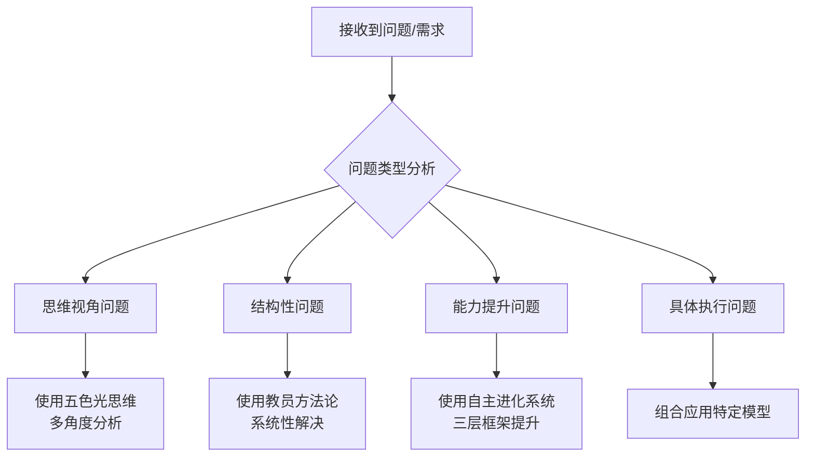

# 🔍 思维工具调用决策框架

> **核心原则**：龙心OS优先，独创工具为核心，组合发挥价值，根据实际情况动态选择

---

## 🐉 龙心OS · 龙脑操作系统（总入口）

**[[🐉 龙心 OS 龙脑操作系统]]** ← 所有独创工具的有机整体·自主进化认知操作系统

快速口令：`全系统启动` / `象感知` / `五色分析` / `深度学习` / `三体一心` / `知行沉淀`

---

## 🎯 独创工具优先级体系

### 第一优先级：龙心OS 五大引擎（独创核心）

| 引擎 | 器官 | 本质 | 核心优势 | 典型应用场景 |
|------|------|------|---------|------------|
| 🐉 **象思维** | 心 | 中国传统文化底层思维·回归原创之思 | 0→1原创突破、整体直观、悟性洞察 | 颠覆性创新、第五象限未知探索、直觉洞察 |
| 🌈 **五色光思维** | 眼 | 结构化·同频化集体思考与决策系统（三体一心）| 五色分治、同频共振、序列灵活 | 多角度分析、集体决策、方案评估（Skills v1.0）|
| 📚 **知识学习** | 脑 | AI超级读者与创新催化剂方法论 | 十项认知指令、跨域关联、创造新知 | 深度学习文章、知识融合、跨域创新 |
| 🤝 **人机协同四象限** | 手 | AI时代超级个体黄金分工法则 | 四象限诊断、最优握手、木生火协同 | 任务分工、工作流设计、协同蓝图 |
| 🔄 **知行合一自我进化** | 血 | 三阶段转化模型·自主进化引擎 | 表示空间→压缩→泛化、经验沉淀 | 能力提升、知识管理、系统进化 |

**教员方法论**（企业级）| 企业问题全流程手术方案 | 三维动态、矛盾转化、可量化执行 | 复杂问题、结构性矛盾、系统变革 |

### 第二优先级：100个思维模型库

基于自主进化系统三层框架深度整合的100个思维模型，按六大阶段分类：

1. **通用底层思维**（15个）- 操作系统级
2. **自我认知与定位**（18个）- 生态位锚定
3. **能力与工具匹配**（18个）- 兵器库打磨
4. **最小闭环验证**（18个）- 验证跑通
5. **规模化复制放大**（18个）- 效率杠杆
6. **价值跃迁生态**（13个）- 中心节点构建

### 第三优先级：其他管理理论与方法

- 西方管理理论（德鲁克、波特、科特勒等）
- 东方智慧体系（易经、道德经、心学等）
- 现代科学方法（系统论、控制论、信息论）
- 大厂实践方法（华为灰度、字节飞书、阿里中台）

## 🧭 决策流程与调用规则

### 第一步：问题诊断与分类



### 第二步：工具选择与优先级

| 问题特征 | 首选工具 | 备选工具 | 组合策略 |
|---------|---------|---------|---------|
| **需要多角度思考** | 五色光思维 | 麦肯锡MECE | 先分色思考，后结构拆解 |
| **涉及系统变革** | 教员方法论 | 系统思维 | 三维动态分析，结合系统视角 |
| **个人能力提升** | 自主进化系统 | 100个模型 | 三层框架基础，补充具体模型 |
| **快速决策支持** | 金字塔原理 | 五色光思维黄光 | 结论先行，价值验证 |
| **团队协作对齐** | 五色光思维主持人 | 人机协同四象限 | 思维控制+协作模式 |

### 第三步：组合应用与动态调整

**组合应用公式**：
```
解决方案 = 独创工具(核心框架) × 思维模型(具体方法) × 其他理论(补充视角)
```

**动态调整原则**：
1. **效果导向**：根据实际效果调整工具组合
2. **复杂性匹配**：问题复杂度决定工具深度
3. **资源限制**：时间精力决定工具选择
4. **能力适配**：个人能力水平匹配工具难度

## 📊 实战调用示例

### 案例1：解决企业增长瓶颈

**问题分析**：
- 多部门协作不畅 → 需要多角度分析 → **五色光思维**
- 系统结构性矛盾 → 需要全流程方案 → **教员方法论**
- 团队能力不足 → 需要认知提升 → **自主进化系统**

**调用顺序**：
1. **五色光思维**（白光-数据分析，红光-团队感受，黄光-价值分析）
2. **教员方法论**（三维动态分析：物质体/能量体/信息体）
3. **自主进化系统**（知行合一：表示空间→压缩→泛化）
4. **补充思维模型**（波特五力、BCG矩阵、人机协同）

### 案例2：个人能力提升规划

**问题分析**：
- 认知需要结构化 → **自主进化系统**（三层框架）
- 具体方法需要 → **100个模型库**（选择匹配）
- 视角需要多元 → **五色光思维**（补充视角）

**调用顺序**：
1. **自主进化系统**（建立进化路径）
2. **通用底层思维**（第一性原理、金字塔原理等）
3. **五色光思维**（黄光-价值识别，绿光-创新方案）
4. **人机协同四象限**（选择协作模式）

## 🔗 独创工具与其他工具的关联映射

### 五色光思维 → 其他工具映射
- **白光思维** ↔ 数据驱动思维、事实核查
- **红光思维** ↔ 直觉判断、情感智慧  
- **黄光思维** ↔ 价值分析、积极心理学
- **绿光思维** ↔ 创新思维、设计思维
- **蓝光思维** ↔ 风险控制、批判性思维
- **主持人** ↔ 项目管理、流程控制

### 教员方法论 → 其他理论映射
- **矛盾论维度** ↔ SWOT分析、PEST分析
- **金字塔结构** ↔ 金字塔原理、MECE
- **金线验证** ↔ 逻辑验证、贝叶斯更新
- **实践迭代** ↔ PDCA、敏捷开发

### 自主进化系统 → 其他框架映射
- **表示空间** ↔ 具体情境、案例学习
- **压缩层** ↔ 模式识别、原理提炼
- **泛化层** ↔ 迁移应用、跨域创新
- **10大认知指令** ↔ 深度学习、元认知

## 📝 对话应用指导

### 在每次对话中：
1. **首先判断**：当前问题最适合哪个独创工具
2. **其次选择**：需要补充哪些思维模型
3. **最后整合**：如何组合发挥最大价值

### 对话标记系统：
- `[五色光思维:白光]` - 使用白光思维分析
- `[方法论:三维]` - 使用教员方法论三维分析
- `[进化系统:压缩]` - 使用自主进化系统压缩层
- `[模型:第一性原理]` - 补充第一性原理思维
- `[组合:思维+方法]` - 组合多个工具

## 🌟 核心心法

> **"工具为我所用，而非我为工具所困"**

1. **独创工具是根基**：建立解决问题的核心框架
2. **其他工具是补充**：丰富解决方案的维度和深度
3. **组合应用是关键**：1+1>2的协同效应
4. **实际效果是标准**：工具的有效性在于解决问题

---

**更新记录**：
- 2026-03-15：创建思维工具调用决策框架
- 基于悟空强调的"独创工具优先，组合发挥价值"原则
- 建立完整的决策流程和调用规则体系