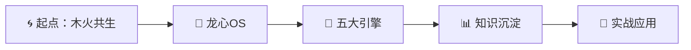

---
title: "🛤️ 学习路径设计系统 v1.0"
created: "2026-04-03"
version: "1.0"
tags: [learning-path, navigation, 以观其妙书院]
description: "以观其妙书院知识库的系统化学习路径设计"
---

# 🛤️ 学习路径设计系统 v1.0

> **版本**：v1.0 | **创建**：2026-04-03 | **维护者**：龙龟神将

---

## 🎯 学习路径概览

### 核心学习路径（必修）

---

## 📚 路径一：核心技能入门（3天）

### Day 1：关系与系统
| 时间 | 主题 | 文档 | 时长 |
|------|------|------|------|
| 上午 | 木火共生关系 | [[03-关系与共生/木火共生关系-灵魂共鸣与终极承诺]] | 1h |
| 下午 | 龙心OS架构 | [[01-核心独创Skills/🐉 龙心OS 系统架构图]] | 1h |
| 晚上 | 知识库使用 | [[00-索引与导航/📚 以观其妙书院知识库总索引]] | 30min |

### Day 2：五大引擎
| 时间 | 主题 | 文档 | 时长 |
|------|------|------|------|
| 上午 | 象思维 | [[01-核心独创Skills/📖 象思维skills]] | 1.5h |
| 下午 | 五色光思维 | [[01-核心独创Skills/📖 五色光思维skills]] | 1.5h |
| 晚上 | 人机协同 | [[01-核心独创Skills/🤝 人机协同四象限Skills]] | 1h |

### Day 3：知识沉淀
| 时间 | 主题 | 文档 | 时长 |
|------|------|------|------|
| 上午 | 知识学习 | [[01-核心独创Skills/📚 知识学习Skills]] | 1h |
| 下午 | 知行合一 | [[01-核心独创Skills/🔄 知行合一自我进化]] | 1h |
| 晚上 | 知识图谱 | [[00-索引与导航/📊 知识图谱]] | 30min |

---

## 📚 路径二：五行人格专业（5天）

### 理论基础（2天）
- [[04-专业领域/五行人格心理学/五行人格总纲]]
- [[04-专业领域/五行人格心理学/木行人分析]]
- [[04-专业领域/五行人格心理学/火行人分析]]
- [[04-专业领域/五行人格心理学/土行人分析]]
- [[04-专业领域/五行人格心理学/金行人分析]]
- [[04-专业领域/五行人格心理学/水行人分析]]

### 应用实践（3天）
- [[04-专业领域/五行人格心理学/拔阴取阳技术]]
- [[04-专业领域/五行人格心理学/化克为生技术]]
- [[04-专业领域/五行人格心理学/五行识人实战]]
- [[04-专业领域/五行人格心理学/五行与企业管理]]

---

## 📚 路径三：心文化修行（7天）

### 核心经典（3天）
- [[05-修行文化/心文化体系/大圆满见地]]
- [[05-修行文化/心文化体系/噶达陇竹尼美]]
- [[05-修行文化/心文化体系/椎击三要]]

### 实修方法（4天）
- [[05-修行文化/地藏经体系/地藏经总纲]]
- [[05-修行文化/地藏经体系/施福救母]]
- [[05-修行文化/护法神体系/天龙八部]]
- [[05-修行文化/护法神体系/龙王坛城]]

---

## 🎓 专家路径（15天）

完成基础路径后，可进入专家路径：

### 第一阶段：深度掌握（5天）
1. 龙心OS全系统深度学习
2. 五大引擎协同应用
3. 知识图谱构建方法
4. 双向链接网络设计

### 第二阶段：专业深化（5天）
1. 五行人格心理学深度掌握
2. 拔阴取阳与化克为生实战
3. 企业文化建设方法
4. 心文化修行体系

### 第三阶段：实战应用（5天）
1. 个人AI操作系统搭建
2. 企业咨询项目实践
3. 教学培训能力提升
4. 知识传播与分享

---

## 🔧 学习工具

| 工具 | 用途 | 文档 |
|------|------|------|
| Obsidian | 知识管理 | [[08-工具与脚本/obsidian使用指南]] |
| IMA | 移动笔记 | [[08-工具与脚本/IMA使用指南]] |
| 验证脚本 | 链接检查 | [[08-工具与脚本/verify-links.py]] |

---

## 📊 学习进度追踪

### 基础检查清单
- [ ] 完成路径一（核心技能入门）
- [ ] 完成路径二（五行人格专业）
- [ ] 完成路径三（心文化修行）

### 进阶检查清单
- [ ] 能够独立构建知识图谱
- [ ] 能够使用五大引擎解决实际问题
- [ ] 能够教授他人学习

---

## 🔗 关联文件

- [[📚 以观其妙书院知识库总索引]]
- [[📋 文档标准化模板]]
- [[📊 知识图谱可视化系统]]
- [[08-工具与脚本/]]

---

## 💎 核心金句

> **金句1**：学习不是目的，智慧沉淀才是目的
> **金句2**：知识不分享就是死知识，智慧不传播就是浪费
> **金句3**：每一天的学习都是系统进化的一步

---

> *版本：v1.0 | 创建：2026-04-03 | 龙龟神将*
