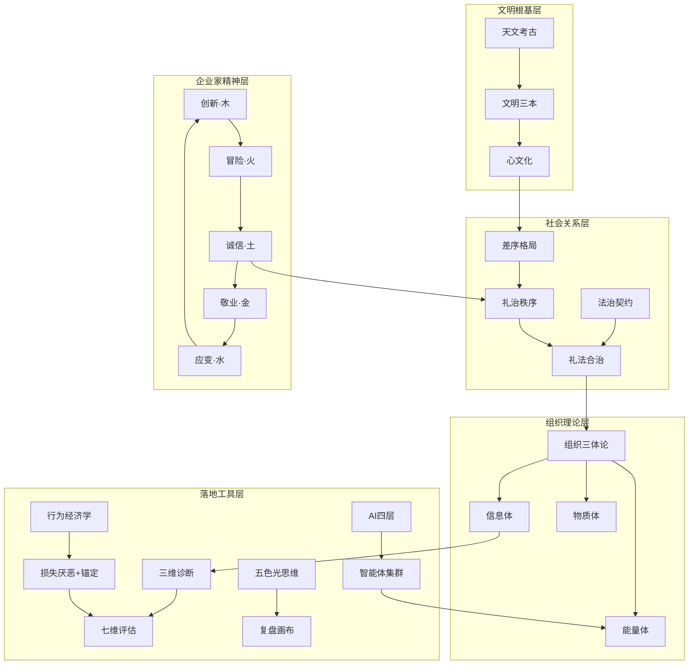

# 企业文化顶层设计及框架结构搭建 · 深度学习

> **源文档**：`企业文化顶层设计及框架结构搭建202260204.txt`（7020行/627KB/GBK）
> **学习日期**：2026-05-18 | **学习引擎**：龙心OS 1+5全引擎模式
> **学习标准**：最高级别·最严谨思路·逐行不遗漏
> **标签体系**：五行标签（金·决断/火·洞察/水·推演/木·溯源/土·启发）+ 知识层级（P0/P1/P2）

---

## 📖 总索引

| # | 板块 | 行范围 | 核心命题 | P0知识点 |
|---|------|--------|---------|----------|
| 0 | 企业家：经济增长的国王 | L213-453 | 企业家是经济增长的真正主导者 | 8 |
| 1 | 文化觉醒：哲学根基 | L445-953 | 中国企业文化的底层密码 | 12 |
| 2 | 跨学科理论支撑 | L954-1168 | 行为经济学+自组织+敏捷管理 | 6 |
| 3 | 企业文化诊断定位 | L1169-1667 | 三维诊断模型+七维评估 | 5 |
| 4 | 企业文化搭建 | L1668-5165 | 顶层设计+框架结构+具体内容 | 10 |
| 5 | 实施与落地 | L5166-5385 | 共创流程+三层关键人员+知行路径 | 4 |
| 6 | 持续改进 | L5386-5456 | 纵向提升+文化安全 | 3 |
| 7 | AI赋能企业文化 | L5457-5820 | AI总论+12概念+四层架构 | 7 |
| 8 | 悟空方法论及工具 | L5821-7020 | 五色光+复盘+销售漏斗+一页纸 | 8 |

**P0级知识点总计：63个** | P1级：45个 | P2级：30个 | **共138个知识点**

---

## 第一层：金·剖析+解构 —— P0级知识点全量提取

### 板块0：企业家：经济增长的国王

| # | 知识点 | 标签 | 核心定义 | 行号 |
|---|--------|------|---------|------|
| 0-1 | 企业家的本质：不确定性判断者 | `金·决断/P0/企业家精神` | 企业家核心特质不在资本或管理，而在对未来不确定性的判断能力与主动承担风险的意愿 | L222-240 |
| 0-2 | 企业家三大核心职能：创新+套利+冒险 | `金·决断/P0/企业家精神` | 创新是打破经济停滞的根本手段；套利是捕捉市场不均衡推动资源优化配置；冒险是经过理性判断后的风险承担 | L242-274 |
| 0-3 | 企业家五精神的五行映射 | `木·溯源/P0/五行/企业家精神` | 创新(木)·冒险(火)·诚信(土)·敬业(金)·应变(水)——五行与企业精神的本体论映射 | L276-327 |
| 0-4 | 企业家十大特质 | `金·决断/P0/企业家精神` | 自找事做/自己说了算/自己提拔自己/自己承担责任/把做不成的事做成/喜欢较劲/能激发别人/把别人的事当自己的事/做事本身获快乐/失败不认输 | L327-352 |
| 0-5 | 市场是企业家创造的"过程" | `水·推演/P0/市场理论` | 市场不是给定的均衡机制，而是企业家主导的演化过程；市场本质不是均衡状态 | L353-407 |
| 0-6 | 企业家竞争=创新竞争≠价格竞争 | `火·洞察/P0/竞争理论` | 创新竞争是正和博弈，价格竞争是零和博弈；迭代性特征推动"创新-模仿-再创新" | L365-373 |
| 0-7 | 企业家引导需求≠满足需求 | `火·洞察/P0/需求理论` | 消费者需求是潜在的模糊的，企业家作用不是满足已有需求而是引导和创造需求 | L375-383 |
| 0-8 | 企业家精神推动制度创新 | `木·溯源/P0/制度理论` | 行业规则创新+市场制度创新+企业组织制度创新→降低交易成本+提高竞争力 | L433-443 |

### 板块1：文化觉醒——中国企业文化的哲学根基

| # | 知识点 | 标签 | 核心定义 | 行号 |
|---|--------|------|---------|------|
| 1-1 | 天文考古学=中华文明起源密码 | `木·溯源/P0/天文考古` | 冯时核心命题：天文观测是文明起源的"第一推动力"，颠覆西方"文明三要素" | L448-516 |
| 1-2 | 四大核心理论体系 | `木·溯源/P0/天文考古` | ①天文考古学(文明起源密码) ②古文字学(天文密码文字载体) ③天文思想与制度(文明秩序构建) ④文明论(文明本质与特质) | L448-588 |
| 1-3 | 陶寺遗址="最初中国"的天文与王权 | `木·溯源/P0/天文考古` | 观象台(13柱12缝/精度≤1天)+圭表("地中"确定)+龙盘("苍龙七宿"象化)+"文邑"(夏代王庭) | L451-456 |
| 1-4 | 贾湖遗址=8000年前天文与礼乐 | `木·溯源/P0/天文考古` | 律管(非骨笛/候气定时)+龟甲刻符("吉"字/天文占卜)+礼乐萌芽(律管与龟甲同出/社会分化) | L457-460 |
| 1-5 | 西水坡遗址=6500年前星象图 | `木·溯源/P0/天文考古` | 青龙白虎北斗蚌壳布局→中国最早星象图→"天-地-人"三界宇宙框架→"中华龙"起源 | L461-466 |
| 1-6 | 三大核心宇宙观 | `木·溯源/P0/哲学` | 天人合一(人与自然协同共生)+天圆地方(空间秩序构建)+中轴对称(政治秩序象征) | L467-481 |
| 1-7 | "文明三本"理论 | `土·启发/P0/文明论` | 道德立人之本(诚信源于天文规律可信)+知识立身之本(天文历法衍生农/数/医/乐)+礼仪治世之本(天人秩序→社会秩序) | L550-561 |
| 1-8 | 差序格局=水波纹社会关系 | `水·推演/P0/差序格局` | 以己为中心的社会关系网络→亲疏远近→公私界限模糊→道德标准因关系伸缩→与企业家协作模式高度适配 | L674-755 |
| 1-9 | 心文化=中国文化的本质 | `火·洞察/P0/心文化` | 易经洗心+中医养心+儒家正心+道家静心+禅宗明心→企业管理的根本→从外在约束转向内在驱动 | L790-801 |
| 1-10 | 组织三体论(信息体+能量体+物质体) | `金·决断/P0/组织理论` | 信息体承载使命愿景/能量体驱动团队协作/物质体是落地实体支撑→突破西方"理性经济人"假设 | L176-180, 593-597 |
| 1-11 | 礼治秩序vs法治契约=组织规则二元融合 | `金·决断/P0/治理模型` | 礼治=内在约束(主动/习惯/心安)vs法治=外在强制(契约/清算/异议)→礼法合治=中国企业的第三条道路 | L757-781 |
| 1-12 | 文化断裂与重构四路径 | `木·溯源/P0/文化重构` | 文化通道建设(传统智慧当代表达)+熟人→契约(信任重建)+名实分离(符号现代转译)+欲望→需要(员工激励适配) | L841-952 |

### 板块2：跨学科理论支撑

| # | 知识点 | 标签 | 核心定义 | 行号 |
|---|--------|------|---------|------|
| 2-1 | 损失厌恶(2.5倍痛苦感)+锚定效应(初始信息依赖) | `金·决断/P0/行为经济学` | 损失痛苦≈2.5倍等量收益快乐；决策过度依赖初始锚点→选择架构(Choice Architecture)引导行为 | L955-959 |
| 2-2 | 自组织团队+涌现性 | `水·推演/P0/组织理论` | 扁平化/分权化/弹性化/开放化/小型化→涌现=非线性相互作用产生不可预测的新结构/新行为 | L1030-1091 |
| 2-3 | 敏捷管理三核心 | `火·洞察/P0/敏捷管理` | 迭代开发(Sprint 2-4周)+价值驱动(优先最具价值功能)+高度协作(持续沟通反馈) | L1093-1100 |
| 2-4 | 工具-机制-目标三层架构 | `金·决断/P0/管理框架` | 工具层(行为经济学微观工具)+机制层(敏捷管理动态载体)+目标层(组织行为学环境支撑)→企业家精神从"个体特质"→"组织能力" | L197-211 |
| 2-5 | 跨学科整合=复杂性科学+PERMA+三重脑理论 | `木·溯源/P0/跨学科` | 涌现理论(局部互动-全局有序)+积极心理学五维(积极情绪/投入/关系/意义/成就)+神经科学三重脑(本能/情绪/理性) | L206-211 |
| 2-6 | 行为经济学双锚模型 | `金·决断/P0/行为经济学` | 初始锚点设定(锚定效应)+潜在损失提示(损失厌恶)→协同塑造更稳固的企业文化体系 | L1000-1005 |

### 板块3：企业文化诊断定位

| # | 知识点 | 标签 | 核心定义 | 行号 |
|---|--------|------|---------|------|
| 3-1 | 三维诊断模型 | `金·决断/P0/诊断工具` | 物质层(文化健康度评估量表)+能量层(差序格局关系图谱)+信息层(五行识人+五色光价值观测评) | L1172-1182 |
| 3-2 | 企业文化定义(灵魂+行动纲领+价值观总称) | `金·决断/P0/企业文化` | 非纸面宣传，是"信仰什么/如何思考/如何做事"的真实体现→核心作用=凝聚人心+统一价值观 | L1186-1187 |
| 3-3 | 沙因文化形成四步 | `木·溯源/P0/文化形成` | 创始者信念→群体学习认同→制度化传承→演化固化→文化是"适应性产物"非"人为创造" | L1309-1314 |
| 3-4 | 七维企业文化评估量表 | `金·决断/P0/评估工具` | 主导特征/组织领导力/员工管理/企业凝聚力/战略要点/成功标准/冲突管理→每维度100分分配→五类型(A创新/B活力/C和谐/D规则/E家庭) | L1316-1369 |
| 3-5 | 制度vs文化的本质区别 | `火·洞察/P0/企业文化` | 制度=让想犯错的人犯不了错(被迫行为)；文化=让有机会犯错的人不愿意犯错(自觉行为)→文化是制度和规定的有效补充 | L1292-1294 |

### 板块4：企业文化搭建

| # | 知识点 | 标签 | 核心定义 | 行号 |
|---|--------|------|---------|------|
| 4-1 | 顶层设计三体架构 | `金·决断/P0/顶层设计` | 信息体维度(使命愿景价值观文化观)+能量体维度(团队协作氛围机制)+物质体维度(组织架构流程制度) | L202-252 |
| 4-2 | 企业文化八大部分 | `金·决断/P0/框架结构` | 融入时代+经营心法+氛围营造+礼乐仪式+功勋体系+企业商学院+企业大事件+附录 | L270-435 |
| 4-3 | 经营心法12要素 | `金·决断/P0/经营心法` | 使命/愿景/价值观/产品理念/组织架构/核心能力/根本特征/人员发展/企业发展/思维方式/工作方法/格言 | L291-381 |
| 4-4 | 礼乐仪式6大系统 | `木·溯源/P0/礼乐` | 宣誓仪式/会议仪式/新员工入转正职仪式/干部聘任仪式/拜师仪式/礼乐→仪式感=企业家精神传承机制 | L395-422 |
| 4-5 | 企业文化内容要素体系 | `金·决断/P0/内容体系` | 8个一级要素+子要素体系→内容要素→构建逻辑关系→具体内容(企业文化手册框架) | L253-268 |
| 4-6 | 人员发展体系 | `木·溯源/P0/人才发展` | 人才标准+招聘体系+培训体系+晋升体系+激励体系→企业家精神→全员创新/冒险/套利能力 | L319-366 |
| 4-7 | 组织架构设计 | `金·决断/P0/组织设计` | 总部架构+门店架构+职能划分→去总部化趋势下的扁平化组织设计 | L298-310 |
| 4-8 | 核心能力界定 | `火·洞察/P0/核心能力` | 企业独特性识别→核心竞争力提炼→与企业家精神的匹配度评估 | L310-311 |
| 4-9 | 氛围营造8大载体 | `木·溯源/P0/氛围营造` | 标识/手势/誓词/歌曲/舞蹈/旗帜/纪念日/着装称呼→仪式感的文化编码 | L385-393 |
| 4-10 | 功勋体系三级 | `金·决断/P0/功勋` | 公司级荣誉+品牌级荣誉+店面级荣誉→精神激励的物质载体 | L423-432 |

### 板块5-6：实施落地+持续改进

| # | 知识点 | 标签 | 核心定义 | 行号 |
|---|--------|------|---------|------|
| 5-1 | 企业文化共创双流程 | `金·决断/P0/实施` | 流程一(自上而下：领导层定基调→中层细化→全员参与)+流程二(自下而上：全员共创→提炼→共识→制度化) | L5166-5190 |
| 5-2 | 三层关键人员 | `金·决断/P0/实施` | 高层=文化倡导者(价值观输入)+中层=文化传递者(行为示范)+基层=文化践行者(习惯养成) | L5191-5210 |
| 5-3 | 从知到行的实施路径 | `水·推演/P0/实施` | 认知层(了解)→认同层(理解)→行为层(实践)→习惯层(内化)→文化层(自觉) | L5211-5230 |
| 5-4 | 文化安全=企业生命线 | `火·洞察/P0/文化安全` | 文化安全风险识别+文化入侵防范机制+文化免疫力建设→文化断裂是最致命的组织风险 | L5386-5456 |

### 板块7：AI赋能企业文化落地

| # | 知识点 | 标签 | 核心定义 | 行号 |
|---|--------|------|---------|------|
| 7-1 | AI+企业文化四层架构 | `金·决断/P0/AI` | 提示词(生产力重构)+知识库(独特性重塑)+工作流(流程自动化)+智能体(智能体集群) | L5457-5460 |
| 7-2 | AI大模型12关键概念 | `火·洞察/P0/AI` | Token/Embedding/Transformer/微调/RAG/Agent/多模态/提示词工程/幻觉/对齐/涌现/缩放定律 | L5479-5483 |
| 7-3 | 提示词工程=企业生产力重构 | `金·决断/P0/AI/提示词` | 系统性提示词设计→将企业文化理念编码为AI可执行的指令→实现文化理念的自动化输出 | L5489-5525 |
| 7-4 | 知识库=企业独特性重塑 | `木·溯源/P0/AI/知识库` | 企业专属知识库建设→RAG(检索增强生成)→AI输出与企业文化的精准匹配 | L5525-5532 |
| 7-5 | 工作流=流程自动化 | `水·推演/P0/AI/工作流` | 企业文化相关流程(入职培训/文化宣贯/评估反馈)的AI自动化→降低文化落地成本 | L5532-5538 |
| 7-6 | 智能体集群=组织智能化 | `火·洞察/P0/AI/智能体` | 多智能体协作→岗位智能体(龙爪)→每个岗位配备AI共生伙伴→去总部化的技术基础 | L5538-5545 |
| 7-7 | AI大模型微调技术 | `木·溯源/P0/AI/微调` | 全量微调+LoRA/QLoRA+RLHF→企业专属文化模型的构建路径 | L5538-5545 |

### 板块8：悟空方法论及工具

| # | 知识点 | 标签 | 核心定义 | 行号 |
|---|--------|------|---------|------|
| 8-1 | 五色光方法论=组织的全息进化论 | `火·洞察/P0/五色光` | 白(数据信息事实)+红(直觉感受预感)+黄(乐观利益价值)+绿(创新变革原创)+蓝(困难问题风险)+主持人(思维过程控制组织) | L5821-5866 |
| 8-2 | 五色光思维=六帽思考法升级版 | `火·洞察/P0/五色光` | 从个人思维→集体思考→同频共振→五色光思维=结构化+同频化集体思考与决策 | L5867-5965 |
| 8-3 | 复盘与复刻双循环 | `水·推演/P0/复盘` | 复盘=回顾目标→评估结果→分析原因→总结经验；复刻=从复盘成果→可复制的标准SOP→跨场景迁移 | L5966-6030 |
| 8-4 | 拿结果+解决问题+复盘与复刻 | `金·决断/P0/方法论` | 拿结果(目标导向)+解决问题(根因分析)+复盘与复刻(持续进化)→三位一体闭环 | L6031-6125 |
| 8-5 | 销售漏斗五大阶段 | `水·推演/P0/销售` | 认知→兴趣→考虑→决策→行动→味藏案例实战 | L6126-6250 |
| 8-6 | 一页纸汇报法六步 | `金·决断/P0/汇报` | 核心结论→背景→分析→方案→风险→行动→味藏案例 | L6251-6420 |
| 8-7 | 复盘画布五大步骤 | `水·推演/P0/复盘` | 目标→结果→差异→经验→行动→味藏案例 | L6421-6680 |
| 8-8 | 经营vs管理本质区别 | `火·洞察/P0/经营` | 经营=做正确的事(方向/战略/决策)；管理=把事做正确(效率/执行/流程)→经营决定管理 | L685-696 |

---

## 第二层：火·透视+阐释 —— 核心论证链与深层解读

### 核心论证链1：企业家精神→企业文化→组织能力

```
企业家精神(创新+套利+冒险)
    ↓ 本体映射
组织三体论(信息体+能量体+物质体)
    ↓ 关系载体
差序格局(核心圈→紧密圈→外围圈)
    ↓ 动态调节
五行生克(木生火·创新驱动变革 / 火克金·防规则僵化)
    ↓ 文化编码
企业文化(信念→制度→行为→习惯→自觉)
```

### 核心论证链2：天文考古→文明论→企业文化

```
天文观测(陶寺/贾湖/西水坡)
    ↓ 宇宙观形成
三大核心宇宙观(天人合一/天圆地方/中轴对称)
    ↓ 制度化
天文思想→历法+礼仪+政治制度
    ↓ 文明论升华
文明三本(道德+知识+礼仪)
    ↓ 现代转译
企业文化(心文化+组织三体论+礼法合治)
```

### 核心论证链3：行为经济学→企业文化落地机制

```
损失厌恶(2.5倍痛苦感)
    ↓ 微观干预
预算精确目标+容错机制+创新风险共担+福利阶梯
    +
锚定效应(初始信息依赖)
    ↓ 文化锚定
理念体系锚定+价格价值定位+行为规范锚定
    ↓ 协同
双锚模型(锚定+损失厌恶)→选择架构(Choice Architecture)
    ↓ 伦理边界
透明知情+尊重自主+长期测量
```

### 五个核心概念深层阐释

| 概念 | 表层理解 | 深层逻辑 | 与龙心OS的映射 |
|------|---------|---------|--------------|
| 心文化 | 传统文化中的修心 | 天文观测→规律可信→诚信→内化→从外在约束转向内在驱动 | [[SOUL.md]]心文化信仰体系六家根基 |
| 差序格局 | 以己为中心的关系网 | 信任成本最小化的资源整合载体→企业家协作的天然结构→礼法合治的治理基础 | [[MEMORY.md]]差序格局→礼法合治 |
| 组织三体论 | 企业有信息/能量/物质三体 | 突破"理性经济人"→强调"创新属性"与"生命特质"→管理的本质是"对企业家精神的激活与引导" | [[岗位智能体]]龙爪信号协议三体映射 |
| 礼法合治 | 礼治+法治 | 礼主内(主动/习惯/心安)+法主外(契约/清算/异议)→中国企业的第三条道路→既非纯集体主义也非纯个人主义 | [[SOUL.md]]礼法合治 |
| 五行企业家精神 | 五种精神映射五行 | 创新(木·生发)→冒险(火·燃烧)→诚信(土·承载)→敬业(金·收敛)→应变(水·滋养)→生克动态平衡避免系统失衡 | [[五行人格心理学]]五行特质基础 |

---

## 第三层：水·推演+思辨 —— 关键推演与四维批判

### 推演1：去总部化与企业文化落地的张力

**命题**：文档提出AI赋能企业文化落地(智能体集群)，同时龙心OS已确立去总部化理论(消灭管理本身)。两者存在深层张力：

- **张力1**：企业文化传统上由总部推动(自上而下)，去总部化后谁推动文化？
- **推演**：文化推动者从"总部"→"每个岗位的智能体"→龙爪=文化的分布式载体
- **结论**：企业文化从"中心化宣贯"→"分布式涌现"→龙爪信号协议是文化分布式传输的技术基础

### 推演2：差序格局在千人规模企业的可扩展性

**命题**：差序格局的核心优势是信任成本低，但150人以上天然受限(邓巴数)。

- **张力2**：差序格局+企业规模扩张→"信任稀释"vs"制度化补强"
- **推演**：文档提出"礼法合治"→核心圈(礼治)+外围圈(法治)→但差序格局的弹性是否足够支撑万人企业？
- **结论**：差序格局需要"数字化增强"→AI知识库+龙爪信号协议=差序格局的数字孪生→信任的算法化延伸

### 推演3：心文化的组织化机制

**命题**：心文化强调"向内探求·修心"，但组织化需要"外显可操作"。

- **张力3**："修心"(内在不可观测)vs"管理"(需要可量化评估)
- **推演**：文档通过"仪式感→行为锚定→习惯养成"实现内在外在转化→但"修心"的深度如何量化？
- **结论**：五色光价值观测评+五行识人定位→"修心"的量化评估工具→AI智能体的长期行为数据追踪=心性进化的可观测指标

### 四维批判

| 维度 | 优势 | 局限 | 突破方向 |
|------|------|------|---------|
| 理论深度 | 天文考古→文明论→企业文化，三层根基极深 | 理论层与实践层跳跃较大，中间层缺"转化机制" | 龙爪=理论的工程化载体 |
| 文化适配 | 差序格局+礼法合治，中国企业管理第三条道路 | "礼治"如何防止退化为人治？缺乏制度性防火墙 | 五行生克=动态平衡的制度化 |
| 企业家精神 | 五精神+五行映射，东方企业家精神体系完整 | 企业家精神=创始人的→如何让全员具备企业家精神？ | 岗位智能体=企业家精神的分布式编码 |
| AI赋能 | 四层架构(提示词+知识库+工作流+智能体) | AI落地技术细节浅，停留在概念层 | 岗位智能体v3.0=AI赋能的工程实现 |

---

## 第四层：木·溯源+融合 —— 学术谱系与跨域融合

### 学术谱系

| 理论根基 | 核心学者 | 核心贡献 | 在本文中的映射 |
|----------|---------|---------|-------------|
| 企业家精神 | 张维迎 | 《企业家：经济增长的国王》→创新/套利/冒险三大职能 | 板块0全部+五精神框架 |
| 市场过程理论 | 奥地利学派(米塞斯/哈耶克) | 市场是企业家主导的演化过程，非均衡状态 | 板块0四、五节 |
| 天文考古 | 冯时 | 《中国天文考古学》七卷本→天文是文明起源密码 | 板块1一节四大体系 |
| 差序格局 | 费孝通 | 《乡土中国》→水波纹社会关系 | 板块1二节 |
| 中国文化精神 | 许倬云 | 《中国文化的精神》→天人合一+多元互动+戒慎恐惧 | 板块1二节 |
| 行为经济学 | 卡尼曼/特沃斯基 | 损失厌恶+锚定效应+前景理论 | 板块2一节 |
| 组织文化 | 沙因 | 文化形成四步模型(创始者→群体→制度化→演化) | 板块3二节 |
| 敏捷管理 | Sutherland/Schwaber | Scrum框架→迭代+价值驱动+协作 | 板块2三节 |

### 6组跨域融合发现

| # | 融合组 | 碰撞逻辑 | 新洞察 |
|---|--------|---------|--------|
| F1 | 天文考古×企业文化 | 天文观测→规律可信→诚信→心文化→企业文化 | 企业文化的"天文根基"：文化不是人设计的，是组织在"观测规律"中自然形成的 |
| F2 | 差序格局×区块链 | 信任网络(人情)+信任协议(算法)→差序格局的数字化增强 | 区块链=差序格局的"数字孪生"→信任的算法化延伸 |
| F3 | 行为经济学×礼治秩序 | 损失厌恶(怕失)≈礼治(克己复礼的主动)→锚定效应≈仪式感(行为锚定) | "礼"是最古老的行为经济学工具→选择架构的东方原型 |
| F4 | 五行生克×组织能量平衡 | 木生火(创新驱动变革)/火克金(防规则僵化)/金生水(规则促适应)/水生木(适应催创新) | 五行=组织动态调节的"自动稳压器"→避免单一要素过度发展 |
| F5 | 去总部化×企业文化 | 文化从中心化宣贯→分布式涌现→龙爪=文化的分布式载体 | 企业文化的去总部化=每个岗位的智能体成为文化的"活载体" |
| F6 | 心文化×肠心脑协同 | 心文化(修心)≈肠-心-脑电磁协同→修心=心率规整→脑波有序→前额叶分别判断减速 | 心文化不是玄学，是可被现代生命科学验证的"心性科学技术" |

### 8项与龙心OS深度融合映射

| # | 文档知识点 | 龙心OS模块 | 融合实现 |
|---|-----------|-----------|---------|
| L1 | 组织三体论(信息+能量+物质) | 岗位智能体v3.0 | 龙爪信号协议=三体的数字化传输协议(上行信号=信息体→断语汇聚=能量体→行动日历=物质体) |
| L2 | 差序格局+企业家协作 | 龙心OS·差序格局 | 龙爪的差序格局映射(S1店长/S2总经理/S3董事长)→信任的层级化编码 |
| L3 | 五行企业家精神 | 五行人格心理学 | 五行人格诊断→岗位智能体适配→五行带教策略→沟通风格优化 |
| L4 | 心文化+修心 | SOUL.md心文化信仰体系 | 心文化=龙心OS的灵魂根基→六家根基→修心的工程化(SOUL.md+IDENTITY.md) |
| L5 | 礼法合治 | 龙心OS规则体系 | P0规则(法)+心文化(礼)→礼法合治的工程实现→规则引擎+价值观引擎双驱动 |
| L6 | AI四层架构 | 岗位智能体+知识库 | 提示词模式→SKILL.md; 知识库→LLM Wiki; 工作流→龙爪信号协议; 智能体→岗位智能体 |
| L7 | 三维诊断模型 | 味藏店长龙爪7S诊断 | 物质层→7S评分; 能量层→五行阴阳面; 信息层→五行识人定位→三体统一诊断 |
| L8 | 五色光方法论 | 五色光思维引擎 | 五色光思维Skills→五色光方法论(组织级)→集体思考→同频共振→决策质量提升 |

---

## 第五层：土·启发+映射 —— 研究空白与成熟度模型

### 5个研究空白

| # | 空白 | 现状 | 突破路径 |
|---|------|------|---------|
| G1 | 心文化的量化评估体系 | "修心"停留在哲学层面，缺乏可量化指标 | 五行识人+五色光测评+AI行为追踪→心性进化的可观测指标体系 |
| G2 | 差序格局的数字化增强方案 | 差序格局在150人以上天然受限 | 区块链信任协议+龙爪信号→差序格局的算法化延伸→突破邓巴数 |
| G3 | 礼治秩序防退化机制 | "礼治"可能退化为人治，缺乏制度性防火墙 | 五行生克=自动稳压器+法治底线→礼治的"防呆设计" |
| G4 | 企业家精神的分布式编码 | 文档侧重创始人的企业家精神，全员化路径不清晰 | 岗位智能体=企业家精神的分布式载体→龙爪=编码器 |
| G5 | AI赋能的具体实施路线图 | 四层架构停留在概念层，缺乏工程级落地方案 | 岗位智能体v3.0=AI赋能的工程实现→10步SOP=实施路线图 |

### 五级企业文化成熟度模型

| Level | 名称 | 特征 | 文化驱动力 | 对应工具 |
|-------|------|------|-----------|---------|
| L1 | 初始级 | 创始人驱动，无体系 | 个人魅力+权威 | 无 |
| L2 | 制度级 | 有制度有规范，但靠外力执行 | 制度约束+KPI考核 | 企业文化手册 |
| L3 | 价值级 | 价值观内化，但仅限管理层 | 价值观认同+行为示范 | 三维诊断+七维评估 |
| L4 | 生态级 | 全员自发创新，差序格局+礼法合治 | 信任网络+文化自组织 | 五行识人+五色光+自组织团队 |
| L5 | 觉醒级 | 心文化根基，天人合一，AI增强 | 心性自觉+智能体共生 | 岗位智能体+龙爪+AI知识库 |

### 核心金句（15条）

1. "脱离企业家精神的企业文化，如同失去灵魂的躯体" —— 前言
2. "企业家的本质不在于'拥有资本'或'管理企业'，而在于'在不确定性中创造确定性'" —— L240
3. "市场不是给定的，而是企业家创造的" —— L357
4. "天文观测是文明起源的'第一推动力'" —— L449
5. "心文化是中国文化的本质" —— L790
6. "制度是让想犯错的人犯不了错，文化是让有机会犯错的人不愿意犯错" —— L1292-1293
7. "差序格局是社会关系的'水波纹'" —— 费孝通
8. "礼主内，法主外，礼法互补，缺一不可" —— L757-781
9. "企业家精神是文化的高阶形态" —— L599
10. "创新竞争是正和博弈，价格竞争是零和博弈" —— L369
11. "文明的标志不是技术，而是'秩序的构建'" —— L549
12. "修心是传统文化在现代社会中最根本的应用" —— L801
13. "五行=组织动态调节的'自动稳压器'" —— F4融合
14. "企业文化从中心化宣贯→分布式涌现" —— F5融合
15. "让企业文化不再仅仅停留在口号层面，而是成为企业所有成员内心深处的共同信仰和行动指南" —— 封面

---

## 标签总索引

### 五行标签体系

| 五行 | 语义 | 使用场景 |
|------|------|---------|
| 金·决断 | 核心定义、刚性规则、评估工具、P0级 | 知识点定义、诊断工具、评估量表 |
| 火·洞察 | 深层解读、核心概念、发现、P0级 | 概念深层阐释、论证链解读、关键发现 |
| 水·推演 | 推演、思辨、路径、流程 | 推演命题、实施路径、动态流程 |
| 木·溯源 | 学术谱系、融合、跨域、起源 | 理论来源、跨域融合、文明溯源 |
| 土·启发 | 映射、模型、研究空白、成熟度 | 成熟度模型、研究空白、实践映射 |

### 主题标签

`企业家精神` `天文考古` `心文化` `差序格局` `五行` `阴阳` `礼治` `法治` `行为经济学` `损失厌恶` `锚定效应` `自组织` `涌现` `敏捷管理` `组织三体论` `五色光` `复盘` `AI` `企业文化` `诊断` `评估` `实施` `文化安全` `提示词` `知识库` `智能体` `文明论` `天人合一` `礼法合治` `岗位智能体` `去总部化`

---

## 双向链接网络



---

> **文档完成**：2026-05-18 | **学习引擎**：龙心OS 1+5全引擎
> **关联文档**：[[去总部化·深度学习]] [[岗位智能体v3.0]] [[五行人格心理学OS]]
> **标签**：`企业文化` `企业家精神` `心文化` `差序格局` `天文考古` `五行` `礼法合治` `AI` `五色光` `复盘`
