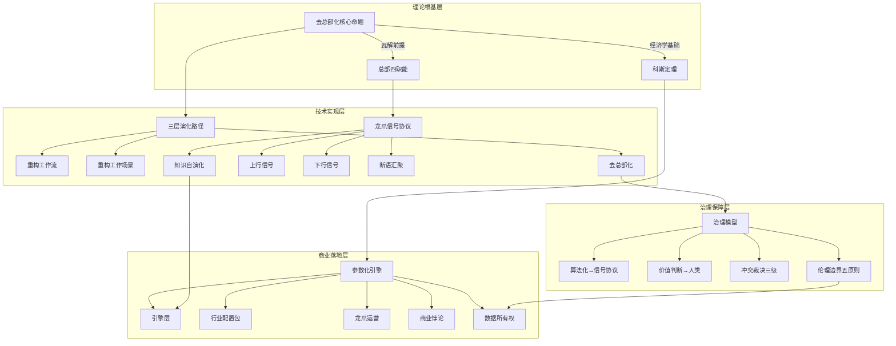

# 去总部化理论·知识图谱

## 核心概念关系网络



## 五行生克流转图

```
        🪵木·生发
    岗位智能体创新
    知识引擎自演化
        │
        ↓ 木生火
        🔥火·明照
    断语汇聚升华
    总经理角色升华
        │
        ↓ 火生土
        🌍土·承载
    治理模型承载
    数据所有权界定
        │
        ↓ 土生金
        🪙金·从革
    科斯定理决断
    适用边界裁断
        │
        ↓ 金生水
        💧水·润下
    信号协议流通
    知识跨店传播
        │
        ↓ 水生木
        🪵木·生发
    （回到起点，循环增强）
```

## 与岗位智能体v3.0映射图

| 去总部化 | → | 岗位智能体v3.0 |
|----------|---|----------------|
| 信息汇聚替代 | → | Step3: 7S评分体系 |
| 标准制定替代 | → | Step1+2: 六维+五行 |
| 资源调配替代 | → | Step4: 三层指标P0/P1 |
| 风险管控替代 | → | Step7+8: 复盘画布+赋能 |
| 龙爪断语 | → | Step9: 断语生成 |
| 岗位自治度 | → | 10步SOP完成度 |
| 知识引擎 | → | LLM Wiki三层架构 |

## 三层龙爪信号闭环

```
     ┌─────────────┐
     │  S3 董事长   │ ← 核心命题+硬截止决策
     │  龙爪        │ ← 断语汇聚（升维压缩）
     └──────┬──────┘
            │
     ┌──────┴──────┐
     │  S2 总经理   │ ← S2断语+行动日历
     │  龙爪        │ ← 信号上升+下行分解
     └──────┬──────┘
            │
     ┌──────┴──────┐
     │  S1 店长×N  │ ← 7S评分+三层指标+断语
     │  龙爪        │ ← 数据采集+信号发送
     └──────┬──────┘
            │
     ┌──────┴──────┐
     │  知识引擎    │ ← 行业配置+评分标准+断语规则+五行参数
     └─────────────┘
```

## 关联文件

- [[去总部化·AI重构企业组织形态·深度学习]] — 完整深度学习文档
- [[岗位智能体v3.0]] — 技术实现载体
- [[味藏店长龙爪]] — 首个实践案例
- [[五行人格心理学]] — 五行适配基础
- [[龙心OS]] — 系统运行平台
