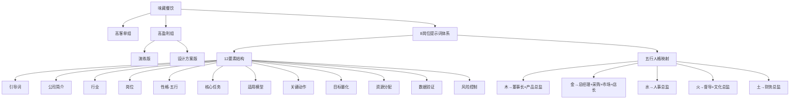

# 味藏AI应用·岗位提示词知识图谱

> **创建日期**：2026-05-18 | **关联**：[[味藏AI应用·岗位提示词深度学习]]
> **标签**：#知识图谱 #味藏 #岗位智能体 #提示词工程

---

## 一、核心概念网络



---

## 二、岗位×模型×五行三维矩阵

| | 木(创新) | 金(目标) | 水(智慧) | 火(推动) | 土(信实) |
|---|---------|---------|---------|---------|---------|
| 战略层 | 董事长←商业模式画布+SWOT | | | | |
| 管理层 | | 总经理←OKR+经营管理 | | | |
| 专业层 | 产品总监←创新金字塔+可实现 | 采购总监←MOSCO+SABC | 人事总监←九宫格+人才供应链 | 督导总监←PDCA+TOPIC+DMAIC | 财务总监←本量利+PI+ARR+EVA |
| | | 市场总监←PMF+需求三角+A/B | | 文化总监←Ashridge+3D+峰值终值 | |
| 执行层 | | 店长←AARRR+服务蓝图 | | | |

---

## 三、提示词迭代进化链

```
V1(高客单组)                V2(高盈利演练)              V3(高盈利设计方案)
┌─────────────┐          ┌─────────────┐          ┌─────────────┐
│ 1-2模型/岗位 │ ──进化→  │ 1-2模型/岗位 │ ──进化→  │ 2-4模型/岗位 │
│ 宽泛KPI     │          │ 中等KPI     │          │ 阈值化KPI   │
│ 1-2风控     │          │ 2-3风控     │          │ 3-5风控+预警│
│ 方向性      │          │ 框架性      │          │ SOP级       │
└─────────────┘          └─────────────┘          └─────────────┘
```

**进化三定律**：
1. 模型叠加律：每次+1-2模型
2. KPI收敛律：定性→定量→阈值
3. 风控扩展律：结果→过程→预警

---

## 四、岗位智能体映射网络

```
提示词12要素 ←→ 岗位智能体SKILL.md ←→ 龙爪信号协议

引导词      ←→ 触发条件        ←→ 上升信号格式
公司简介    ←→ 知识库YAML       ←→ 组织DNA编码
岗位+性格   ←→ 五行诊断+SOP    ←→ 差序层级S1/S2/S3
适用模型    ←→ 分析引擎模块     ←→ 信号处理算法
目标量化    ←→ KPI仪表盘       ←→ 数据上行字段
资源分配    ←→ 预算约束         ←→ 资源分配信号
数据验证    ←→ 验证规则         ←→ 断语汇聚机制
风险控制    ←→ 红线规则         ←→ 下行信号触发
```

---

## 五、概念关联矩阵

| 概念A | 概念B | 关联类型 | 关联强度 |
|-------|-------|---------|---------|
| 提示词12要素 | SKILL.md | 结构映射 | ★★★★★ |
| 五行×岗位 | 差序格局S1/S2/S3 | 层级对应 | ★★★★ |
| 心饮食文化 | 心文化信仰体系 | 品牌OS双向映射 | ★★★★★ |
| AI+人工核查 | 龙爪信号协议 | 技术预演 | ★★★★ |
| 动态财务模型 | 7S诊断财务维度 | 维度对齐 | ★★★ |
| 膳食平衡 | 阴阳平衡 | 方法论同构 | ★★★★ |
| AB角机制 | 信号协议冗余设计 | 设计哲学一致 | ★★★★ |
| VIP客户社群 | 差序格局核心圈 | 客户管理映射 | ★★★ |
| 模型叠加律 | darwin-skill棘轮机制 | 进化逻辑同构 | ★★★★ |
| 风控红线 | 龙心OS规则体系P0 | 安全底线对齐 | ★★★★★ |

---

## 六、标签网络

```
T1(极高频)                    T2(高频)                    T3(中频)
┌────────────────┐          ┌────────────────┐          ┌────────────────┐
│ #味藏          │          │ #五行人格       │          │ #金枪鱼         │
│ #SMART原则     │          │ #岗位智能体     │          │ #绿色生态       │
│ #高盈利产品    │          │ #商业模式画布   │          │ #品牌溢价       │
│ #提示词        │          │ #SWOT          │          │ #降本增效       │
│ #提示词工程    │          │ #OKR           │          │ #PDCA           │
└────────────────┘          └────────────────┘          └────────────────┘
        │                          │                          │
        ▼                          ▼                          ▼
T4(低频)                     T5(极低频)
┌────────────────┐          ┌────────────────┐
│ #本量利分析     │          │ #区块链溯源     │
│ #EVA            │          │ #六西格玛DMAIC │
│ #AB角           │          │ #峰值终值模型   │
│ #MOSCO          │          │ #TOPIC          │
│ #Ashridge使命   │          │ #3D模型         │
└────────────────┘          └────────────────┘
```

---

## 七、跨体系知识连接

### 7.1 与企业文化的连接
- 文化总监"心饮食" ←→ [[企业文化顶层设计·深度学习]]"心文化"
- 文化触点量化 ←→ 礼法合治中"礼"的操作化
- 五行养生菜品 ←→ 五行企业家精神(创新木/冒险火/诚信土/敬业金/应变水)

### 7.2 与去总部化的连接
- AB角机制 ←→ [[去总部化·AI重构企业组织形态·深度学习]]"信息中转站必要性归零"
- AI+人工核查 ←→ 龙爪信号协议"算法化事务→信号协议自动执行"
- 督导数字化 ←→ 去总部化"管理本身被消灭"

### 7.3 与岗位智能体的连接
- 提示词12要素 ←→ 岗位智能体SOP
- 模型选择 ←→ 分析引擎配置
- 风控红线 ←→ 龙心OS规则体系P0

---

## 八、双向链接索引

**本文档被以下文档引用**：
- [[味藏AI应用·岗位提示词深度学习]]
- [[岗位智能体]]
- [[味藏店长龙爪]]

**本文档引用以下文档**：
- [[味藏AI应用·岗位提示词深度学习]]
- [[企业文化顶层设计·深度学习]]
- [[去总部化·AI重构企业组织形态·深度学习]]
- [[五行人格心理学]]

---

_此知识图谱与深度学习文档配套使用，可视化展示味藏AI应用岗位提示词体系中各概念的关联关系。_
