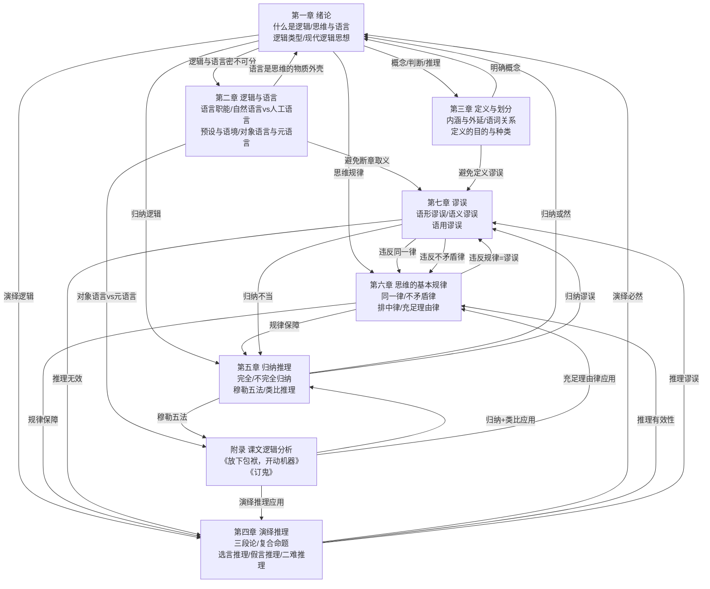

# 逻辑基本知识·知识图谱

> **核心结论**：本书七章+附录构成完整的逻辑学入门体系，从"什么是逻辑"（第一章）到"如何识别谬误"（第七章），形成"概念→推理→规律→应用"的完整闭环。

---

## 📐 全书知识图谱（Mermaid）



---

## 🔗 隐秘联系全表

| # | 起点 | 终点 | 联系类型 | 说明 |
|---|------|------|----------|------|
| H1 | 第一章 1.3 思维的形式与内容 | 第六章 同一律 | 规律应用 | 思维形式同一性是不矛盾律/排中律的基础 |
| H2 | 第一章 2.2 演绎逻辑与归纳逻辑 | 第四章 演绎推理 | 理论→应用 | 演绎逻辑理论在第四章具体展开 |
| H3 | 第一章 2.2 演绎逻辑与归纳逻辑 | 第五章 归纳推理 | 理论→应用 | 归纳逻辑理论在第五章具体展开 |
| H4 | 第二章 对象语言与元语言 | 附录 课文逻辑分析 | 方法→应用 | 对象语言/元语言区分是课文分析的基础方法 |
| H5 | 第三章 定义与划分 | 第七章 谬误#语义谬误 | 规范→违反 | 定义规则违反即产生定义谬误 |
| H6 | 第四章 三段论 | 第七章 谬误#语形谬误 | 有效→无效 | 三段论规则违反即产生推理谬误 |
| H7 | 第五章 穆勒五法 | 附录 《订鬼》分析 | 方法→应用 | 穆勒五法思想是《订鬼》类比推理的评价基础 |
| H8 | 第六章 同一律/不矛盾律/排中律 | 第七章 各类谬误 | 规律→违反 | 所有谬误本质上都是违反思维基本规律 |
| H9 | 第六章 充足理由律 | 附录 《放下包袱》分析 | 规律→应用 | 《放下包袱》严格遵循充足理由律 |
| H10 | 第七章 谬误 | 第二章 逻辑与语言 | 误用→正确使用 | 识别谬误才能正确使用逻辑与语言 |

---

## 🃏 易经卦变思维 × 逻辑基本知识

| 易经卦变 | 本书对应 | 整合价值 |
|----------|----------|----------|
| **本卦**（当前状态） | 第一章 绪论（逻辑学现状与定位） | 认清逻辑学的基础定位 |
| **变卦**（未来趋势） | 现代逻辑发展（形式化、符号化） | 预判逻辑学发展趋势 |
| **互卦**（隐藏结构） | 第七章 谬误（日常表达中的隐藏逻辑错误） | 深挖日常语言背后的隐性逻辑问题 |
| **错卦**（对立面） | 非形式逻辑（与形式逻辑对立统一） | 从反面审视形式逻辑的边界 |
| **综卦**（他者视角） | 语文教学视角（从教师角度理解逻辑应用） | 站在不同立场理解逻辑的教学价值 |
| **杂卦**（关系网络） | 全书知识图谱（各章节之间的隐秘联系） | 追溯逻辑知识概念的历史演变与跨域连接 |

---

## 🃠 五行分类图谱 × 逻辑基本知识

| 五行 | 对应章节 | 核心功能 | 逻辑基本知识的五行流转 |
|------|----------|----------|----------------------|
| **金** | 第一章 绪论 + 第六章 思维的基本规律 | 清明决断，拆解分明 | 精准拆解逻辑概念，厘定思维边界 |
| **水** | 第五章 归纳推理 + 第七章 谬误 | 润泽流动，思辨变通 | 归纳或然如水流动，谬误识别需思辨流动 |
| **木** | 第二章 逻辑与语言 + 附录 课文逻辑分析 | 生长联结，跨域生发 | 逻辑与语言结合，跨域连接语文教学 |
| **火** | 第四章 演绎推理 | 光明洞察，照亮本质 | 演绎必然如烈火照耀，推理有效性光明正大 |
| **土** | 第三章 定义与划分 + 总索引/知识图谱 | 承载转化，框架沉淀 | 定义是知识的承载容器，知识图谱是框架沉淀 |

**五行流转路径**：
```
金（第一章·拆解概念）→ 水（第五章·归纳思辨）→ 木（第二章·语言联结）
  → 火（第四章·演绎洞察）→ 土（第三章·定义承载）→ 金（第六章·规律拆解）
```

---

## 📊 穆勒五法 × 语文教学中逻辑应用

| 穆勒五法 | 本书章节 | 语文教学应用 | 隐秘联系 |
|----------|----------|------------|----------|
| **求同法** | 第五章 第二节 | 归纳同主题文章共性（如鲁迅杂文"批判国民性"） | → 归纳推理的有效工具 |
| **求异法** | 第五章 第二节 | 正反对比论证（勤能补拙：勤奋vs懒惰对比） | → 议论文写作核心论证方法 |
| **求同求异并用法** | 第五章 第二节 | 历史人物/事件评价（改革成败对比） | → 复杂文本分析的核心工具 |
| **共变法** | 第五章 第二节 | 数据论证（教育投入与经济发展正相关） | → 说明文/议论文的数据使用逻辑 |
| **剩余法** | 第五章 第二节 | 原因分析类题目（某朝代衰落的多因分析） | → 深层原因探究的逻辑工具 |

---

## 🀄 核心逻辑规律 × 议论文写作

| 思维规律 | 本书章节 | 议论文写作应用 | 常见谬误 |
|----------|----------|------------|----------|
| **同一律**（A是A） | 第六章 第一节 | 核心概念必须全文保持同一（如"自由"不能中途变成"放任"） | 偷换概念、转移论题 |
| **不矛盾律**（A不是非A） | 第六章 第二节 | 全文不能自相矛盾（如不能既说"赞成"又说"反对"） | 自相矛盾 |
| **排中律**（要么A要么非A） | 第六章 第三节 | 对矛盾命题必须明确表态（不能"既赞成也不反对"） | 两不可、模棱两可 |
| **充足理由律** | 第六章 第四节 | 每个分论点都必须有充分理由支撑 | 理由虚假、推不出 |

---

## 📚 全书核心金句汇总

1. **"逻辑学研究的不是思维的具体内容，而是思维的逻辑形式及其规律。"**（第一章）
2. **"思维是人脑对客观事物的概括和间接反映，语言是思维的物质外壳。"**（第一章）
3. **"逻辑不脱离语言，逻辑存在于每篇课文、每个语句之中。"**（第二章）
4. **"不能用对象语言本身来论证对象语言的正确性——这是避免循环论证谬误的关键。"**（第二章）
5. **"概念通过内涵与外延两个维度明确——内涵是本质属性，外延是适用范围。"**（第三章）
6. **"属加种差定义法是最常用的内涵定义方法：被定义概念 = 种差 + 邻近属概念。"**（第三章）
7. **"演绎推理的核心：前提真且形式有效，结论必然真。"**（第四章）
8. **"二难推理让对方进退两难——但假二难推理的选言前提往往没有穷尽所有可能。"**（第四章）
9. **"归纳推理是从个别到一般的推理，结论超出前提范围，具有或然性。"**（第五章）
10. **"穆勒五法是归纳推理的核心工具——求同、求异、并用、共变、剩余，五种方法各有适用场景。"**（第五章）
11. **"同一律、不矛盾律、排中律是思维形式的基本规律；充足理由律是论证的基本规律——二者不属于同一层次。"**（李先焜独到见解，第六章）
12. **"语形谬误看结构，语义谬误看意义，语用谬误看语境——三维诊断法。"**（第七章）
13. **"《放下包袱，开动机器》的核心是演绎推理框架——大前提真、小前提真、形式有效，结论必然成立。"**（附录）
14. **"《订鬼》的核心是类比推理——用'病目见垂缨''病耳闻鸣鼓'这两个已验证的幻觉现象，类比推出'病心见鬼'也是幻觉。"**（附录）
15. **"附录的价值在于：让抽象的逻辑规则，在具体的课文分析中变得可感、可用。"**（附录）

---

## 🔍 本书在逻辑学体系中的位置

```
世界逻辑学三大起源
├── 古希腊逻辑（亚里士多德《工具论》）
│   └── 本书第一章·2.4节 关于逻辑的各种名称的说明
├── 中国先秦名辩学（墨家"辩、类、故"）
│   └── 本书第一章·2.4节 三大起源并列
└── 古印度因明（足目《正理经》）
    └── 本书第一章·2.4节 三大起源并列

本书定位：
  ├── 隶属：形式逻辑（传统逻辑）入门读物
  ├── 特色：密切结合自然语言与语文教学实际
  ├── 定位：语文教师小丛书系列
  ├── 评价：广东职业技术学院逻辑主题推荐图书
  │         "逻辑思维入门的'必修课'，夯实思维基础的经典之作"
  └── 学界评价：汉语言文学专业研究者评为"最佳逻辑入门读物"
```

---

*知识图谱创建时间：2026-05-24*
*学习方法：知识学习Skills v3.0 · 第五层·土（启发+映射）*
