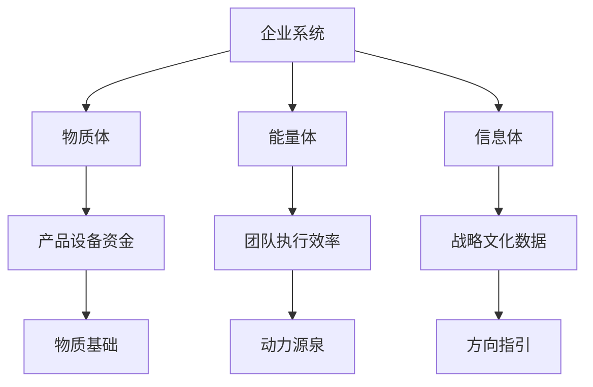
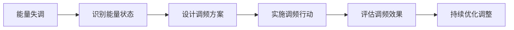

# 企业文化能量场构建

## 核心定义
**企业文化能量场**是指通过文化理念、仪式实践、信念系统等构建的组织能量系统，它影响组织成员的行为模式、思维方式和情感体验，是组织凝聚力和竞争力的重要来源。

## 详细内容

### 一、能量场理论基础

#### 1. 三体理论框架

**三体平衡原则**：
- **物质体**（基础）：产品、设备、资金等有形资源
- **能量体**（动力）：团队执行力、流程效率、组织活力
- **信息体**（方向）：战略规划、文化理念、数据信息

#### 2. 能量场层次结构
- **个人能量场**：个人信念、情绪状态、行为模式
- **团队能量场**：团队氛围、协作模式、集体情感
- **组织能量场**：组织文化、价值观、整体氛围
- **场域能量场**：物理空间、环境氛围、能量聚集

### 二、文化能量场的构建要素

#### 1. 信息体层面：文化理念系统
- **使命愿景**：组织的存在意义和未来图景
- **核心价值观**：指导行为和决策的基本原则
- **行为规范**：具体的行为标准和期望

#### 2. 能量体层面：仪式实践系统
- **日常仪式**：晨会、夕会、周会等常规仪式
- **特殊仪式**：庆典、表彰、入职等特殊时刻
- **修行实践**：个人修行、集体修行、能量链接

#### 3. 物质体层面：符号象征系统
- **视觉符号**：Logo、色彩、办公环境
- **物质载体**：文化手册、礼品、纪念品
- **空间布局**：办公室设计、会议空间、公共区域

### 三、能量场构建的具体方法

#### 1. 能量调频技术

**调频方法**：
- **认知同频**：统一思想认识和价值观念
- **情感共鸣**：激发共同情感体验和归属感
- **行为同步**：协调行动节奏和协作模式

#### 2. 护法团队建设
- **能量链接**：建立与传统文化能量的链接
- **团队构成**：龙族、凤族、饕餮等能量团队
- **供养实践**：通过仪式和实践维持能量链接

#### 3. 知行合一实践
- **理念内化**：将文化理念转化为个人信念
- **行为外化**：通过具体行为体现文化理念
- **体验深化**：通过深度体验强化文化认同

### 四、悟空的企业文化实践

#### 1. 文化落地四步法
1. **认知阶段**：理解文化理念的内涵和意义
2. **认同阶段**：情感上接受和认同文化理念
3. **内化阶段**：将文化理念转化为个人信念
4. **外化阶段**：通过行为体现文化理念

#### 2. 能量场建设实践
- **地藏经修行**：通过修行建立能量基础
- **北斗七星链接**：建立与宇宙能量的链接
- **护法团队供养**：维持传统文化的能量支持

#### 3. 文化自信建设
- **理想导向**：自信来源于对理想的追求
- **过程重视**：重视文化落地的过程和体验
- **结果验证**：以实际效果验证文化有效性

### 五、能量场的管理和维护

#### 1. 能量监测体系
- **能量指标**：团队活力、协作效率、创新氛围
- **测量工具**：能量评估问卷、观察记录、访谈
- **定期评估**：月度、季度、年度能量评估

#### 2. 能量调节机制
- **正向强化**：奖励符合文化能量的行为
- **负向调整**：纠正偏离文化能量的行为
- **动态平衡**：根据实际情况调整能量策略

#### 3. 能量传承系统
- **导师制度**：通过师徒制传承文化能量
- **故事传承**：用故事形式传递文化精神
- **仪式传承**：通过仪式固化文化体验

### 六、能量场建设的挑战和对策

#### 1. 常见挑战
- **理念与实践脱节**：文化理念未能转化为实际行动
- **能量衰减**：文化能量随时间逐渐减弱
- **个体差异**：不同个体对文化能量的接受程度不同

#### 2. 应对策略
- **持续强化**：通过持续实践强化文化能量
- **个性化适应**：根据个体差异调整能量策略
- **创新融合**：将传统文化与现代管理创新融合

#### 3. 成功关键
- **领导示范**：领导者以身作则示范文化能量
- **全员参与**：鼓励全员参与能量场建设
- **系统支持**：建立支持能量场建设的系统机制

### 七、能量场建设的组织价值

#### 1. 组织层面价值
- **凝聚力提升**：增强组织成员的归属感和认同感
- **竞争力强化**：形成独特的组织能量竞争优势
- **可持续发展**：为组织长期发展提供能量支持

#### 2. 个人层面价值
- **成长支持**：为个人成长提供能量环境
- **幸福感提升**：改善工作体验和幸福感
- **意义感增强**：增强工作的意义和价值感

#### 3. 社会层面价值
- **文化传承**：传承和弘扬优秀传统文化
- **创新实践**：探索传统文化与现代企业的融合
- **社会影响**：为社会提供正能量示范

## 关联文件
- [[悟空人格与企业文化深度分析]]
- [[知识诅咒理论与教学法]]
- [[护法团队与企业精神支撑]]
- [[知行合一实践体系]]
- [[组织能量管理系统]]

## 核心金句
1. "文化是修出来的能量，不是写出来的文字"
2. "企业不仅是经济组织，更是能量交换系统"
3. "自信来源于对理想的坚定追求"
4. "知行合一是文化落地的检验标准"
5. "能量场是组织的核心竞争力"

## 标签
#企业文化 #能量场 #组织发展 #文化落地 #知行合一 #护法团队 #能量管理 #领导力 #传统文化 #现代管理