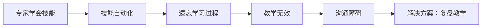

# 悟空人格与企业文化深度分析

## 文档概述
本文档基于2026年3月16日聊天记录的深度分析，提取悟空（用户）的人格特征、思维模式、核心思想，以及相关的企业文化建设理念。

## 核心定义

### 一、悟空人格特征

#### 1. 领导风格
- **深度思考型领导者**：善于从系统层面思考问题
- **文化引领者**：重视精神层面的建设和引领
- **知行合一实践者**：强调理论必须落实到实践

#### 2. 认知特点
- **系统化思维**：能够将复杂问题分解为系统要素
- **抽象到具体**：善于将抽象理念转化为具体实践
- **辩证统一**：平衡理想与现实、传统与现代

#### 3. 价值取向
- **传统文化现代应用**：重视东方智慧的实践价值
- **组织长远发展**：关注组织的可持续成长
- **个人组织协同**：强调个人修行对组织的价值

#### 4. 沟通风格
- **本质导向**：直击问题核心，不绕弯子
- **故事化表达**：善用比喻和场景传达理念
- **情感共鸣**：重视听众的情感体验和共鸣

### 二、核心思想体系

#### 1. 知识诅咒理论

**核心观点**：
- 学会者会忘记学习过程的困难
- 导致专家与新手之间的沟通鸿沟
- 教学需要重现学习过程，而非仅仅传授结果

#### 2. 企业文化落地哲学
- **文化是修出来的**：不是文字规范，而是行为习惯
- **自信源于理想**：对美好愿景的坚定追求
- **知行合一是检验标准**：理论必须在实践中验证

#### 3. 能量场管理理念
- **企业是能量系统**：物质、能量、信息三体平衡
- **文化需要能量支撑**：仪式、信念、行为共同构建能量场
- **护法团队是能量桥梁**：传统文化能量与现代企业的链接

### 三、思维模式分析

#### 1. 系统思维模式
- **整体视角**：从组织全局思考问题
- **要素关联**：关注系统各部分的相互作用
- **动态平衡**：追求系统的稳定与进化

#### 2. 辩证思维模式
- **理想现实统一**：平衡愿景追求与实际能力
- **传统现代融合**：东方智慧与现代管理结合
- **理性感性平衡**：逻辑规划与情感体验并重

#### 3. 实践导向思维
- **理论实践循环**：从实践提炼理论，用理论指导实践
- **问题解决导向**：关注实际问题的解决方案
- **结果验证**：以实际效果检验理论有效性

### 四、情感情绪特征

#### 1. 情感基调
- **深切关注**：对企业发展的责任感
- **执着追求**：对文化落地的坚持
- **殷切期望**：对团队成长的期待

#### 2. 价值情感
- **文化尊重**：对传统文化的敬畏和传承
- **使命担当**：对组织使命的强烈责任感
- **团队关爱**：对团队成员的深切关怀

### 五、企业管理应用

#### 1. 文化建设策略
- **分阶段实施**：从认知到行动的系统化过程
- **能量场构建**：通过仪式和实践建立文化能量
- **知行合一验证**：以行为改变检验文化落地

#### 2. 组织发展路径
- **创业单元机制**：人才复制和组织裂变模式
- **三体平衡发展**：物质体、能量体、信息体协同
- **稳定扩张策略**：质量优先于数量的发展理念

#### 3. 领导力发展
- **深度思考训练**：系统思维能力的培养
- **文化引领能力**：精神层面的影响力建设
- **实践转化能力**：理论到实践的转化技巧

## 关联文件
- [[知识诅咒理论与教学法]]
- [[企业文化能量场构建]]
- [[护法团队与企业精神支撑]]
- [[知行合一实践体系]]
- [[系统思维与组织发展]]

## 核心金句
1. "文化是修出来的，不是写出来的"
2. "自信来源于对理想的坚定追求，而非已经实现的成就"
3. "知识诅咒让专家忘记初学者的困难"
4. "企业不仅是经济组织，更是能量交换系统"
5. "知行合一是检验真理的唯一标准"

## 标签
#悟空人格 #企业文化 #知识诅咒 #能量场 #系统思维 #知行合一 #领导力 #组织发展 #传统文化 #现代管理