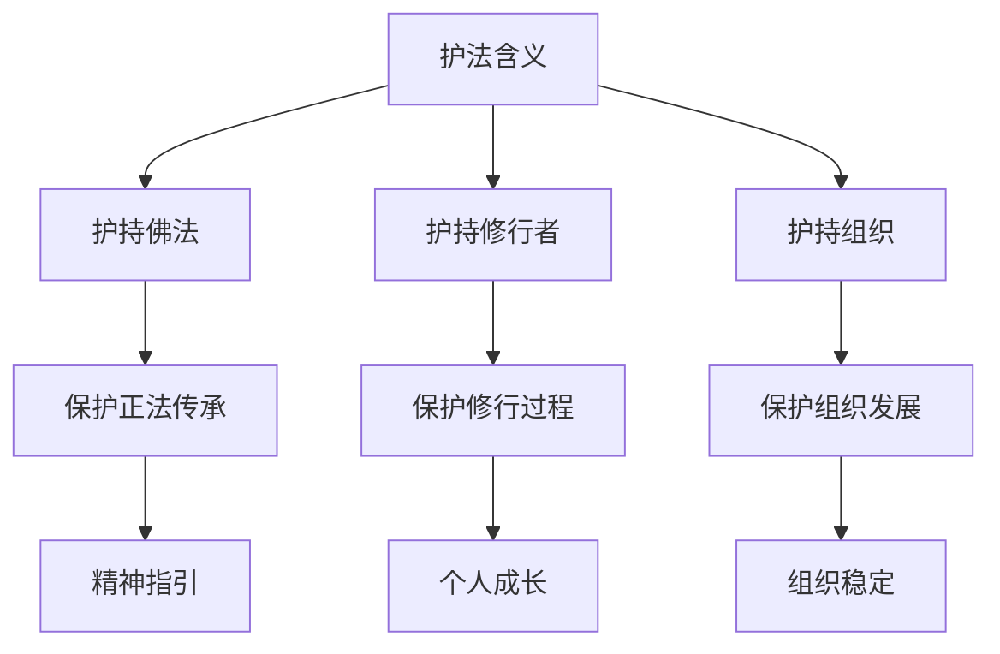
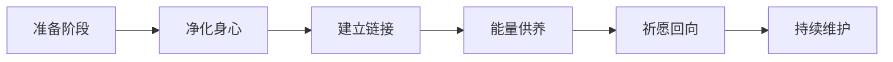

# 护法团队与企业精神支撑

## 核心定义
**护法团队**是指基于传统文化智慧构建的企业精神支撑系统，通过链接龙族、凤族、饕餮等传统文化能量，为企业提供精神力量、智慧支持和能量保护，是现代企业管理与传统文化融合的创新实践。

## 详细内容

### 一、护法团队的理论基础

#### 1. 传统文化能量观
- **能量链接**：人与天地、自然、宇宙的能量链接
- **精神支撑**：传统文化力量对现代企业的精神滋养
- **智慧传承**：古老智慧在现代企业中的创新应用

#### 2. 护法的三重含义

### 二、护法团队的构成体系

#### 1. 核心护法类型

##### 龙族护法
- **能量属性**：水元素，智慧与变化
- **代表意义**：行云布雨，消灾解难
- **链接方式**：水供养、龙供仪轨
- **企业对应**：董事长能量链接

##### 凤族护法
- **能量属性**：火元素，重生与净化
- **代表意义**：凤凰涅槃，火焰净化
- **链接方式**：火供养、凤供仪轨
- **企业对应**：总经理能量链接

##### 饕餮护法（饕餮龙尊）
- **能量属性**：土元素，包容与转化
- **代表意义**：吞噬负能量，转化正能量
- **链接方式**：食物供养、特殊仪轨
- **企业对应**：企业图腾与文化象征

#### 2. 辅助护法体系

##### 药师十二神将
- **能量属性**：医药与健康
- **代表意义**：健康守护，疾病消除
- **链接方式**：药师佛仪轨
- **企业对应**：健康餐饮与养生理念

##### 北斗七星
- **能量属性**：宇宙能量与命运
- **代表意义**：命运改变，能量链接
- **链接方式**：北斗七星仪轨
- **企业对应**：企业命运与战略方向

##### 一祖师爷（伊尹）
- **能量属性**：烹饪与食疗
- **代表意义**：食医同源，健康烹饪
- **链接方式**：祖师爷供养
- **企业对应**：餐饮技术与健康理念

### 三、护法团队的建立方法

#### 1. 能量链接仪式

**仪式要素**：
- **身心准备**：净身、净心、净意
- **能量链接**：通过仪轨建立能量通道
- **持续供养**：定期供养维持能量链接
- **诚信守约**：遵守与护法的约定

#### 2. 个人护法链接
- **八字匹配**：根据个人生辰匹配护法
- **能量感应**：通过修行感应护法能量
- **日常供养**：建立日常的供养和修行

#### 3. 组织护法建设
- **道场建立**：设立专门的能量场域
- **团队修行**：组织团队共同修行
- **文化融合**：将护法文化融入企业文化

### 四、护法团队的企业应用

#### 1. 精神支撑系统
- **压力缓解**：在困难时期提供精神支持
- **决策支持**：在重大决策时提供智慧指引
- **团队凝聚**：增强团队的归属感和使命感

#### 2. 能量管理系统
- **正能量增强**：提升组织的正能量氛围
- **负能量转化**：转化和消除组织的负能量
- **能量平衡**：维持组织的能量平衡状态

#### 3. 文化传承机制
- **传统智慧传承**：传承优秀的传统文化智慧
- **文化创新实践**：探索传统文化在现代企业的应用
- **精神文化建设**：建设有深度的组织精神文化

### 五、悟空的企业护法实践

#### 1. 护法团队建设历程
1. **初期探索**：个人修行与护法链接
2. **组织推广**：在企业内部推广护法文化
3. **系统建设**：建立完整的护法团队体系
4. **文化融合**：将护法文化融入企业管理

#### 2. 关键实践要点
- **诚信为本**：与护法的链接需要绝对的诚信
- **持续修行**：护法链接需要持续的修行和维护
- **知行合一**：护法智慧必须落实到实际行动

#### 3. 实践效果
- **团队稳定**：增强了团队的稳定性和凝聚力
- **文化自信**：提升了企业的文化自信和独特性
- **发展动力**：为企业发展提供了精神动力

### 六、护法团队的管理原则

#### 1. 诚信原则
- **承诺守约**：对护法的承诺必须遵守
- **真诚供养**：供养需要真诚的心意
- **长期维护**：护法关系需要长期维护

#### 2. 修行原则
- **个人修行**：个人需要通过修行提升能量
- **团队共修**：组织团队共同修行提升能量
- **知行合一**：将修行智慧转化为实际行动

#### 3. 适度原则
- **能量平衡**：保持与护法能量的适度平衡
- **理性对待**：理性看待护法作用，不迷信
- **现实结合**：将护法智慧与现实管理结合

### 七、护法团队的现代意义

#### 1. 对企业的价值
- **精神支撑**：为企业提供深层次的精神支持
- **文化特色**：形成独特的企业文化特色
- **竞争优势**：建立难以模仿的文化竞争优势

#### 2. 对个人的价值
- **心灵成长**：促进个人的心灵成长和修行
- **能量提升**：提升个人的正能量和生命力
- **智慧启迪**：获得传统文化智慧的启迪

#### 3. 对社会的价值
- **文化传承**：传承和弘扬优秀传统文化
- **创新实践**：探索传统文化在现代社会的应用
- **正能量传播**：为社会传播正能量和美好价值观

### 八、实施建议与注意事项

#### 1. 实施步骤建议
1. **认知教育**：首先进行传统文化认知教育
2. **个人体验**：让核心团队体验护法修行的价值
3. **组织建设**：逐步建立组织的护法团队体系
4. **文化融合**：将护法文化有机融入企业文化

#### 2. 注意事项
- **理性对待**：避免迷信和盲目崇拜
- **适度推广**：根据组织实际情况适度推广
- **尊重差异**：尊重不同个体的信仰和选择

#### 3. 成功关键
- **领导示范**：领导者以身作则示范护法修行
- **系统支持**：建立支持护法文化建设的系统
- **持续优化**：根据实践效果持续优化和完善

## 关联文件
- [[悟空人格与企业文化深度分析]]
- [[企业文化能量场构建]]
- [[传统文化与现代企业融合]]
- [[修行实践与企业管理]]
- [[组织精神支撑系统]]

## 核心金句
1. "护法护的是法，不是人"
2. "护法关系是对等的能量交换"
3. "诚信是护法链接的基础"
4. "护法智慧需要在实践中验证"
5. "传统文化能量是现代企业的宝贵资源"

## 标签
#护法团队 #传统文化 #企业精神 #能量管理 #文化融合 #修行实践 #组织发展 #领导力 #智慧传承 #现代管理