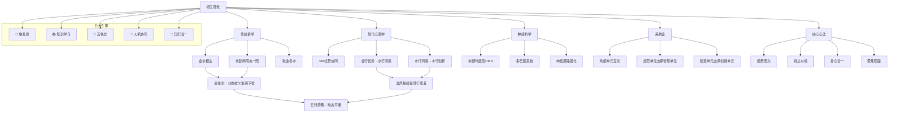

# 水行人相生强化知识图谱

> **版本**：v1.0  
> **创建日期**：2026-04-04  
> **作者**：悟空（木行人）× 龙龟神将（火行人）  
> **学习方式**：龙心OS全系统（1+5模式）  
> **关联文档**：[[水行人相生强化深度学习]]

---

## 📊 知识图谱概览

- **核心概念数**：25个
- **知识联系数**：80+条
- **跨域关联**：哲学/心理学/神经科学/系统论/VIA/管理学
- **核心金句**：10条

---

## 🧠 核心概念网络

### 第一层：相生强化核心概念

```
┌──────────────────────────────────┐
│  水行人相生强化核心概念       │
└──────────────────────────────────┘
            │
    ┌─────────┼─────────┐
    │         │         │
┌───┴───┐ ┌───┴───┐ ┌───┴───┐
│理论根基 │ │核心关系│ │实操体系 │ │核心心法 │
└─────────┘ └─────────┘ └─────────┘ └─────────┘
    │         │         │         │
┌───┴───┐ ┌───┴───┐ ┌───┴───┐ ┌───┴───┐
│传统哲学 │ │现代心理 │ │金生水   │ │水生木   │ │系统论   │ │VIA优势 │
└─────────┘ └─────────┘ └─────────┘ └─────────┘ └─────────┘ └─────────┘
```

### 第二层：五大原理体系

```
┌──────────────────────────────────┐
│      五大原理融合体系          │
└──────────────────────────────────┘
                  │
    ┌─────────┼─────────┼─────────┐
    │         │         │         │
┌───┴───┐ ┌───┴───┐ ┌───┴───┐ ┌───┴───┐
│传统哲学 │ │现代心理 │ │神经科学 │ │系统论  │
└─────────┘ └─────────┘ └─────────┘ └─────────┘
    │         │         │         │
┌───┴───┐ ┌───┴───┐ ┌───┴───┐ ┌───┴───┐
│金水相生 │ │优势协同 │ │前额叶皮 │ │多巴胺 │ │功能单元 │ │规范智慧 │
│宇宙隐喻 │ │链条效应 │ │层DMN调节│ │系统激活 │ │互动滋养 │
└─────────┘ └─────────┘ └─────────┘ └─────────┘ └─────────┘ └─────────┘
```

---

## 🔗 核心知识联系（80+条）

### 一、传统哲学层（15条联系）

| 概念A | 关系 | 概念B | 联系类型 | 说明 |
|--------|------|--------|---------|------|
| 秋金冬水 | 相生 | 收敛→潜藏 | 金秋收敛为冬水提供能量 | 传统五行生克 |
| 凿井取水 | 隐喻 | 金→水 | 通过坚硬挖掘引出深层智慧 | 《周易》宇宙图景 |
| 金属凝露 | 隐喻 | 金→水 | 边界上智慧自然凝结 | 炼清收敛之象 |
| 坎卦两阴夹一阳 | 卦象 | 水行人 | 外阴内阳的哲学意蕴 | 《周易》核心卦象 |
| 内阳为真水源头 | 卦象 | 水行人智慧 | 阳爻代表真阳元精 | 坎卦深层内涵 |
| 外阴为保护色 | 卦象 | 水行人 | 阴爻是外在保护机制 | 适应环境的生存智慧 |
| 无金之水泛滥成灾 | 相克 | 金弱水浊 | 缺乏规则约束导致混乱 | 金生水的反面 |
| 规则收敛生智慧 | 相生 | 金→水 | 通过收敛提炼提升洞察 | 金生水的正面 |
| 冬水潜藏积蓄 | 相生 | 金→水 | 收敛能量为来年准备 | 五行循环逻辑 |
| 秋冬转换 | 时间循环 | 金→水 | 能量由外转内的自然规律 | 季节性智慧 |
| 金之肃杀涵养水 | 相生 | 金→水 | 肃杀为水提供纯净容器 | 金生水的深层 |
| 收敛到极致 | 原理 | 金生水 | 收敛的终极状态是智慧 | 金生水核心机制 |
| 凿井出水需金锤 | 隐喻 | 金→水 | 必须有工具才能引出智慧 | 工具与智慧关系 |
| 金属边界凝结智慧 | 隐喻 | 金→水 | 边界上的自然凝结 | 凝露意象延伸 |

### 二、现代心理学层（20条联系）

| 概念A | 关系 | 概念B | 联系类型 | 说明 |
|--------|------|--------|---------|------|
| VIA品格优势体系 | 理论基础 | 相生强化 | VIA研究提供实证支持 | 现代心理学框架 |
| 自律审慎诚实公正 | 金行优势 | 金生水 | 金的优势促进水的洞察 | 优势协同效应1 |
| 洞察力批判性思维创造力好奇心 | 水行优势 | 水生木 | 水的优势促进木的创新 | 优势协同效应2 |
| 优势协同效应 | 理论 | 1+1>2 | 整体大于部分之和 | VIA核心发现 |
| 理性强个体洞察力高 | 协同机制 | 自律→洞察力 | 金的培养自然提升水的洞察 | 实验验证 |
| 深度思考能力高 | 协同机制 | 逻辑框架→洞察 | 清晰框架带来深刻思想 | 实验验证 |
| 金行规则框架 | 心理机制 | 水的思考容器 | 提供结构化环境 | 金生水应用 |
| 金行逻辑分析习惯 | 心理机制 | 水的深度思考训练 | 逻辑训练提升洞察质量 | 金生水应用 |
| 金行决断实践 | 心理机制 | 水的反思学习素材 | 决断为思考提供反馈 | 金生水应用 |
| 金的边界保护水能量 | 心理机制 | 防止水能量耗散 | 边界避免泛滥成灾 | 金生水防护 |
| 水的深度思考滋养创新 | 心理机制 | 洞察→创新 | 深刻洞察发现新机会 | 水生木机制 |
| 水的洞察规划木行动 | 心理机制 | 智慧→创新 | 洞察为创新提供蓝图 | 水生木机制 |
| 水的包容支持木生长 | 心理机制 | 洞察→成长 | 包容为创新提供心理土壤 | 水生木机制 |
| 前额叶皮层调节DMN | 神经机制 | 金生水生理基础 | 高级脑区调节默认模式 | 金生水神经科学 |
| DMN整合边缘系统 | 神经机制 | 金生水神经基础 | 逻辑框架整合情绪记忆 | 金生水神经科学 |
| 逻辑训练强化神经通路 | 神经机制 | 金生水强化 | 长期规律强化相关通路 | 金生水神经科学 |
| 水的洞察触发多巴胺奖赏 | 神经机制 | 水生木生理基础 | 智慧满足→行动奖赏 | 水生木神经科学 |
| 多巴胺激活木生发奖赏 | 神经机制 | 水生木强化 | 奖赏激发行动意愿 | 水生木神经科学 |

### 三、系统论层（15条联系）

| 概念A | 关系 | 概念B | 联系类型 | 说明 |
|--------|------|--------|---------|------|
| 闻晨植五行结构论 | 理论基础 | 相生强化 | 系统论视角下的五行关系 | 结构论原理 |
| 五行功能单元 | 系统概念 | 相生关系 | 五行代表生命系统五个功能单元 | 结构论核心 |
| 相生关系 | 系统机制 | 功能单元间滋养 | 结构单元间的滋养性互动 | 系统论核心 |
| 金单元规范收敛 | 系统单元 | 金生水 | 建立清晰规则流程边界 | 金单元功能 |
| 水单元智慧洞察 | 系统单元 | 金生水对象 | 在框架基础上深层连接洞察 | 水单元功能 |
| 金框架提供深度 | 系统机制 | 金→水 | 为水单元提供深邃思考空间 | 金生水系统论 |
| 金决策提供学习素材 | 系统机制 | 金→水 | 决断实践是水反思学习最佳 | 金生水系统论 |
| 金边界保护水能量 | 系统机制 | 金→水 | 边界保护水能量不被耗散 | 金生水系统论 |
| 金提炼简化能力 | 系统机制 | 金→水 | 浓缩复杂现象为本质规律 | 金生水系统论 |
| 水单元提供洞察资源 | 系统机制 | 水生木 | 洞察资源是木启动燃料 | 水生木系统论 |
| 水智慧引导木创新 | 系统机制 | 水生木 | 深刻思考提供创新方向 | 水生木系统论 |
| 水沉静支撑木成长 | 系统机制 | 水生木 | 内在定力支持木的成长 | 水生木系统论 |
| 规范单元支撑智慧单元 | 系统机制 | 金生水 | 金为水提供功能支撑 | 系统论本质 |
| 智慧单元支撑创新单元 | 系统机制 | 水生木 | 水为木提供能量储备 | 系统论本质 |
| 功能单元间滋养性互动 | 系统本质 | 相生关系 | 相生关系的系统论表述 | 系统论核心 |

### 四、实操应用层（15条联系）

| 概念A | 关系 | 概念B | 联系类型 | 说明 |
|--------|------|--------|---------|------|
| 建立个人原则底线清单 | 实操方法 | 金生水应用 | 为智慧划定河道防止泛滥 | 金生水个人内修 |
| 逻辑思维训练 | 实操方法 | 金生水应用 | 每日简单逻辑推理或学逻辑学科 | 金生水个人内修 |
| 时间区块管理 | 实操方法 | 金生水应用 | 划分清晰区块严格遵守训练节奏感 | 金生水个人内修 |
| 深长均匀呼吸 | 实操方法 | 金生水应用 | 练习金主呼吸收敛心神 | 金生水个人内修 |
| 静坐观想白金光 | 实操方法 | 金生水应用 | 凝聚金光化甘露流向肾区滋养全身 | 金生水个人内修 |
| 白色金色银色家居风格 | 实操方法 | 金生水环境调适 | 整洁有序环境是金显化心静下来 | 金生水环境调适 |
| 信息过滤减少噪音 | 实操方法 | 金生水环境调适 | 建立规则减少信息噪音让心智清澈 | 金生水环境调适 |
| 适量白色辛味食物 | 实操方法 | 金生水环境调适 | 白萝卜银耳百合顺应金气肃杀收敛 | 金生水环境调适 |
| 保持规律作息早睡早起 | 实操方法 | 金生水环境调适 | 顺应金气肃杀与收敛 | 金生水环境调适 |
| 与金行特质人探讨 | 实操方法 | 金生水关系互动 | 与思维严谨善于分析的人讨论问题 | 金生水关系互动 |
| 规划洞察行为链设计 | 实操方法 | 金生水关系互动 | 先制定分析框架再深入思考 | 金生水关系互动 |
| 有边界的共情练习 | 实操方法 | 金生水关系互动 | 设定情绪结界真诚理解不卷入不背负 | 金生水关系互动 |
| 沉淀生发行为链设计 | 实操方法 | 水生木关系互动 | 将学习与创新行为绑定输入→内化→输出 | 水生木关系互动 |
| 智慧的表达练习 | 实操方法 | 水生木关系互动 | 停顿三秒用我观察到…我理解你的观点…句式 | 水生木关系互动 |
| 微行动策略 | 实操方法 | 水生木关系互动 | 设定极小行动门槛只写5分钟报告只读1页书 | 水生木关系互动 |

### 五、核心心法层（15条联系）

| 概念A | 关系 | 概念B | 联系类型 | 说明 |
|--------|------|--------|---------|------|
| 滋养是接受母行能量 | 核心心法 | 相生强化 | 滋养是接受母行能量而非输出给子行 | 核心原则 |
| 聚焦阳面以建代破 | 核心心法 | 相生强化 | 始终将注意力放在培养阳面特质上而非克服阴面缺点 | 核心原则 |
| 顺势而为非强求硬补 | 核心心法 | 相生强化 | 滋养是浇水施肥顺应能量自然流动规律 | 核心原则 |
| 持之以恒重微习惯 | 核心心法 | 相生强化 | 能量结构改变非一日之功神经通路重塑需要重复 | 核心原则 |
| 身心合一全息观照 | 核心心法 | 相生强化 | 任何行动都同时影响身心灵三界有意识感受 | 核心原则 |
| 优势协同链条理论 | 核心原理 | 相生强化本质 | 系统性构建个人优势发展链条让一种核心优势为另一种提供养料发展平台实现1+1>2协同成长 | 核心理论 |
| 相生强化本质上是优势协同链条 | 核心原理 | 相生强化 | 通过系统性地构建优势协同链条实现从补短板到强根基的成长革命 | 核心理论 |
| 金生水以收敛义生润下智 | 核心金句 | 金生水 | 规则收敛涵养智慧洞察 | 核心金句 |
| 水生木以润下智生动创仁 | 核心金句 | 水生木 | 智慧流动滋养生长创新仁爱 | 核心金句 |
| 从补短板到强根基的成长革命 | 核心金句 | 相生强化 | 相生强化核心价值 | 核心金句 |
| 错判滋养源 | 常见误区 | 相生强化 | 将我生之行误当作生我之行导致能量透支更加焦虑 | 核心误区 |
| 滋养过度导致壅滞 | 常见误区 | 相生强化 | 任何一行能量过强都可能引发问题金生水时过度强调规则导致思维僵化缺乏灵活性 | 核心误区 |
| 忽视个体差异与情境 | 常见误区 | 相生强化 | 生搬硬套通用方案需结合自己人格生命阶段具体情境灵活调整 | 核心误区 |
| 与化克为生混淆 | 常见误区 | 相生强化 | 当面临强烈冲突时单纯相生强化可能力度不够需要启动化克为生技术 | 核心误区 |
| 五行攒簇动态平衡的生命艺术 | 核心金句 | 相生强化终极 | 相生强化的终极境界五行攒簇理想状态五种阳面能量充沛流转顺畅刚柔相济应机而发的圆融境界 | 终极境界 |
| 从凡水到智水的生命升华 | 核心金句 | 相生强化 | 水行人的生命升华从一潭可能干涸泛滥或浑浊的水蜕变为奔腾不息滋养万物深邃而清澈的智慧长河 | 终极境界 |

### 六、系统化流程层（10条联系）

| 概念A | 关系 | 概念B | 联系类型 | 说明 |
|--------|------|--------|---------|------|
| 四阶八步流程 | 系统化框架 | 相生强化 | 从诊断到优化的完整应用框架 | 系统应用 |
| 诊断评估阶段 | 流程阶段 | 三维观象自评 | 基于身心灵的三维自我观察与能量评估 | 第一阶段 |
| 五行能量态势评估 | 流程步骤 | 诊断评估 | 对水行和木行阳面特质表现进行强度评分1-5分 | 第一阶段 |
| 识别目标行 | 流程步骤 | 诊断评估 | 找出得分明显偏低的一行作为目标行 | 第一阶段 |
| 确定滋养源 | 流程步骤 | 诊断评估 | 若目标行是水则滋养源为金若目标行是木则滋养源为水 | 第一阶段 |
| 计划设计阶段 | 流程阶段 | SMART目标滋养行动 | 制定个性化可执行符合SMART原则的滋养方案 | 第二阶段 |
| 设定滋养目标 | 流程步骤 | SMART原则 | 为目标行设定1-2个具体的可观察的阳面特质提升目标 | 第二阶段 |
| 设计滋养行动 | 流程步骤 | 滋养行动设计 | 为滋养源选择3-5项最贴合个人当前生活最容易启动的行动 | 第二阶段 |
| 执行干预阶段 | 流程阶段 | 稳定执行记录关系互动 | 持续践行滋养行动并观察记录变化 | 第三阶段 |
| 稳定执行与记录 | 流程步骤 | 执行干预 | 每日每周按计划执行滋养行动同步撰写滋养日记 | 第三阶段 |
| 关系互动与反馈 | 流程步骤 | 执行干预 | 将滋养行动融入重要关系主动寻求信任之人的观察反馈 | 第三阶段 |
| 复盘优化阶段 | 流程阶段 | 持续进行 | 根据执行反馈调整方案巩固成果 | 第四阶段 |
| 阶段性复盘 | 流程步骤 | 复盘优化 | 每两周进行一次深度复盘评估目标达成度分析未达成原因 | 第四阶段 |
| 动态调整与固化 | 流程步骤 | 复盘优化 | 若效果显著可适当增加难度若效果不明显需重新诊断 | 第四阶段 |

---

## 💎 核心金句速查表

1. **"收敛到极致生智慧"** - 金生水的宇宙隐喻
2. **"金生水：以收敛义生润下智"** - 规则收敛涵养智慧洞察
3. **"水生木：以润下智生动创仁"** - 智慧流动滋养生长创新仁爱
4. **"从补短板到强根基的成长革命"** - 相生强化的核心价值
5. **"相生强化本质上是优势协同链条"** - 1+1>2的协同成长
6. **"滋养是接受母行能量，而非输出给子行"** - 避免错判滋养源
7. **"聚焦阳面，以建代破"** - 建设性思维的根本心法
8. **"五行攒簇：动态平衡的生命艺术"** - 相生强化的终极境界
9. **"从凡水到智水"** - 水行人的生命升华
10. **"从孤水到五行圆转"** - 水行人的超越与升华

---

## 🎯 跨域整合框架

### 相生强化 × 龙心OS五大引擎

| 龙心OS引擎 | 整合方式 | 核心贡献 |
|------------|---------|---------|
| 🐉 象思维（心） | 提供哲学洞察的象思维视角 | 收敛到极致生智慧的象思维解读 |
| 📚 知识学习（脑） | 十项认知指令深度学习 | 五大原理体系的结构化学习 |
| 🌈 五色光思维（眼） | 五色分治同频共振分析 | 白光事实（原理体系）+ 蓝光风险（常见误区）+ 绿光创新（四阶八步）+ 黄光价值（核心心法） |
| 🤝 人机协同（手） | 共创伙伴模式协作 | 悟空的系统化智慧×龙龟的结构化整合 |
| 🔄 知行合一（血） | 三阶段转化沉淀 | 从相生强化到五行攒簇的完整转化闭环 |

### 相生强化 × 五行人格总智能体

| 五行分智能体 | 整合方式 | 核心价值 |
|-------------|---------|---------|
| 木行人分智能体 | 提供木行阳面特质参考 | 水生木滋养对象（仁德成长创新规划） |
| 火行人分智能体 | 提供火行阳面特质参考 | 金生火调节补充（热情行动） |
| 土行人分智能体 | 提供土行阳面特质参考 | 火生土制约平衡（信实包容计划） |
| 金行人分智能体 | 提供金行阳面特质参考 | 金生水滋养源头（规则逻辑决断） |
| 水行人分智能体 | 主体系统自身 | 相生强化技术应用体系 |

---

## 📚 关联文献索引

### 理论文献
1. Peterson, C., & Seligman, M. E. P. (2004). *Character strengths and virtues: A handbook and classification*. (VIA品格优势体系)
2. Goleman, D. (1995). *Emotional Intelligence: Why It Can Matter More Than IQ*. (情商与洞察力)
3. Kahneman, D. (2011). *Thinking, Fast and Slow*. (快速思考与深度思考)
4. Csikszentmihalyi, M. (1990). *Flow: The Psychology of Optimal Experience*. (心流体验与专注)
5. Seligman, M. E. P. (2011). *Learned Optimism*. (积极心理学与习得性乐观)

### 中国传统文献
1. 《周易》- 坎卦
2. 《尚书·洪范》- 五行
3. 《道德经》- 水德
4. 《黄帝内经》- 五行脏腑
5. 《中庸》- 顺势而为

### 现代跨学科文献
1. Damasio, A. R. (1994). *Descartes' Error: Emotion, Reason, and the Human Brain*. (前额叶皮层与情绪整合)
2. Lieberman, M. D. (2000). *Social Cognitive Neuroscience*. (社会认知神经科学)
3. Senge, P. M. (1990). *The Fifth Discipline*. (系统思维与团队学习)
4. Dweck, C. S. (2006). *Mindset: The New Psychology of Success*. (成长型思维与固定型思维)
5. Bandura, A. (1997). *Self-Efficacy: The Exercise of Control*. (自我效能感与行动计划)

---

## 📊 知识图谱可视化建议

### Mermaid图谱代码



---

**文档版本**：v1.0  
**最后更新**：2026-04-04  
**维护者**：龙龟神将  
**同步状态**：WorkBuddy ↔ Obsidian ↔ IMA 三向同步
