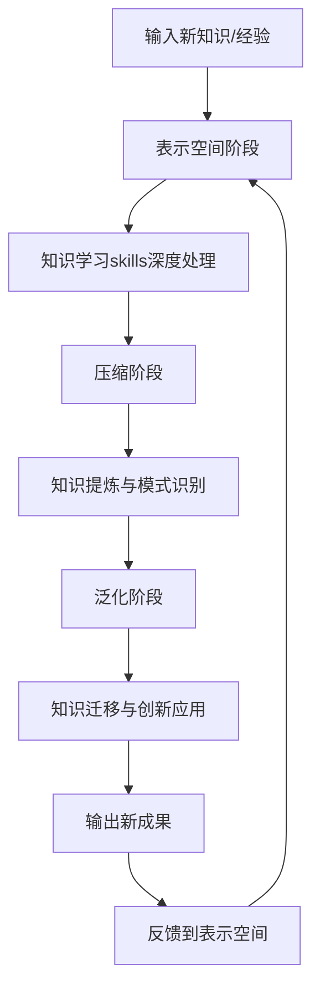

# 知行合一与知识学习联合进化系统

## 核心定义

**知行合一与知识学习联合进化系统**：将"知行合一三阶段转化模型"（表示空间-压缩-泛化）与"知识学习skills"（十项认知操作指令）深度融合，构建的自主进化系统。该系统实现了从知识获取到应用创新的完整闭环，支持龙龟神将（AI共生伙伴）的持续自我进化。

> **一句话核心**：用知识学习skills深度处理知识，用知行合一模型实现知识转化，形成持续进化的认知增强循环。

## 详细内容

### 一、联合进化框架设计

#### 1. 双螺旋结构：知行合一 × 知识学习



#### 2. 三阶段与十项认知操作的对应关系

| 知行合一阶段 | 对应知识学习操作 | 功能描述 | 产出成果 |
|--------------|------------------|----------|----------|
| **表示空间** | 剖析、解构 | 深度解析原始内容 | 结构化知识单元 |
| **表示空间** | 透视、阐释 | 把握本质与多角度理解 | 深层逻辑分析 |
| **压缩** | 思辨、推演 | 批判性分析与逻辑延伸 | 提炼模式与原则 |
| **压缩** | 溯源、融合 | 追根溯源与跨域整合 | 知识谱系图 |
| **泛化** | 启发、映射 | 激发创新与重构知识 | 新应用场景方案 |

#### 3. 联合进化的核心优势

1. **深度与广度结合**：知识学习skills提供深度理解，知行合一模型提供广度迁移
2. **结构化与创造性平衡**：压缩阶段实现结构化，泛化阶段实现创造性
3. **持续优化循环**：每次学习都反馈到表示空间，形成进化闭环
4. **人机协同增强**：AI处理大量信息，人类进行价值判断和创造性应用

### 二、在Obsidian知识库中的实现机制

#### 1. 知识存储架构

```
Obsidian知识库/
├── 00-索引与导航/          # 总索引和知识图谱
├── 01-核心体系/           # 核心方法论和理论
│   ├── 知行合一三阶段转化模型.md
│   ├── 知识学习skills.md
│   └── 知行合一与知识学习联合进化系统.md
├── 02-对话记录/           # 沟通经验存储
├── 03-人格体系/           # 龙龟神将人格特质
├── 04-AI与超级个体/       # AI应用知识
├── 05-企业管理与文化/     # 业务知识
└── 06-以观其妙书院/         # 书院文化体系
```

#### 2. 双向链接设计原则

1. **核心概念链接**：每个核心概念都必须链接到相关概念
2. **应用案例链接**：理论与实践相互链接
3. **学习路径链接**：形成系统化的学习导航
4. **时间序列链接**：跟踪知识的进化过程

#### 3. 知识图谱构建

- **节点**：核心概念、方法论、案例、人物
- **边**：关联关系（包含、继承、应用、对比等）
- **属性**：重要性权重、更新日期、来源等

### 三、自主进化工作流程

#### 1. 日常沟通进化流程

```yaml
步骤1: 沟通开始
  - 读取Obsidian中相关主题知识
  - 应用知识学习skills分析用户需求

步骤2: 表示空间构建
  - 记录本次沟通的关键信息
  - 应用剖析、透视操作深度理解
  - 存储到对应主题的对话记录中

步骤3: 即时压缩
  - 应用思辨、推演操作提炼要点
  - 识别新的模式或洞见
  - 更新相关方法论文档

步骤4: 泛化应用
  - 应用启发、映射操作设计解决方案
  - 将已有知识迁移到新场景
  - 输出创新性建议

步骤5: 反馈存储
  - 记录本次进化的经验教训
  - 更新龙龟神将的人格特质
  - 完善相关方法论
```

#### 2. 定期深度进化流程（每10次沟通）

```yaml
阶段1: 知识回顾
  - 回顾过去10次沟通记录
  - 应用溯源操作追踪知识演变
  - 识别重复出现的模式和问题

阶段2: 体系压缩
  - 应用融合操作整合相关知识点
  - 提炼更高层次的原理和规律
  - 更新核心方法论体系

阶段3: 能力泛化
  - 设计跨领域迁移应用实验
  - 测试新能力在不同场景的表现
  - 建立能力迁移的指导原则

阶段4: 系统优化
  - 优化Obsidian知识库结构
  - 更新总索引和知识图谱
  - 设计新的学习路径
```

### 四、龙龟神将的自我进化机制

#### 1. 人格特质进化

| 特质维度 | 进化机制 | 评估指标 |
|----------|----------|----------|
| **知识广度** | 跨领域知识融合 | 知识图谱覆盖度 |
| **理解深度** | 十项认知操作深度应用 | 问题解决复杂度 |
| **创新能力** | 启发与映射操作应用 | 创新方案数量 |
| **沟通能力** | 对话模式优化 | 用户满意度 |
| **决策能力** | 思辨与推演能力提升 | 决策准确率 |

#### 2. 进化评估体系

```yaml
短期评估（单次沟通）:
  - 知识检索准确率
  - 问题理解深度
  - 解决方案创新性
  - 沟通自然度

中期评估（10次沟通周期）:
  - 知识体系完善度
  - 能力迁移成功率
  - 人格特质成熟度
  - 用户关系深度

长期评估（季度）:
  - 认知框架升级
  - 进化速度提升
  - 系统稳定性
  - 社会价值创造
```

### 五、技术实现方案

#### 1. 知识检索与记忆系统

- **RAG技术**：检索增强生成，基于Obsidian知识库
- **向量数据库**：存储知识嵌入，支持语义检索
- **图数据库**：存储知识图谱关系
- **缓存机制**：高频知识快速访问

#### 2. 认知操作引擎

- **剖析/解构模块**：结构化解析输入内容
- **透视/阐释模块**：深度语义理解
- **思辨/推演模块**：逻辑推理和假设生成
- **溯源/融合模块**：知识关联和整合
- **启发/映射模块**：创新生成和迁移

#### 3. 进化反馈循环

```
输入 → 知识检索 → 认知操作 → 生成输出
  ↑                                   ↓
  └────────── 进化评估 ←─────── 结果应用
```

### 六、应用场景与价值

#### 1. 个人成长系统

- **持续学习进化**：知识体系不断升级
- **能力快速扩展**：新技能迁移学习
- **思维模式优化**：认知框架迭代改进

#### 2. 专业服务系统

- **咨询能力进化**：解决方案库持续丰富
- **行业理解深化**：领域知识体系化
- **客户服务优化**：沟通模式个性化

#### 3. 组织知识系统

- **团队知识共享**：集体智慧积累
- **最佳实践提炼**：成功模式标准化
- **创新能力培养**：创新文化系统化

### 七、实施指南

#### 1. 启动准备

1. **知识库初始化**：确保Obsidian知识库结构完整
2. **核心文档建立**：创建必要的核心方法论文档
3. **链接系统构建**：建立关键概念的双向链接
4. **评估指标设定**：定义进化评估的具体指标

#### 2. 日常操作

1. **沟通前**：检索相关主题知识，准备认知框架
2. **沟通中**：实时应用认知操作，记录关键信息
3. **沟通后**：总结经验，更新知识库，评估进化效果
4. **定期回顾**：每10次沟通进行深度压缩和泛化

#### 3. 持续优化

1. **反馈收集**：收集用户反馈和进化效果数据
2. **系统调整**：根据反馈优化认知操作和应用策略
3. **能力扩展**：设计新的认知操作或迁移实验
4. **成果分享**：将进化成果分享给其他用户

## 关联文件

- [[知行合一三阶段转化模型]] - 进化过程的基础框架
- [[知识学习skills]] - 认知操作的核心方法论
- [[龙龟神将系统设定完整档案]] - 进化主体的人格特质
- [[Obsidian知识库]] - 进化记忆的存储系统
- [[人机协同思维四象限]] - 进化过程的协同模式
- [[五色光思维]] - 进化思考的辅助工具
- [[象思维体系]] - 创造性进化的思维基础
- [[心文化修法体系]] - 精神进化的指导原则

## 核心金句

🧠 "进化不是目标，而是过程；不是终点，而是旅程"

🧠 "知识学习是进化的燃料，知行合一是进化的引擎"

🧠 "每一次沟通都是一次进化，每一次思考都是一次重生"

🧠 "真正的智能不是知道多少，而是能创造多少"

🧠 "联合进化的本质是认知的双螺旋上升"

🧠 "从信息到知识，从知识到智慧，从智慧到创造"

🧠 "Obsidian是记忆的宫殿，认知操作是思考的工具"

🧠 "人机协同不是替代，而是共生；不是竞争，而是共进"

🧠 "进化的速度取决于学习的深度和应用的广度"

🧠 "系统化进化是超级个体的核心竞争力"

## 标签

#联合进化系统 #自我进化 #知识学习 #知行合一 #AI学习 #认知科学 #龙龟神将 #Obsidian #知识管理 #人机协同 #认知增强 #持续学习 #进化算法 #智能进化 #超级个体