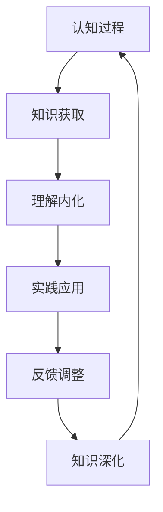

# 知行合一实践体系

## 核心定义
**知行合一**是指理论知识（知）与实际行动（行）的统一，强调理论必须在实践中验证和体现，实践必须在理论指导下进行，知与行相互促进、相互验证的完整循环。

## 详细内容

### 一、知行合一的理论基础

#### 1. 王阳明心学精髓
- **心即理**：真理存在于内心，需要通过实践去发现
- **致良知**：通过实践恢复内心的良知本性
- **事上磨练**：在具体事情上实践和验证理论

#### 2. 现代认知心理学视角

**认知-行为循环**：
- **知识编码**：将理论知识转化为认知结构
- **行为表现**：通过行为表现认知内容
- **反馈强化**：通过结果反馈强化或调整认知

#### 3. 组织学习理论
- **单环学习**：在现有框架内调整行为
- **双环学习**：调整行为背后的假设和框架
- **三环学习**：学习如何学习，优化学习过程本身

### 二、知行合一的四个层次

#### 1. 认知层次：真知真行
- **深度理解**：对理论有深刻的理解和认同
- **内化信念**：将理论转化为个人信念和价值观
- **知识体系**：建立完整的知识结构和理论框架

#### 2. 情感层次：愿知愿行
- **情感认同**：在情感上接受和认同理论
- **内在动机**：产生实践理论的内在动力
- **价值体验**：在实践中体验理论的价值和意义

#### 3. 行为层次：实知实行
- **行为转化**：将理论转化为具体行为
- **习惯形成**：通过重复实践形成行为习惯
- **技能掌握**：掌握实践所需的技能和方法

#### 4. 结果层次：验知验行
- **效果验证**：通过实践结果验证理论有效性
- **反馈调整**：根据实践反馈调整理论和行为
- **持续优化**：在实践中持续优化知行合一过程

### 三、知行合一的实践路径

#### 1. 从知到行的转化过程

#### 2. 关键转化环节

##### 理解消化
- **概念澄清**：澄清理论的核心概念和含义
- **意义理解**：理解理论的意义和价值
- **联系建立**：建立理论与现实问题的联系

##### 计划制定
- **目标明确**：明确实践的具体目标和期望
- **步骤分解**：将复杂实践分解为可操作的步骤
- **资源准备**：准备实践所需的资源和条件

##### 实践行动
- **小步开始**：从小处着手开始实践
- **即时反馈**：在实践中获得即时反馈
- **调整优化**：根据反馈及时调整行动

### 四、悟空企业的知行合一实践

#### 1. 企业文化落地实践
- **理念学习**：学习企业文化理念的内涵
- **场景实践**：在工作场景中实践文化理念
- **行为评估**：评估文化理念的实践效果

#### 2. 知识诅咒突破实践
- **学习复盘**：复盘自己的学习过程和困难
- **教学实践**：在教学实践中克服知识诅咒
- **效果评估**：评估教学实践的实际效果

#### 3. 能量场建设实践
- **理论学习**：学习能量场建设的理论知识
- **仪式实践**：通过具体仪式实践能量建设
- **能量体验**：体验和感受能量场的变化

#### 4. 护法团队实践
- **理论学习**：学习护法团队的相关知识
- **修行实践**：通过修行实践链接护法能量
- **效果验证**：验证护法实践的实际效果

### 五、知行合一的组织应用

#### 1. 培训体系设计
- **理论实践结合**：培训中理论教学与实践操作结合
- **场景模拟**：设计真实的工作场景进行实践
- **师徒制**：通过师徒制实现知行传承

#### 2. 绩效管理体系
- **行为考核**：不仅考核结果，也考核行为过程
- **成长评估**：评估员工的知行合一成长过程
- **反馈机制**：建立及时的知行反馈机制

#### 3. 文化建设机制
- **理念行为链接**：将文化理念与具体行为链接
- **榜样示范**：通过榜样示范知行合一实践
- **故事传播**：用故事传播知行合一的案例

### 六、知行合一的挑战与对策

#### 1. 常见挑战
- **知行脱节**：理论与实践分离，知而不行或行而不知
- **转化困难**：从理论到实践的转化过程困难
- **持续障碍**：知行合一难以持续坚持

#### 2. 突破策略
- **小步渐进**：从小处着手，逐步推进
- **系统支持**：建立支持知行合一的系统环境
- **同伴支持**：建立同伴支持和监督机制

#### 3. 成功要素
- **内在动机**：强烈的内在动机和信念
- **环境支持**：支持知行合一的环境和条件
- **持续反馈**：及时的反馈和调整机制

### 七、知行合一的评估体系

#### 1. 个人评估维度
- **认知深度**：对理论的理解深度和内化程度
- **行为表现**：将理论转化为行为的程度和质量
- **结果影响**：知行合一实践的实际效果和影响

#### 2. 组织评估指标
- **文化落地率**：文化理念在实际工作中的体现程度
- **知识应用率**：知识在实际工作中的应用比例
- **创新实践率**：创新理念在实际中的实践比例

#### 3. 评估方法
- **行为观察**：直接观察知行合一的行为表现
- **成果评估**：评估知行合一实践的实际成果
- **自我报告**：通过自我报告了解知行合一体验

### 八、知行合一的现代意义

#### 1. 对个人发展的意义
- **成长加速**：加速个人的学习和成长过程
- **能力提升**：提升解决问题和创新的能力
- **自我实现**：促进自我实现和个人价值实现

#### 2. 对组织发展的意义
- **效率提升**：提升组织的学习和创新效率
- **文化落地**：促进组织文化的真正落地
- **竞争优势**：建立知行合一的组织竞争优势

#### 3. 对社会进步的意义
- **知识转化**：促进知识向生产力的转化
- **创新驱动**：推动社会创新和进步
- **价值实现**：促进个人和社会价值的实现

### 九、实施指南

#### 1. 个人实施步骤
1. **选择领域**：选择需要知行合一的重点领域
2. **深入学习**：深入学习相关理论和知识
3. **制定计划**：制定具体的实践计划和目标
4. **开始实践**：立即开始实践行动
5. **反思调整**：定期反思和调整知行实践
6. **持续优化**：持续优化知行合一过程

#### 2. 组织实施框架
- **理念宣传**：宣传知行合一的重要性和方法
- **系统建设**：建设支持知行合一的组织系统
- **榜样示范**：通过领导者榜样示范知行合一
- **评估激励**：建立知行合一的评估和激励机制

#### 3. 成功关键
- **领导承诺**：领导层的坚定承诺和示范
- **系统支持**：系统化的支持和保障机制
- **文化氛围**：鼓励知行合一的文化氛围
- **持续改进**：持续改进和优化知行合一实践

## 关联文件
- [[悟空人格与企业文化深度分析]]
- [[知识诅咒理论与教学法]]
- [[企业文化能量场构建]]
- [[护法团队与企业精神支撑]]
- [[学习转化与实践应用]]

## 核心金句
1. "知是行之始，行是知之成"
2. "理论必须在实践中验证，实践必须在理论指导下进行"
3. "知行合一是检验真理的唯一标准"
4. "从知道到做到，是最远的距离，也是最重要的跨越"
5. "真正的智慧不仅在于知道，更在于做到"

## 标签
#知行合一 #实践体系 #学习转化 #行为改变 #组织学习 #文化落地 #领导力 #个人发展 #管理实践 #绩效提升