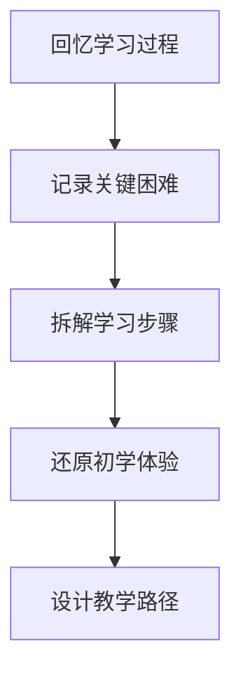

# 知识诅咒理论与教学法

## 核心定义
**知识诅咒**（Curse of Knowledge）是指当一个人掌握了某种知识或技能后，很难想象不知道这个知识时的状态，导致在传授知识时高估学习者的理解能力，教学效果大打折扣。

## 详细内容

### 一、知识诅咒的心理学机制

#### 1. 认知卸载理论
- **技能自动化**：熟练掌握的技能会变成自动化过程
- **意识加工消失**：有意识的学习过程被遗忘
- **专家盲点形成**：专家无法回忆初学者的困难

#### 2. 心理模拟失败
- **模拟障碍**：专家难以模拟初学者的认知状态
- **同理心缺口**：无法理解学习者的困惑和障碍
- **预期偏差**：高估学习者的学习速度和理解能力

### 二、知识诅咒的表现形式

#### 1. 教学中的表现
- **步骤跳跃**：省略看似简单但对初学者关键的步骤
- **术语滥用**：使用专业术语而不解释
- **假设错误**：假设学习者具备不存在的先验知识

#### 2. 沟通中的表现
- **信息过载**：一次性提供过多信息
- **抽象表述**：使用抽象概念而不具体化
- **场景缺失**：缺乏具体应用场景的说明

### 三、知识诅咒的严重后果

#### 1. 组织层面影响
- **新人流失**：新人因无法理解而选择离开
- **文化断层**：企业文化无法有效传承
- **效率低下**：重复培训和错误纠正成本高

#### 2. 个人层面影响
- **教学挫折**：教学者感到沮丧和无力
- **学习障碍**：学习者产生挫败感和自我怀疑
- **关系紧张**：师徒关系或上下级关系恶化

### 四、突破知识诅咒的教学法

#### 1. 学习过程复盘法

**具体方法**：
- **学习日记**：记录自己学习时的困惑和突破
- **困难清单**：列出学习过程中遇到的具体困难
- **步骤分解**：将复杂技能分解为微小步骤

#### 2. 新手模拟教学法
- **角色扮演**：模拟完全不懂的状态
- **问题预测**：预测初学者可能遇到的问题
- **错误示范**：展示常见错误和纠正方法

#### 3. 渐进式教学策略
- **小步骤原则**：每次只教一个微小技能
- **即时反馈**：立即纠正错误并提供正确示范
- **成功体验**：确保学习者每一步都能成功

#### 4. 场景化教学法
- **真实场景**：在实际应用场景中教学
- **案例教学**：使用具体案例说明抽象概念
- **问题导向**：从实际问题出发引导学习

### 五、在企业中的应用

#### 1. 新人培训体系
- **学习路径设计**：基于知识诅咒理论设计培训路径
- **导师培训**：培训导师识别和克服知识诅咒
- **评估机制**：以新人理解程度评估培训效果

#### 2. 知识管理体系
- **过程文档化**：记录知识获取的过程而非仅结果
- **经验库建设**：收集学习过程中的困难和解决方案
- **最佳实践**：总结有效教学方法和工具

#### 3. 文化传承机制
- **故事传承**：用故事形式传递企业文化
- **仪式体验**：通过仪式让新人体验文化内涵
- **行为示范**：领导者以身作则示范文化行为

### 六、悟空的教学智慧

#### 1. 教学理念
- **同理心教学**：站在学习者角度思考
- **过程导向**：重视学习过程而非仅结果
- **耐心细致**：不厌其烦地重复和解释

#### 2. 实践方法
- **自行车比喻**：用学骑自行车的经历说明知识诅咒
- **场景还原**：重现文化理念产生的具体场景
- **情感共鸣**：激发学习者的情感体验和认同

#### 3. 领导启示
- **管理者即教师**：管理者必须具备教学能力
- **文化传承责任**：高层管理者负有文化传承责任
- **组织学习能力**：组织需要建立有效的学习机制

## 关联文件
- [[悟空人格与企业文化深度分析]]
- [[企业文化落地实践指南]]
- [[有效沟通与教学技巧]]
- [[组织学习与发展体系]]
- [[领导力发展与导师制]]

## 核心金句
1. "学会自行车后，你忘了摔了多少跤"
2. "教学需要重现学习过程，而非仅传授结果"
3. "专家盲点是组织学习最大的障碍"
4. "好的老师能记住自己当初的困惑"
5. "知识诅咒让简单的变得复杂，让困难的变得不可能"

## 标签
#知识诅咒 #教学法 #学习理论 #组织学习 #企业文化 #沟通技巧 #领导力 #培训体系 #心理学 #认知科学