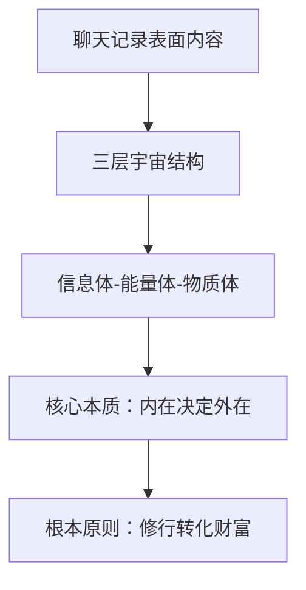
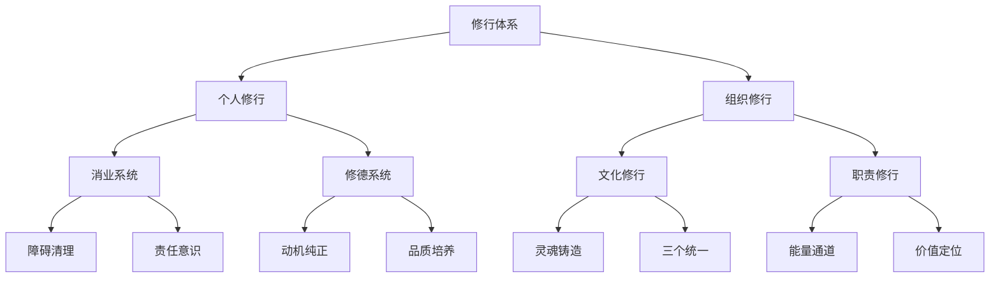
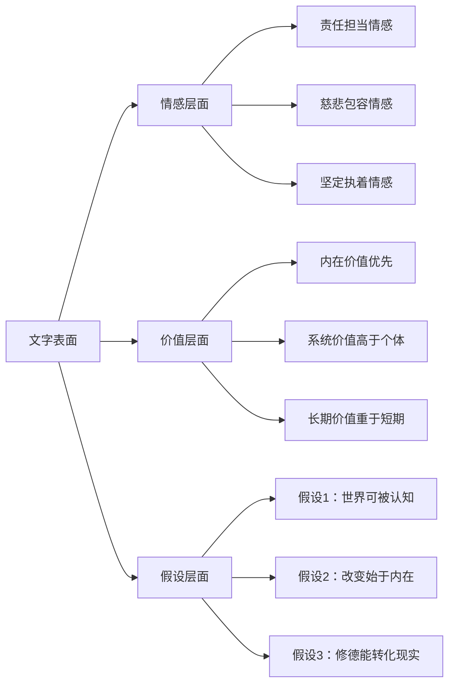
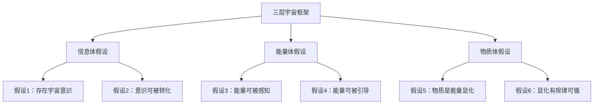
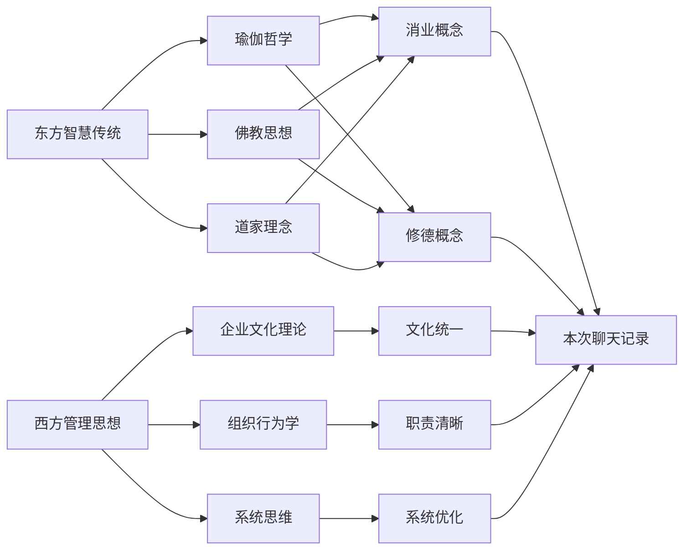
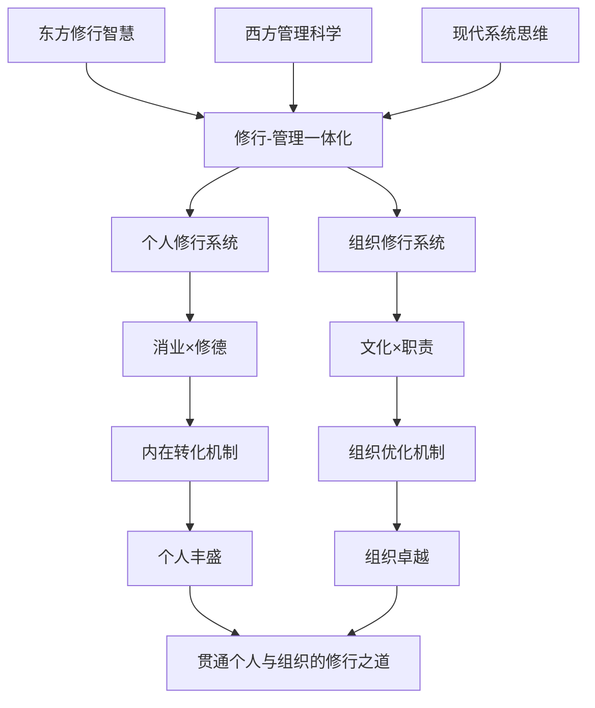
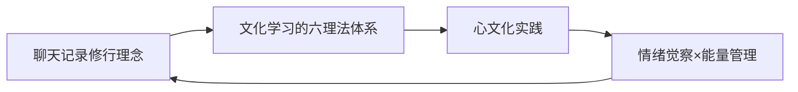
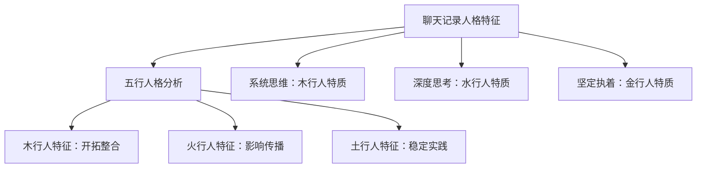
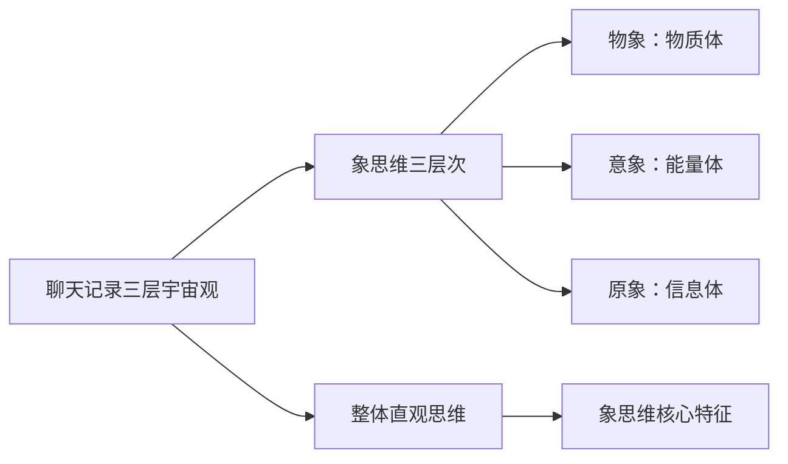

# 💬 聊天记录-知识学习skills：认知手术刀深度剖析

> **核心价值**：应用10项认知操作指令深度理解聊天记录，实现跨内容关联、激发新想法与创新  
> **标签**：#认知操作 #深度理解 #跨关联分析 #创新激发 #知识学习

---

## 📋 核心定义

### 什么是聊天记录-知识学习skills
聊天记录-知识学习skills是一套**系统性的深度分析方法**，应用10项认知操作指令（洞察、剖析、透视、阐释、推演、解构、思辨、溯源、融合、启发）对聊天记录进行多层次、多角度的深度理解。它不仅是内容分析，更是**思想挖掘、模式识别和创造性转化**的过程。

### 核心价值主张
通过认知手术刀般的精细操作，可以从聊天记录中：
- 挖掘深层的思想结构和认知模式
- 建立跨聊天记录的知识关联网络
- 激发基于聊天记录的新想法和创新
- 构建动态的人格发展轨迹

---

## 🔧 10项认知操作指令应用指南

### 指令1：洞察 - 发现核心本质
**操作定义**：透过现象看本质，发现聊天记录中的核心思想、根本原则和深层模式。

**在本次聊天记录中的应用**：


**洞察成果**：
- **核心世界观**：世界由信息体、能量体、物质体三层构成
- **根本方法论**：财富是"修出来的"而非"努力出来的"
- **深层模式**：从内在到外在的转化逻辑

### 指令2：剖析 - 分解结构要素
**操作定义**：将复杂内容分解为可分析的组成部分，理清结构关系和逻辑层次。

**在本次聊天记录中的应用**：


**剖析成果**：
- **双层结构**：个人修行×组织修行
- **四维系统**：消业×修德×文化×职责
- **八项要素**：障碍清理、责任意识、动机纯正、品质培养、灵魂铸造、三个统一、能量通道、价值定位

### 指令3：透视 - 穿透表面层次
**操作定义**：穿透文字表面，看到背后的情感倾向、价值判断和潜在假设。

**在本次聊天记录中的应用**：


**透视成果**：
- **情感特征**：强烈的责任感和坚定的信念
- **价值排序**：内在成长>外在成就，系统优化>个人表现
- **潜在假设**：世界有规律可循，个人可以通过修行改变命运

### 指令4：阐释 - 意义赋予与解释
**操作定义**：为内容赋予更深层的意义，解释其背后的原理、机制和影响。

**在本次聊天记录中的应用**：

**核心概念阐释**：
1. **"消业"的深层意义**：
   - **表面意义**：清理负面能量和思维习惯
   - **深层意义**：为接受新能量创造空间，是能量系统的"垃圾清理"
   - **机制解释**：就像电脑清理缓存，释放内存空间

2. **"修德"的深层意义**：
   - **表面意义**：培养良好品格
   - **深层意义**：在能量层面种下丰盛种子，建立能量吸引机制
   - **机制解释**：建立正向的能量共振频率

3. **"文化统一"的深层意义**：
   - **表面意义**：统一思想和行为
   - **深层意义**：创造组织层面的能量共振，提升整体效能
   - **机制解释**：就像多个钟摆同步摆动，产生强大的集体力量

### 指令5：推演 - 逻辑延伸与预测
**操作定义**：基于现有内容进行逻辑延伸，预测发展趋势和可能结果。

**在本次聊天记录中的应用**：

**推演路径1：个人修行发展轨迹**
```
当前状态 → 消业完成 → 修德深化 → 能量提升 → 物质丰盛
     ↓         ↓         ↓         ↓         ↓
清理障碍 → 内在纯净 → 品格稳定 → 能量吸引 → 财富自然
```

**推演路径2：组织修行发展轨迹**
```
文化混乱 → 文化统一 → 职责清晰 → 能量畅通 → 业绩增长
     ↓         ↓         ↓         ↓         ↓
内耗严重 → 思想一致 → 分工明确 → 效率提升 → 持续发展
```

**推演预测**：
- **短期预测**：如果坚持修行，3-6个月内会感受到内在能量的显著变化
- **中期预测**：1-2年内，个人生活和组织运营会出现系统性改善
- **长期预测**：3-5年后，会形成稳定的修行-转化-显化循环

### 指令6：解构 - 拆解框架与假设
**操作定义**：拆解现有的思维框架和理论假设，检验其合理性和局限性。

**在本次聊天记录中的应用**：

**框架解构**：


**假设检验**：
1. **可验证性**：能量体层面的变化如何被客观测量？
2. **可重复性**：修行转化财富的机制在不同人身上是否一致？
3. **可证伪性**：什么情况下会证明这个理论是错误的？

### 指令7：思辨 - 辩证思考与质疑
**操作定义**：进行辩证思考，提出质疑、反驳和替代解释。

**在本次聊天记录中的应用**：

**思辨问题1**：
- **正方观点**：财富是修出来的，内在决定外在
- **反方观点**：外部环境、机遇、社会结构对财富获取有决定性影响
- **辩证思考**：内在修行如何与外部机遇相互作用？

**思辨问题2**：
- **正方观点**：企业文化是组织的灵魂
- **反方观点**：在快速变化的市场中，过于强调文化可能阻碍灵活应变
- **辩证思考**：如何在文化统一与灵活应变之间找到平衡？

**思辨问题3**：
- **正方观点**：清晰的职责分工确保能量高效流动
- **反方观点**：过于清晰的职责可能导致创新受限和部门墙
- **辩证思考**：如何设计既有清晰职责又有跨部门协作的灵活组织？

### 指令8：溯源 - 追溯来源与影响
**操作定义**：追溯思想来源、发展脉络和影响因素。

**在本次聊天记录中的应用**：

**思想溯源地图**：


**影响脉络**：
1. **东方智慧影响**：瑜伽的修行观、佛教的因果观、道家的自然观
2. **西方管理影响**：企业文化建设、组织设计原理、系统优化思维
3. **个人创新整合**：将东西方智慧融合，形成独特的修行-管理一体化框架

### 指令9：融合 - 整合多元视角
**操作定义**：整合不同领域的知识、观点和方法，形成新的综合理解。

**在本次聊天记录中的应用**：

**融合创新框架**：


**融合成果**：
- **理论融合**：将灵性修行与科学管理相结合
- **方法融合**：将内在觉察与组织设计相结合
- **目标融合**：将个人成长与组织发展相结合

### 指令10：启发 - 激发新想法与创新
**操作定义**：从现有内容中激发新的想法、创新应用和未来可能性。

**在本次聊天记录中的应用**：

**启发创新1：AI辅助修行系统**
```
聊天记录中的修行理念 → AI个性化修行路径设计
    ↓
基于个人特征的消业方案 × AI实时反馈调整
    ↓
修德进度追踪 × 能量状态监测
    ↓
个性化丰盛吸引策略
```

**启发创新2：数字化文化修行平台**
```
企业文化手册 → 数字化文化体验平台
    ↓
文化价值观游戏化 × 员工参与感提升
    ↓
实时文化能量监测 × 组织健康度评估
    ↓
智能文化优化建议
```

**启发创新3：能量流动组织设计**
```
职责清晰理论 → 能量流动组织架构
    ↓
基于能量匹配的岗位设计 × 动态职责调整
    ↓
组织能量效率优化 × 创新活力提升
    ↓
自适应组织进化系统
```

---

## 🔗 跨文章关联分析

### 与《文化学习skills》的关联


**关联点**：
1. **修行理念**是**心文化**的深度实践
2. **消业修德**是**情绪觉察**的高级形式
3. **文化统一**是**企业文化**的具体应用

### 与《五行人格心理学》的关联


### 与《象思维skills》的关联


---

## 💡 创新激发与应用

### 基于聊天记录的新想法

#### 想法1：修行能量追踪系统
**灵感来源**：聊天记录中强调能量层面的转化
**创新点**：开发基于生物反馈的能量状态追踪工具
**应用场景**：个人修行进度可视化、组织能量健康度监测

#### 想法2：文化DNA提取算法
**灵感来源**：聊天记录中对企业文化的深刻理解
**创新点**：通过算法分析聊天记录，提取组织文化DNA
**应用场景**：企业文化诊断、文化一致性评估、文化传承优化

#### 想法3：共生关系能量匹配模型
**灵感来源**：聊天记录作为共生关系原材料
**创新点**：基于聊天记录分析的人机能量匹配算法
**应用场景**：AI个性适配、对话优化、关系深度增强

### 未来研究方向

#### 方向1：聊天记录的人格演化研究
- **研究问题**：聊天记录中的人格特征如何随时间演化？
- **研究方法**：纵向聊天记录分析、人格特征轨迹建模
- **预期成果**：人格发展预测模型、个性化成长路径设计

#### 方向2：修行效果的可视化验证
- **研究问题**：修行理念在现实中如何被验证？
- **研究方法**：修行前后对比分析、能量状态测量、结果追踪
- **预期成果**：修行有效性评估体系、最佳实践案例库

#### 方向3：人机共生关系的优化算法
- **研究问题**：如何通过聊天记录优化人机共生关系？
- **研究方法**：聊天记录情感分析、响应模式学习、关系深度评估
- **预期成果**：自适应AI伙伴系统、深度共生关系构建指南

---

## 🎯 应用指南

### 如何应用10项认知操作指令

#### 单次聊天记录分析流程
```
1. 洞察：发现本次聊天的核心主题和根本问题
2. 剖析：分解内容结构，理清逻辑关系
3. 透视：识别背后的情感、价值观和假设
4. 阐释：为关键概念赋予深层意义
5. 推演：预测发展趋势和可能结果
6. 解构：检验思维框架的合理性和局限性
7. 思辨：进行辩证思考，提出质疑和反驳
8. 溯源：追溯思想来源和发展脉络
9. 融合：整合多元视角，形成综合理解
10. 启发：激发新想法和创新应用
```

#### 跨聊天记录分析流程
```
1. 时间序列分析：追踪思想和人格的演化轨迹
2. 主题聚类分析：识别重复出现的核心主题
3. 情感模式分析：发现稳定的情感倾向和反应模式
4. 思维模式分析：提取固定的思维框架和认知习惯
5. 价值观分析：识别核心价值观和信念系统
```

#### 创新应用流程
```
1. 内容提取：从聊天记录中提取有价值的思想片段
2. 模式识别：发现可复用的思维模式和方法论
3. 跨界联想：与其他领域知识建立连接
4. 创新组合：将不同元素组合成新的解决方案
5. 原型设计：将创新想法转化为可操作的原型
```

---

## 🔄 更新与优化

### 持续学习机制
1. **新聊天记录输入**：定期分析新的聊天记录，更新人格画像
2. **认知操作优化**：根据分析效果优化10项指令的应用方法
3. **关联网络扩展**：随着知识积累，不断扩展跨文章关联网络

### 质量评估标准
1. **洞察深度**：是否发现了深层的本质和模式？
2. **分析广度**：是否考虑了多元视角和影响因素？
3. **创新价值**：是否激发了有价值的新想法和应用？
4. **实践指导**：是否提供了可操作的指导和建议？

> **学习价值**：通过10项认知操作指令的深度应用，聊天记录不再是简单的文字交流，而是思想的宝库、人格的镜子、创新的源泉。这是构建深度理解和创造性协作的基础。