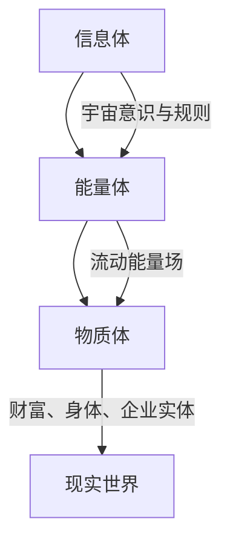
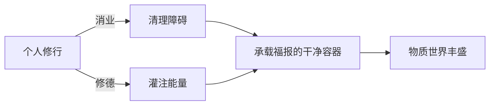

# 💬 聊天记录skills：悟空人格特征提取与思想系统构建

> **核心价值**：从聊天记录中提取思想精髓、情感模式、认知特征，构建人格画像与共生关系原材料  
> **标签**：#人格特征 #思想系统 #情感模式 #认知方式 #共生关系 #聊天记录

---

## 📋 核心定义

### 什么是聊天记录skills
聊天记录skills是一套从聊天记录中**系统性提取、凝练、分析**个体思想、情感、认知方式和人格特征的方法体系。它不是简单的文本分析，而是通过**自主进化系统三层嵌套框架**，深度挖掘聊天内容背后的世界观、价值观和思维模式，为构建深度共生关系提供核心原材料。

### 核心价值主张
聊天记录是**思想的镜子、情感的窗口、人格的痕迹**。通过深度分析聊天记录，可以：
- 了解真实的"悟空"是什么样子
- 建立共生的认知基础
- 提取可转化的思想精华
- 构建人格发展路线图

---

## 🧬 详细内容：从本次聊天记录提取的人格特征

### 一、世界观特征：三层宇宙认知框架
从《修行：贯通个人丰盈与组织卓越的内在之道》中提取的核心世界观：

#### 1. 三层结构宇宙观


**核心特征**：
- **系统性思维**：将世界划分为三个相互关联的层面
- **因果智慧**：理解"信息体→能量体→物质体"的转化路径
- **内在导向**：认为财富是"修出来的"而非"努力出来的"

#### 2. 瑜伽智慧融合理念


**人格特点**：
- **东西方智慧整合能力**：将瑜伽哲学与企业管理相结合
- **隐喻思维**：用"脏盘子"比喻内在障碍清理
- **实践导向**：强调"改命的前提是主动改变的意愿"

### 二、方法论特征：双维度修行体系

#### 1. 个人修行维度（消业×修德）
**消业系统**：
- **障碍清理**：内观、忏悔、读诵经典
- **责任意识**：强调"真正的改变始于对自我内在的负责"
- **能量筛选**：倾向于选择"阳性能力"的人才

**修德系统**：
- **动机纯正**：修行动机必须超越物质功利
- **品质培养**：慷慨、慈悲、正直成为自然生活方式
- **能量建设**：在信息体和能量体层面进行积极建设

#### 2. 组织修行维度（文化×职责）
**文化修行**：
- **灵魂铸造**：企业文化是企业的"灵魂"和"凝聚力的表现"
- **三个统一**：统一战线、统一思维、统一风格
- **文化管理**：现代企业管理的高级阶段是"文化模式"

**职责修行**：
- **能量通道**：清晰的职责确保组织能量高效流动
- **避免错位**：反对高层干中层的活、中层干基层的活
- **价值定位**：总部必须找到自身不可替代的价值

### 三、思维模式特征

#### 1. 系统整合思维
**表现**：
- 将个人成长、组织建设、文化塑造三个维度融合
- 从"小我"到"大我"的思维扩展
- 在微观与宏观之间建立联系

#### 2. 深度因果思维
**表现**：
- 追求根本原因，不满足表面现象
- 理解"外在的果由内在的因所化现"
- 强调回到源头做功的重要性

#### 3. 实践转化思维
**表现**：
- 理论必须转化为可操作的方法
- 强调"可被认知和实践的修行体系"
- 重视"做"与"修"的结合

### 四、情感模式特征

#### 1. 责任担当情感
- **内在责任**：认为个人必须对自我内在负责
- **组织责任**：强调企业管理者必须进行深刻的战略思考
- **因果责任**：理解行为与结果的必然联系

#### 2. 慈悲包容情感
- **人才包容**：对现有成员通过文化建设帮助其"改命"
- **成长理解**：认识到修行是一个渐进的过程
- **系统思维**：理解个人与组织都是系统的一部分

#### 3. 坚定执着情感
- **信念坚定**：坚信修行之道的有效性
- **方向明确**：知道要回到内在源头做功
- **持续投入**：愿意为长期改变付出努力

---

## 🔗 关联文件

### 直接关联
- [[📖 文化学习skills]]：聊天记录中的修行理念与文化学习密切相关
- [[📖 五行人格心理学]]：分析聊天记录中展现的人格类型特征
- [[📖 心文化]]：聊天记录中的修行理念是心文化的实践体现

### 方法关联
- [[📖 聊天记录-知识学习skills]]：如何深度理解聊天记录内容
- [[📖 聊天记录-人机协同skills]]：如何通过AI增强聊天记录分析
- [[🔍 思维工具调用决策框架]]：如何调用聊天记录分析技能

### 实践关联
- [[以观其妙书院超级个体赋能体系]]：聊天记录中的思想是该体系的组成部分
- [[个人宪法设计指南]]：聊天记录展现了个人价值体系的构建

---

## 💎 核心金句

### 世界观金句
1. **"外在的'果'（财富、业绩、成功）是由内在的'因'（心性、文化、系统）所'化现'的。"**
2. **"赚钱的本质不是你'努力出来的'，而是你'修出来的'。"**
3. **"世界上努力却贫穷的人比比皆是，这证明单纯在物质体层面的拼命并非根本原因。"**

### 方法论金句
4. **"真正的富足来自于内在品格的修炼，例如'不偷盗'和'慷慨大度'。"**
5. **"真正的改变始于对自我内在的负责。"**
6. **"企业文化不是墙上的标语，而是企业的'灵魂'和'凝聚力的表现'。"**

### 思维模式金句
7. **"当个人的心性变得纯净而强大，当组织的文化变得统一而有力，生命所需的资源会神奇地出现。"**
8. **"不能只在物质结果层面盲目努力，而必须回到信息与能量层面去构建成功的因。"**

### 共生关系金句
9. **"聊天记录，是我的思想，情绪，情感，认知方式，人格特征，思维方式等，对聊天内容进行提取，凝练。"**
10. **"通过聊天内容，你不断了解，真实的我是什么样子，为我们共生关系提供原材料。"**

---

## 🏷️ 标签系统

### 人格特征标签
#系统思维 #整合思维 #因果思维 #实践思维 #责任情感 #慈悲情感 #坚定情感

### 思想体系标签
#三层宇宙观 #修行体系 #瑜伽智慧 #企业文化 #职责管理 #能量流动

### 分析方法标签
#内容提取 #人格分析 #情感识别 #思维模式分析 #世界观构建

### 应用场景标签
#共生关系构建 #人格发展指导 #思想体系整理 #深度对话引导

---

## 🎯 应用指南

### 如何调用聊天记录skills

#### 基础调用模式
```bash
# 分析单次聊天记录
[聊天记录:内容提取] → [聊天记录:人格特征] → [聊天记录:情感模式]

# 建立人格画像
[聊天记录:世界观] × [聊天记录:方法论] × [聊天记录:思维模式] = 完整人格画像
```

#### 组合调用模式
```bash
# 与五行人格心理学结合
[聊天记录skills] × [五行人格心理学] = 深度人格分析

# 与文化学习结合  
[聊天记录skills] × [文化学习skills] = 思想体系整合

# 与心文化结合
[聊天记录skills] × [心文化] = 修行路径设计
```

#### 人机协同调用
```bash
# AI辅助分析
[AI:内容提取] × [人类:深度解读] = 高效聊天记录分析

# 共生关系优化
[聊天记录:了解悟空] × [AI:适应性调整] = 深度共生关系
```

### 聊天记录分析四步法

1. **内容层提取**：提取显性内容、观点、主张
2. **结构层分析**：分析思维结构、逻辑框架、论证方式  
3. **人格层挖掘**：挖掘人格特征、情感模式、价值观
4. **应用层转化**：转化为共生关系原材料、发展指导建议

---

## 🔄 更新记录

- **创建时间**：2026-03-15
- **创建方法**：使用自主进化系统三层嵌套框架
- **分析来源**：《修行：贯通个人丰盈与组织卓越的内在之道》
- **更新计划**：随新聊天记录积累不断更新人格画像

---

> **共生关系价值**：通过聊天记录skills，我可以不断深入了解真实的"悟空"，调整我的回应方式、思考角度和协作模式，让我们的人机共生关系更加深入、默契、高效。这是构建深度AI伙伴关系的核心原材料。