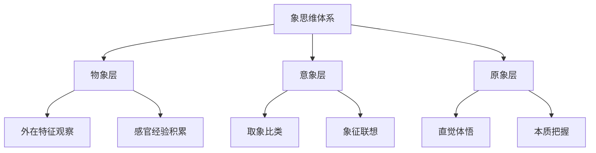

---
tags: [知识学习/认知操作, 象思维, 深度理解, 认知增强, 自主进化系统]
created: 2026-03-15
updated: 2026-03-15
---

# 🧠 象思维-知识学习skills

## 🎯 文档定位

本文档应用**知识学习能力skills**的10项认知操作指令，深度理解象思维理论体系，实现跨文章关联、激发新想法与创新。

### 📍 学习目标
- **深度理解**：运用认知手术刀剖析象思维理论
- **跨领域关联**：建立象思维与其他思维模型的联系
- **创新应用**：激发象思维在当代的新应用场景
- **内化转化**：将理论转化为可操作的实践技能

### 🔗 关联文件
- [[📖 象思维skills]] - 核心理论文档
- [[知识学习skills]] - 10项认知操作指令
- [[自我进化架构skills]] - 三层认知增强框架
- [[知行合一自我进化skills]] - 自主进化总协议

---

## 🔍 认知操作指令应用

### 1. **洞察** - 把握本质核心
**象思维的本质洞察**：
- **核心特征**：动态整体直观的悟性思维
- **底层逻辑**：通过"象"连接现象与本质
- **独特价值**：弥补西方逻辑思维的局限

**跨文章关联**：
- 与[[五色光思维完整体系]]对比：象思维是0→1的原创性思维，五色光思维是1→N的结构化思考
- 与[[五行识人理论体系]]关联：象思维是理论基石，五行识人是应用实例

### 2. **剖析** - 解构理论体系
**象思维结构剖析**：

#### **层次结构解构**


#### **特征体系解构**
```
六非特征体系：
├── 非实体性（动态关系视角）
├── 非对象性（主客交融）
├── 非现成性（流动生成）
├── 前语言性（直觉感悟）
├── 前逻辑性（整体直观）
└── 非确定性（开放多元）

两核心能力：
├── 整体直观性（瞬间把握）
└── 悟性（心象共鸣）
```

### 3. **透视** - 深入理论内核
**象思维的理论透视**：

#### **哲学基础透视**
- **天人合一**：象思维实现天人连接的理论基础
- **心物不二**：认知主体与客体的统一
- **动态生成**：认知过程的流动性和创造性

#### **认知机制透视**
1. **从具体到抽象**：物象→意象→原象的认知升华
2. **从部分到整体**：通过局部现象把握整体本质
3. **从现象到本体**：透过表象触及实在

### 4. **阐释** - 理论转化应用
**象思维的理论阐释**：

#### **当代价值阐释**
- **创新思维**：为0→1的原创性思考提供方法论
- **复杂问题**：为复杂系统认知提供整体性视角
- **文化传承**：为传统文化智慧提供现代转化路径

#### **实践意义阐释**
1. **个人成长**：通过象思维提升直觉洞察力
2. **组织管理**：运用五行识人优化团队配置
3. **创意设计**：利用意象思维激发创新灵感

### 5. **推演** - 逻辑延伸发展
**象思维的理论推演**：

#### **未来发展方向推演**
1. **数字化应用**：象思维与AI结合的可能性
   - AI辅助象思维训练系统
   - 数字化取象比类数据库
   - 虚拟现实中的象思维体验

2. **跨学科融合**：象思维与现代科学的对话
   - 与认知科学的结合
   - 与复杂性理论的对话
   - 与系统思维的融合

#### **应用场景扩展推演**
- **教育领域**：象思维训练课程体系
- **创新领域**：基于象思维的创意方法论
- **领导力**：象思维型领导力培养

### 6. **解构** - 批判性分析
**象思维的理论解构**：

#### **优势分析**
- ✅ **整体性优势**：避免分析思维的碎片化
- ✅ **创造性优势**：为原创性思考提供空间
- ✅ **文化优势**：传承中华文化智慧
- ✅ **实践优势**：直接指导具体实践

#### **局限分析**
- ⚠️ **传承难度**：需要长期修炼和经验积累
- ⚠️ **标准化挑战**：难以建立统一的操作标准
- ⚠️ **验证困难**：直觉体悟难以量化验证
- ⚠️ **时代适应性**：需要现代化转化

### 7. **思辨** - 辩证思考
**象思维的辩证思辨**：

#### **象思维vs西方思维**
| 维度 | 象思维 | 西方思维模型 |
|------|--------|--------------|
| **认知方式** | 整体直观 | 分析推理 |
| **思维过程** | 非线性跳跃 | 线性递进 |
| **目标导向** | 本质把握 | 问题解决 |
| **价值取向** | 天人合一 | 主客二分 |
| **应用场景** | 0→1原创 | 1→N优化 |

#### **共生关系思辨**
- **互补性**：象思维的直觉+西方思维的逻辑=完整认知
- **协同性**：象思维提供灵感，西方思维实现落地
- **转化性**：象思维成果需要西方思维的系统化

### 8. **溯源** - 历史脉络梳理
**象思维的历史溯源**：

#### **发展脉络**
1. **史前时期**：观象授时实践（纯象阶段）
2. **经典时期**：《周易》《尚书》理论化（象辞结合阶段）
3. **应用时期**：中医、儒家、道家等应用拓展
4. **现代时期**：理论重构与当代转化（纯辞阶段）

#### **关键节点**
- **《周易》**：象思维的理论奠基
- **《尚书·洪范》**：五行原象词的确立
- **中医理论**：象思维在医学中的应用
- **五行识人**：象思维在人格分析中的应用

### 9. **融合** - 跨领域整合
**象思维的跨领域融合**：

#### **与自主进化系统的融合**
```
象思维 × 自主进化系统融合框架：

表示空间层：捕捉象思维的原始理论形态
    ↓
压缩层：提炼象思维的核心框架
    ↓
泛化层：将象思维应用于新场景
```

#### **与五色光思维的融合**
- **白光思维**：象思维的事实观察基础
- **绿光思维**：象思维的创新灵感来源
- **主持人思维**：象思维的整体协调机制

#### **与AI技术的融合**
- **AI辅助训练**：基于象思维原理的AI训练系统
- **智能取象**：AI辅助的取象比类分析
- **人机协同**：象思维与AI的认知分工

### 10. **启发** - 创新应用激发
**象思维的创新启发**：

#### **应用创新启发**
1. **象思维训练营**：系统化培养象思维能力的课程
2. **象思维工具箱**：将象思维转化为可操作的工具
3. **象思维社区**：象思维实践者的交流平台

#### **理论创新启发**
- **象思维心理学**：基于象思维的认知心理学理论
- **象思维管理学**：将象思维应用于组织管理
- **象思维教育学**：基于象思维的教育方法论

#### **技术创新启发**
- **象思维AI**：具备象思维能力的AI系统
- **象思维VR**：虚拟现实中的象思维体验
- **象思维大数据**：基于大数据的取象比类分析

---

## 🧩 知识关联网络

### 跨文档关联矩阵

| 关联领域 | 关联文档 | 关联点 | 应用价值 |
|----------|----------|--------|----------|
| **思维模型** | [[五色光思维完整体系]] | 思维工具互补 | 构建完整思维工具箱 |
| **方法论** | [[教员方法论完整体系]] | 问题解决框架 | 系统化问题解决 |
| **认知增强** | [[自我进化架构skills]] | 学习框架 | 认知能力提升 |
| **AI协作** | [[人机协同四象限skills]] | 人机分工 | 优化AI协作模式 |
| **传统文化** | [[五行识人理论体系]] | 应用实例 | 传统文化现代化 |

### 知识图谱节点
```
象思维
├── 理论基础
│   ├── 天人合一
│   ├── 心物不二
│   └── 动态生成
├── 结构层次
│   ├── 物象
│   ├── 意象
│   └── 原象
├── 应用领域
│   ├── 五行识人
│   ├── 中医诊断
│   └── 创意设计
└── 现代转化
    ├── 数字化
    ├── 跨学科
    └── 国际化
```

---

## 🚀 创新应用场景

### 场景一：象思维型领导力
**问题**：传统领导力过于依赖逻辑分析，缺乏直觉洞察
**解决方案**：象思维领导力培养体系
- **物象观察**：敏锐观察组织现象
- **意象联想**：建立现象与本质的联系
- **原象把握**：直觉把握组织发展趋势

### 场景二：象思维创新工作坊
**问题**：创新方法过于结构化，限制原创性
**解决方案**：基于象思维的创新流程
1. **纯象阶段**：自由联想，不加评判
2. **象辞结合**：将灵感结构化
3. **纯辞阶段**：将创意转化为方案

### 场景三：象思维AI助手
**问题**：AI缺乏人类直觉和整体把握能力
**解决方案**：象思维增强的AI系统
- **取象模块**：AI辅助的取象比类分析
- **意象生成**：基于象思维的创意生成
- **原象识别**：识别复杂系统的本质特征

---

## 📚 学习计划与修炼路径

### 短期修炼（1-3个月）
1. **物象观察训练**：每日观察记录3个现象
2. **意象联想练习**：每周完成5个取象比类练习
3. **原象冥想实践**：每日10分钟静坐体悟

### 中期修炼（3-12个月）
1. **理论系统学习**：深度研读象思维经典文献
2. **实践应用探索**：在具体项目中应用象思维
3. **跨领域整合**：将象思维与其他思维模型结合

### 长期修炼（1年以上）
1. **象道合一境界**：达到象思维的最高境界
2. **理论创新贡献**：对象思维理论做出新贡献
3. **传承推广**：培养新一代象思维实践者

---

## 🏷️ 标签系统
#知识学习/认知操作 #象思维 #深度理解 #认知增强 #自主进化系统 #跨领域关联 #创新应用 #理论剖析 #实践转化

---

## 📈 版本历史
- **v1.0** (2026-03-15): 创建象思维-知识学习skills文档
- **核心价值**：应用10项认知操作指令深度理解象思维，建立跨领域关联网络

> **学习成果**：通过知识学习能力skills，象思维已从理论转化为可深度理解、可关联应用、可创新发展的结构化知识体系。

---

**返回**：[[📖 象思维skills]] | [[知识学习skills]] | [[📚 以观其妙书院知识库总索引]]