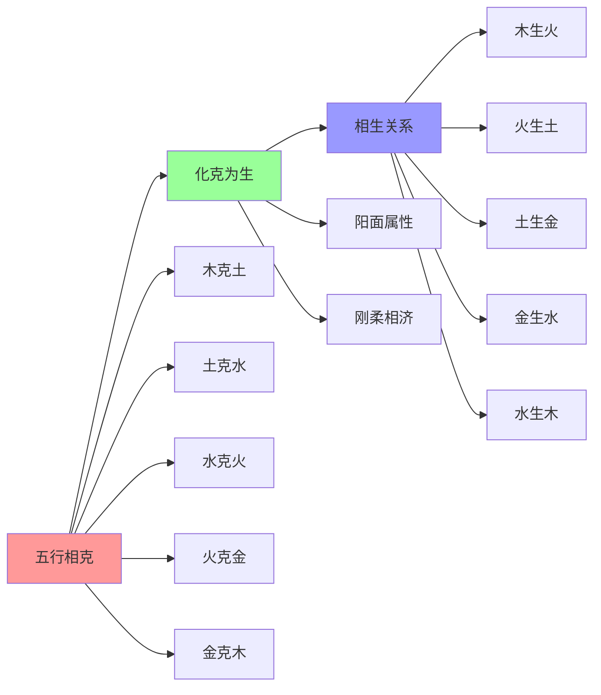
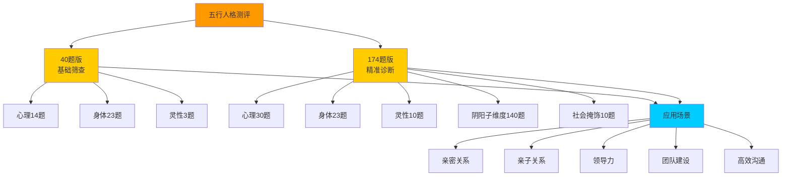
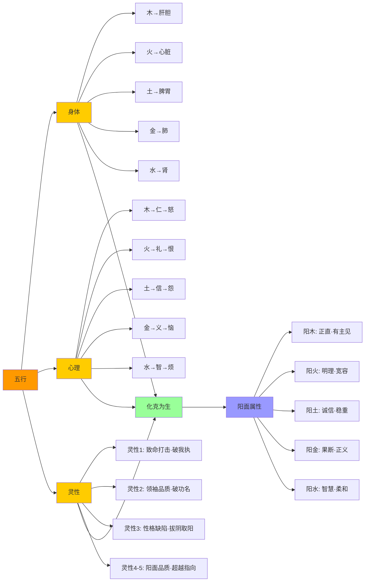
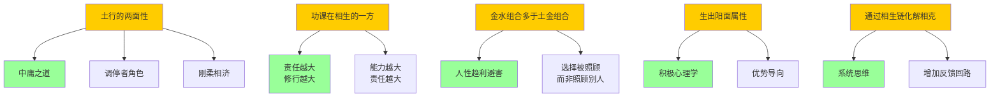

# 09第九章 化克为生 - 知识图谱

> **知识图谱版本**: 1.0 | **创建日期**: 2026-05-25 | **作者**: 悟空

---

## 一、理论关系图谱

**图谱解读**：
1. **五行相克**是问题，**化克为生**是解决方案
2. **化克为生**的三大路径：相生关系、阳面属性、刚柔相济
3. **相生关系**是转化的具体操作路径

---

## 二、测评对比图谱

**图谱解读**：
1. **40题版**：快速筛查，适合初步了解
2. **174题版**：精准诊断，包含阴阳子维度和信度检验
3. **应用场景**：测评的目的是为了应用，而非贴标签

---

## 三、身心关系图谱

**图谱解读**：
1. **五行**是连接身体、心理、灵性的桥梁
2. **身心一体**：身体疾病（相克）与心理情绪（阴面）密切相关
3. **化克为生**：通过生出阳面属性，可以同时改善身体、心理、灵性

---

## 四、隐秘联系图谱

**图谱解读**：
1. **表面**是五行理论，**深层**是普世智慧
2. **土行的两面性** = 中庸之道（儒家）
3. **功课在相生的一方** = 责任越大，修行越大（佛教）
4. **金水组合多于土金组合** = 人性趋利避害（心理学）
5. **生出阳面属性** = 优势导向（积极心理学）
6. **通过相生链化解相克** = 系统思维（系统论）

---

## 五、双向链接索引

### 5.1 核心链接
- [[09第九章 化克为生-深度学习与知识图谱]] - 主文档
- [[东西方心理学的殊途同归]] - 对比东西方心理学
- [[五行人格测评题·完整题库与计分体系]] - 测评工具
- [[五行人格心理学]] - 理论体系
- [[凤脑OS]] - 知识地基

### 5.2 应用链接
- [[味藏店长龙爪]] - 土行两面性的应用
- [[五行信任模型]] - 信任建立需要相生
- [[凤心OS]] - 快思考执行引擎

---

## 六、知识应用场景

### 6.1 亲密关系
- **问题**：夫妻五行相克，经常吵架
- **分析**：可能是"木克土"（丈夫木行，妻子土行）
- **化解**：妻子（土）生出阳金（果断、原则），形成"土生金"，丈夫（木）畏金（金克木）
- **结果**：夫妻关系改善，从相克变为相生

### 6.2 领导力
- **问题**：领导（金行）过于苛刻，员工（木行）气不舒
- **分析**：金克木，木行人被束缚
- **化解**：领导（金）尊重员工（木）的个性，员工（木）生出阳火（热情、行动），形成"木生火"
- **结果**：团队氛围改善，员工积极性提高

### 6.3 自身修炼
- **问题**：自己（土行）固执己见，抑郁不乐（土克水）
- **分析**：阴土 + 阴水，阳气下凝
- **化解**：生出阳金（义气、果断），转为"土生金，金生水"
- **结果**：心情舒畅，身体好转

---

## 七、核心金句（跨文档链接）

1. **"化克为生：将相克之苦转化为相生之乐"** → [[09第九章 化克为生-深度学习与知识图谱#一、核心摘要]]
2. **"土行人可以表现阴柔一面，也可以表现阳刚一面"** → [[09第九章 化克为生-深度学习与知识图谱#二、详细内容学习]]
3. **"功课永远在相生的一方"** → [[09第九章 化克为生-深度学习与知识图谱#二、详细内容学习]]
4. **"生出阳面属性，打破阴面循环"** → [[09第九章 化克为生-深度学习与知识图谱#二、详细内容学习]]
5. **"刚柔相济，才能化克为生"** → [[09第九章 化克为生-深度学习与知识图谱#一、核心摘要]]

---

## 八、后续研究方向

1. **量化研究**：开发"化克为生"的测评工具
2. **案例研究**：收集真实的亲密关系、领导力案例
3. **跨文化研究**：比较东西方在"化克为生"方面的异同
4. **神经科学研究**：探索"生出阳面属性"的神经机制
5. **AI应用**：开发基于"化克为生"的AI心理咨询系统

---

**图谱结束**

*本文档是《09第九章 化克为生》的知识图谱，包含理论关系、测评对比、身心关系、隐秘联系四大图谱，以及双向链接索引、应用场景和核心金句。*
