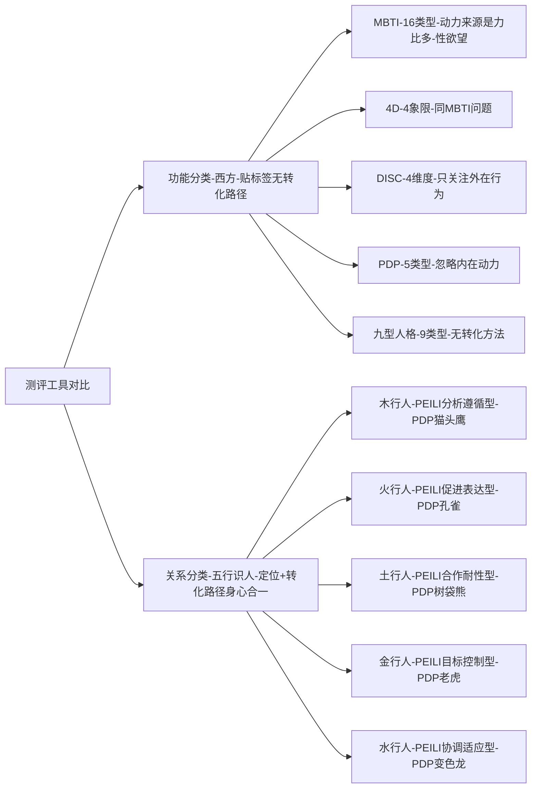
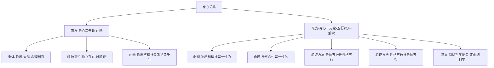
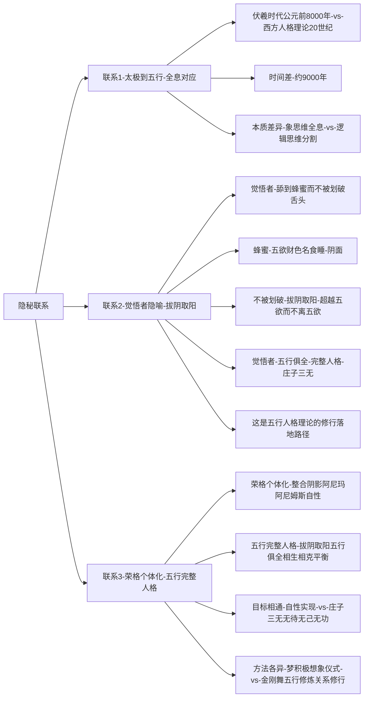
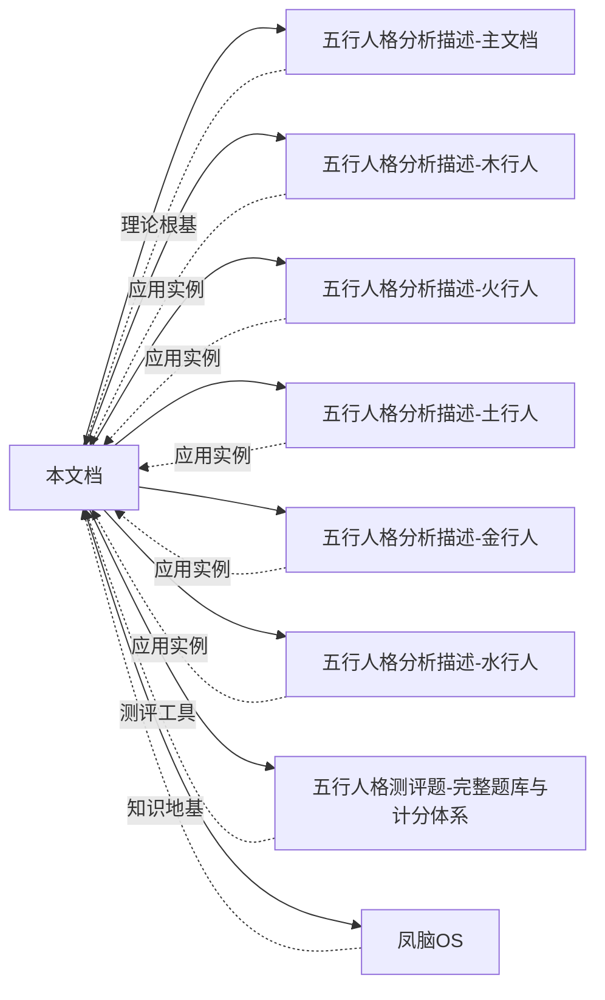

# 东西方心理学的殊途同归 - 知识图谱

> **图谱类型**：理论关系图谱 | **创建时间**：2026-05-25 | **维护者**：龙龟神将

---

## 一、核心理论关系图谱

```mermaid
graph TD
    A[东西方心理学整合] --> B[东方心理学-整体全息]
    A --> C[西方心理学-分割量化]
    
    B --> B1[太极阴阳模型]
    B1 --> B11[太极-每个人都是统一生命体]
    B1 --> B12[两仪-阴阳分类强健vs软弱]
    B1 --> B13[四象-四类人格少阳太阳少阴老阴]
    B1 --> B14[五行-五类人格木火土金水]
    
    B --> B2[黄帝内经人格思想]
    B2 --> B21[五态人-从态入手性格特征]
    B2 --> B22[五形人-从形入手形色音貌体型]
    B2 --> B23[重要发现-五态与五形异曲同工]
    
    B --> B3[五行识人-悟空创立]
    B3 --> B31[六大优势-科学性完备性系统性简约性实用性身心合一]
    B3 --> B32[关系分类-vs西方功能分类]
    B3 --> B33[有转化路径-vs西方无转化方法]
    
    C --> C1[六大人格理论]
    C1 --> C11[特质论-量化可测量但无动力关系]
    C1 --> C12[生物学理论-遗传体型气质关联]
    C1 --> C13[精神分析论-潜意识本我自我超我]
    C1 --> C14[行为主义理论-环境决定否定遗传]
    C1 --> C15[人本主义-自愈功能自我实现]
    C1 --> C16[认知理论-认知结构预期建构]
    
    C --> C2[四大测评工具]
    C2 --> C21[MBTI-荣格理论4维度16类型]
    C2 --> C22[4D-荣格简化2维度4象限]
    C2 --> C23[DISC-行为风格4维度]
    C2 --> C24[九型人格-苏菲教9类型]
```

---

## 二、五行识人 vs 西方工具对比图谱

---

## 三、身心关系理论图谱

---

## 四、隐秘知识联系图谱

---

## 五、文档双向链接图谱

---

## 六、标签体系（Obsidian可识别）

**主标签**：`#东西方心理学` `#五行人格` `#人格理论` `#测评工具` `#身心健康` `#天人合一` `#象思维`

**关联标签**：
- `#太极阴阳` `#黄帝内经` `#五态人` `#五形人`
- `#MBTI` `#DISC` `#4D` `#九型人格` `#PDP` `#DPA`
- `#身心合一` `#统一科学` `#系统论` `#完备性` `#简约性`
- `#拔阴取阳` `#完整人格` `#庄子三无` `#觉悟者`

---

## 七、快速导航索引

| 关键词 | 位置 | 链接 |
|--------|------|------|
| 太极阴阳 | 本文 2.1.2 | [[#212-中国古代人格思想]] |
| 黄帝内经 | 本文 2.1.2 | [[#212-中国古代人格思想]] |
| MBTI | 本文 2.2.1 | [[#221-西方测评工具]] |
| 五行识人 | 本文 2.3 | [[#23-五行识人的六大核心优势]] |
| 身心合一 | 本文 优势① | [[#优势①身心合一的统一科学理论]] |
| 觉悟者 | 本文 金句② | [[#四核心金句提炼]] |

---

**图谱版本**：v1.0 | **最后更新**：2026-05-25 | **维护者**：龙龟神将
