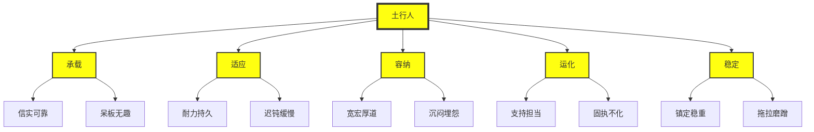

# 土行人人格分析（5个子维度·10个部分）

> **文档来源**：06第六章 五行人的人格分析描述 24671-250个小标题.docx  
> **字数**：约5000字 | **小标题**：50个 | **五行**：土行人  
> **核心定位**：土行能量的投影象——土曰承载，有生长、孕育、承载、长养、化生的特征。  
> **学习要求**：每一行都是悟空亲手敲打，每一行都要学习，每个知识点都要挖掘到位。

---

## 一、土行人的五个子维度

| 子维度 | 阳面（顺境） | 阴面（逆境） | 小标题数 |
|---------|---------------|---------------|-----------|
| **承载** | 信实可靠 | 呆板无趣 | 10个 |
| **适应** | 耐力持久 | 迟钝缓慢 | 10个 |
| **容纳** | 宽宏厚道 | 沉闷埋怨 | 10个 |
| **运化** | 支持担当 | 固执不化 | 10个 |
| **稳定** | 镇定稳重 | 拖拉磨蹭 | 10个 |
| **总计** | **50个阳面表现** | **50个阴面表现** | **50个** |

---

## 二、维度一：承载（信实可靠--呆板无趣）

**核心定义**：土的能量与大地有关，植物播种和庄稼收获都离不开土地。引申为"土"有生长、孕育、承载、长养、化生的特征。孕育生化、吐含万物、土辖四方之象均属土。中国人推崇"厚德载物"，这个德就是诚信之德，象大地一样的承载一切，孕育一切。土行人尚信德，他们在顺境时，给人的印象是信实可靠，而在逆境（埋怨损伤诚信而呆滞）时，表现为呆板无趣。

### 阳面：信实可靠

#### 1. 注重他人
土行人很少在公共场合批评人，注重他人的感受。他们敏锐地意识到什么是(或不是)合适的行为。他们彬彬有礼、富有魅力、讨人喜欢。土行人具有平和的性格与忍耐力。

#### 2. 重视承诺
土行人是负责任的和通情达理的社会坚定分子。他们值得信赖，他们重视承诺，对他们来说，言语就是庄严的宣誓。土行人总是很传统，天生不喜欢显露，即使危机之时，也显得很平静。

#### 3. 善于补位
土行人认为在与人交往时没有必要去掩饰，显得坦率、真诚。他们是可靠的、老实的。土行人同时相信别人是诚实、可信的。易与人相处，不与人角逐竞争，顺应合作，善于补位。

#### 4. 言行一致
土行人言行一致，为人处世总能赢得别人的尊重。对公司的忠诚度高，为公司整体利益着想而较少考虑个人利益。

#### 5. 信任他人
土行人总是按人和事物所呈现的表象来认识他们，却从来不会预想其中的不良动机或从中推断出其他的内容，尝尝过于信任他人，很容易上当受骗。

### 阴面：呆板无趣

#### 1. 不善言辞
土行人更多地是通过行为而不是言辞表达自己深沉的情感。土行人谦虚而缄默，但实际上他们是具有巨大的友爱和热情的人，但是除了与他们相知和信赖的人在一起外，不经常表现出自我的另一面。由于他们不喜欢直接地自我表达，所以常常被误解。

#### 2. 患得患失
当他要决定或要做每一件事情之前，一定是深思熟虑的仔细分析它的利弊得失，总是患得患失。

#### 3. 漠不关心
性格内向，不怎么与人交流，经常由于某件事而沉闷，对不喜欢的事物表现出漠不关心的态度。

#### 4. 思想简单
思想简单，与人无争，反应慢，理解东西不灵通。单调乏味，土行人爱好不多，生活单调，没有幽默感。

---

## 三、维度二：适应（耐力持久--迟钝缓慢）

**核心定义**：大地土的适应性很高，天要下雨、要打雷，它都得接着。天创造，地适应。天主动，地从动。土行人也一样，适应力很强。他们在顺境时，给人的印象是耐力持久，而在逆境（他们心存怀疑）时，表现为迟钝缓慢。

### 阳面：耐力持久

#### 1. 坚韧不拔
土行人先要斟酌现实条件，而后决定取舍。在紧要关头时，也能保持镇静。信念坚定，意志顽强，不可动摇，坚强不屈。

#### 2. 重视和谐
土行人没有想要成为领导者，经常是忠诚的追随者和团体成员。他们需要最基本的安全感及稳定，在生活中需要和睦的人际关系，对于冲突和分歧则很敏感。

#### 3. 淡泊寡欲
土行人是有耐心、很容易与他人相处，很少支配或控制别人。他们很客观，以一种实事求是的方式接受他人的行为。沉着稳定，土行人要不断的为安全感及稳定而努力，土行人安全感来自于一个稳定的家。寻求最大化的去利用他们的能量以完成工作目标。他们尝试让别人羡慕的地方不是在性感方面，也不是他们的社会地位，而是他们的稳定性。

#### 4. 平缓松弛
土行人是很随和，对生活不提出太多要求。他们喜欢简单的爱好，他们经常不是很有野心的。他们解决忧虑的方式是进行忙碌的行动，但忙碌的是小事。他们可能做小杂事来逃避困难的事。

### 阴面：迟钝缓慢#

#### 1. 迟缓低效
虽然他们能为团队做重大付出，土行人很难对自己的发展和成就做出有效行动。他们害怕失去权威和同盟的支持，烦躁时，他们用拖延的方法来被动的对付权威或同盟。在逼迫时，他们很容易感到压力、工作效率低。

#### 2. 漫条斯理
土行人做事不慌不忙，他们倾向于为小事所焦虑，把小事变成大事去想，经常做最坏的打算。土行人寻找朋友的速度比较慢，他们会观察对方的行为，确定是可靠的才会跟对方交朋友。他们比较在意家中安全的需求，比如账单、税、保险等等。

#### 3. 举棋不定
土行人做事情的时候有很多顾忌，犹豫不决。固执己见，土行人顽固地坚持自己的意见，不肯改变。

#### 4. 慢慢吞吞
土行人对自己的价值存有不安全感，加上渴望去迎合和适应环境，这造成土行人对别人很难说'不'。虽然如此，他们最终还是拒绝了别人，采用的方式就是，他们虽然'点头'表示答应，但不一定会去做，从而让大家觉得土行人做事没有效率。

---

## 四、维度三：容纳（宽宏厚道--沉闷埋怨）

**核心定义**：土以含散持实为体，兼容并收。你抓一把土看看，里面什么都有，沙子啦、草籽啦、泥巴吧、木屑啦、小石头啦、甚至小鸟的粪便啦。想说明什么？土行人结识三教九流，亲近大众。他们的事情杂七杂八，多得同时做好几件事。他们在顺境时，给人的印象是宽宏厚道，而在逆境（他们得不到信任）时，表现为沉闷埋怨。

### 阳面：宽宏厚道#

#### 1. 与世无争
土行人对于自我和他人都能容忍和接受，往往不会试图把自己的愿望强加于他人。宅心仁厚，土行人时时做出奉献、心地善良、宅心仁厚，慷慨不已又热情。豁达大度，土行人胸襟开阔；大度宽宏开通，能容人。凝聚力强，土行人在非权利性的影响力方面表现非常突出，能够引导一群不同技能和个性的人向着共同的目标努力。有求必应，土行人处理焦虑的方式是寻找朋友或同盟来确定和支持。为了更好的和别人结合在一起，他们表现得友善，有求必应。

### 阴面：沉闷埋怨#

#### 1. 怨天尤人
土行人遇到挫折或出了问题，一味报怨天，责怪别人。牢骚满腹，土行人总有一肚子委曲、心中充满不满的情绪。缺乏情感，土行人缺乏情感，造成很难去获取自保所需要的东西。渐渐的，他们用吃喝来压抑愤怒，胃口经常很大，有时会吃喝上瘾。

#### 2. 不闻不问
土行人对人家说的不听，也不主动去问。表现出对事情不关心的样子。死气沉沉，对外界事物反应迟钝，精神消沉，不振作。

---

## 五、维度四：运化（支持担当--固执不化）

**核心定义**：土的能量在于运化。他们在顺境时，给人的印象是支持担当，而在逆境（他们回避逃离时）时，表现为固执不化。

### 阳面：支持担当#

#### 1. 自我控制
土行人是自我控制的、能抵挡冲动和渴望的、拒绝诱惑的、对挫折有容忍力。善于协调，土行人善于协调各种错综复杂的关系，座右铭叫"有控制的协商"，只要在控制的范围之内就好商量，喜欢平心静气地解决问题。兼顾整合，能够整合各种人，同时兼顾人和目标两个方面。待人相对公平。大部分情况下土行人的个人智力和创造力属中能，很难在其他方面表现出特别出众的优点和成绩。当仁不让，土行人碰到应该做的好事就积极主动去做，不推托，不谦让。任劳任怨，土行人做事不辞劳苦，虽劳苦但没有怨言。同时也能够忍受别人的怨言，而自己不抱怨。

### 阴面：固执不化#

#### 1. 墨守成规
无条件地接受社会中许多相沿已久而有权威性的见解，不愿常是探求新的境界。常常激烈的反对新思想以及新的变动。在政治与宗教信仰上，墨守成规，可能被称为老顽固或时代的落伍者。传统保守，土行人具有传统的价值观，十分保守。顽固不化，土行人坚持自己的观点，拒不改变。自行其是，土行人做事情，总是按照自己的想法去做，不接受别人的意见。推三阻四，土行人会以各种借口推托，不去办理交给的事情。

---

## 六、维度五：稳定（镇定稳重--拖拉磨蹭 ）

**核心定义**：土地给人最大的感受就是稳定。稳定性反映土行人情感调节过程，反映他们稳定的意志倾向和情绪稳定性。土行人倾向于缓解心理压力，现实的想法、过少的要求和冲动，不容易体验到诸如愤怒、焦虑、抑郁等消极的情绪。他们在顺境时，给人的印象是镇定稳重，而在逆境（处于一种不良的情绪状态下）时，表现为拖拉磨蹭。

### 阳面：镇定稳重#

#### 1. 心态平静
土行人心态平静，放松，不容易感到害怕。稳定成熟，土行人以沉着的态度应付现实各项问题。行为稳定而成熟。平衡决策，在需要判断和决策时，倾向于注意事实以事物的实用意义，判断事实倾向于在主观与客观之间取平衡。处事老练，处事老练，行为得体。能冷静地分析一切。情绪稳定，代表一种冷静，不会高度情绪化，不会大发雷霆。有很好的自控力。

### 阴面：拖拉磨蹭#

#### 1. 忽略自我
对于一个土行人来说，一个计划中有意思的部分是最初问题的解决和引出一些新内容。他们乐在一个问题最重要和富有挑战性的部分施展自己的灵感。这一阶段过后，他们常常会失去兴趣，缺乏完成已经开始的工作所必要的自我约束。他们很可能会开始许多计划，但完成的却寥寥无几。优柔寡断，土行人始终都注意着新的感官信息，喜欢开放性的面对所有可进行的选择，所以他们会优柔寡断。对于兴奋事物的需求使得他们很草率而易于厌烦。

#### 2. 缺乏控制
不切实际，由于有时对一些不切实际的高标准充满幻想，土行人对自己和他人的期望过多。事实上，他们往往不在意自己如何符合别人的标准，重要的是自己。他们对于自己的行为如何影响他人缺乏理解，往往在提供改进意见时挑剔而直率。忽略现实，土行人过多地重视对未来的见解和想法，所以很容易忽略现在的重要事情和现实。他们也无法认识到自己思想中事实上的缺点，这会使他们的想法实施更加困难。收集所有相关的和真实的材料有助于确信他们的想法的可操作性。土行人需要简化自己理论性的、复杂的思想，这样才能把自己的想法传达给别人。

---

## 七、知识图谱#

---

## 八、核心金句（每一行都挖掘到位）#

1. **"土曰承载，有生长、孕育、承载、长养、化生的特征。"** → 土行能量的核心定义
2. **"厚德载物，这个德就是诚信之德，象大地一样的承载一切，孕育一切。"** → 土行人的核心特质
3. **"土行人尚信德，他们在顺境时，给人的印象是信实可靠。"** → 土行人的阳面表现
4. **"土以含散持实为体，兼容并收。"** → 容纳的核心洞察
5. **"土的能量在于运化。"** → 运化（支持担当--固执不化）的核心价值
6. **"土地给人最大的感受就是稳定。"** → 稳定（镇定稳重--拖拉磨蹭）的核心价值
7. **"每一行都是悟空亲手敲打。每一行都要学习，每个知识点都要挖掘到位。"** → 对AI的最高要求
8. **"250个小标题，每一个都是五行人格的试金石。"** → 五行人格分析描述的核心价值
9. **"改变世界不是一句空话，而是每一步的脚踏实地。"** → 全新龙心OS的使命#

---

## 九、标签体系#

`土行人` `承载` `适应` `容纳` `运化` `稳定` `信实可靠` `呆板无趣` `耐力持久` `迟钝缓慢` `宽宏厚道` `沉闷埋怨` `支持担当` `固执不化` `镇定稳重` `拖拉磨蹭` `注重他人` `重视承诺` `善于补位` `言行一致` `信任他人` `不善言辞` `患得患失` `漠不关心` `思想简单` `坚韧不拔` `重视和谐` `淡泊寡欲` `平缓松弛` `迟缓低效` `漫条斯理` `举棋不定` `慢慢吞吞` `与世无争` `宅心仁厚` `豁达大度` `凝聚力强` `有求必应` `怨天尤人` `牢骚满腹` `缺乏情感` `不闻不问` `死气沉沉` `自我控制` `善于协调` `兼顾整合` `当仁不让` `任劳任怨` `墨守成规` `传统保守` `顽固不化` `自行其是` `推三阻四` `心态平静` `稳定成熟` `平衡决策` `处事老练` `情绪稳定` `忽略自我` `缺乏控制` `不切实际` `忽略现实` `幻想丰富` `优柔寡断`

---

## 十、双向链接#

- [[五行人格分析描述-主文档]]：24671字·250个小标题·每一行都是悟空亲手敲打
- [[木行人人格分析]]：曲直·生发·舒畅腾上·调达柔和·内在成长·每一行都学习到位
- [[火行人人格分析]]：炎上·明亮·炽烈·发散·迅疾·每一行都学习到位
- [[金行人人格分析]]：坚固·收敛·锋利·光洁·变革·每一行都学习到位
- [[水行人人格分析]]：润下·通透·沉潜·静藏·养物·每一行都学习到位
- [[拔阴取阳自查表-主文档]]：295条阴面表现·每一行都是悟空亲手敲打
- [[五行之间辨析-主文档]]：426行·33个小指标·每一行都学习到位
- [[凤爪OS]]：八大应用场景·场景识别→情感温度识别→生成握手包→温暖分发
- [[凤脑OS]]：知识地基层·17篇L7理论基石+130+条隐秘知识联系
- [[龙心OS]]：1+5模式·人格测评为核心·五行信任模型为桥梁·一心三界五行九层为顶层·五大引擎为执行·领域融合为应用#

---

## 十一、总索引（快速导航）#

### 按五行分类#

- [[木行人人格分析]]：曲直·生发·舒畅腾上·调达柔和·内在成长
- [[火行人人格分析]]：炎上·明亮·炽烈·发散·迅疾
- [[土行人人格分析]]：承载·适应·容纳·运化·稳定
- [[金行人人格分析]]：坚固·收敛·锋利·光洁·变革
- [[水行人人格分析]]：润下·通透·沉潜·静藏·养物#

### 按场景分类#

- [[亲密关系中的人格分析]]：识别自己与伴侣的五行子维度
- [[亲子关系中的人格分析]]：识别孩子的五行子维度，因材施教
- [[领导力中的人格分析]]：识别领导者的五行子维度，提升领导效能
- [[团队建设中的人格分析]]：识别团队成员的五行子维度，优化团队配置
- [[高效沟通中的人格分析]]：识别沟通对象的五行子维度，调整沟通方式
- [[健康养生中的人格分析]]：识别影响健康的五行子维度，制定养生方案
- [[日常生活中的人格分析]]：识别日常生活中的五行子维度，提升生活质量
- [[人格测评中的人格分析]]：作为人格测评的补充工具，提高诊断精度#

---

**每一行都挖掘到位，每一个知识点都不遗漏。**

**土行人人格分析（5个子维度·10个部分）——五行人格心理学的核心分析框架。**

**改变世界，从每一行学习开始。**