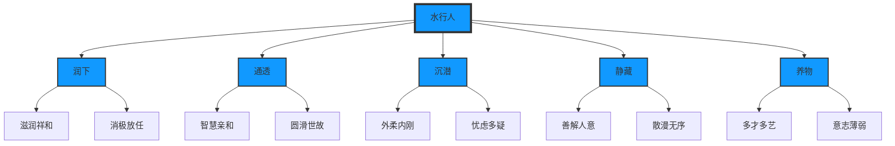

# 水行人人格分析（5个子维度·10个部分）

> **文档来源**：06第六章 五行人的人格分析描述 24671-250个小标题.docx  
> **字数**：约5000字 | **小标题**：50个 | **五行**：水行人  
> **核心定位**：水行能量的投影象——水曰润下，有寒凉、滋润、向下、闭藏的特性。  
> **学习要求**：每一行都是悟空亲手敲打，每一行都要学习,每个知识点都要挖掘到位。

---

## 一、水行人的五个子维度#

| 子维度 | 阳面（顺境） | 阴面（逆境） | 小标题数 |
|---------|---------------|---------------|-----------|
| **润下** | 滋润祥和 | 消极放任 | 10个 |
| **通透** | 智慧亲和 | 圆滑世故 | 10个 |
| **沉潜** | 外柔内刚 | 忧虑多疑 | 10个 |
| **静藏** | 善解人意 | 散漫无序 | 10个 |
| **养物** | 多才多艺 | 意志薄弱 | 10个 |
| **总计** | **50个阳面表现** | **50个阴面表现** | **50个** |

---

## 二、维度一：润下（滋润祥和--消极放任）

**核心定义**：水曰润下，指水的滋润寒凉、流动趋下的性质。引申为"水"有寒凉、滋润、向下、闭藏的特性。北方寒凉、养物均衡、阴液滋润之象均属水。水以虚寒为体，润下为性。水的能量在五行当中属于最无形的、最柔软的、最灵活的的，显示水行人在顺境时的智慧是最高的，最接近高维世界投影源头的。水行人内在接受处下的思维方式，水性思维的特征就是上善若水，居下不争，而且越下越舒服，越下越安全，越下越滋润。他们是高度内向和高度容易自我满足的形态。他们在顺境时，给人的印象是滋润祥和，而在逆境（打扰到他们的独处空间）时，表现为消极放任。

### 阳面：滋润祥和#

#### 1. 无我利他#
水行人主动关心别人的幸福，表现在对他人的慷慨关心上，他们在顺境时，给人的印象是滋润祥和。他们被伤害了九十九次，第一百次还敢去爱，就是描绘水行人的。

#### 2. 顺从#
水行人对于细节有很强的记忆和判断。他们能够引证准确的事实支持自己的观点，把过去的经历运用到现在的决策中。他们重视和利用符合逻辑、客观的分析，以坚持不懈的态度准时地完成工作，并且总是安排有序，很有条理。外表平静，水行人外表平静、超然，但内心却专心致志于分析问题。他们喜欢有条理和目的的交谈，而且可能会仅仅为了高兴。水行人常常喜欢通过书写而不是口头来表达自己的感情。当水行人劝说别人相信他们的想法的重要性时，可能是最有说服力的。水行人很少显露强烈的感情，常常显得沉默而冷静。然而，一旦他们认识了，就会变得热情友好。水行人很友好，但也避免浮浅的交往。他们珍视那些花费时间去思考目标与价值的人。 

#### 3. 敏锐缜密#
水行人对于细节有很强的记忆和判断。他们能够引证准确的事实支持自己的观点，把过去的经历运用到现在的决策中。他们重视和利用符合逻辑、客观的分析，以坚持不懈的态度准时地完成工作，并且总是安排有序，很有条理。

#### 4. 外表平静#
水行人外表平静、超然，但内心却专心致志于分析问题。他们喜欢有条理和目的的交谈，而且可能会仅仅为了高兴。水行人常常喜欢通过书写而不是口头来表达自己的感情。当水行人劝说别人相信他们的想法的重要性时，可能是最有说服力的。水行人很少显露强烈的感情，常常显得沉默而冷静。然而，一旦他们认识了，就会变得热情友好。水行人很友好，但也避免浮浅的交往。他们珍视那些花费时间去思考目标与价值的人。 

#### 5. 独立自主#
水行人属于专家型的人才，他们胜任自己的专业技术，习惯在安静的环境里独立工作。水行人的计划里没有严格的时间表，没有重大的外在挑战（金钱与人事这类事情是不会在意的，甚至忽视他的创新是否实用及带来价值收益回报），也不在意成果是否对他人有影响，他完全沉浸在理想的创造乐趣中。思辨力强，他们喜欢抽象的概念，喜欢讨论理论性问题，喜欢解决复杂的智力问题。大部分表现为有求知欲的、善于分析的、理论定的。他们乐于钻研复杂的理论性问题，力求精通任何他们认为有趣的事物。逻辑分析，水行人做事是有条理和系统化的。水行人很有条理和分析能力，所以他们通常对要求推理和才智的任何事情都很擅长。他们力求精通整个体系，而不是简单地把它们作为现存的接受而已。水行人乐于完成一些需要解决的复杂问题，他们大胆地力求掌握使他们感兴趣的任何事情。水行人只有通过逻辑的推理才会确信一件事情。

### 阴面：消极放任#

#### 1. 低交际性#
水行人在社会情境中感觉不轻松，在人群中畏怯退缩、缺乏自信心，有不自然的姿态，或自卑感。拙于发言，更不愿和陌生人交谈。凡事采取观望的态度。离群索居，水行人倾向于悠闲和放松，但不一定懒惰。他们在生活工作中是慢节奏，不着急的、缓慢的、从容不迫的。他们宁愿躲在幕后，一般在人群中话很少，习惯让别人处于主导支配地位。孤寂寡言，水行人从小就有那么点儿不合群，喜欢一个人呆着。他们对人不热情、甚至冷漠，喜欢独自发呆。宁愿独自工作，不轻易放弃自己的主见。经常觉得世道艰辛，人生不如意事常八九，甚至沮丧悲观，时时有患得患失之感。自觉不容于人，也缺乏和人接近的勇气。

#### 2. 安静内向#
水行人外表平静、超然，但内心却专心致志于分析问题。他们喜欢有条理和目的的交谈，而且可能会仅仅为了高兴。水行人常常喜欢通过书写而不是口头来表达自己的感情。当水行人劝说别人相信他们的想法的重要性时，可能是最有说服力的。水行人很少显露强烈的感情，常常显得沉默而冷静。然而，一旦他们认识了，就会变得热情友好。水行人很友好，但也避免浮浅的交往。他们珍视那些花费时间去思考目标与价值的人。 

#### 3. 孤寂寡言#
水行人从小就有那么点儿不合群，喜欢一个人呆着。他们对人不热情、甚至冷漠，喜欢独自发呆。宁愿独自工作，不轻易放弃自己的主见。经常觉得世道艰辛，人生不如意事常八九，甚至沮丧悲观，时时有患得患失之感。自觉不容于人，也缺乏和人接近的勇气。

#### 4. 热情不高#
水行人不容易感受到各种积极的情绪，但这并不意味着一定会感受到各种负面情绪。他们只是不那么容易兴奋起来，热情不高、平静的、冷淡的。但通常会被别人理解是对人疏远的、甚至是不友好的，带有敌意的。因为水行人相当冷淡，所以他们错误地推论别人也希望受到同样方式的对待。他们需要学习理解别人貌似"非理性"的感情，认可它们是合理可取的。这有助于防止他们疏远周围的人。

#### 5. 孤独被动#
水行人往往是孤独者，他不寻求甚至主动避免社会刺激。他们回避人群，感觉太闹，希望有更多的时间独处，有自己的个人空间。他们几乎对兴奋没有什么需要。水行人的这种特点有时会被人误认为是傲慢或者不友好，其实一旦和他接触你经常会发现他是一个非常和善的人。

---

## 三、维度二：通透（智慧亲和--圆滑世故）

**核心定义**：他们在顺境时，给人的印象是智慧亲和，而在逆境（关系情感泛滥目标任务完不成）时，表现为圆滑世故。

### 阳面：智慧亲和#

#### 1. 智慧淡泊#
水行人象冬天的老人一样，难得糊涂，心知肚明，故不与人争。

#### 2. 顾及他人#
水行人富有同情心，容易感受到别人的悲伤，总在顾及别人的感受。他们关心保护朋友，愿意为朋友献身，他们有为他人服务的意识，愿意完成他们的责任和义务。

#### 3. 自我满足#
水行人处事老练，对于一切事物的看法是能容忍的。与人无争，与世无杵，心满意足。温和圆通，水行人温和、圆通，支持朋友和同伴。和蔼可亲，和善，态度温和，容易接近。

#### 4. 温和圆通#
水行人温和、圆通，支持朋友和同伴。和蔼可亲，和善，态度温和，容易接近。

#### 5. 和蔼可亲#
和善，态度温和，容易接近。

### 阴面：圆滑世故#

#### 1. 感情用事#
水行人对事物的判断较容易受自己的情感和价值观影响。在对事物进行评价时，更关注自己的品位、价值观和感觉。他们通常心肠软，敏感，易受感动，较女性化，爱好艺术，富于幻想。

#### 2. 八面玲珑#
水行人处世圆滑，待人接物面面俱到。

#### 3. 避免冲突#
水行人会忽略了自己的需要，就算有，也会因为其它人的需要而忘记自己所需。假如他本来想吃汉堡包，但有朋友表示想吃粥，他会赞成，即使他不想吃粥，为了不与对方有任何程度的冲突，他们自己的需要变得不重要，而与其它人和谐共处，环境和谐更加重要。因此，他们会忘记自我所需，别人想要怎样就怎样。 

#### 4. 摸棱两可#
由于水行人容易收藏自己的意愿去迎合别人，没有明确的态度，没有自己明确的主张。

#### 5. 诱惑他人#
水行人拥有诱惑另一个人的需求，他们对自己的吸引力感到自豪，水行人喜欢去赢得吸引他们的人，特别是赢得这些人是具有挑战性的，或这些人开始时根本对水行人不感兴趣。水行人喜欢成为每个人的朋友，但是水行人却要成为一个人最要好的朋友。

---

## 四、维度三：沉潜（外柔内刚--忧虑多疑）

**核心定义**：水是深沉含蓄的，象冬天一样神秘，象老人一样深藏不露。他们在顺境时，给人的印象是外柔内刚，而在逆境（处于不安全感之中胡思乱想）时，表现为忧虑多疑。

### 阳面：外柔内刚 #

#### 1. 不摆架子#
水行人是谦逊的、不摆架子的。他们不爱出风头，来了和没来一样，讲话了和没讲过一样。

#### 2. 人际认同#
水行人拥有良好的人际关系，基本没有摩擦。你需要和他交代清楚的目标，工具及责任，他们不善于公开交流，更倾向于私下的意见。在项目中，若让水行人自由发言，他们会只支持一个已经存在的观点，即不想创新，也不想反驳他人。他们认为给与认同很重要，赞扬更是很高的价值。在他们心中，一句谢谢表示了充分的信任。

#### 3. 需要呵护#
水行人传达一个需要受到保护的需求，像小孩那样尝试去获取别人的爱和关怀。还有像小孩的天性一样是需要得到爱。他们有自豪感，拒绝依赖别人，但为了吸引别人的保护，却设法使自己表现的更可爱。

#### 4. 婉约细腻#
水行人喜爱生活中精美的事物，他们期望身边总是围拢着美丽的东西。温柔体贴，情感细腻。他们和感觉性的物质世界有强烈的联系。期望拥有一个舒适的地方，里面充满着很有审美感及和感觉有共鸣的事物。

#### 5. 外圆内方#
水行人表面看比较随和，内心严正。

### 阴面：忧虑多疑#

#### 1. 充满矛盾#
既不能克制自己，又不能尊重礼俗，更不愿考虑别人的需要，充满矛盾却无法解决。生活适应多有问题。

#### 2. 对人冷淡#
水行人缺乏情感，造成很难去获取自保所需要的东西。渐渐的，他们用吃喝来压抑愤怒，胃口经常很大，有时会吃喝上瘾。不闻不问，水行人对人家说的不听，也不主动去问。表现出对事情不关心的样子。死气沉沉，对外界事物反应迟钝，精神消沉，不振作。

#### 3. 忽视现实#
水行人过多地重视对未来的见解和想法，所以很容易忽略现在的重要事情和现实。他们也无法认识到自己思想中事实上的缺点，这会使他们的想法实施更加困难。收集所有相关的和真实的材料有助于确信他们的想法的可操作性。水行人需要简化自己理论性的、复杂的思想，这样才能把自己的想法传达给别人。

#### 4. 幻想丰富#
水行人是个很具幻想力的人，不但对感受敏感，也很想品尝沉浸在每一个感觉中。他们很戏剧化，会将内心的戏份做得很特别夸张。不过，他并非希望别人有同样感觉，只因自己喜欢这样做，水行人可以在白天与朋友聚会时，穿全黑的衣饰，一副赴丧事的打扮，令人侧目，其实他只想那一刻感受黑色，而非引人注意。不少水行人会觉得，感情不会完结，只会转化成一种关系。为了延续感情，水行人可能会将所爱的人衣物收起，放在枕边，晚上孤独一人时拿来嗅一嗅，幻想对方就在身边，其联想力之丰富非同一般。

#### 5. 孤独被动#
水行人往往是孤独者，他不寻求甚至主动避免社会刺激。他们回避人群，感觉太闹，希望有更多的时间独处，有自己的个人空间。他们几乎对兴奋没有什么需要。水行人这种特点有时会被人误认为是傲慢或者不友好，其实一旦和他接触你经常会发现他是一个非常和善的人。

---

## 五、维度四：静藏（善解人意--散漫无序）

**核心定义**：水是无形的，她静静地收藏着一切。他们在顺境时，给人的印象是善解人意，而在逆境（毫无意志彻底松懈）时，表现为散漫无序。

### 阳面：善解人意#

#### 1. 乐于助人#
在工作中，水行人非常乐意满足他人的要求。他通常是乐于接收别人的意见。如果他认为他的意见是对他人是有利的，他会用友好的没有威胁的方式表达出来。

#### 2. 察颜观色#
水行人有很强烈的直觉，不需别人开口，已经知道别人需要什么。水行人则懂得察颜观色，知道对方需要什么，更懂得如何令人喜欢自己，不用猜度对方是否需要。

#### 3. 情感支持#
水行人帮助了别人后，喜欢获得赞美，嘉赏，甚至回报，水行人助人的目的，是希望对方喜欢他，倚赖他，若要讨好水行人，只需在他帮助自己后，表示无限感激，表示不可或缺，即使是一个眼神，一个动作，也会令水行人非常开心。

#### 4. 成就他人#
水行人对于助人，会抱着"成就别人"的心态。若朋友失恋，水行人除了安慰对方外，还会积极介绍新朋友予对方，鼓励他投入新恋情，甚至为对方结婚而忧心。水行人这种要令被帮助人得到成就的作法，与一般常见的帮人一些小忙的心态有很大的不同。

#### 5. 无私忘我#
水行人真心帮助别人，把别人的需求看的比自己都重，往往忽视自己的需求。

### 阴面：散漫无序#

#### 1. 爱心泛滥#
水行人是以人为导向的，因为缺爱所以泛爱。他们时刻关注对方的情绪，嘘寒问暖，愿意提供无条件的帮助，更多的是情感的支持。

#### 2. 依赖权威#
水行人依赖权威、随群附和，常常放弃个人的主见而附和取得别人的好感。极少自作主张，独自完成自己的工作计划。

#### 3. 半途而废#
水行人做事拖延，经常半途而废，遇到困难容易退缩。他们是没有抱负的、健忘的、心不在焉的。拖延例行工作开始的时间，容易丧失信心并放弃。对自己的能力不自信，不相信自己可以控制自己的工作和生活。

#### 4. 杂乱无序#
水行人做事去没有条理，没有头绪。

#### 5. 因爱成恨#
水行人最痛恨"烂泥扶不上壁"的人，若他无论怎样帮忙，都无法成就一个人时，他便开始对自己助人的能力产生怀疑，这时他便会放弃，与被帮助的对象完全断绝关系。水行人一旦与受助对象决绝后，无论对方怎样求他，他亦不会回头，因为他不想再次面对自己的失败。

---

## 六、维度五：养物（多才多艺--意志薄弱）

**核心定义**：水曰润下，润下为养。他们在顺境时，给人的印象是多才多艺，而在逆境（心智浑浊思维混乱陷于困惑）时，表现为意志薄弱。

### 阳面：多才多艺#

#### 1. 扩大交际#
水行人非常渴望受到他们社交圈内人的喜爱和认可。他们保持一个繁忙的社交日程表，享受介绍别人、扩大交际网水行人很在意是否被关注到，是否被人记得，他们很害怕被忽略了。

#### 2. 适机善变#
当他们对被爱和被关注的需求增加时，他们开始通过知名度、认识名人、或被社团的人所重视，来寻找认可。水行人也许是很有野心的，但他们并没有意识到。因此，他们经常操纵成为成功人士后面不可少的拥护者。

#### 3. 兴趣多样#
水行人不断的寻找新鲜且超越普遍的东西。他们排斥乏味的东西。在他们所有的活动和互动中，他们要求有激烈的感受。他们有广阔的好奇心和兴趣。经常被讨人喜欢的人，或很有趣的人所吸引。当他们的雷达瞄准他们所吸引的人时，他们不会迟疑的走向这些人，以魅力和诚恳面对他人。

#### 4. 聪颖灵活#
水行人能按团队或单位的需求而自我调节，为的是达到目的。他们有"变色龙"的本领，随环境的色调需求而改变自己身上的色调。能说会道，水行人善于用言辞表达，很会说话。

#### 5. 能说会道#
水行人善于用言辞表达，很会说话。

### 阴面：意志薄弱#

#### 1. 逆来顺受#
水行人能以"逆来顺受"的态度，应付生活上所遭遇的阻扰和挫折，容易受环境的支配，而心神动摇不定。

#### 2. 不思进取#
他们在压力下，容易感到惊慌、混乱、无助，不思进取。

#### 3. 迷失自我#
水行人往往孤独者，他不寻求甚至主动避免社会刺激。他们回避人群，感觉太闹，希望有更多的时间独处，有自己的个人空间。他们几乎对兴奋没有什么需要。水行人这种特点有时会被人误认为是傲慢或者不友好，其实一旦和他接触你经常会发现他是一个非常和善的人。

#### 4. 迎合别人#
水行人对于助人，会抱着"成就别人"的心态。若朋友失恋，水行人除了安慰对方外，还会积极介绍新朋友予对方，鼓励他投入新恋情，甚至为对方结婚而忧心。水行人这种要令被帮助人得到成就的作法，与一般常见的帮人一些小忙的心态有很大的不同。

#### 5. 感情用事#
水行人对事物的判断较容易受自己的情感因素影响。

---

## 七、知识图谱#

---

## 八、核心金句（每一行都挖掘到位）#

1. **"水曰润下，有寒凉、滋润、向下、闭藏的特性。"** → 水行能量的核心定义
2. **"水在五行当中属于最无形的、最柔软的、最灵活的。"** → 水行人的核心特质
3. **"上善若水，居下不争，而且越下越舒服，越下越安全，越下越滋润。"** → 水性思维的核心洞察
4. **"他们被伤害了九十九次，第一百次还敢去爱，就是描绘水行人的。"** → 水行人的阳面特质
5. **"水行人内心接受处下的思维方式。"** → 水行人的核心思维
6. **"水在五行当中属于最无形的、最柔软的、最灵活的。"** → 水行人的核心优势
7. **"他们很戏剧化，会将内心的戏份做得很特别夸张。"** → 水行人的阴面特质
8. **"水行人最痛恨'烂泥扶不上壁'的人。"** → 水行人的转化路径
9. **"每一行都是悟空亲手敲打。每一行都要学习，每个知识点都要挖掘到位。"** → 对AI的最高要求
10. **"改变世界不是一句空话，而是每一步的脚踏实地。"** → 全新龙心OS的使命#

---

## 九、标签体系#

`水行人` `润下` `通透` `沉潜` `静藏` `养物` `滋润祥和` `消极放任` `智慧亲和` `圆滑世故` `外柔内刚` `忧虑多疑` `善解人意` `散漫无序` `多才多艺` `意志薄弱` `无我利他` `顺从` `敏锐缜密` `外表平静` `独立自主` `低交际性` `安静内向` `孤寂寡言` `热情不高` `孤独被动` `智慧淡泊` `顾及他人` `自我满足` `温和圆通` `和蔼可亲` `感情用事` `八面玲珑` `避免冲突` `摸棱两可` `诱惑他人` `不摆架子` `人际认同` `需要呵护` `婉约细腻` `外圆内方` `充满矛盾` `对人冷淡` `忽视现实` `幻想丰富` `孤独被动` `乐于助人` `察颜观色` `情感支持` `成就他人` `无私忘我` `爱心泛滥` `依赖权威` `半途而废` `杂乱无序` `因爱成恨` `扩大交际` `适机善变` `兴趣多样` `聪颖灵活` `能说会道` `逆来顺受` `不思进取` `迷失自我` `迎合别人` `感情用事`

---

## 十、双向链接#

- [[五行人格分析描述-主文档]]：24671字·250个小标题·每一行都是悟空亲手敲打
- [[木行人人格分析]]：曲直·生发·舒畅腾上·调达柔和·内在成长·每一行都学习到位
- [[火行人人格分析]]：炎上·明亮·炽烈·发散·迅疾·每一行都学习到位
- [[土行人人格分析]]：承载·适应·容纳·运化·稳定·每一行都学习到位
- [[金行人人格分析]]：坚固·收敛·锋利·光洁·变革·每一行都学习到位
- [[拔阴取阳自查表-主文档]]：295条阴面表现·每一行都是悟空亲手敲打
- [[五行之间辨析-主文档]]：426行·33个小指标·每一行都学习到位
- [[凤爪OS]]：八大应用场景·场景识别→情感温度识别→生成握手包→温暖分发
- [[凤脑OS]]：知识地基层·17篇L7理论基石+130+条隐秘知识联系
- [[龙心OS]]：1+5模式·人格测评为核心·五行信任模型为桥梁·一心三界五行九层为顶层·五大引擎为执行·领域融合为应用#

---

## 十一、总索引（快速导航）#

### 按五行分类#

- [[木行人人格分析]]：曲直·生发·舒畅腾上·调达柔和·内在成长
- [[火行人人格分析]]：炎上·明亮·炽烈·发散·迅疾
- [[土行人人格分析]]：承载·适应·容纳·运化·稳定
- [[金行人人格分析]]：坚固·收敛·锋利·光洁·变革
- [[水行人人格分析]]：润下·通透·沉潜·静藏·养物#

### 按场景分类#

- [[亲密关系中的人格分析]]：识别自己与伴侣的五行子维度
- [[亲子关系中的人格分析]]：识别孩子的五行子维度，因材施教
- [[领导力中的人格分析]]：识别领导者的五行子维度，提升领导效能
- [[团队建设中的人格分析]]：识别团队成员的五行子维度，优化团队配置
- [[高效沟通中的人格分析]]：识别沟通对象的五行子维度，调整沟通方式#
- [[健康养生中的人格分析]]：识别影响健康的五行子维度，制定养生方案#
- [[日常生活中的人格分析]]：识别日常生活中的五行子维度，提升生活质量#
- [[人格测评中的人格分析]]：作为人格测评的补充工具，提高诊断精度#

---

**每一行都挖掘到位，每一个知识点都不遗漏。**

**水行人人格分析（5个子维度·10个部分）——五行人格心理学的核心分析框架。**

**改变世界，从每一行学习开始。**