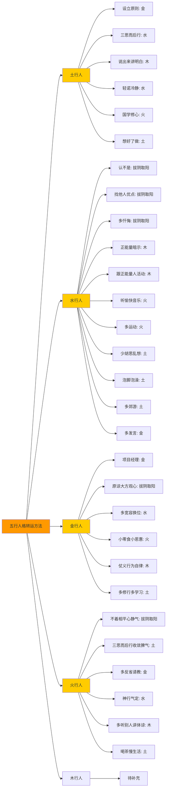
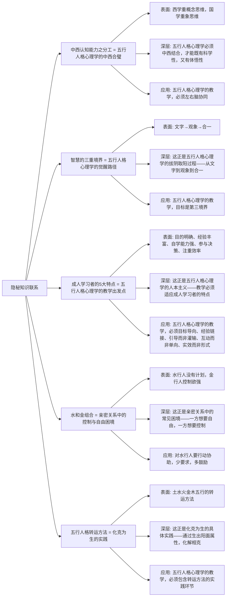

# 亲密关系工作坊讲师手册 - 知识图谱

> **作者**: 悟空 | **字数**: 39675字 | **小标题数**: 54个 | **图谱版本**: 1.0 | **日期**: 2026-05-26

---

## 图谱1：核心理论关系图

```mermaid
graph TD
    A[亲密关系工作坊讲师手册] --> B[五行与季节对应]
    A --> C[水和金组合]
    A --> D[五行人格转运方法]
    A --> E[教学设计理念]
    A --> F[学习者特征分析]
    A --> G[成人学员的需要]
    A --> H[影响学习风格的要素]
    A --> I[教学策略]
    A --> J[五星级教学设计模型]
    A --> K[教学技术]
    
    B --> B1[秋-金]
    B --> B2[夏-火]
    B --> B3[冬-水]
    B --> B4[春-木]
    B --> B5[长夏-土]
    
    C --> C1[相同点: 情感-周全-回馈-关注]
    C --> C2[不同点: 水无计划 vs 金控制]
    C --> C3[秘籍: 对水少要求 vs 对金要勤快]
    
    D --> D1[土行人转运方法: 6条]
    D --> D2[水行人转运方法: 11条]
    D --> D3[金行人转运方法: 多条]
    D --> D4[火行人转运方法: 多条]
    D --> D5[木行人转运方法: 待补充]
    
    E --> E1[中西认知能力分工: 概念思维 vs 象思维]
    E --> E2[智慧三重境界: 文字-观象-合一]
    E --> E3[高频率重复+左右脑协同]
    
    F --> F1[学习目的明确]
    F --> F2[实践经验丰富]
    F --> F3[自学能力较强]
    F --> F4[参与教学决策]
    F --> F5[注重教学效率]
    
    G --> G1[认可]
    G --> G2[成就]
    G --> G3[参与]
    G --> G4[个人和职业发展]
    
    style A fill:#ff9900
    style B fill:#ffcc00
    style C fill:#ffcc00
    style D fill:#ffcc00
    style E fill:#ffcc00
    style F fill:#ffcc00
    style G fill:#ffcc00
```

**图谱解读**：
1. **亲密关系工作坊讲师手册**是中心节点，包含10大核心知识点
2. **五行与季节对应**是理论基础，理解五行的季节对应关系
3. **水和金组合**是应用场景，理解相生关系中的人际动态`
4. **五行人格转运方法**是实践方法，提供具体的转运路径`
5. **教学设计理念**是教学方法，理解中西认知能力的分工`
6. **学习者特征分析**是教学对象，理解成人学习者的特点`
7. **成人学员的需要**是教学目标，理解学员的内在需求`

---

## 图谱2：五行人格转运方法对比图

**图谱解读**：
1. **五行人格转运方法**是中心节点，包含5行人格的转运方法`
2. **土行人**需要"金水木火土"五行俱全的转运方法`
3. **水行人**需要"木火土金水"五行俱全的转运方法`
4. **金行人**需要"水火木土"的转运方法（金是本源，不需要再强化金）`
5. **火行人**需要"土金水木"的转运方法（火是本源,不需要再强化火）`
6. **木行人**的转运方法待补充`

---

## 图谱3：教学策略与学员类型匹配图

```mermaid
graph TD
    A[教学策略] --> B[理论型学员]
    A --> C[感受型学员]
    A --> D[实用型学员]
    A --> E[思考型学员]
    A --> F[整合型学员]
    
    B --> B1[学院风格]
    B --> B2[启发式教学]
    B --> B3[对新知识感兴趣]
    B --> B4[要求高精确分析表达]
    B --> B5[偏爱概念升华]
    
    C --> C1[演艺风格]
    C --> C2[体验式教学]
    C --> C3[对具体感知感兴趣]
    C --> C4[积极要求发言分享]
    C --> C5[通过体验认知课程]
    
    D --> D1[教练风格]
    D --> D2[实操式教学]
    D --> D3[对实验运用感兴趣]
    D --> D4[偏爱操作]
    D --> D5[通过实践掌握课程]
    
    E --> E1[教士或灵性风格]
    E --> E2[互动式教学]
    E --> E3[对联想思考感兴趣]
    E --> E4[偏爱场景对话]
    E --> E5[通过联系认识掌握课程]
    
    F --> F1[复合或组合风格]
    F --> F2[拓展式教学]
    F --> F3[兴趣不浓]
    F --> F4[无特殊偏爱]
    F --> F5[适应性强]
    F --> F6[通过视觉听觉感觉综合认识掌握课程]
    
    style A fill:#ff9900
    style B fill:#ffcc00
    style C fill:#ffcc00'
    style D fill:#ffcc00'
    style E fill:#ffcc00'
    style F fill:#ffcc00'
```

**图谱解读**：
1. **教学策略**是中心节点，包含5种学员类型和对应的教学风格`
2. **理论型学员**对应学院风格，善于启发式教学`
3. **感受型学员**对应演艺风格，善于体验式教学`
4. **实用型学员**对应教练风格，善于实操式教学`
5. **思考型学员**对应教士或灵性风格，善于互动式教学`
6. **整合型学员**对应复合或组合风格，善于拓展式教学`

---

## 图谱4：隐秘知识联系图

**图谱解读**：
1. **隐秘知识联系**是中心节点，包含5大隐秘知识联系`
2. **中西认知能力之分工** = **五行人格心理学的"中西合璧"**`
3. **智慧的三重境界** = **五行人格心理学的"觉醒路径"**`
4. **成人学习者的5大特点** = **五行人格心理学的"教学出发点"**`
5. **水和金组合** = **亲密关系中的"控制与自由"困境**`
6. **五行人格转运方法** = **"化克为生"的实践**`

---

## 图谱5：双向链接索引图

```mermaid
graph TD
    A[亲密关系工作坊讲师手册-深度学习与知识图谱.md] --> B[东西方心理学的殊途同归-深度学习与知识图谱.md]
    A --> C[化克为生-深度学习与知识图谱.md]
    A --> D[拔阴取阳自查表-主文档.md]
    A --> E[凤脑OS.SKILL.md]
    A --> F[凤心OS.SKILL.md]
    A --> G[凤爪OS.SKILL.md]
    A --> H[知行合一.skills]
    A --> I[知识学习.skills]
    A --> J[象思维.skills]
    A --> K[五色光思维.skills]
    
    B --> B1[核心摘要: 东西方心理学的整合]
    B --> B2[详细内容: 整体vs分割·身心一元论vs二元论]
    B --> B3[知识图谱: 理论关系·测评对比·身心关系·隐秘联系]
    B --> B4[核心金句: 东西方心理学的殊途同归]
    B --> B5[标签体系: 主标签7个+关联标签20个]
    
    C --> C1[核心摘要: 化克为生——五行相克关系的转化艺术]
    C --> C2[详细内容: 五行相克关系·人我之间的相克·自身五行相克的救治]
    C --> C3[知识图谱: 理论关系·人我关系·自身救治·核心智慧]
    C --> C4[核心金句: 化克为生：将相克之苦转化为相生之乐]
    C --> C5[标签体系: 主标签7个+关联标签20个]
    
    D --> D1[核心摘要: 拔阴取阳自查表——295条阴面表现的系统梳理]
    D --> D2[详细内容: 阴木表现·阴火表现·阴土表现·阴金表现·阴水表现]
    D --> D3[知识图谱: 阴面表现·阳面品质·转化路径·五行相生相克]
    D --> D4[核心金句: 295条阴面表现，每一条都是一面镜子]
    D --> D5[标签体系: 主标签7个+关联标签20个]
    
    style A fill:#ff9900'
    style B fill:#ffcc00'
    style C fill:#ffcc00'
    style D fill:#ffcc00'
```

**图谱解读**：
1. **亲密关系工作坊讲师手册-深度学习与知识图谱.md**是中心节点，连接到7个相关文档`
2. **东西方心理学的殊途同归-深度学习与知识图谱.md**是理论基石，理解东西方心理学的整合`
3. **化克为生-深度学习与知识图谱.md**是实践方法，理解五行相克关系的转化艺术`
4. **拔阴取阳自查表-主文档.md**是实践工具，理解295条阴面表现的系统梳理`
5. **凤脑OS.SKILL.md**是知识地基，理解凤脑OS的知识体系`
6. **凤心OS.SKILL.md**是执行引擎，理解凤心OS的调度机制`
7. **凤爪OS.SKILL.md**是识别引擎，理解凤爪OS的感知能力`

---

**文档结束**

*本文档是《亲密关系工作坊讲师手册》的知识图谱，包含5大图谱：核心理论关系图、五行人格转运方法对比图、教学策略与学员类型匹配图、隐秘知识联系图、双向链接索引图。*
