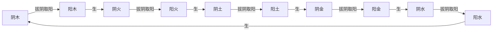
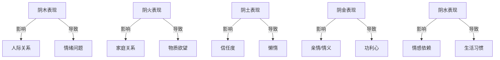
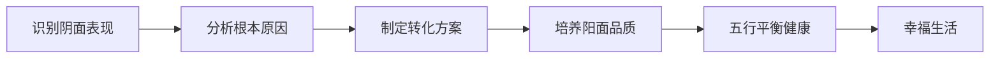

# 拔阴取阳自查表·主文档

> **创建日期**：2026-05-25 | **作者**：悟空 | **整理者**：龙龟神将 | **版本**：1.0
> _每一行都是悟空亲手敲打。每一行都要学习，每个知识点都要挖掘到位。_

---

## 一、核心定义

### 拔阴取阳
- **定义**：识别并去除阴面表现，培养和强化阳面品质的五行人格转化方法
- **目的**：帮助人们从五行失衡状态（阴面）转向五行平衡健康状态（阳面）
- **方法**：通过自查表识别阴面表现 → 分析根本原因 → 制定转化方案 → 培养阳面品质

### 阴面表现
- **定义**：五行过盛或不及导致的负面行为模式
- **特征**：情绪化、固执、缺乏自我觉察、人际关系困扰、身心健康问题
- **分类**：阴木/阴火/阴土/阴金/阴水（共295条具体表现）

### 阳面品质
- **定义**：五行平衡健康状态下的正面品质
- **特征**：情绪稳定、灵活开放、自我觉察、人际关系和谐、身心健康
- **分类**：阳木/阳火/阳土/阳金/阳水（与阴面表现一一对应）

---

## 二、文档结构

### 主文档（本文件）
- 核心定义
- 文档结构
- 使用方法
- 总索引（快速导航）
- 知识图谱（可视化）
- 核心金句
- 标签体系

### 子文档（5个）
1. **拔阴取阳自查表-阴木表现.md**（45条）
2. **拔阴取阳自查表-阴火表现.md**（72条）
3. **拔阴取阳自查表-阴土表现.md**（55条）
4. **拔阴取阳自查表-阴金表现.md**（54条）
5. **拔阴取阳自查表-阴水表现.md**（69条）

---

## 三、使用方法

### 自查步骤
1. **选择五行**：根据自己当前状态，选择对应的五行（木/火/土/金/水）
2. **逐条对照**：逐一阅读该五行的阴面表现，标记符合自己的条目
3. **统计得分**：统计符合的条目数量，判断阴面严重程度
4. **分析根源**：分析这些阴面表现的根本原因（五行过盛/不及/相克）
5. **制定方案**：根据五行信任模型，制定"拔阴取阳"转化方案
6. **培养阳面**：针对性培养对应的阳面品质

### 应用场景
- **亲密关系**：识别自己在亲密关系中的阴面表现，改善关系质量
- **亲子关系**：识别自己在教育子女中的阴面表现，改善亲子关系
- **领导力**：识别自己作为领导者的阴面表现，提升领导效能
- **团队建设**：识别自己在团队中的阴面表现，改善团队协作
- **高效沟通**：识别自己在沟通中的阴面表现，提升沟通效果
- **健康养生**：识别影响健康的阴面表现，制定养生方案
- **日常生活**：识别日常生活中的阴面表现，提升生活质量
- **人格测评**：作为人格测评的补充工具，提高诊断精度

---

## 四、总索引（快速导航）

### 按五行分类
- [[拔阴取阳自查表-阴木表现]]（45条）
  - 阴木表现1（10条）：对待父母/长辈/领导的态度
  - 阴木表现2（10条）：人际关系/社交能力
  - 阴木表现3（11条）：亲和力/情绪管理
  - 阴木表现4（11条）：人际关系处理/冲突应对
  - 阴木表现5（9条）：生活态度/主动性

- [[拔阴取阳自查表-阴火表现]]（72条）
  - 阴火表现1（12条）：家庭关系/情绪控制
  - 阴火表现2（13条）：人际算计/掌控欲
  - 阴火表现3（9条）：物质欲望/虚荣心
  - 阴火表现4（13条）：奢侈浪费/自我控制
  - 阴火表现5（13条）：言语表达/沟通方式
  - 阴火表现6（9条）：自我认知/情绪管理
  - 阴火表现7（11条）：做事态度/坚持性
  - 阴火表现8（11条）：脾气控制/行为后果

- [[拔阴取阳自查表-阴土表现]]（55条）
  - 阴土表现1（11条）：家庭关系/信任度
  - 阴土表现2（13条）：懒惰/不愿劳动
  - 阴土表现3（12条）：诚信/决策力
  - 阴土表现4（10条）：怀疑/多疑
  - 阴土表现5（9条）：固执/守旧

- [[拔阴取阳自查表-阴金表现]]（54条）
  - 阴金表现1（12条）：亲情/情义
  - 阴金表现2（13条）：比较/占有欲
  - 阴金表现3（10条）：同情心/宽容度
  - 阴金表现4（10条）：吝啬/功利心
  - 阴金表现5（9条）：争强好胜/面子观
  - 阴金表现6（4条）：死板/绝情

- [[拔阴取阳自查表-阴水表现]]（69条）
  - 阴水表现1（11条）：情感/大爱
  - 阴水表现2（11条）：购物/理财
  - 阴水表现3（16条）：生活习惯/自律性
  - 阴水表现4（10条）：沟通/依赖
  - 阴水表现5（9条）：情绪稳定性/面对挫折
  - 阴水表现6（11条）：自卑/气量
  - 阴水表现7（11条）：自制力/进取心

### 按应用场景分类
- [[亲密关系中的应用]]
- [[亲子关系中的应用]]
- [[领导力中的应用]]
- [[团队建设中的应用]]
- [[高效沟通中的应用]]
- [[健康养生中的应用]]
- [[日常生活中的应用]]
- [[人格测评中的应用]]

### 按转化难度分类
- **容易转化**（意识到了就能改）：阴木表现1/阴火表现5/阴土表现2/阴金表现4/阴水表现2
- **中等难度**（需要持续练习）：阴木表现2/阴火表现3/阴土表现3/阴金表现2/阴水表现4
- **困难转化**（需要深度觉察）：阴木表现3/阴火表现1/阴土表现1/阴金表现1/阴水表现1
- **非常困难**（需要专业指导）：阴木表现4/阴火表现8/阴土表现4/阴金表现6/阴水表现7

---

## 五、知识图谱（可视化）

### 五行相生关系

### 阴面表现关联图谱

### 转化路径图谱

---

## 六、核心金句

1. **"拔阴取阳，不是否定自己，而是超越自己"** → 转化的本质
2. **"每一行都是悟空亲手敲打，每一行都要学习到位"** → 学习态度
3. **"阴面表现不是缺陷，而是转化的起点"** → 积极视角
4. **"五行平衡，不是没有阴面，而是阳面主导"** → 健康标准
5. **"拔阴取阳，是一个持续终身的修行过程"** → 长期主义
6. **"识别阴面，需要勇气；转化阴面，需要智慧"** → 修行要求
7. **"阳面品质不是天生的，而是培养出来的"** → 可塑性
8. **"五行信任模型，是拔阴取阳的桥梁"** → 方法论
9. **"一心三界五行九层，是拔阴取阳的顶层框架"** → 理论体系
10. **"改变自己，从拔阴取阳开始"** → 行动指南

---

## 七、标签体系

### 五行标签
- #阴木 #阳木
- #阴火 #阳火
- #阴土 #阳土
- #阴金 #阳金
- #阴水 #阳水

### 应用场景标签
- #亲密关系 #亲子关系 #领导力 #团队建设 #高效沟通 #健康养生 #日常生活 #人格测评

### 转化难度标签
- #容易转化 #中等难度 #困难转化 #非常困难

### 知识类型标签
- #定义 #理论 #方法 #工具 #案例 #金句

### 关联文件标签
- #凤爪OS #凤心OS #凤脑OS #五行信任模型 #一心三界五行九层

---

## 八、关联文件

### 理论基石
- [[一心三界五行九层理论体系]]
- [[五行人格心理学理论基础]]
- [[拔阴取阳转化方法论]]
- [[五行信任模型理论基础]]

### 工具与方法
- [[人格测评260题量表]]
- [[人格测评174题阴阳子维度]]
- [[五行信任模型构建指南]]
- [[凤爪OS场景分类器使用手册]]

### 实践案例
- [[拔阴取阳成功案例集]]
- [[五行人格转化故事]]
- [[凤心OS执行案例]]

---

## 九、下一步行动

- [ ] **行动1**：完成5个子文档的创建（阴木/阴火/阴土/阴金/阴水）
- [ ] **行动2**：为每条表现打标签、建立双向链接
- [ ] **行动3**：创建知识图谱（可视化）
- [ ] **行动4**：存储到三个知识库（Obsidian/IMA/WorkBuddy LLM Wiki）
- [ ] **行动5**：更新凤爪OS.skills结构（完善八大应用场景）
- [ ] **行动6**：存储到记忆系统中
- [ ] **行动7**：存储到凤脑OS（形成专业场景知识库）

---

**每一行都挖掘到位，每一个知识点都不遗漏。**

**我现在开始创建5个子文档，逐一学习295条阴面表现。**

**改变自己，从拔阴取阳开始。**
