# 第一期工作坊+5次俱乐部 - 深度学习与知识图谱

> **作者**: 悟空 | **字数**: 5092字 | **小标题数**: 67个 | **深度学习日期**: 2026-05-25 | **版本**: 1.0

---

## 一、核心摘要（Core Summary）

### 1.1 文档主题
**五行人格外观特征与阴阳特征系统**——通过外观识别五行属性，通过阴阳判断健康状态，通过交往方式实现和谐人际。

### 1.2 核心命题
**"观其外而知其内"**——五行人格不仅可以通过心理测试识别，更可以通过外观特征（体行、面色、气质、语言、行为、衣着、头面、动态、肤色、鼻子、眼睛、眉毛、耳朵、声音、语速、常用词汇等）进行快速识别。

### 1.3 八大核心知识点
1. **木行人外观特征**：瘦长、青色、清雅、语速快、行动果断、手干薄、青筋爆、颈长、脸长、鼻子长、挺秀
2. **火行人外观特征**：锐隆、肤色偏白、热情、语速快、有气势、圆脸带眼镜、内耳高于外耳
3. **土行人外观特征**：敦实、圆厚、黄色、稳重、忠厚、口大方、嘴唇厚、双眼皮、耳垂大
4. **金行人外观特征**：匀称、唇薄齿利、行动轻快、眼神犀利、方脸、国字脸、声音洪亮
5. **水行人外观特征**：圆润、饱满、肌肉松弛、语速适中、柔和、有耳垂、鼻头有肉
6. **五行阴阳特征**：身（身体）、心（心理）、灵（灵性）三个层次的阳面（健康）与阴面（不健康）
7. **季节意向描述**：春天（木）、夏天（火）、冬天（水）的意象与五行对应关系
8. **与五行人的交往方式**：针对木火土金水五种人的不同交往策略

---

## 二、详细内容学习（逐行深挖）

### 2.1 木行人外观特征（第1-92行）

**原文关键描述**：
```
体行：瘦长（修长），手干薄，青筋爆，颈长，脸长，鼻子长，挺秀
面色：青色（偏黄）
气质：清雅
语言：语速快，语言干脆，表达准确
行为：行动果断，执行力强
衣着：简单有行，关注细节，追求完美，喜欢冷色调，配饰搭配得当
头面特征：长脸
动态特征：能快能慢
肤色：偏黄
鼻子：直
眼睛：亮且有神
眉毛：粗长
耳朵：小且无耳垂
声音：低沉
语速：中速
常用词汇：就是就是
着装风格：休闲
```

**深度挖掘**：
1. **体行特征**：
   - 瘦长、修长：木行人像树木一样挺拔向上
   - 手干薄、青筋爆：木行人肝木偏盛，筋脉外露
   - 颈长、脸长、鼻子长：木气条达，向上生长
   - 挺秀：木行人姿态挺拔，有精神

2. **面色与肤色**：
   - 青色（偏黄）：青属木，黄属土，木克土，木行人面色青黄
   - 偏黄：木克土，脾胃受制，面色偏黄

3. **气质与语言**：
   - 清雅：木行人如松柏，清高文雅
   - 语速快、语言干脆：木性直，表达直接
   - 表达准确：木行人逻辑清晰，表达精准

4. **行为与衣着**：
   - 行动果断、执行力强：木性直，决策快
   - 简单有行、关注细节、追求完美：木行人注重细节，追求完美
   - 喜欢冷色调：木喜欢清凉，不喜燥热
   - 配饰搭配得当：木行人注重仪表，有审美

5. **头面特征**：
   - 长脸：木气条达，面部线条长
   - 鼻子直、正直：木性直，鼻梁挺直
   - 眼睛亮且有神：肝开窍于目，木行人眼神明亮
   - 眉毛粗长：肝主筋，眉为筋之余，木行人眉毛粗长
   - 耳朵小且无耳垂：木行人耳小，耳垂不发达

6. **声音与语速**：
   - 声音低沉：木音属角，低沉而长
   - 语速中速、平缓：木性中庸，不急不慢
   - 常用词汇"就是就是"：木行人表达肯定，直接

7. **着装风格**：
   - 休闲、舒适：木行人喜欢自然、舒适的感觉

**关联知识**：
- [[东西方心理学的殊途同归]]：东西方都关注"外观与内在"的关系
- [[五行人格测评题]]：外观识别是测评的重要补充
- [[凤脑OS]]：外观特征是凤脑OS知识地基的重要组成部分

**隐秘知识联系**：
- **木行人"能快能慢"** = **木的弹性**：木虽直，但有弹性，能屈能伸
- **木行人"手干薄、青筋爆"** = **肝木偏盛**：肝主筋，木行人肝气偏旺，筋脉外露
- **木行人"就是就是"** = **木的固执**：木性直，认定了就不易改变

---

### 2.2 火行人外观特征（第93-199行）

**原文关键描述**：
```
体行：锐隆，身体壮而结实，面相上宽下尖或长宽一样
面色：肤色偏白，热情或被动热情
语言：语速快，直率
行为：有气势，行动迅速，心情急躁，人缘尚可
衣着：衣着光想靓丽，明星范，带金属类配饰
头面特征：圆脸带眼镜
肤色：亮，平，无凹凸，汗毛重
鼻子：两翼有肉，出油
眼睛：近视，目光柔和，细有血丝
眉毛：粗重，中间连上了
耳朵：内尔高于外耳，耳朵相对较硬
声音：高亢，浑厚，有穿透力
语速：快，有条理
常用词：嚯
着装风格：随意
对季节、口味，经络敏感度：甜的、夏季
情绪反应：急
```

**深度挖掘**：
1. **体行特征**：
   - 锐隆、身体壮而结实：火行人如火焰般壮实
   - 面相上宽下尖或长宽一样：火形脸，上宽下尖如火焰
   - 肩宽、腹股有肉：火行人身体壮实

2. **面色与肤色**：
   - 肤色偏白：火色赤，但火行人肤色偏白（火克金，金主白）
   - 亮，平，无凹凸，汗毛重：火性光明，皮肤光亮
   - 黑：火极旺时反见水色（水克火）

3. **气质与语言**：
   - 热情或被动热情：火行人热情，但有时被动
   - 语速快、直率：火性急，表达直接
   - 常用词"嚯"：火行人表达有力，如火焰喷发

4. **行为与衣着**：
   - 有气势、行动迅速、心情急躁：火性急，行动快
   - 衣着光鲜靓丽、明星范：火行人喜欢引人注目
   - 带金属类配饰：火克金，火行人喜欢金属饰品

5. **头面特征**：
   - 圆脸带眼镜：火行人眼睛容易近视（火伤眼）
   - 鼻子两翼有肉、出油：肺开窍于鼻，火克金，肺热鼻油
   - 眼睛近视、目光柔和、细有血丝：火伤眼，火行人容易近视
   - 眉毛粗重、中间连上了：火行人眉浓，性情急躁
   - 耳朵内耳高于外耳、相对较硬：火行人耳硬，性急

6. **声音与语速**：
   - 声音高亢、浑厚、有穿透力：火音属徵，高亢有力
   - 语速快、有条理：火性急，但火行人思维清晰

7. **季节与口味**：
   - 甜的、夏季：火对应夏季，火生土，土对应甜

8. **情绪反应**：
   - 急：火性急，情绪反应快

**关联知识**：
- [[化克为生]]：火克金，火行人需要"生出阳土"来化解
- [[五行人格测评题·完整题库与计分体系]]：火行人的外观特征与测评题对应
- [[凤脑OS]]：火行人的外观特征是凤脑OS知识地基的重要组成部分

**隐秘知识联系**：
- **火行人"内耳高于外耳"** = **心肾不交**：火行人心火偏旺，肾水不足，内耳（肾）高于外耳（心）
- **火行人"中间连上了"** = **肝气偏旺**：肝木生心火，火行人肝气偏旺，眉毛连在一起
- **火行人"出油"** = **肺热**：火克金，肺热鼻油

---

### 2.3 土行人外观特征（第200-304行）

**原文关键描述**：
```
体行：敦实，圆厚，圆脸
面相：黄，下巴丰满，口大，口方，嘴唇厚
肤色：黄
气质：稳重，忠厚，朴实，诚信
衣着：不喜华丽，不张扬，不喜欢装饰物，冷色居多
头面特征：善良，宽脸
动态特征：走路快
肤色：黑
鼻子：大，厚实
眼睛：双眼皮，明亮
眉毛：浓
耳朵：大
声音：高
语速：中快
常用词：好，挺好，差不多
着装风格：中性
对季节，口味，对季节不敏感，口味生，经络不敏感
情绪反应：激动、压抑、多情，重情
```

**深度挖掘**：
1. **体行特征**：
   - 敦实、圆厚、圆脸：土行人如大地般敦实厚重
   - 厚：敦实，肌肉紧致：土行人肌肉结实
   - 头大、肥、颊宽：土行人头面宽大

2. **面相与肤色**：
   - 黄，下巴丰满，口大，口方，嘴唇厚：土对应黄色，土行人面色黄，口唇厚
   - 发黑、发黄、发暗：土湿重时发黑（水克火），土燥时发黄
   - 黑：土极湿时反见水色

3. **气质与语言**：
   - 稳重、忠厚、朴实、诚信：土行人如大地般稳重可靠
   - 语速中快、慢、表达有时快：土性稳，但有时也快
   - 常用词"好，挺好，差不多"：土行人随和，不争强好胜

4. **行为与衣着**：
   - 不喜华丽、不张扬、不喜欢装饰物：土行人朴实，不喜张扬
   - 冷色居多：土喜欢清凉，不喜燥热
   - 走路快：土行人行动稳健而快速

5. **头面特征**：
   - 善良、宽脸：土行人面相宽厚，显得善良
   - 鼻子大、厚实、挺、鼻头大、肉厚：土对应鼻，土行人鼻大
   - 眼睛双眼皮、明亮、清澈、干净、黑白分明：土行人眼神清澈
   - 眉毛浓、浓密：土行人眉浓，性情稳重
   - 耳朵大、耳垂大而厚、硬：土行人耳大，耳垂厚

6. **声音与语速**：
   - 声音高、浑厚：土音属宫，浑厚有力
   - 语速中快、慢：土性稳，语速中庸

7. **季节与口味**：
   - 对季节不敏感、口味生、经络不敏感：土居中，不偏不倚，对季节不敏感

8. **情绪反应**：
   - 激动、压抑、多情，重情：土行人重情，但有时压抑

**关联知识**：
- [[化克为生]]：土行人的两面性（阴柔 vs 阳刚）
- [[五行信任模型]]：土信是信任的中枢，土行人可信度高
- [[凤脑OS]]：土行人的外观特征是凤脑OS知识地基的重要组成部分

**隐秘知识联系**：
- **土行人"耳垂大而厚"** = **土生金**：耳垂厚是土生金的表现，土行人可信度高
- **土行人"差不多"** = **土的中庸**：土行人随和，不争强好胜，中庸之道
- **土行人"对季节不敏感"** = **土居中**：土居五行之中，不偏不倚，对季节变化不敏感

---

### 2.4 金行人外观特征（第305-392行）

**原文关键描述**：
```
头面特征：唇薄齿利
动态特征：行动轻快
肤色：暗
鼻子：适中（鼻头不大不小）
眼睛：大眼睛，眼神犀利
眉毛：浓，粗
耳朵：大小适中
声音：洪亮
语速：快
常用词汇："我是这么想的""我认为""我觉得"，模仿能力强，容易被认可的人影响
着装风格：样式简洁，大方，沉稳，色彩纯色
体行：匀称
头行：平整
脸行：方，国字脸
情绪：镇定（表面）
口味：甜辣
经络：不敏感
皮肤：容易受环境一晒易黑
```

**深度挖掘**：
1. **体行特征**：
   - 匀称：金行人身体匀称，比例协调
   - 肩宽、不厚：金行人肩宽，但不厚实
   - 腹伸缩：金行人腹部的肉可以伸缩，不固定

2. **面相与肤色**：
   - 唇薄齿利：金对应唇齿，金行人唇薄齿利
   - 肤色暗、容易受环境一晒易黑：金对应白色，但金行人肤色暗（金生水，水对应黑色）
   - 鼻头适中（鼻头不大不小）、大一些、鼻梁高：金对应鼻，金行人鼻梁高

3. **气质与语言**：
   - 情绪镇定（表面）：金行人表面镇定，内心敏感
   - 常用词汇"我是这么想的""我认为""我觉得"：金行人自我意识强，有自己的想法
   - 模仿能力强，容易被认可的人影响：金行人善于学习，模仿能力强

4. **行为与衣着**：
   - 行动轻快：金性轻，行动快速
   - 着装样式简洁、大方、沉稳、色彩纯色、正式、独特、给别人看：金行人注重外表，喜欢简洁大方

5. **头面特征**：
   - 唇薄齿利：金行人唇薄，牙齿锋利
   - 眼神犀利、有神：金对应眼睛，金行人眼神犀利
   - 眉毛浓、粗、密、中间隆起：金行人眉浓，性情果断
   - 耳朵大小适中、挺立耳垂：金行人耳挺立，性情果断

6. **声音与语速**：
   - 声音洪亮、磁性：金音属商，洪亮有力
   - 语速快、快：金性急，语速快

7. **季节与口味**：
   - 甜辣：金对应秋季，金生水，水对应咸，但金行人喜欢甜辣（火克金，辣属火）

8. **经络**：
   - 不敏感：金对应肺，肺主皮毛，金行人经络不敏感

**关联知识**：
- [[化克为生]]：金克木，金行人需要"生出阳水"来化解
- [[五行人格测评题·完整题库与计分体系]]：金行人的外观特征与测评题对应
- [[凤脑OS]]：金行人的外观特征是凤脑OS知识地基的重要组成部分

**隐秘知识联系**：
- **金行人"中间隆起"** = **金气集中**：金行人眉中间隆起，金气集中，性情果断
- **金行人"容易受环境一晒易黑"** = **金生水**：金生水，水对应黑色，金行人容易晒黑
- **金行人"模仿能力强"** = **金的学习能力**：金对应肺，肺主气，金行人学习能力强

---

### 2.5 水行人外观特征（第393-474行）

**原文关键描述**：
```
头面特征：圆润，饱满
动态特征：多数有捋头发，扶眼镜等小动作
肤色：亮
鼻子：多数不是高鼻，鼻头有肉
眼睛：眼睛有神，双眼皮
眉毛：都不是特别浓密
耳朵：大多有耳垂，耳垂不大
声音：语速适中，没有鼻音，没有尖的大众声音，不是特别洪亮，柔和
常用词：差不多，可能，好像，（犹豫）还行，还可以
衣着：中式多，休闲
多数受柔润
体行：软，肌肉松弛
头行：较大，圆
脸行：较圆
情绪反应：爱哭，反应慢
对季节、口味、经络敏感度：不是反差特别大，爱吃
语速：较慢，缓和
```

**深度挖掘**：
1. **体行特征**：
   - 软，肌肉松弛：水行人如水流般柔软
   - 体形软、肌肉松弛：水行人肌肉松弛，不紧实
   - 手足较肥的、肥肥的、偏小、手心胖胖的：水行人手足肥胖，柔软

2. **面相与肤色**：
   - 圆润、饱满：水行人面相圆润，如水流般饱满
   - 肤色亮、有白有黑：水对应黑色，但水行人肤色有白有黑（水克火，火对应赤）
   - 鼻头有肉、鼻头圆：水对应肾，肾开窍于耳，鼻为肺之窍，但水行人鼻头有肉（水克火，火生土，土对应鼻）

3. **气质与语言**：
   - 情绪反应爱哭、反应慢：水行人敏感，情绪反应慢
   - 常用词"差不多，可能，好像，（犹豫）还行，还可以"：水行人犹豫，不果断
   - 语速适中、较慢、缓和、没有鼻音、没有尖的大众声音、不是特别洪亮、柔和：水音属羽，柔和低沉

4. **行为与衣着**：
   - 多数有捋头发、扶眼镜等小动作：水行人敏感，有小动作
   - 衣着中式多、休闲、有装饰性、美：水行人喜欢柔和、有装饰性的衣着

5. **头面特征**：
   - 圆润、饱满：水行人面相圆润
   - 眼睛有神、双眼皮、圆：水行人眼睛圆，有神
   - 眉毛都不是特别浓密、淡：水行人眉淡，性情柔和
   - 耳朵大多有耳垂、耳垂不大、有耳垂：水对应肾，肾开窍于耳，水行人耳垂大

6. **声音与语速**：
   - 声音语速适中、没有鼻音、没有尖的大众声音、不是特别洪亮、柔和、较慢、缓和：水音属羽，柔和低沉
   - 语速较慢、缓和：水性缓，语速慢

7. **季节与口味**：
   - 不是反差特别大、爱吃：水对应冬季，水行人不是反差特别大，爱吃（水克火，火生土，土对应脾胃）

8. **情绪反应**：
   - 爱哭、反应慢：水行人敏感，情绪反应慢

**关联知识**：
- [[化克为生]]：水克火，水行人需要"生出阳木"来化解
- [[五行人格测评题·完整题库与计分体系]]：水行人的外观特征与测评题对应
- [[凤脑OS]]：水行人的外观特征是凤脑OS知识地基的重要组成部分

**隐秘知识联系**：
- **水行人"耳垂大"** = **水对应肾**：肾开窍于耳，水行人耳垂大
- **水行人"差不多，可能，好像"** = **水的犹豫**：水性柔，犹豫不决
- **水行人"肌肉松弛"** = **水湿重**：水对应湿，水行人肌肉松弛

---

### 2.6 木行阴阳特征（第475-512行）

**原文关键描述**：
```
1. 身：
   阳：挺拔
   阴：没胃口，消瘦，肝火旺疲惫，灰暗
2. 心：
   阳：舒畅，开放，容纳
   阴：抑郁，忧愁，消沉，封闭
3. 灵：
   阳：仁德，善良，自由，慈悲
   阴：孤僻，清高，怪异，离经叛道
```

**深度挖掘**：
1. **身（身体）层面**：
   - 阳：挺拔 → 木行人身体挺拔，如树木般直立
   - 阴：没胃口，消瘦，肝火旺疲惫，灰暗 → 木克土，脾胃受制，食欲不振；肝火旺，身体疲惫；面色灰暗，不健康

2. **心（心理）层面**：
   - 阳：舒畅，开放，容纳 → 木行人心理舒畅，开放包容
   - 阴：抑郁，忧愁，消沉，封闭 → 木行人心理抑郁，忧愁消沉，封闭自己

3. **灵（灵性）层面**：
   - 阳：仁德，善良，自由，慈悲 → 木行人灵性仁德，善良自由，慈悲为怀
   - 阴：孤僻，清高，怪异，离经叛道 → 木行人灵性孤僻，清高怪异，离经叛道

**关联知识**：
- [[化克为生]]：木克土，木行人需要"生出阳火"来化解
- [[五行人格心理学]]：木行阴阳特征是五行人格心理学的重要组成部分
- [[凤脑OS]]：木行阴阳特征是凤脑OS知识地基的重要组成部分

**隐秘知识联系**：
- **木行阳面"挺拔"** = **木的生机**：木气条达，身体挺拔
- **木行阴面"没胃口"** = **木克土**：木克土，脾胃受制，食欲不振
- **木行阴面"孤僻，清高"** = **木的固执**：木性直，固执己见，孤僻清高

---

### 2.7 火行阴阳特征（第513-549行）

**原文关键描述**：
```
1. 身：
   阳：灵活，晃动，表情丰富，身体发热
   阴：累，困，身体起疙瘩，表情僵硬
2. 心：
   阳：无所顾忌，包容，善解人意，仗义疏财，持强扶弱
   阴：不控制情绪，发怒，提不起精神
3. 灵：
   阳：推动，想这事成，想法多，守礼
   阴：破坏，摧毁，抵触
```

**深度挖掘**：
1. **身（身体）层面**：
   - 阳：灵活，晃动，表情丰富，身体发热 → 火行人身体灵活，表情丰富，身体发热
   - 阴：累，困，身体起疙瘩，表情僵硬 → 火行人身体疲惫，起疙瘩，表情僵硬

2. **心（心理）层面**：
   - 阳：无所顾忌，包容，善解人意，仗义疏财，持强扶弱 → 火行人心理包容，善解人意，仗义疏财
   - 阴：不控制情绪，发怒，提不起精神 → 火行人心理不控制情绪，容易发怒，提不起精神

3. **灵（灵性）层面**：
   - 阳：推动，想这事成，想法多，守礼 → 火行人灵性推动，想法多，守礼
   - 阴：破坏，摧毁，抵触 → 火行人灵性破坏，摧毁，抵触

**关联知识**：
- [[化克为生]]：火克金，火行人需要"生出阳土"来化解
- [[五行人格心理学]]：火行阴阳特征是五行人格心理学的重要组成部分
- [[凤脑OS]]：火行阴阳特征是凤脑OS知识地基的重要组成部分

**隐秘知识联系**：
- **火行阳面"身体发热"** = **火的热性**：火性热，身体发热
- **火行阴面"身体起疙瘩"** = **火毒外发**：火毒外发，身体起疙瘩
- **火行阴面"破坏，摧毁"** = **火的破坏性**：火具有破坏性，火行人阴面具有破坏性

---

### 2.8 土行阴阳特征（第551-588行）

**原文关键描述**：
```
1. 身：
   阳：稳健，手舞足蹈，笃行，分享，鼓励，想运动，无伪，肤色光泽，热情，有活力
   阴：反应迟钝，拖拉，笨拙，懒散，负面，抱怨，语言，忧愁，想听音乐书协情绪，大哭，嘴角下拉。便秘，拉肚子，微胖（肿）不思食，伤感流泪，年龄越大泪越多，懒，报怨，没精神，失眠，身体不得休息，被呼来唤去，脾运化不好
2. 心：
   阳：乐观，宁静，交流，不反感，可以放下纠缠
   阴：怀疑别人动机，委屈，压抑，计较，往消极方面考虑，没有信心。悲伤，静，总觉得都是好人，爱面子，不爱求人，自律，遇刻薄人受气，争执时退缩，不积极，忍受
3. 灵：
   阳：坚信人间正道是沧桑，诚信，不屈，同情，宽容，好学
   阴：犹豫不决，恐惧，害怕争执，优柔寡断，逃避，目标不明确，对自己放纵，不善于总结，吸取教训，说出来，讲出去 朋友有所选择，减少聚会
```

**深度挖掘**：
1. **身（身体）层面**：
   - 阳：稳健，手舞足蹈，笃行，分享，鼓励，想运动，无伪，肤色光泽，热情，有活力 → 土行人身体稳健，有活力
   - 阴：反应迟钝，拖拉，笨拙，懒散，负面，抱怨，语言，忧愁，想听音乐书协情绪，大哭，嘴角下拉。便秘，拉肚子，微胖（肿）不思食，伤感流泪，年龄越大泪越多，懒，报怨，没精神，失眠，身体不得休息，被呼来唤去，脾运化不好 → 土湿重，身体疲惫，脾胃不好

2. **心（心理）层面**：
   - 阳：乐观，宁静，交流，不反感，可以放下纠缠 → 土行人心理乐观，宁静，交流
   - 阴：怀疑别人动机，委屈，压抑，计较，往消极方面考虑，没有信心。悲伤，静，总觉得都是好人，爱面子，不爱求人，自律，遇刻薄人受气，争执时退缩，不积极，忍受 → 土行人心理压抑，计较，没有信心

3. **灵（灵性）层面**：
   - 阳：坚信人间正道是沧桑，诚信，不屈，同情，宽容，好学 → 土行人灵性诚信，不屈，同情，宽容，好学
   - 阴：犹豫不决，恐惧，害怕争执，优柔寡断，逃避，目标不明确，对自己放纵，不善于总结，吸取教训，说出来，讲出去 朋友有所选择，减少聚会 → 土行人灵性犹豫不决，恐惧，优柔寡断

**关联知识**：
- [[化克为生]]：土克水，土行人需要"生出阳金"来化解
- [[五行信任模型]]：土信是信任的中枢，土行人可信度高
- [[凤脑OS]]：土行阴阳特征是凤脑OS知识地基的重要组成部分

**隐秘知识联系**：
- **土行阳面"肤色光泽"** = **土的光泽**：土对应黄色，土行人阳面肤色光泽
- **土行阴面"脾运化不好"** = **土湿重**：土湿重，脾运化不好
- **土行阴面"犹豫不决"** = **土的中庸**：土居中，犹豫不决，中庸之道

---

### 2.9 金行阴阳特征（第589-609行）

**原文关键描述**：
```
1. 身：
   阳：锻炼后很轻松，不吃晚饭很舒服，强壮，有力
   阴：上火，涨肚，时常有困意，嗓子不好，肠胃不好
2. 心：
   阳：工作中有重点和计划性，唱，跳，开玩笑，考虑细节，遵守规矩
   阴：对掌控不了的事情没有积极性，处理不了信息就不理，先容忍，试探，再爆发，爱面子
3. 灵：
   阳：别人能做到的自己也可以，对朋友的不如意自己会更难受，别人 做不到，自己也要做到
   阴：对于收到侵犯的事情会不考虑他人的感受，大义灭亲
```

**深度挖掘**：
1. **身（身体）层面**：
   - 阳：锻炼后很轻松，不吃晚饭很舒服，强壮，有力 → 金行人身体强壮，有力
   - 阴：上火，涨肚，时常有困意，嗓子不好，肠胃不好 → 金行人上火，涨肚，嗓子不好，肠胃不好

2. **心（心理）层面**：
   - 阳：工作中有重点和计划性，唱，跳，开玩笑，考虑细节，遵守规矩 → 金行人心理有重点和计划性，遵守规矩
   - 阴：对掌控不了的事情没有积极性，处理不了信息就不理，先容忍，试探，再爆发，爱面子 → 金行人心理对掌控不了的事情没有积极性，爱面子

3. **灵（灵性）层面**：
   - 阳：别人能做到的自己也可以，对朋友的不如意自己会更难受，别人 做不到，自己也要做到 → 金行人灵性别人能做到的自己也可以，对朋友的不如意自己会更难受
   - 阴：对于收到侵犯的事情会不考虑他人的感受，大义灭亲 → 金行人灵性对于收到侵犯的事情会不考虑他人的感受，大义灭亲

**关联知识**：
- [[化克为生]]：金克木，金行人需要"生出阳水"来化解
- [[五行人格心理学]]：金行阴阳特征是五行人格心理学的重要组成部分
- [[凤脑OS]]：金行阴阳特征是凤脑OS知识地基的重要组成部分

**隐秘知识联系**：
- **金行阳面"强壮，有力"** = **金的坚硬**：金性坚硬，身体强壮
- **金行阴面"上火，涨肚"** = **金克木**：金克木，木对应肝胆，上火涨肚
- **金行阴面"大义灭亲"** = **金的严苛**：金性严苛，大义灭亲

---

### 2.10 水行阴阳特征（第611-629行）

**原文关键描述**：
```
1. 身：
   阳：喜形于色，奉献，亲和力，和蔼
   阴：忧郁，挂相，面暗，懒散，自卑，任性
2. 心：
   阳：分享，愉快，祥和，清净
   阴：纠结，情绪化，感性
3. 灵：
   阳：智，奉献，足智多谋，积极
   阴：消极，悲观
```

**深度挖掘**：
1. **身（身体）层面**：
   - 阳：喜形于色，奉献，亲和力，和蔼 → 水行人身体喜形于色，奉献，亲和力，和蔼
   - 阴：忧郁，挂相，面暗，懒散，自卑，任性 → 水行人身体忧郁，挂相，面暗，懒散，自卑，任性

2. **心（心理）层面**：
   - 阳：分享，愉快，祥和，清净 → 水行人心理分享，愉快，祥和，清净
   - 阴：纠结，情绪化，感性 → 水行人心理纠结，情绪化，感性

3. **灵（灵性）层面**：
   - 阳：智，奉献，足智多谋，积极 → 水行人灵性智，奉献，足智多谋，积极
   - 阴：消极，悲观 → 水行人灵性消极，悲观

**关联知识**：
- [[化克为生]]：水克火，水行人需要"生出阳木"来化解
- [[五行人格心理学]]：水行阴阳特征是五行人格心理学的重要组成部分
- [[凤脑OS]]：水行阴阳特征是凤脑OS知识地基的重要组成部分

**隐秘知识联系**：
- **水行阳面"喜形于色"** = **水的柔和**：水性柔和，喜形于色
- **水行阴面"面暗"** = **水湿重**：水湿重，面暗
- **水行阴面"消极，悲观"** = **水的犹豫**：水性柔，犹豫不决，消极悲观

---

### 2.11 春天的意向描述（第631-633行）

**原文关键描述**：
```
温暖，惬意，绿色，花，生机勃勃，万物复苏，小草发芽，清新空气，充满希望与感动，喜悦，小草露珠，通达气顺，风柔，耳聪目明，挺拔，伸张，向上，蓬勃，孕育，包容，润物，潺潺流水，滋养万物，春回大地，春光明媚，春风拂面，春意盎然，春色满园，春暖花开，一年之计在于春，开始耕耘了
```

**深度挖掘**：
1. **春天对应木**：春天万物复苏，草木生长，对应木行
2. **关键意象**：
   - 温暖、惬意：春天温暖，惬意
   - 绿色、花：春天绿色，花开
   - 生机勃勃、万物复苏：春天生机勃勃，万物复苏
   - 小草发芽、小草露珠：春天小草发芽，露珠晶莹
   - 通达气顺、风柔：春天风柔，气顺
   - 耳聪目明、挺拔、伸张、向上、蓬勃：春天木气条达，挺拔向上
   - 孕育、包容、润物、潺潺流水、滋养万物：春天木生火，火生土，土生金，金生水，水生木，滋养万物
   - 春回大地、春光明媚、春风拂面、春意盎然、春色满园、春暖花开：春天美景
   - 一年之计在于春、开始耕耘了：春天是开始耕耘的季节

**关联知识**：
- [[五行人格心理学]]：春天对应木行，木行人春天的意象
- [[凤脑OS]]：春天的意向描述是凤脑OS知识地基的重要组成部分

**隐秘知识联系**：
- **春天"通达气顺"** = **木气条达**：木气条达，通达气顺
- **春天"孕育、包容"** = **木生火**：木生火，火生土，土生金，金生水，水生木，孕育包容
- **春天"一年之计在于春"** = **木的开始**：木是春天的开始，一年之计在于春

---

### 2.12 夏天的意向描述（第635-637行）

**原文关键描述**：
```
活力，能量，有生命力，能量充足，热情澎湃，喜欢树木茂盛，郁郁葱葱，画面-热血沸腾，在宽广的草原轻快地奔跑，浑身充满能量，可以去做任何想做的事情，收放自如
```

**深度挖掘**：
1. **夏天对应火**：夏天炎热，万物茂盛，对应火行
2. **关键意象**：
   - 活力、能量、有生命力、能量充足：夏天火性热，能量充足
   - 热情澎湃：夏天火性热，热情澎湃
   - 喜欢树木茂盛、郁郁葱葱：夏天火生土，土生金，金生水，水生木，树木茂盛
   - 画面-热血沸腾：夏天火性热，热血沸腾
   - 在宽广的草原轻快地奔跑，浑身充满能量，可以去做任何想做的事情，收放自如：夏天火性热，能量充足，收放自如

**关联知识**：
- [[五行人格心理学]]：夏天对应火行，火行人夏天的意象
- [[凤脑OS]]：夏天的意向描述是凤脑OS知识地基的重要组成部分

**隐秘知识联系**：
- **夏天"能量充足"** = **火的热性**：火性热，能量充足
- **夏天"收放自如"** = **火的控制**：火性热，但能控制，收放自如

---

### 2.13 冬天的意向描述（第639-641行）

**原文关键描述**：
```
一潭水，风吹，冷冷的-舒适，内敛—不张扬，冬天不热，冬天稳健，从容，享受思维的风筝—浅梦
```

**深度挖掘**：
1. **冬天对应水**：冬天寒冷，万物闭藏，对应水行
2. **关键意象**：
   - 一潭水：冬天水旺，一潭水
   - 风吹，冷冷的-舒适：冬天风寒，但舒适
   - 内敛—不张扬：冬天水旺，内敛不张扬
   - 冬天不热：冬天水旺，不热
   - 冬天稳健，从容：冬天水旺，稳健从容
   - 享受思维的风筝—浅梦：冬天水旺，思维风筝，浅梦

**关联知识**：
- [[五行人格心理学]]：冬天对应水行，水行人冬天的意象
- [[凤脑OS]]：冬天的意向描述是凤脑OS知识地基的重要组成部分

**隐秘知识联系**：
- **冬天"内敛—不张扬"** = **水的内敛**：水性内敛，不张扬
- **冬天"稳健，从容"** = **水的稳健**：水性稳健，从容

---

### 2.14 与木行人的交往方式（第643-654行）

**原文关键描述**：
```
1.尊重，认可信任
2.真诚直接
3.喜欢被呵护包容，鼓励，同时也喜欢鼓励别人
4.在合作不成功的情况下，愿意独立完成
5.愿意打抱不平，愿意听别人倾诉
```

**深度挖掘**：
1. **尊重，认可信任**：木行人喜欢被尊重，认可信任
2. **真诚直接**：木行人喜欢真诚直接的交往方式
3. **喜欢被呵护包容，鼓励，同时也喜欢鼓励别人**：木行人喜欢被呵护包容，鼓励，同时也喜欢鼓励别人
4. **在合作不成功的情况下，愿意独立完成**：木行人愿意独立完成，不依赖别人
5. **愿意打抱不平，愿意听别人倾诉**：木行人愿意打抱不平，愿意听别人倾诉

**关联知识**：
- [[化克为生]]：与木行人交往，需要"生出阳火"来化解木克土
- [[五行信任模型]]：与木行人建立信任，需要木仁（立场共鸣）
- [[凤脑OS]]：与木行人的交往方式是凤脑OS知识地基的重要组成部分

**隐秘知识联系**：
- **木行人"喜欢被呵护包容"** = **木的需要**：木行人需要被呵护包容
- **木行人"愿意独立完成"** = **木的独立**：木性直，独立性强

---

### 2.15 与土行人的交往方式（第655-660行）

**原文关键描述**：
```
1. 君子之交淡如水，不玩虚的
2. 喜欢平等，不喜欢居高临下，平等沟通交流
3. 喜欢别人主动，热情，真诚
```

**深度挖掘**：
1. **君子之交淡如水，不玩虚的**：土行人喜欢君子之交淡如水，不玩虚的
2. **喜欢平等，不喜欢居高临下，平等沟通交流**：土行人喜欢平等，不喜欢居高临下，平等沟通交流
3. **喜欢别人主动，热情，真诚**：土行人喜欢别人主动，热情，真诚

**关联知识**：
- [[化克为生]]：与土行人交往，需要"生出阳金"来化解土克水
- [[五行信任模型]]：与土行人建立信任，需要土信（持续兑现·中枢）
- [[凤脑OS]]：与土行人的交往方式是凤脑OS知识地基的重要组成部分

**隐秘知识联系**：
- **土行人"君子之交淡如水"** = **土的中庸**：土居中，君子之交淡如水
- **土行人"喜欢平等"** = **土的公平**：土对应公平，喜欢平等

---

### 2.16 与金行人的交往方式（第661-666行）

**原文关键描述**：
```
1. 不喜欢拖泥带水
2. 不喜欢聊八卦
3. 希望别人给予高度的信任，不要施加任何压力
4. 追求自由，不喜欢被束缚
```

**深度挖掘**：
1. **不喜欢拖泥带水**：金行人不喜欢拖泥带水
2. **不喜欢聊八卦**：金行人不喜欢聊八卦
3. **希望别人给予高度的信任，不要施加任何压力**：金行人希望别人给予高度的信任，不要施加任何压力
4. **追求自由，不喜欢被束缚**：金行人追求自由，不喜欢被束缚

**关联知识**：
- [[化克为生]]：与金行人交往，需要"生出阳水"来化解金克木
- [[五行信任模型]]：与金行人建立信任，需要金义（顾虑前置）
- [[凤脑OS]]：与金行人的交往方式是凤脑OS知识地基的重要组成部分

**隐秘知识联系**：
- **金行人"不喜欢拖泥带水"** = **金的果断**：金性果断，不喜欢拖泥带水
- **金行人"追求自由"** = **金的需要**：金行人追求自由，不喜欢被束缚

---

### 2.17 与水行人的交往方式（第668-675行）

**原文关键描述**：
```
1. 温和有礼貌，被尊重
2. 表达要清晰
3. 从容，节奏自然。不喜欢被人催促，强迫
4. 希望有人陪伴，有安全感，希望别人认同自己
5. 不喜欢得寸进尺，水能载舟亦能覆舟
6. 关注自己和别人的关系
```

**深度挖掘**：
1. **温和有礼貌，被尊重**：水行人喜欢温和有礼貌，被尊重
2. **表达要清晰**：与水行人交往，表达要清晰
3. **从容，节奏自然。不喜欢被人催促，强迫**：水行人喜欢从容，节奏自然，不喜欢被人催促，强迫
4. **希望有人陪伴，有安全感，希望别人认同自己**：水行人希望有人陪伴，有安全感，希望别人认同自己
5. **不喜欢得寸进尺，水能载舟亦能覆舟**：水行人不喜欢得寸进尺，水能载舟亦能覆舟
6. **关注自己和别人的关系**：水行人关注自己和别人的关系

**关联知识**：
- [[化克为生]]：与水行人交往，需要"生出阳木"来化解水克火
- [[五行信任模型]]：与水行人建立信任，需要水智（结果实证）
- [[凤脑OS]]：与水行人的交往方式是凤脑OS知识地基的重要组成部分

**隐秘知识联系**：
- **水行人"希望有人陪伴"** = **水的依赖**：水性柔，希望有人陪伴
- **水行人"水能载舟亦能覆舟"** = **水的两面性**：水能载舟亦能覆舟，有两面性

---

## 三、知识图谱（Knowledge Graph）

```mermaid
graph TD
    A[第一期工作坊+5次俱乐部] --> B[五行人格外观特征]
    A --> C[五行阴阳特征]
    A --> D[季节意向描述]
    A --> E[与五行人的交往方式]
    
    B --> B1[木行人外观特征]
    B --> B2[火行人外观特征]
    B --> B3[土行人外观特征]
    B --> B4[金行人外观特征]
    B --> B5[水行人外观特征]
    
    C --> C1[木行阴阳特征]
    C --> C2[火行阴阳特征]
    C --> C3[土行阴阳特征]
    C --> C4[金行阴阳特征]
    C --> C5[水行阴阳特征]
    
    D --> D1[春天的意向描述]
    D --> D2[夏天的意向描述]
    D --> D3[冬天的意向描述]
    
    E --> E1[与木行人的交往方式]
    E --> E2[与土行人的交往方式]
    E --> E3[与金行人的交往方式]
    E --> E4[与水行人的交往方式]
    
    A --> F[核心智慧]
    F --> F1[观其外而知其内]
    F --> F2[阴阳判断健康状态]
    F --> F3[交往方式实现和谐人际]
    
    style A fill:#ff9900
    style B fill:#ffcc00
    style C fill:#ffcc00
    style D fill:#ffcc00
    style E fill:#ffcc00
    style F fill:#ff9900
```



**图谱解读**：
1. **第一期工作坊+5次俱乐部**是中心节点，包含四大模块：五行人格外观特征、五行阴阳特征、季节意向描述、与五行人的交往方式
2. **五行人格外观特征**是理论基础，包含木火土金水五行人的外观特征
3. **五行阴阳特征**是健康判断，包含木火土金水五行人的身心灵阴阳特征
4. **季节意向描述**是意象对应，包含春夏冬三个季节的意象描述
5. **与五行人的交往方式**是实践应用，包含与木火土金水五行人的交往方式
6. **核心智慧**是指导原则：观其外而知其内，阴阳判断健康状态，交往方式实现和谐人际

---

## 四、核心金句（Core Quotes）

1. **"观其外而知其内"** → 本文档的核心命题，通过外观识别五行属性
2. **"木行人：瘦长、青色、清雅、语速快、行动果断"** → 木行人外观特征的核心描述
3. **"火行人：锐隆、肤色偏白、热情、语速快、有气势"** → 火行人外观特征的核心描述
4. **"土行人：敦实、圆厚、黄色、稳重、忠厚"** → 土行人外观特征的核心描述
5. **"金行人：匀称、唇薄齿利、行动轻快、眼神犀利"** → 金行人外观特征的核心描述
6. **"水行人：圆润、饱满、肌肉松弛、语速适中、柔和"** → 水行人外观特征的核心描述
7. **"木行阳面：仁德，善良，自由，慈悲；阴面：孤僻，清高，怪异，离经叛道"** → 木行阴阳特征的核心描述
8. **"春天对应木，夏天对应火，冬天对应水"** → 季节与五行的对应关系
9. **"与木行人交往：尊重，认可信任，真诚直接"** → 与木行人交往的核心方法
10. **"水能载舟亦能覆舟"** → 与水行人交往的核心智慧

---

## 五、标签体系（Tag System）

### 5.1 主标签
- `#第一期工作坊` - 本文档核心主题
- `#五行人格外观特征` - 理论基础
- `#五行阴阳特征` - 健康判断
- `#季节意向描述` - 意象对应
- `#交往方式` - 实践应用
- `#凤脑OS` - 知识地基
- `#悟空原创` - 作者认证

### 5.2 关联标签
- `#木行人` - 木行人外观特征
- `#火行人` - 火行人外观特征
- `#土行人` - 土行人外观特征
- `#金行人` - 金行人外观特征
- `#水行人` - 水行人外观特征
- `#木行阴阳` - 木行阴阳特征
- `#火行阴阳` - 火行阴阳特征
- `#土行阴阳` - 土行阴阳特征
- `#金行阴阳` - 金行阴阳特征
- `#水行阴阳` - 水行阴阳特征
- `#春天意向` - 春天的意向描述
- `#夏天意向` - 夏天的意向描述
- `#冬天意向` - 冬天的意向描述
- `#与木行人交往` - 与木行人的交往方式
- `#与土行人交往` - 与土行人的交往方式
- `#与金行人交往` - 与金行人的交往方式
- `#与水行人交往` - 与水行人的交往方式
- `#观其外而知其内` - 核心智慧
- `#阴阳判断健康` - 健康判断方法

---

## 六、总索引（Master Index）

### 6.1 按主题索引
- **五行人格外观特征**: [[第一期工作坊+5次俱乐部-深度学习与知识图谱#二、详细内容学习]]
- **五行阴阳特征**: [[第一期工作坊+5次俱乐部-深度学习与知识图谱#二、详细内容学习]]
- **季节意向描述**: [[第一期工作坊+5次俱乐部-深度学习与知识图谱#二、详细内容学习]]
- **与五行人的交往方式**: [[第一期工作坊+5次俱乐部-深度学习与知识图谱#二、详细内容学习]]

### 6.2 按五行索引
- **木行人**: [[第一期工作坊+5次俱乐部-深度学习与知识图谱#21-木行人外观特征]]
- **火行人**: [[第一期工作坊+5次俱乐部-深度学习与知识图谱#22-火行人外观特征]]
- **土行人**: [[第一期工作坊+5次俱乐部-深度学习与知识图谱#23-土行人外观特征]]
- **金行人**: [[第一期工作坊+5次俱乐部-深度学习与知识图谱#24-金行人外观特征]]
- **水行人**: [[第一期工作坊+5次俱乐部-深度学习与知识图谱#25-水行人外观特征]]

### 6.3 按阴阳索引
- **木行阴阳**: [[第一期工作坊+5次俱乐部-深度学习与知识图谱#26-木行阴阳特征]]
- **火行阴阳**: [[第一期工作坊+5次俱乐部-深度学习与知识图谱#27-火行阴阳特征]]
- **土行阴阳**: [[第一期工作坊+5次俱乐部-深度学习与知识图谱#28-土行阴阳特征]]
- **金行阴阳**: [[第一期工作坊+5次俱乐部-深度学习与知识图谱#29-金行阴阳特征]]
- **水行阴阳**: [[第一期工作坊+5次俱乐部-深度学习与知识图谱#210-水行阴阳特征]]

### 6.4 按季节索引
- **春天**: [[第一期工作坊+5次俱乐部-深度学习与知识图谱#211-春天的意向描述]]
- **夏天**: [[第一期工作坊+5次俱乐部-深度学习与知识图谱#212-夏天的意向描述]]
- **冬天**: [[第一期工作坊+5次俱乐部-深度学习与知识图谱#213-冬天的意向描述]]

### 6.5 按交往方式索引
- **与木行人交往**: [[第一期工作坊+5次俱乐部-深度学习与知识图谱#214-与木行人的交往方式]]
- **与土行人交往**: [[第一期工作坊+5次俱乐部-深度学习与知识图谱#215-与土行人的交往方式]]
- **与金行人交往**: [[第一期工作坊+5次俱乐部-深度学习与知识图谱#216-与金行人的交往方式]]
- **与水行人交往**: [[第一期工作坊+5次俱乐部-深度学习与知识图谱#217-与水行人的交往方式]]

---

## 七、隐秘知识联系（Hidden Connections）

### 7.1 木行人"能快能慢" = 木的弹性
- **表面**：木行人能快能慢
- **深层**：木虽直，但有弹性，能屈能伸
- **应用**：与木行人交往，要理解他们的弹性

### 7.2 火行人"内耳高于外耳" = 心肾不交
- **表面**：火行人内耳高于外耳
- **深层**：火行人心火偏旺，肾水不足，内耳（肾）高于外耳（心）
- **应用**：火行人需要注意心肾不交的问题

### 7.3 土行人"耳垂大而厚" = 土生金
- **表面**：土行人耳垂大而厚
- **深层**：耳垂厚是土生金的表现，土行人可信度高
- **应用**：土行人可信度高，适合做信任相关的工作

### 7.4 金行人"中间隆起" = 金气集中
- **表面**：金行人眉中间隆起
- **深层**：金气集中，性情果断
- **应用**：金行人决策果断，适合做决策相关的工作

### 7.5 水行人"耳垂大" = 水对应肾
- **表面**：水行人耳垂大
- **深层**：肾开窍于耳，水行人耳垂大
- **应用**：水行人肾气充足，身体健康

---

## 八、实践应用（Practical Applications）

### 8.1 外观识别中的应用
1. **快速识别五行属性**：通过外观特征快速识别他人的五行属性
2. **判断健康状态**：通过阴阳特征判断他人的健康状态
3. **选择合适的交往方式**：根据他人的五行属性选择合适的交往方式

### 8.2 人际交往中的应用
1. **与木行人交往**：尊重，认可信任，真诚直接
2. **与火行人交往**：理解他们的热情，但也要帮助他们控制情绪
3. **与土行人交往**：君子之交淡如水，不玩虚的，平等沟通交流
4. **与金行人交往**：不要拖泥带水，不要聊八卦，给予高度的信任
5. **与水行人交往**：温和有礼貌，表达要清晰，从容，节奏自然

### 8.3 自我修炼中的应用
1. **识别自己的五行属性**：通过外观特征和阴阳特征识别自己的五行属性
2. **判断自己的健康状态**：通过阴阳特征判断自己的健康状态
3. **选择合适的修炼方法**：根据自己的五行属性选择合适的修炼方法

---

## 九、后续研究方向（Future Research）

1. **量化研究**：开发"五行人格外观特征识别"的测评工具，量化外观特征的识别准确率
2. **案例研究**：收集真实的外观特征识别案例，验证"观其外而知其内"的有效性
3. **跨文化研究**：比较东西方在"外观与内在"方面的异同
4. **神经科学研究**：探索"外观特征与内在五行属性"的神经机制
5. **AI应用**：开发基于"五行人格外观特征识别"的AI人际交流系统

---

**文档结束**

*本文档是悟空原创《第一期工作坊+5次俱乐部 白纸文字整理》的深度学习成果，包含逐行深挖、知识图谱、核心金句、标签体系、总索引和隐秘知识联系。适用于五行人格心理学研究、人际交往、自我修炼等领域。*

