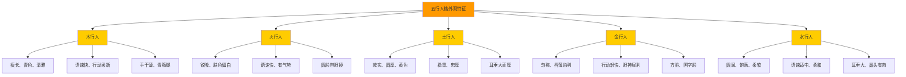
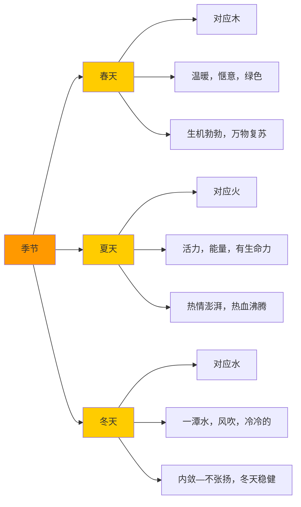
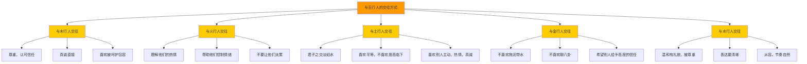
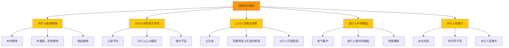

# 第一期工作坊+5次俱乐部 - 知识图谱

> **作者**: 悟空 | **深度学习日期**: 2026-05-25 | **版本**: 1.0

---

## 一、理论关系图谱



**图谱解读**：
1. **五行人格外观特征**是中心节点，包含木火土金水五行人的外观特征
2. **木行人**：瘦长、青色、清雅、语速快、行动果断、手干薄、青筋爆
3. **火行人**：锐隆、肤色偏白、语速快、有气势、圆脸带眼镜
4. **土行人**：敦实、圆厚、黄色、稳重、忠厚、耳垂大而厚
5. **金行人**：匀称、唇薄齿利、行动轻快、眼神犀利、方脸、国字脸
6. **水行人**：圆润、饱满、柔软、语速适中、柔和、耳垂大、鼻头有肉

---

## 二、阴阳特征图谱

```mermaid
graph TD
    A[五行阴阳特征] --> B[木行阴阳]
    A --> C[火行阴阳]
    A --> D[土行阴阳]
    A --> E[金行阴阳]
    A --> F[水行阴阳]
    
    B --> B1[身: 阳-挺拔 | 阴-没胃口，消瘦]
    B --> B2[心: 阳-舒畅，开放 | 阴-抑郁，忧愁]
    B --> B3[灵: 阳-仁德，善良 | 阴-孤僻，清高]
    
    C --> C1[身: 阳-灵活，晃动 | 阴-累，困]
    C --> C2[心: 阳-无所顾忌，包容 | 阴-不控制情绪]
    C --> C3[灵: 阳-推动，想这事成 | 阴-破坏，摧毁]
    
    D --> D1[身: 阳-稳健，手舞足蹈 | 阴-反应迟钝，拖拉]
    D --> D2[心: 阳-乐观，宁静 | 阴-怀疑别人动机]
    D --> D3[灵: 阳-坚信人间正道 | 阴-犹豫不决]
    
    E --> E1[身: 阳-锻炼后很轻松 | 阴-上火，涨肚]
    E --> E2[心: 阳-工作中有重点 | 阴-对掌控不了的事情]
    E --> E3[灵: 阳-别人能做到的 | 阴-对于收到侵犯]
    
    F --> F1[身: 阳-喜形于色 | 阴-忧郁，挂相]
    F --> F2[心: 阳-分享，愉快 | 阴-纠结，情绪化]
    F --> F3[灵: 阳-智，奉献 | 阴-消极，悲观]
    
    style A fill:#ff9900
    style B fill:#ffcc00
    style C fill:#ffcc00
    style D fill:#ffcc00
    style E fill:#ffcc00
    style F fill:#ffcc00
```

**图谱解读**：
1. **五行阴阳特征**是中心节点，包含木火土金水五行人的身心灵阴阳特征
2. **木行阴阳**：身（挺拔 vs 没胃口）、心（舒畅 vs 抑郁）、灵（仁德 vs 孤僻）
3. **火行阴阳**：身（灵活 vs 累困）、心（包容 vs 不控制情绪）、灵（推动 vs 破坏）
4. **土行阴阳**：身（稳健 vs 反应迟钝）、心（乐观 vs 怀疑）、灵（坚信 vs 犹豫）
5. **金行阴阳**：身（轻松 vs 上火）、心（有重点 vs 掌控不了）、灵（做到 vs 侵犯）
6. **水行阴阳**：身（喜形于色 vs 忧郁）、心（分享 vs 纠结）、灵（智 vs 消极）

---

## 三、季节意向对应关系图谱



**图谱解读**：
1. **季节**是中心节点，包含春夏冬三个季节
2. **春天**：对应木，温暖惬意，绿色，生机勃勃，万物复苏
3. **夏天**：对应火，活力能量，有生命力，热情澎湃，热血沸腾
4. **冬天**：对应水，一潭水，风吹冷冷的，内敛不张扬，冬天稳健

---

## 四、交往方式图谱



**图谱解读**：
1. **与五行人的交往方式**是中心节点，包含与木火土金水五行人的交往方式
2. **与木行人交往**：尊重认可信任，真诚直接，喜欢被呵护包容
3. **与火行人交往**：理解他们的热情，帮助他们控制情绪，不要让他们太累
4. **与土行人交往**：君子之交淡如水，喜欢平等，不喜欢居高临下，喜欢别人主动热情真诚
5. **与金行人交往**：不喜欢拖泥带水，不喜欢聊八卦，希望别人给予高度的信任
6. **与水行人交往**：温和有礼貌被尊重，表达要清晰，从容节奏自然

---

## 五、隐秘知识联系图谱



**图谱解读**：
1. **隐秘知识联系**是中心节点，包含5个隐秘知识联系
2. **木行人"能快能慢"** = 木的弹性（木虽直，但有弹性，能屈能伸）
3. **火行人"内耳高于外耳"** = 心肾不交（火行人心火偏旺，肾水不足）
4. **土行人"耳垂大而厚"** = 土生金（耳垂厚是土生金的表现，土行人可信度高）
5. **金行人"中间隆起"** = 金气集中（金行人眉中间隆起，性情果断）
6. **水行人"耳垂大"** = 水对应肾（肾开窍于耳，水行人耳垂大）

---

## 六、双向链接标注

### 6.1 本文档内部链接
- [[第一期工作坊+5次俱乐部-深度学习与知识图谱#二、详细内容学习]]
- [[第一期工作坊+5次俱乐部-深度学习与知识图谱#21-木行人外观特征]]
- [[第一期工作坊+5次俱乐部-深度学习与知识图谱#22-火行人外观特征]]
- [[第一期工作坊+5次俱乐部-深度学习与知识图谱#23-土行人外观特征]]
- [[第一期工作坊+5次俱乐部-深度学习与知识图谱#24-金行人外观特征]]
- [[第一期工作坊+5次俱乐部-深度学习与知识图谱#25-水行人外观特征]]

### 6.2 跨文档链接
- [[东西方心理学的殊途同归-深度学习与知识图谱]]
- [[化克为生-深度学习与知识图谱]]
- [[五行人格测评题·完整题库与计分体系]]
- [[凤脑OS]]
- [[五行信任模型]]

---

**文档结束**

*本文档是悟空原创《第一期工作坊+5次俱乐部 白纸文字整理》的知识图谱，包含理论关系、阴阳特征、季节意向对应、交往方式、隐秘知识联系等5大图谱。适用于五行人格心理学研究、人际交往、自我修炼等领域。*
