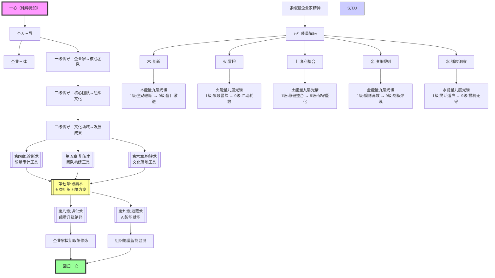

# 📊 五行创生系统知识图谱

## 🌐 图谱概述

**核心定位**：《五行创生：企业家精神觉醒与组织文化构建的系统实践》体系的知识图谱，为凤心OS智能调度提供结构化知识网络。

**设计目的**：
1. **可视化连接**：直观展示全书各章节、概念、理论的联系
2. **智能调用**：为凤心OS提供清晰的知识节点和路径
3. **快速导航**：支持凤脑OS快速检索和关联推理

## 🗺️ 核心架构图



## 🔗 关键知识节点

### 节点1：**一心三界·三体同构**（理论基石）
- **位置**：第一章核心
- **标签**：`#一心三界` `#三体理论` `#同构性` `#本体论`
- **连接**：
  - ↓ 个人三界 → 企业三体
  - → 张维迎企业家精神 → 五行能量解码
  - → 能量传导三级路径
- **智能调用**：当需要理解企业家与企业的深层关系时调用

### 节点2：**五行能量·九层光谱**（核心语言）
- **位置**：第二章核心
- **标签**：`#五行能量` `#九层光谱` `#张维迎` `#企业家精神`
- **连接**：
  - ↑ 张维迎企业家精神（来源）
  - ↓ 九层诊断工具（应用）
  - → 五类组织类型（对应）
- **智能调用**：当需要评估企业家能量状态或企业能量特征时调用

### 节点3：**能量传导三级路径**（核心机制）
- **位置**：第三章核心
- **标签**：`#能量传导` `#三级路径` `#传导机制` `#生成论`
- **连接**：
  - ↑ 个人三界·企业三体（起点）
  - ↑ 五行能量·九层光谱（内容）
  - ↓ 诊断术·配伍术·构建术（落地）
- **智能调用**：当需要分析个人能量如何影响组织文化时调用

### 节点4：**诊断-配伍-构建三术**（落地工具）
- **位置**：第四、五、六章核心
- **标签**：`#诊断术` `#配伍术` `#构建术` `#企业实践`
- **连接**：
  - ↑ 能量传导三级路径（原理）
  - ↓ 破局术（问题解决）
  - ↓ 进化术（迭代升级）
- **智能调用**：当需要具体的企业诊断或文化建设工具时调用

### 节点5：**五类组织破局**（问题解决）
- **位置**：第七章核心
- **标签**：`#木型组织` `#火型组织` `#土型组织` `#金型组织` `#水型组织` `#破局术`
- **连接**：
  - ↑ 五行能量·九层光谱（类型基础）
  - ↑ 诊断-配伍-构建三术（解决工具）
  - ↓ 进化术（持续优化）
- **智能调用**：当遇到特定类型组织困境时调用

### 节点6：**AI智能赋能**（未来演进）
- **位置**：第九章核心
- **标签**：`#AI赋能` `#智能诊断` `#能量监测` `#驭器术`
- **连接**：
  - ↑ 所有诊断工具（数据来源）
  - → 凤心OS智能调度（系统集成）
  - → 未来企业智能（发展趋势）
- **智能调用**：当考虑AI技术在企业文化领域的应用时调用

## 🧩 隐秘联系网络

### 联系1：**个人修炼 ↔ 组织构建**


**智能识别**：凤心OS可监测此循环，当企业业绩下滑时提醒可能的企业家能量状态问题。

### 联系2：**五行能量 ↔ 组织类型 ↔ 发展阶段**

| 发展阶段 | 主导能量 | 组织类型 | 关键挑战 | 调适方向 |
|---------|---------|---------|---------|---------|
| **初创期** | 木+火 | 创新驱动型 | 创新失控风险 | 引入金能量规范 |
| **成长期** | 土+金 | 协同驱动型 | 增长停滞风险 | 注入木能量活力 |
| **成熟期** | 水+木 | 适应驱动型 | 惯性依赖风险 | 注入火能量突破 |
| **转型期** | 火+水 | 变革驱动型 | 身份模糊风险 | 注入土能量稳定 |

**智能调度**：凤心OS可根据企业发展阶段推荐合适的能量调配方案。

### 联系3：**诊断 ↔ 治疗 ↔ 预防**

```
诊断术（发现问题）
    ↓
配伍术（构建团队）
    ↓
构建术（文化落地）
    ↓
进化术（持续迭代）
    ↓
AI赋能（智能预防）
```

**系统思维**：凤心OS可建立企业的"能量健康档案"，实现从被动治疗到主动预防的升级。

## 🎯 凤心OS智能调度示例

### 场景1：企业家能量诊断

**用户输入**："我最近决策总是犹豫不决，创新动力也不足"

**凤心OS调用路径**：
1. 识别为"能量状态问题" → 调用[五行能量·九层光谱]节点
2. 分析"决策犹豫"可能对应金能量问题 → 调用[金能量九层]
3. 分析"创新不足"可能对应木能量问题 → 调用[木能量九层]
4. 综合判断可能为"金能量过强压制木能量" → 调用[五行平衡]原理
5. 推荐"化克为生"方案：金克木→金生水→水生木

**输出建议**：
- 短期：运用水能量（适应洞察）缓解金能量压力
- 中期：培养水能量支撑木能量生长
- 长期：实现金-水-木相生循环

### 场景2：组织文化构建

**用户输入**："我们公司创新氛围很好，但执行落地总有问题"

**凤心OS调用路径**：
1. 识别为"组织能量不平衡" → 调用[五行能量·九层光谱]节点
2. 判断"创新氛围好"对应木能量充沛 → 调用[木型组织破局]
3. 判断"执行问题"可能对应金能量不足 → 调用[金能量职能]
4. 识别为"木强·金弱"失衡 → 调用[能量传导三级路径]
5. 推荐"木→火→土→金"传导增强方案

**输出建议**：
- 信息体：明确"创新有边界"价值观
- 能量体：引入金型仪式（如"创新可行性评审会"）
- 物质体：建立创新-落地衔接流程

### 场景3：团队冲突化解

**用户输入**："我的销售总监和运营总监总是冲突"

**凤心OS调用路径**：
1. 识别为"团队能量相克" → 调用[五行配伍术]节点
2. 判断销售可能对应火能量，运营可能对应土能量
3. 识别为"火克土"相克关系 → 调用[化克为生]技术
4. 推荐"引入水能量调和"方案

**输出建议**：
 - 引入人力资源总监（水能量·适应洞察）作为调解者
 - 建立火→土能量转化机制：销售目标与运营资源的平衡会议
 - 设计水能量仪式：双方向我诉"流水账"分享会

## 📁 知识库集成

### Obsidian知识库文件结构
```
观其妙书院/
├── 04-五行人格与应用/
│   ├── 📖 五行创生-全书索引.md
│   ├── 📖 五行创生-第一章-本体论.md
│   ├── 📖 五行创生-第二章-能量论.md
│   ├── 📖 五行创生 -第三章-生成论.md (待创建)
│   ├── 📖 五行创生 -第四章-诊断术.md (待创建)
│   ├── 📖 五行创生 -第五章-配伍术.md (待创建)
│   ├── 📖 五行创生 -第六章-构建术.md (待创建)
│   ├── 📖 五行创生 -第七章-破局术.md (待创建)
│   ├── 📖 五行创生 -第八章-进化术.md (待创建)
│   ├── 📖 五行创生 -第九章-驭器术.md (待创建)
│   ├── 📖 五行创生-终章-回归一心.md (待创建)
│   └── 📊 五行创生系统知识图谱.md (本文件)
```

### 凤心OS调度接口

**节点查询API**：
```yaml
凤心OS调用示例:
  需求: "诊断企业家能量状态"
  调用: 五行能量·九层光谱节点
  返回: 五行能量状态评估 + 九层位置 + 调适建议
  
  需求: "构建企业文化"
  调用: 诊断-配伍-构建三术节点链
  返回: 诊断结果 + 团队配伍方案 + 文化落地工具
```

## 🚀 未来扩展方向

### 1. **智能化升级**
- 开发AI五行能量测评系统（第九章愿景）
- 实现组织能量流动可视化
- 建立个性化能量赋能算法

### 2. **跨域整合**
- 与五色光思维整合：白光事实诊断→绿光创新方案→蓝光风险评估
- 与象思维整合：识别企业"原象"层面的文化本质
- 与知行合一整合：将企业实践经验沉淀为知识资产

### 3. **生态化应用**
- 企业家能量成长社区
- 企业能量健康认证体系
- 五行文化咨询师培训体系

---

**创建时间**: 2026-04-04  
**最后更新**: 2026-04-04  
**维护者**: 龙龟神将  
**知识状态**: 🗺️ 已完整构建知识图谱，支持凤心OS智能调度

---

> 本知识图谱是《五行创生》系统的中枢神经系统，将全书的理论体系、实践工具、典型案例、智能调度融为一体，为凤心OS提供了"读懂企业能量"的智能之眼和"调适企业文化"的智能之手。