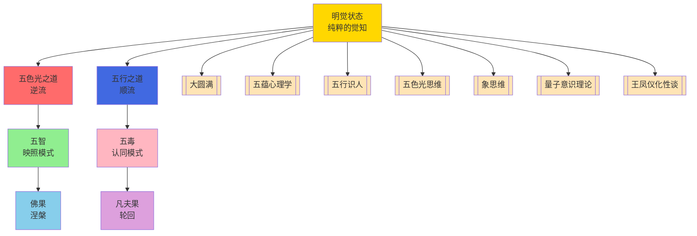

# 五毒自解与五智慧显发 - 明觉状态下的意识转化机制与实践路径

> **核心金句**：五毒自解不是消灭敌人，而是看清本质——明觉照耀下，毒药同源

> **象征符号**：🌊 明觉流（意识能量如水，清澈时五毒即五智，浑浊时即五毒）

---

## 📋 目录

- [核心命题](#核心命题-意识转化的根本原理)
- [第一章：明觉状态](#第一章-明觉状态-意识的本然面目与心理学基础)
- [第二章：五毒与五智](#第二章-五毒与五智-能量的错认与自然转化)
- [第三章：自解脱三步法](#第三章-自解脱三步法-从理论到实践的转化路径)
- [第四章：实践指南](#第四章-实践指南-将五毒自解融入日常生活)
- [跨域知识联系](#跨域知识联系)
- [知识图谱](#知识图谱)

---

## 核心命题：意识转化的根本原理

在人类意识探索的漫长历程中，一个核心命题始终贯穿东西方智慧传统：痛苦与解脱、束缚与自由，并非两种截然不同的存在状态，而是同一意识在不同认知模式下的自然显发。

所谓"五毒自解为五智"，正是这一根本原理的精妙阐述。它揭示了一个深刻的真理：贪、嗔、痴、慢、疑这五种被传统视为负面心理状态的力量，并非需要被消灭的敌人，而是被错认的能量；当意识回归其本然状态——明觉，这五种能量便自然转化、升华，显发为法界体性智、大圆镜智、平等性智、妙观察智、成所作智这五种本具的智慧功能。

这一转化过程的核心机制在于"认知模式的根本转变"。在通常的二元认知模式下，意识将自身等同于身心现象（身、语、意），从而陷入对境界的认同、评判与纠缠，五毒由此生起。而当意识能够稳定地安住于其本质——明觉状态，即"无分别的觉知"时，它便如明镜一般，能够映照一切现象而不被任何现象所染污、所牵绊。此时，五毒的能量不再被固化为痛苦的循环，而是自然流动、转化，成为智慧运作的燃料。

本文旨在系统梳理这一意识转化的完整理论体系与实践路径。我们将首先深入探讨明觉状态的本质及其心理学基础，继而详细剖析五毒与五智慧的内在关联与转化机制，然后重点阐述"自解脱"三步法的具体操作与原理，最后提供将此智慧融入日常生活的实践指南。这一梳理不仅是对传统智慧的现代诠释，更是为每一个寻求内在自由的生命提供清晰可行的转化地图。

---

## 第一章：明觉状态：意识的本然面目与心理学基础

### 1.1 明觉的定义与核心特征

"明觉"，在藏文中称为"Rigpa"，在藏传佛教大圆满传统中被视为意识最本初、最纯粹的状态。它并非某种通过修行新获得的特殊境界，而是意识本具的、从未被遮蔽的本质。明觉的核心特征可以概括为以下几点：

**第一，无分别的觉知。**

明觉状态下的觉知，不同于通常的二元觉知。通常的觉知总是"觉知到某物"，存在能知（主体）与所知（客体）的二元对立。而明觉的觉知是"没有对境的知"，它不指向任何具体对象，而是知本身——一种纯粹的、无对象的觉照。这正如[[五蕴心理学]]中所探讨的"识蕴的理解机能"，特别是"自我理解的心理原理"中指出的，超越自我意识的局限，达到"自性"或"本心"的层面，正是这种无分别觉知的体现。

**第二，明镜般的映照。**

明觉被比喻为一面明镜，能够映照一切现象——念头、情绪、感知、记忆——而不被任何现象所影响。镜子映照鲜花，不会变得更美丽；映照污秽，不会变得更肮脏。它只是如实映照，不留痕迹。这种"映照而不牵绊"的特质，是明觉状态的关键。

当我们"急于评估这些影像"，即对映照的内容进行评判、认同、抗拒时，我们就"从明觉的状态中出来了"，陷入了二元对立的错觉。

**第三，本自圆满的潜能。**

明觉状态并非空白或虚无，而是蕴含着无限潜能。它像一面镜子，不仅能够映照，其本质也"能够映照出心的无限潜能"。这种潜能不是有待开发的能力，而是本自具足的智慧德相。当意识安住于明觉，五智便自然显现，如同阳光穿过棱镜自然分解为七彩光谱。

### 1.2 明觉状态的心理学诠释

从现代心理学视角审视，明觉状态对应着意识的一种特殊功能模式。[[五蕴心理学]]详细探讨了"识蕴的理解机能"，指出理解有三种主要类型：简择慧、明慧、觉慧。其中，"觉慧"最接近明觉的特质，它是一种超越概念思维的直接洞察。

在[[五蕴心理学]]关于"自我理解的心理原理"的探讨中，文章通过佛家哲学批判传统自我观念，提倡通过理性觉悟和精神修炼实现自我超越和解脱。这为理解明觉提供了心理学框架：通常的"自我"是一个由概念、记忆、情绪构建的虚拟中心，而明觉则是认识到这个中心的虚幻性，从而安住于更根本的觉知本身。

神经科学研究为明觉状态提供了生理学佐证。长期冥想者的大脑在静息状态下，默认模式网络（与自我指涉思维、念头漫游相关）的活动显著降低，而与当下觉知、注意力控制相关的脑区（如前额叶皮层、前扣带回）活动增强，功能连接性提高。这表明，明觉状态并非玄学概念，而是具有可观测的神经生理基础。

### 1.3 明觉与二元认知模式的根本差异

理解明觉的关键在于明晰其与通常二元认知模式的根本差异。我们可以从以下几个维度进行对比：

| 维度 | 二元认知模式 | 明觉模式 |
|------|-------------|-----------|
| **认知主体** | 固化的"自我"，将自身等同于身心现象 | "觉性本身"，不认同于任何现象，纯粹的见证 |
| **认知对象** | 总是认知具体对象（念头、情绪、外境），陷入执着或抗拒 | 不认知具体对象，而是安住于"知"本身，对象在觉知中自然显现、自然消融 |
| **认知关系** | 主体与客体对立，产生"我"与"非我"、"好"与"坏"的分别 | 主客对立消融，觉知与现象不二，如同虚空与云朵 |
| **认知结果** | 执着、抗拒、冲突，形成五毒循环 | 开放、接纳、智慧，显发五智功能 |

这种差异不是程度上的，而是性质上的。它如同从梦中醒来，不是梦的内容改变了，而是对梦的认知模式彻底转变了。

---

## 第二章：五毒与五智：能量的错认与自然转化

### 2.1 五毒的本质：被错认的生命能量

贪、嗔、痴、慢、疑，传统上称为"五毒"，它们并非外在的邪恶力量，而是生命能量在二元认知模式下被错认、扭曲后的表现。每一种"毒"都对应着一种根本的生命驱动力，当这种驱动力被"自我"所认同和扭曲时，便形成了痛苦的循环。

#### 贪（火能量的扭曲）

贪对应着生命对连接、融合、圆满的根本渴望。在二元模式下，这种渴望被投射到外在对象（人、物、体验）上，形成"我想要"、"我需要"的执着。贪的本质是"火"能量的扭曲，表现为对认可、成就、感官享受的过度追求。

在[[五行识人]]体系中，[[火行人]]在逆境中容易表现出"贪求虚荣、急躁冲动"等特质，这正是贪毒在特定性格模式下的显化。

#### 嗔（木能量的扭曲）

嗔对应着生命对清晰、界限、转化的根本力量。在二元模式下，这种力量被转化为对"非我"的抗拒和攻击，形成"我反对"、"我讨厌"的反应。嗔的本质是"木"能量的扭曲，表现为对阻碍的愤怒、对不公的怨恨。

[[木行人]]在逆境中可能表现出"傲慢孤僻、抗上不服"，这背后往往有未被觉察的嗔心。

#### 痴（水能量的扭曲）

痴对应着生命对整体、包容、存在的根本信任。在二元模式下，这种信任被遮蔽，形成对实相的无知和迷惑，表现为"我不知道"、"我困惑"。痴的本质是"水"能量的扭曲，表现为沉溺、逃避、缺乏方向。

[[水行人]]可能因"内心渴望被需要"而陷入情感纠葛，这背后是痴毒在运作——对自我和关系的迷惑。

#### 慢（金能量的扭曲）

慢对应着生命对价值、尊严、独特性的根本肯定。在二元模式下，这种肯定被扭曲为自我膨胀和对他人的轻视，形成"我更好"、"我更重要"的傲慢。慢的本质是"金"能量的扭曲，表现为高标准、严要求、难以接纳不完美。

[[金行人]]可能因"自律、公正"而显得傲慢，这需要区分健康的自尊与扭曲的慢心。

#### 疑（土能量的扭曲）

疑对应着生命对真理、探索、验证的根本智慧。在二元模式下，这种智慧被转化为对自我和他人、事物的怀疑和不信任，形成"我怀疑"、"我不确定"的犹豫。疑的本质是"土"能量的扭曲，表现为担忧、不安、缺乏决断。

[[土行人]]可能因"稳定、包容"而显得犹豫不决，这背后是疑毒在干扰。

### 2.2 五智：生命能量的本然显发

当意识安住于明觉，五毒的能量不再被扭曲，而是自然显发为五种智慧功能。这五种智慧不是新获得的，而是生命本具潜能的开启。

#### 法界体性智（痴毒的转化）

当痴的迷惑被明觉照亮，生命对整体、包容、存在的根本信任得以恢复。法界体性智认识到一切现象的本质是空性——没有固定不变的实体，一切都在相互依存中流变。这种智慧带来彻底的开放与接纳，如同虚空容纳万物。

在[[五蕴心理学]]中，这对应着对"自性"或"本心"的体认，超越自我意识的局限。

#### 大圆镜智（嗔毒的转化）

当嗔的抗拒被明觉照亮，生命对清晰、界限、转化的力量得以正确运用。大圆镜智心如明镜，如实映照一切现象，而不被染污。它能够清晰分辨现象的差别，却不执着于差别。这种智慧带来精准的洞察与行动，如同明镜映照万物而不留痕迹。

#### 平等性智（慢毒的转化）

当慢的傲慢被明觉照亮，生命对价值、尊严、独特性的肯定得以平等扩展。平等性智超越二元对立，视一切众生平等，无有高下。它认识到所有现象都是觉性的显化，本质无二。这种智慧带来真正的尊重与包容，如同大地承载万物而无分别。

#### 妙观察智（贪毒的转化）

当贪的执着被明觉照亮，生命对连接、融合、圆满的渴望得以智慧地导向。妙观察智能够清晰分辨现象的差别，理解每个生命的独特需求与路径，而不执着于任何特定对象。这种智慧带来精准的慈悲与智慧的结合，如同医生对症下药。

#### 成所作智（疑毒的转化）

当疑的不信任被明觉照亮，生命对真理、探索、验证的智慧得以正确运用。成所作智能够自由行动，利益众生，而不执着于结果。它基于对实相的信任，能够根据因缘做出恰当回应。这种智慧带来有效的行动与服务，如同农夫顺应时节耕作。

### 2.3 转化机制：从"认同"到"映照"

五毒转化为五智的核心机制，是从"认同"模式切换到"映照"模式。

在认同模式下，意识将自身等同于身心现象，从而陷入对境界的纠缠。在映照模式下，意识安住于明觉，如镜映照，不认同、不评判、不抗拒。

这一转化不是压抑或对抗五毒，而是"看清"五毒的本质。当我们能够"像镜子般完全自由，不受影像的牵绊，不下任何评判"，五毒就失去了扭曲的力量，其能量自然回归本然状态，显发为智慧。

[[五色光思维]]中描述的修行方式，正是这一转化的具体实践。通过身体动作、呼吸与观想五色光球的结合，修行者训练自己保持觉知，从粗糙的身体层面逐步进入微细的意识层面，最终安住于明觉状态，让五色光（五智）自然显现。

---

## 第三章：自解脱三步法：从理论到实践的转化路径

### 3.1 第一步：身份认同的根本转变——"身语意不是我，我是觉性本身"

自解脱的第一步，是进行身份认同的根本转变。通常，我们无意识地将自己等同于身心现象：我的身体、我的语言、我的念头、我的情绪。这种认同是五毒生起的根源。第一步要求我们"从身语意的境界中抽离出来"，认识到"身语意不是我，我是觉性本身"。

#### 理论依据

这一步的理论基础在于佛教的"无我"思想。[[五蕴心理学]]详细探讨了"自我理解的心理原理"，指出佛家哲学批判传统自我观念，认为所谓的"自我"是由五蕴（色、受、想、行、识）因缘和合而成的假象，没有独立不变的实体。当我们认识到这一点，就能从对身心现象的认同中解脱出来。

#### 心理学机制

从心理学角度看，这一步是"去认同化"（de-identification）的过程。我们通常将自我概念建立在不断变化的现象上，如同将房子建在流沙上。第一步要求我们将自我认同的锚点从现象转移到觉性本身——那个不变、不动的见证者。

这类似于心理学中的"观察性自我"（observing self）概念，但更彻底：观察性自我仍然是一个微细的"我"，而觉性本身超越任何"我"的概念。

#### 具体操作

1. **日常反思**：在日常生活中，经常问自己："正在思考的是我吗？正在感受的是我吗？正在行动的是我吗？"然后回答："不，思考、感受、行动只是现象，我是觉知这一切的觉性。"

2. **观想练习**：在冥想中，观察念头的来去，情绪的起伏，身体的感觉。每次观察到现象时，提醒自己："这不是我，我是觉知这一切的觉性。"

3. **标记练习**：当强烈的情绪或念头生起时，用语言标记："这是愤怒，不是我"、"这是欲望，不是我"、"这是怀疑，不是我"。通过标记，创造与现象的距离。

#### 可能障碍与对治

- **障碍**：感到空虚或恐惧，因为失去了熟悉的自我认同。
- **对治**：认识到这种空虚是旧模式瓦解的信号，不是真正的空虚。真正的觉性充满智慧与慈悲。可以暂时将认同锚定在"觉知"这个更稳定的点上，而不是完全无依无靠。

### 3.2 第二步：反观与安住——"发现纯粹的知，然后放松在这个纯粹的知中"

第二步是自解脱的核心。它要求我们"反观，是什么在觉知这一切？发现纯粹的知。没有对境的知。然后放松在这个纯粹的知中。"

#### 理论依据

这一步直接指向明觉状态。在[[五蕴心理学]]中，这被称为"慧解脱"（liberation by wisdom）——通过智慧而获得的解脱。智慧不是知识，而是对实相的直接洞察。当这种洞察稳定时，五毒自然转化为五智。

#### 心理学机制

这一步是"元认知"（metacognition）的极致发展。通常的元认知是"知道自己在思考"，仍然有"我"在知道。第二步要求的是"知道知道本身"，即纯粹的知，没有"我"在知，也没有"对象"被知。

这类似于心理学中的"纯粹意识事件"（pure consciousness event），但更强调其稳定性和日常生活中的应用。

#### 具体操作

1. **反问练习**：在日常生活中，经常反问："是什么在觉知这一切？"不要用思维回答，而是让问题引导你回到觉知本身。你会发现，无法找到一个具体的"什么"，只有觉知在发生。

2. **安住练习**：在冥想中，让注意力从对象（呼吸、念头、感受）上撤回，安住在"知"本身。不要知什么，只是知。开始时可能只能短暂安住，随着练习，时间会延长。

3. **放松练习**：当发现纯粹的知后，不要努力维持，而是放松在这个状态中。努力本身会制造紧张，破坏明觉。放松意味着放开控制，信任觉性的自然运作。

#### 关键要点

- **没有对境的知**：这是第二步的核心。通常的知总是"知某物"，第二步要求的是"知"本身，不指向任何对象。这需要反复练习，因为习惯性的对象化认知非常强大。

- **放松**：放松不是懈怠，而是放开努力。明觉状态不是通过努力达到的，而是通过"不努力"发现的。如同水中的月亮，不是通过搅动水来显现，而是通过让水静下来自然显现。

#### 可能障碍与对治

- **障碍**：陷入空白或昏沉，误以为没有念头就是明觉。
- **对治**：明觉状态是清晰、明亮、警觉的，不是空白或昏沉。如果陷入昏沉，可以睁开眼睛，或进行一些身体活动，保持觉知。

- **障碍**：努力寻找"纯粹的知"，反而制造了新的对象。
- **对治**：认识到"寻找"本身就是障碍。纯粹的知不是被找到的对象，而是寻找者本身。放下寻找，只是安住。

### 3.3 第三步：智慧的应用——"根据环境行事"

第三步是将明觉状态融入日常生活。它要求我们"根据环境行事。此时此刻需要你表现什么行为就表现什么行为。"

#### 理论依据

这一步体现了"成所作智"的应用。智慧不是逃避生活，而是更清醒、更有效地参与生活。[[五行识人]]体系中强调，亲密关系、工作、家庭都是"最真实的道场"，可以"暴露并解决问题、化解烦恼，也是修炼和转变命运的地方"。

#### 心理学机制

这一步是"正念"（mindfulness）与"智慧行动"（wise action）的结合。在明觉状态下，意识不再被无意识模式驱动，而是能够根据当下的因缘做出恰当回应。这类似于心理学中的"心流"（flow）状态，但更强调觉知的背景和智慧的导向。

#### 具体操作

1. **情境觉知**：在任何情境中，首先安住于明觉（第一步和第二步），然后观察情境的需要：需要说什么？需要做什么？需要保持沉默吗？

2. **灵活运用**：根据情境的需要，灵活运用五行能量。例如，在需要决断时运用金能量，在需要包容时运用土能量，在需要创新时运用木能量，在需要热情时运用火能量，在需要适应时运用水能量。

3. **不执着结果**：行动后，不执着于结果。如同镜子映照后不留痕迹，行动后也不留心理痕迹。

#### 与五行识人的结合

[[五行识人]]提供了丰富的性格分析和相处之道，可以与第三步结合：

- **认识自己的五行属性**：了解自己在通常状态下的行为模式，有助于在明觉状态下更灵活地运用不同能量。

- **认识他人的五行属性**：理解他人的行为模式，有助于做出更恰当的回应。

- **五行平衡**：在行动中，注意平衡五行能量，避免过度强化某种能量。

#### 可能障碍与对治

- **障碍**：在行动中失去明觉，重新陷入认同。
- **对治**：这是正常的，不要自责。每次意识到失去明觉时，就重新应用第一步和第二步，回到明觉状态。随着练习，明觉会越来越稳定。

- **障碍**：不知道如何根据环境行事，感到困惑。
- **对治**：这需要生活经验和智慧的培养。可以学习[[五行识人]]等智慧传统，也可以在日常生活中多观察、多反思，培养对情境的敏感度。

---

## 第四章：实践指南：将五毒自解融入日常生活

### 4.1 日常生活中的自解脱练习

将自解脱三步法融入日常生活，需要建立具体的练习习惯。以下是一些建议：

#### 晨间练习

- 醒来后，不要立即起床，花5-10分钟进行自解脱练习。
- 第一步：提醒自己"身语意不是我，我是觉性本身"。
- 第二步：反问"是什么在觉知这一切？"，安住于纯粹的知。
- 第三步：设定一天的意图：在所有活动中保持觉知，根据环境行事。

#### 日间练习

- 设置定时提醒（如每小时一次），进行简短的自解脱练习（1-2分钟）。
- 在转换活动时（如从工作到休息，从家里到外面），进行自解脱练习。
- 在遇到挑战或强烈情绪时，立即应用自解脱三步法。

#### 晚间练习

- 睡前，花10-15分钟进行自解脱练习，回顾一天中何时保持明觉，何时失去明觉。
- 对失去明觉的时刻，不要自责，而是理解这是正常的，并重新应用自解脱方法。

### 4.2 针对五毒的具体对治方法

虽然自解脱三步法适用于所有五毒，但针对每种毒，可以有一些侧重：

#### 对治贪毒

- 当贪欲生起时，应用自解脱三步法。
- 特别注意第二步：安住于纯粹的知，不跟随贪欲的对象。
- 在第三步中，根据环境行事：如果需要拒绝，就拒绝；如果需要接受，就接受而不执着。
- 可以结合[[火行人]]的唤醒技术：释放技术（释放对认可的执着）、顺承技术（顺承当下的因缘）、臣服技术（臣服于更大的整体）、自省技术（反省贪欲的根源）。

#### 对治嗔毒

- 当愤怒生起时，应用自解脱三步法。
- 特别注意第一步：从愤怒的境界中抽离，认识到"愤怒不是我"。
- 在第三步中，根据环境行事：如果需要表达，就清晰表达而不攻击；如果需要沉默，就保持沉默而不压抑。
- 可以结合[[木行人]]的业力模式认识：理解愤怒往往源于对理想的执着，学会在坚持理想的同时包容差异。

#### 对治痴毒

- 当迷惑或逃避生起时，应用自解脱三步法。
- 特别注意第二步：安住于纯粹的知，不沉溺于迷惑或逃避。
- 在第三步中，根据环境行事：如果需要澄清，就寻求澄清；如果需要接受不确定性，就接受。
- 可以结合[[水行人]]的业力模式认识：理解迷惑往往源于对情感的过度依赖，学会在情感连接的同时保持内在的清晰。

#### 对治慢毒

- 当傲慢生起时，应用自解脱三步法。
- 特别注意第一步：从傲慢的境界中抽离，认识到"傲慢不是我"。
- 在第三步中，根据环境行事：如果需要谦虚，就真诚谦虚；如果需要自信，就健康自信而不膨胀。
- 可以结合[[金行人]]的修炼方法："找好处"来化解阴金性，培养阳金性的义气与积极态度。

#### 对治疑毒

- 当怀疑生起时，应用自解脱三步法。
- 特别注意第二步：安住于纯粹的知，不陷入怀疑的漩涡。
- 在第三步中，根据环境行事：如果需要验证，就验证；如果需要信任，就选择信任。
- 可以结合[[土行人]]的修炼方法：通过"认不是"来转化疑心，培养稳定的信任。

### 4.3 与传统修行方法的整合

自解脱三步法可以与传统修行方法整合，增强其效果：

#### 与王凤仪"化性"方法的整合

王凤仪在《化性谈》中强调"不怨人、不生气、找好处、认不是"等方法。这些方法可以与自解脱三步法结合：

- "不怨人、不生气"对应嗔毒的对治，可以在应用自解脱三步法后，进一步培养不怨、不怒的心态。
- "找好处"对应慢毒的对治，可以在应用自解脱三步法后，进一步练习看到他人的优点。
- "认不是"对应疑毒的对治，可以在应用自解脱三步法后，进一步练习承认自己的局限。

#### 与五色光瑜伽的整合

[[五色光思维]]提供了具体的修行方法：通过身体动作、呼吸与观想五色光球来保持觉知。这可以与自解脱三步法结合：

- 在进行五色光瑜伽时，应用自解脱三步法，深化对明觉状态的体验。
- 将五色光观想与五智对应，增强对五智慧的理解和体验。

#### 与五行识人系统的整合

[[五行识人]]提供了详细的性格分析和相处之道。这可以与自解脱三步法结合：

- 在认识自己和他人的五行属性后，应用自解脱三步法，更灵活地运用五行能量。
- 在处理人际关系时，应用自解脱三步法，避免被五行模式所束缚。

### 4.4 可能的误区与澄清

在实践自解脱三步法时，可能会遇到一些误区，需要澄清：

#### 误区一：认为明觉状态是特殊体验

**澄清**：明觉状态不是特殊体验，而是意识的本然状态。它可能被体验为平静、喜悦、清晰，但这些体验本身不是明觉。明觉是这些体验的背景，如同屏幕是电影的背景。

#### 误区二：认为需要消灭五毒

**澄清**：五毒不需要被消灭，只需要被看清。当看清五毒的本质，它们自然转化为智慧。试图消灭五毒，反而会强化它们。

#### 误区三：认为自解脱三步法是逃避现实

**澄清**：自解脱三步法不是逃避现实，而是更清醒地参与现实。第三步"根据环境行事"明确要求根据情境需要行动，而不是逃避。

#### 误区四：认为需要长时间冥想才能达到明觉

**澄清**：明觉状态可以在任何时刻发现，不需要长时间冥想。当然，定期冥想有助于稳定明觉状态，但不是必要条件。

#### 误区五：认为明觉状态后不再有情绪或念头

**澄清**：明觉状态不是没有情绪或念头，而是不被情绪或念头所牵绊。情绪和念头仍然会生起，但它们如同镜中的影像，自然显现、自然消融。

---

## 结论：意识转化的完整路径

五毒自解为五智，不是一个理论命题，而是一个实践路径。它揭示了意识转化的根本原理：痛苦与智慧不是两种不同的能量，而是同一能量在不同认知模式下的显发。当意识从认同模式切换到映照模式，五毒的能量自然回归本然状态，显发为五智。

自解脱三步法提供了这一转化的具体操作指南：第一步，进行身份认同的根本转变，从身心现象中抽离，认同于觉性本身；第二步，反观并安住于纯粹的知，没有对境的知；第三步，根据环境行事，将明觉状态融入日常生活。

这一路径不是线性的，而是循环的。我们可能多次在明觉状态与认同模式之间切换，这是正常的。关键在于每次意识到失去明觉时，能够重新应用自解脱方法，回到明觉状态。随着练习，明觉状态会越来越稳定，五智慧的显发会越来越自然。

最终，五毒与五智不再是两个对立的概念，而是同一生命能量的不同面向。贪、嗔、痴、慢、疑不再是需要恐惧和压抑的敌人，而是可以认识和转化的老师。法界体性智、大圆镜智、平等性智、妙观察智、成所作智不再是遥不可及的理想，而是本具潜能的自然开启。

这就是五毒自解的终极启示：解脱不是成为另一个人，而是认出本来的自己；智慧不是获得新知识，而是发现本有的宝藏。在明觉的照耀下，一切已然圆满，何其完美，本就完美。

---

## 跨域知识联系

### 与[[大圆满]]的连接（5个核心点）

1. **觉性对应**：明觉状态 = 大圆满的"本来清净"（空性）+ "本自圆满"（明性）
2. **椎击三要**：第一步直指心性 = 椎击三要之"直指心性"
3. **解脱自信**：第二步安住 = 椎击三要之"解脱自信"
4. **五毒转五智**：五毒自解 = 大圆满的"五毒转五智"
5. **不二境界**：明觉映照模式 = 噶达陇竹尼美的不二境界

### 与[[五蕴心理学]]的连接（4个核心点）

1. **自性=觉性**：明觉状态对应五蕴心理学的"自性"或"本心"层面
2. **五毒转五智**：五毒与五智慧的对应 = 五蕴心理学对心识转化的阐述
3. **无我思想**：第一步身语意不是我 = 佛教"无我"思想 + 自我理解心理原理
4. **元认知发展**：第二步纯粹觉知 = 五蕴心理学的"慧解脱"（通过智慧解脱）

### 与[[五行识人]]的连接（5个核心点）

1. **五毒与五行对应**：贪（火）、嗔（木）、痴（水）、慢（金）、疑（土）
2. **五行人格表现**：各五毒在特定五行人格中的显化模式
3. **五智与五行对应**：五智慧的显发 = 五行阳面的自然呈现
4. **五行能量运用**：第三步根据环境行事 = 灵活运用五行能量
5. **五毒对治方法**：针对每种毒的对治 = 结合五行识人的修炼方法

### 与[[五色光思维]]的连接（4个核心点）

1. **红光觉察**：红光直觉感受 = 觉察五毒生起的情感信号
2. **白光理解**：白光客观事实 = 理解五毒的本质是能量错认
3. **蓝光风险**：蓝光风险控制 = 识别五毒带来的认知扭曲风险
4. **五色光瑜伽**：身体动作、呼吸、观想 = 自解脱三步法的具体实践

### 与[[象思维]]的连接（3个核心点）

1. **原象=觉性**：明觉状态 = 象思维的原象层，0→1突破的本源
2. **物象→意象→原象**：五毒显现到五智慧显发 = 从表象到本质的递进
3. **0→1原创突破**：自解脱三步法 = 从理论到实践的原创转化

### 与[[量子意识理论]]的连接（4个核心点）

1. **观察者效应**：明觉映照 = 量子观察者效应，观察者不被观察对象影响
2. **量子叠加态**：五毒五智同显发 = 能量以不同状态同时存在的量子叠加
3. **波粒二象性**：认同模式vs映照模式 = 主客对立与不二的不同认知模式
4. **意识坍缩**：明觉状态稳定 = 从叠加到确定的转化

### 与[[王凤仪化性谈]]的连接（3个核心点）

1. **化性思想**：自解脱三步法 = 王凤仪化性思想的根本方法
2. **不怨人、不生气**：嗔毒对治 = "不怨人、不生气"的具体实践
3. **找好处、认不是**：慢毒疑毒对治 = "找好处"化解慢心，"认不是"转化疑心

---

## 知识图谱

---

## 标签

#心文化 #大圆满 #五毒 #五智 #明觉 #意识转化 #自解脱三步法 #五蕴心理学 #五行识人 #五色光思维 #象思维 #量子意识 #王凤仪 #意识能量场 #修行实践 #生活应用 #跨域整合

---

**文档版本**: 1.0  
**创建时间**: 2026-04-06  
**存储路径**: `D:\以观其妙书院知识库\观其妙书院\05-五行人格心理学\00-入口\五毒自解与五智慧显发-明觉状态下的意识转化机制与实践路径.md`  
**知识图谱**: `D:\以观其妙书院知识库\观其妙书院\05-五行人格心理学\00-入口\五毒自解与五智慧显发-知识图谱.md`
