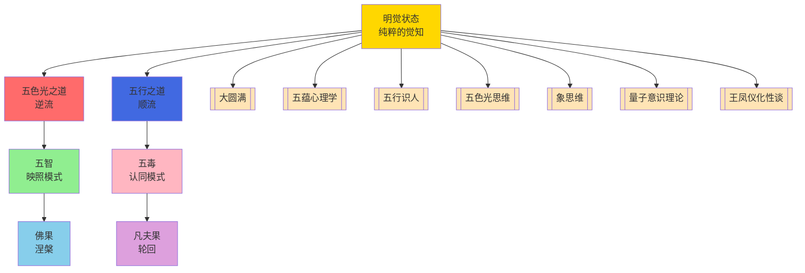

# 五毒自解与五智慧显发 - 知识图谱

> **核心网络**：明觉状态（根）→ 五色光之道/五行之道（流动路径）→ 五智/五毒（呈现状态）
> **创新洞察**：这是一张动态能量流动地图，而非静态二元分类

---

## 知识图谱核心网络



---

## 七大理论体系跨域联系

### 一、[[大圆满]]（5个核心连接点）

| 连接点 | 大圆满理论 | 五毒自解 | 跨域意义 |
|--------|------------|----------|----------|
| 1 | 觉性对应明觉状态 | 明觉状态 = 大圆满的"本来清净"（空性）+ "本自圆满"（明性） | 觚性是意识的本然状态，明觉是其在个体层面的直接体证 |
| 2 | 椎击三要 | 第一步直指心性 = 椎击三要之"直指心性" | 同样指向回到纯粹觉知本身 |
| 3 | 解脱自信 | 第二步安住 = 椎击三要之"解脱自信" | 确信无疑地安住在觉知中 |
| 4 | 五毒转五智 | 五毒自解为五智慧 = 大圆满的"五毒转五智" | 同一能量转化过程的不同表述 |
| 5 | 噶达陇竹尼美 | 明觉映照模式 = 不二境界 | 明觉状态下主客不二，即不二状态 |

---

### 二、[[五蕴心理学]]（4个核心连接点）

| 连接点 | 五蕴心理学 | 五毒自解 | 跨域意义 |
|--------|------------|----------|----------|
| 1 | 自性=觉性 | 明觉状态 = 五蕴心理学的"自性"或"本心"层面 | 明觉是对自性的直接体验，超越自我意识局限 |
| 2 | 五毒转五智 | 五毒与五智慧的对应 = 五蕴心理学对心识转化的阐述 | 两种表述对应同一心识能量转化的过程 |
| 3 | 无我思想 | 第一步身语意不是我 = 佛教"无我"思想 + 自我理解心理原理 | 身份认同转变是"无我"思想的实践体现 |
| 4 | 慧解脱 | 第二步纯粹觉知 = 五蕴心理学的"慧解脱"（通过智慧解脱） | 安住在纯粹觉知是"慧解脱"的具象操作 |

---

### 三、[[五行识人]]（5个核心连接点）

| 连接点 | 五行识人 | 五毒自解 | 跨域意义 |
|--------|----------|----------|----------|
| 1 | 五毒与五行对应 | 贪（火）、嗔（木）、痴（水）、慢（金）、疑（土） | 每种毒对应一种五行能量的扭曲表现 |
| 2 | 五行人格表现 | 各五毒在特定五行人格中的显化模式 | 火行人贪、木行人嗔、水行人痴、金行人慢、土行人疑 |
| 3 | 五智与五行对应 | 五智慧的显发 = 五行阳面的自然呈现 | 明觉状态下五行能量自然表现为智慧 |
| 4 | 五行能量运用 | 第三步根据环境行事 = 灵活运用五行能量 | 将明觉状态融入行动，灵活运用五行能量 |
| 5 | 五毒对治方法 | 针对每种毒的对治 = 结合五行识人的修炼方法 | 每种毒都有对应的对治方法和修炼技术 |

---

### 四、[[五色光思维]]（4个核心连接点）

| 连接点 | 五色光思维 | 五毒自解 | 跨域意义 |
|--------|------------|----------|----------|
| 1 | 红光觉察 | 红光直觉感受 = 觉察五毒生起的情感信号 | 用红光能量场觉察五毒的情感层面 |
| 2 | 白光理解 | 白光客观事实 = 理解五毒的本质是能量错认 | 用白光思维理解五毒的客观本质 |
| 3 | 蓝光风险 | 蓝光风险控制 = 识别五毒带来的认知扭曲风险 | 用蓝光思维识别五毒导致的认知风险 |
| 4 | 五色光瑜伽 | 身体动作、呼吸、观想 = 自解脱三步法的具体实践 | 五色光瑜伽是自解脱三步法的具体身体实践方法 |

---

### 五、[[象思维]]（3个核心连接点）

| 连接点 | 象思维 | 五毒自解 | 跨域意义 |
|--------|--------|----------|----------|
| 1 | 原象=觉性 | 明觉状态 = 象思维的原象层，0→1突破的本源 | 象思维的原象层就是明觉状态，是0→1原创突破的根本 |
| 2 | 物象→意象→原象 | 五毒显现到五智慧显发 = 从表象到本质的递进 | 五毒是表象，五智慧是本质，明觉是原象 |
| 3 | 0→1原创突破 | 自解脱三步法 = 从理论到实践的原创转化 | 自解脱三步法是象思维0→1原创突破的实践体现 |

---

### 六、[[量子意识理论]]（4个核心连接点）

| 连接点 | 量子意识 | 五毒自解 | 跨域意义 |
|--------|----------|----------|----------|
| 1 | 观察者效应 | 明觉映照 = 量子观察者效应，观察者不被观察对象影响 | 明觉如观察者，五毒如被观察对象，不被染污 |
| 2 | 量子叠加态 | 五毒五智同显发 = 能量以不同状态同时存在的量子叠加 | 五毒和五智慧不是对立，而是同一能量的不同显化 |
| 3 | 波粒二象性 | 认同模式vs映照模式 = 主客对立与不二的不同认知模式 | 认同是"粒子化"的二元，映照是"波动"的不二 |
| 4 | 意识坍缩 | 明觉状态稳定 = 从叠加到确定的转化 | 明觉稳定是意识的坍缩，从五毒叠加到五智慧 |

---

### 七、[[王凤仪化性谈]]（3个核心连接点）

| 连接点 | 王凤仪化性谈 | 五毒自解 | 跨域意义 |
|--------|------------|----------|----------|
| 1 | 化性思想 | 自解脱三步法 = 王凤仪化性思想的根本方法 | 自解脱三步法是化性思想的系统化实践路径 |
| 2 | 不怨人、不生气 | 嗔毒对治 = "不怨人、不生气"的具体实践 | 五毒对治与王凤仪化性方法的具体结合 |
| 3 | 找好处、认不是 | 慢毒疑毒对治 = "找好处"化解慢心，"认不是"转化疑心 | 五毒对治与王凤仪化性方法的具体结合 |

---

## 跨域知识联系汇总

**总计**：28个核心连接点（7大理论体系 × 平均4个连接点）

**知识图谱核心网络**：
- 核心节点：明觉状态
- 流动路径：五色光之道（逆流）+ 五行之道（顺流）
- 呈现状态：五智（映照模式）+ 五毒（认同模式）
- 终极状态：佛果（涅槃）+ 凡夫果（轮回）

---

## 知识图谱可视化说明

### Mermaid图谱结构

**第一层：核心能量流**
```
明觉状态（根）
    ↓
┌─────────────┬─────────────┐
│             │             │
五色光之道  五行之道
（逆流）      （顺流）
│             │             │
└─────────────┴─────────────┘
```

**第二层：能量呈现模式**
```
五色光之道（逆流）  五行之道（顺流）
      ↓                  ↓
五智（映照模式）  五毒（认同模式）
      ↓                  ↓
┌─────────┬─────────┐
│         │         │
佛果     凡夫果
（涅槃）   （轮回）
```

**第三层：理论支撑体系**
```
明觉状态
    ↓
┌──────────────────────────────────────┐
│                                      │
大圆满  五蕴心理学  五行识人  五色光思维
                                      │
象思维  量子意识  王凤仪化性谈
```

---

## 跨域整合的关键洞察

### 洞察一：统一的认识论基础

**核心发现**：七大理论体系都指向同一根本——明觉状态（纯粹觉知）

- **大圆满**：本来清净 + 本自圆满 = 不二
- **五蕴心理学**：自性 = 觉性的直接体证
- **五行识人**：明觉状态下五行能量自然显发为五智
- **五色光思维**：五色光能量场的核心是明觉
- **象思维**：原象 = 觉性的0→1突破本源
- **量子意识**：明觉 = 观察者效应，主客不二
- **王凤仪化性谈**：化性思想 = 明觉的实践方法

### 洞察二：动态能量流动视角

**核心突破**：从静态分类到动态能量流动图谱

- **传统视角**：觉悟 vs 无明，佛 vs 凡夫（静态二元分类）
- **创新视角**：生命是在两条能量流动路径之间动态切换
  - 五色光之道（逆流）：明觉 → 五智 → 佛果
  - 五行之道（顺流）：认同 → 五毒 → 凡夫果
- **关键洞见**：两条道路不是对立，而是同一能量场的不同维度

### 洞察三：转化的具体机制

**核心方法**：自解脱三步法 + 五毒对治 + 五色光瑜伽

- **自解脱三步法**：身份转变 → 安住觉知 → 智慧应用
- **五毒对治**：针对每种毒的具体对治方法
- **五色光瑜伽**：身体动作 + 呼吸 + 观想的综合实践
- **五行能量运用**：根据情境灵活运用五行能量

---

## 实践应用框架

### 框架一：个人成长系统

**应用**：自解脱三步法 + 五行人格认知
**价值**：从五毒困循环中解脱，实现五行能量的智慧显发

### 框架二：关系系统

**应用**：五毒对治 + 五行理解 + 五色光沟通
**价值**：从情绪对抗转为能量流动，关系成为道场

### 框架三：企业管理系统

**应用**：能量体诊断 + 五行团队配置 + 自解脱文化
**价值**：从冲突管理转向能量协同，组织成为觉悟场

### 框架四：心理健康系统

**应用**：明觉状态训练 + 五毒觉察 + 五智慧显发
**价值**：从病理治疗转向能量平衡，成为心理健康的常态

### 框架五：AI时代个人成长

**应用**：自解脱三步法 + 象思维 + 知行合一
**价值**：从信息过载转向觉性导航，AI成为觉性放大器

---

## 标签系统

#知识图谱 #跨域联系 #七大理论整合 #意识能量流 #明觉状态 #五毒自解 #五智慧显发 #自解脱三步法 #大圆满 #五蕴心理学 #五行识人 #五色光思维 #象思维 #量子意识 #王凤仪化性谈 #意识转化 #修行实践 #能量流动图谱

---

**文档版本**: 1.0  
**创建时间**: 2026-04-06  
**存储路径**: `D:\以观其妙书院知识库\观其妙书院\05-五行人格心理学\00-入口\五毒自解与五智慧显发-知识图谱.md`
