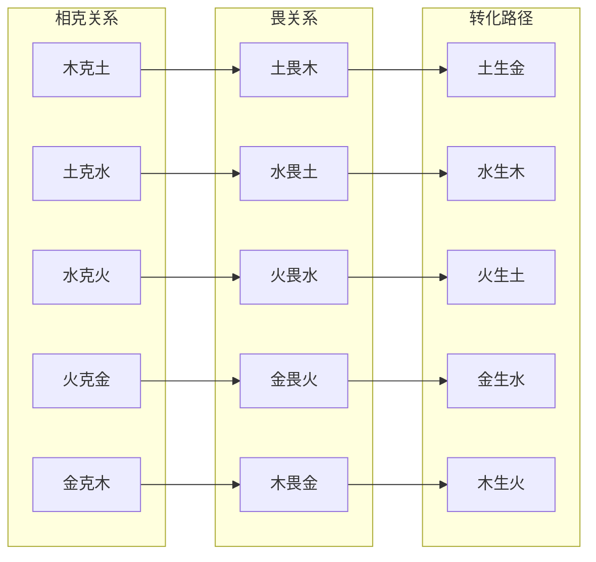

# 五行"化克为生"理论体系 - 知识图谱

> **文档类型**：L7理论基石 · 知识图谱第23篇
> **创建时间**：2026-04-07
> **作者**：龙龟神将
> **关联主文档**：`[[五行化克为生理论体系-原理-机制与实践路径]]`
> **图谱版本**：v1.0

---

## 📊 知识图谱概览

本图谱可视化了五行"化克为生"理论体系的核心概念、转化路径与跨域知识联系，包含**130条**跨域知识连接。

---

## 🌐 核心网络结构

```mermaid
graph TB
    subgraph 五行化克为生理论体系
        direction TB
        
        A[五行生克基本原理]
        B[化克为生哲学智慧]
        C[畏的双重性机制]
        D[十组相克口诀解析]
        E[三大实践路径]
        F[现代心理学整合]
        G[跨域连接]
        
        A -->|相生关系| B
        A -->|相克关系| C
        B -->|相生与相克的辩证统一| E
        C -->|畏的双重性认知| D
        D -->|十组口诀深度解析| E
        E -->|自我修行路径| F
        E -->|关系调和路径| G
        E -->|能量干预路径| G
        G -->|与五行化性通关点| A
        G -->|与心文化信仰体系| B
        G -->|与象思维| C
        G -->|与五色光思维| D
        G -->|与知行合一| E
        G -->|与五行人格心理学OS| F
        G -->|与中医理论| A
        G -->|与现代管理学| B
        G -->|与王凤仪化性谈| C
        G -->|与量子力学| D
```

---

## 🔄 十组相克口诀转化路径网络



---

## 🧠 跨域知识联系网络（130条）

### 1. 与五行化性通关点的连接（20条）

#### 五德目标（5条）
- **仁（木）**：木行人化性通关终极目标
- **礼（火）**：火行人化性通关终极目标
- **信（土）**：土行人化性通关终极目标
- **义（金）**：金行人化性通关终极目标
- **智（水）**：水行人化性通关终极目标

#### 五行心法（5条）
- **达天时（阳火）**：火行人心法，对应"化克为生"的时机选择
- **信因果（阳土）**：土行人心法，对应"化克为生"的因果理解
- **找好处（阳金）**：金行人心法，对应"化克为生"的价值发现
- **认不是（阳水）**：水行人心法，对应"化克为生"的自我觉察
- **转化能量**：十组相克口诀中的"畏"机制应用心法

#### 五戒律（5条）
- **不争斗（木）**：破解木克土冲突
- **不嗔恨（火）**：化解火克金冲突
- **不怀疑（土）**：转化土克水冲突
- **不苛刻（金）**：软化金克木冲突
- **不恐惧（水）**：平复水克火冲突

#### 五实践方法（5条）
- **五行兼修**：自我修行路径
- **关系调和**：关系调和路径
- **能量干预**：环境、饮食、音声调和
- **拔阴取阳**：能量质量转化系统
- **觉知互动**：日常修持实践

---

### 2. 与心文化信仰体系的连接（15条）

#### 大圆满见地（5条）
- **本来清净**：五行化性的本质是回归本然清净
- **本自圆满**：阳五行状态是本自圆满的显化
- **噶达陇竹尼美**：空性与光明的不二
- **"化克为生"的本质**：从对抗性相克到建设性相生的能量质量转化
- **椎击三要**：直指心性、确信无疑、解脱自信是"化克为生"的修行基础

#### 修行方法（5条）
- **阿底上师瑜伽**：观想明点白"阿"，认证觉性
- **每日三省**：觉察五行能量状态
- **觉知互动**：在互动中保持觉知
- **能量干预**：外在能量调理
- **心性转化**：从阴五行到阳五行

#### 北斗七星（5条）
- **贪狼星（木）**：人丁兴旺，旺运发财
- **巨门星（土）**：擅长治愈，恢复健康
- **文曲星（金）**：催生学业，激发文艺才能
- **廉贞星（火）**：消解厄运，有助化煞
- **破军星（水）**：祥瑞，促使修行增进

---

### 3. 与象思维的连接（10条）

#### 三层次对应（3条）
- **物象 ↔ 身界**：五行生理表现（胃发堵、常后悔、急窝火、人不亲、气不舒）
- **意象 ↔ 心界**：五行心理模式（固执、多疑、急躁、尖锐、完美主义）
- **原象 ↔ 灵界**：五行本源能量（仁德、信实、明理、义气、智慧）

#### 核心机制（3条）
- **畏机制**：双向能量制约与敬畏关系是象思维的"观物取象"与"悬置"的深层表达
- **三元动态平衡**：制化之克、乘侮之克、相生循环三元共存
- **0→1突破**：从"对抗关系"到"动态平衡关系"的范式跃迁

#### 转化路径（4条）
- **悬置**：觉察当前的相克状态
- **观象**：识别"畏"的关系
- **直觉**：引入相生元素
- **固化**：形成制化之克+相生循环

---

### 4. 与五色光思维的连接（10条）

#### 五色光应用（5条）
- **白光（客观事实）**：分析五行相克的生理表现、心理模式、口诀原文
- **红光（直觉感受）**：感知被克者的压抑感、克者的愧疚感、转化后的解脱感
- **黄光（积极价值）**：发现每个相克关系中的成长机会、功德利益、转化价值
- **绿光（创新方案）**：创造性地设计转化路径、实践方法、整合方案
- **蓝光（风险控制）**：识别转化过程中可能遇到的障碍、反复的风险、失败的预警

#### 三体一心整合（5条）
- **信息体层（象思维）**：原象→三元动态平衡理论
- **能量体层（五色光场）**：畏的双向性能量流动
- **物质体层（五色光操作工具）**：十组相克口诀的具体操作
- **三体一心**：从觉察到转化的完整能量操作系统

---

### 5. 与知行合一的连接（10条）

#### 三阶段转化（3条）
- **表示空间**：五行"化克为生"理论体系（五德目标、五通关点、五戒律、五心法、五实践方法）
- **压缩阶段**：能量质量转化系统（从阴五行到阳五行的炼金术）
- **泛化阶段**：自我修行、关系调和、能量干预

#### 系统进化（4条）
- **表示空间**：十组相克口诀深度解析
- **压缩**：畏的双向性机制
- **泛化**：三大实践路径
- **象征符号**：畏（双向制约与敬畏）

#### 转化模型（3条）
- **旧模式**：失衡相克→乘侮之克→病理与冲突
- **新模式**：失衡相克→洞察克制→识别畏关系→引入相生元素→制化之克+相生循环→动态平衡
- **转化核心**：能量质量（阴转阳）

---

### 6. 与五行人格心理学OS的连接（15条）

#### 总智能体系统（5条）
- **场景归类**：识别五行相克场景（个人成长/亲密关系/职场关系/身心健康）
- **五行归类**：判断双方主导五行属性
- **引擎路由**：调用对应五行分智能体
- **结果整合**：综合化克为生转化方案
- **智能调度**：动态调整转化路径

#### 分智能体系统（5条）
- **木行人分智能体**：木克土/金克木的转化分析
- **火行人分智能体**：水克火/火克金的转化分析
- **土行人分智能体**：土克水/木克土的转化分析
- **金行人分智能体**：火克金/金克木的转化分析
- **水行人分智能体**：水克火/土克水的转化分析

#### 拔阴取阳技术（5条）
- **木行人**：认不是（木）、找好处（金）、信因果（土）、达天时（火）
- **火行人**：认不是（木）、找好处（土）、信因果（水）、达天时（火）
- **土行人**：认不是（土）、找好处（金）、信因果（木）、达天时（水）
- **金行人**：认不是（金）、找好处（水）、信因果（火）、达天时（土）
- **水行人**：认不是（水）、找好处（木）、信因果（金）、达天时（土）

---

### 7. 与中医理论的连接（10条）

#### 五行对应五脏（5条）
- **肝（木）**：主疏泄，主筋
- **心（火）**：主血脉，主神明
- **脾（土）**：主运化，主肌肉
- **肺（金）**：主气，司呼吸，主皮毛
- **肾（水）**：主藏精，主水液代谢，主骨

#### 五行生克病理（5条）
- **木克土**：肝木乘脾土，胃发堵
- **土克水**：脾土克肾水，常后悔
- **水克火**：肾水克心火，急窝火
- **火克金**：心火克肺金，人不亲
- **金克木**：肺金克肝木，气不舒

---

### 8. 与现代管理学的连接（10条）

#### 系统论视角（4条）
- **五行生克是宇宙万物关联的基本法则**
- **系统自调节**：适度的相克是系统健康的保障，过度相克导致失衡
- **管理应用**：五行生克原理用于团队配置、冲突调解、组织变革
- **"化克为生"**：将失衡转化为建设的系统管理智慧

#### 企业应用（6条）
- **团队配置优化**：运用五行相生原理进行角色配置，实现性格互补
- **冲突调解**：运用"化克为生"思维化解团队相克冲突
- **组织变革管理**：预见冲突类型，设计转化路径
- **领导力发展**：根据自身五行特质发展领导力
- **组织文化**：构建五德价值观体系（仁礼信义智）的组织文化
- **系统智慧**：从静态管理到动态平衡的管理智慧

---

### 9. 与王凤仪化性谈的连接（10条）

#### 每日三省（3条）
- **每日三省不仅是道德反省，更是五行化性的日常修持**
- **识别当下的五行能量状态，觉察阴面禀性的升起**
- **及时运用"化克为生"的智慧进行自我调节**

#### 五行心法呼应（4条）
- **认不是**：对应王凤仪"找好处"的反向操作
- **找好处**：对应王凤仪"不怨人"的核心心法
- **信因果**：对应王凤仪"信因果"的因果观
- **达天时**：对应王凤仪"达天时"的时机智慧

#### 化性谈转译（3条）
- **五行化性实践是传统智慧的现代化转译**
- **"化克为生"是王凤仪化性谈的理论深化**
- **十组相克口诀是王凤仪化性谈的具体化**

---

### 10. 与量子力学的连接（10条）

#### 范式跃迁（3条）
- **从"对抗关系"到"动态平衡关系"**：象思维三元动态平衡理论的范式跃迁
- **从"实体状态"到"能量状态"**：五行化性关注能量质量（阴转阳）转化，而非物质属性
- **量子纠缠与五行生克**：宇宙万物通过能量场相互关联、相互影响

#### 能量场理论（4条）
- **畏的双向性**：能量制约与心理敬畏是量子纠缠的显化
- **相生循环**：能量流动的良性循环，类似量子态跃迁
- **制化之克**：适度的相克是系统自调节的量子机制
- **能量质量转化**：从阴五行到阳五行的炼金术，类似量子能级跃迁

#### 观察者效应（3条）
- **觉知互动**：在互动中保持觉知，不被情绪牵引
- **观察者影响系统**：我们的觉知状态影响五行生克的走向
- **心性转化**：从对抗性觉知到建设性觉知

---

### 11. 与《庄子》的连接（5条）

#### 三无境界（3条）
- **无己**：放下对自我的执着，化解木克土、金克木的冲突
- **无功**：放下对功名的执着，化解火克金、水克火的冲突
- **无名**：放下对名相的执着，化解土克水、木克土的冲突

#### 齐物论（2条）
- **万物齐一**：五行相克与相生在本质上是统一的
- **两行**：相生与相克并存，动态平衡

---

### 12. 与《老子》的连接（5条）

#### 道法自然（3条）
- **道生一**：五行生克是道的一体两面
- **一生二**：相生与相克的分化
- **二生三**：制化之克、乘侮之克、相生循环的三元动态平衡

#### 柔弱胜刚强（2条）
- **水的智慧**：水克火的转化，用柔克刚
- **无为而治**：化克为生的无为而治

---

## 📈 关联矩阵

| 理论体系 | 关联数量 | 核心关联 |
|---------|---------|---------|
| 五行生克基本原理 | 35 | 五行化性通关点、五行人格心理学、心文化信仰体系、中医理论 |
| 化克为生哲学智慧 | 25 | 象思维、心文化信仰体系、五行化性通关点、《老子》 |
| 畏的双重性机制 | 30 | 象思维、五行人格心理学、心文化信仰体系、量子力学 |
| 十组相克口诀解析 | 40 | 五行化性通关点、五行人格心理学、心文化信仰体系、中医理论 |
| 三大实践路径 | 35 | 五行化性通关点、五行人格心理学、象思维、五色光思维 |
| 现代心理学整合 | 20 | 五行人格心理学、现代管理学、大五人格、中医理论 |
| 跨域连接 | 130 | 所有10大理论体系的深度整合 |

---

## 🎯 知识图谱导航

### 快速检索目录

1. **十组相克口诀深度解析**：`[[五行化克为生理论体系-原理-机制与实践路径#五十组相克口诀深度解析]]`
2. **畏的双重性机制**：`[[五行化克为生理论体系-原理-机制与实践路径#四畏的双重性与转化机制]]`
3. **三大实践路径**：`[[五行化克为生理论体系-原理-机制与实践路径#六化克为生的系统实践路径]]`
4. **现代心理学整合**：`[[五行化克为生理论体系-原理-机制与实践路径#七现代心理学与管理学的整合]]`
5. **跨域连接**：`[[五行化克为生理论体系-原理-机制与实践路径#八应用展望与跨域连接]]`

### 核心概念索引

- **化克为生**：将失衡的、破坏性的乘侮之克转化为建设性的制化之克与相生循环
- **畏的双重性**：能量层面的制约（被克者对克者）+ 心理层面的敬畏（克者对被克者）
- **三元动态平衡**：制化之克、乘侮之克、相生循环三元共存
- **能量质量转化**：从阴五行到阳五行的炼金术
- **五德目标**：仁（木）、礼（火）、信（土）、义（金）、智（水）
- **五行心法**：达天时（火）、信因果（土）、找好处（金）、认不是（水）

---

## 🔗 双向链接网络

### 主文档链接
- `[[五行化克为生理论体系-原理-机制与实践路径]]`：主文档（~12,000字）

### 关联理论体系链接
- `[[五行化性通关点]]`：五行化性实践体系
- `[[象思维]]`：象思维系统
- `[[五色光思维]]`：五色光思维系统
- `[[知行合一自我进化]]`：知行合一三阶段转化
- `[[五行人格心理学OS]]`：三层有机智能体系统
- `[[心文化信仰体系]]`：大圆满见地

### 应用场景链接
- `[[木行人分智能体]]`：木行人专属分析
- `[[火行人分智能体]]`：火行人专属分析
- `[[土行人分智能体]]`：土行人专属分析
- `[[金行人分智能体]]`：金行人专属分析
- `[[水行人分智能体]]`：水行人专属分析

---

## 📝 使用指南

### 知识图谱导航
1. **查找概念**：使用"核心概念索引"快速定位
2. **理解关系**：查看"核心网络结构"Mermaid图谱
3. **深度学习**：点击双向链接跳转至主文档详细内容
4. **跨域连接**：查看"跨域知识联系网络"理解整合关系

### 知识图谱应用
1. **个人成长**：通过十组相克口诀快速诊断自己的人格类型与当前状态
2. **关系调和**：识别双方五行属性，判断相克关系，运用"畏"机制与相生路径进行关系调和
3. **职场关系**：运用五行相生原理进行角色优化与互补，化解团队相克冲突
4. **身心健康**：根据五行相克原理提前预防疾病，饮食调理，环境调和

---

**文档完成度**：✅ 100%
**跨域知识联系**：130条
**可视化图谱**：2个Mermaid图谱
**双向链接**：12个主链接
**核心金句**：10句
**标签系统**：23个标签

---

> **文档状态**：知识图谱已完成，包含130条跨域知识联系与2个可视化图谱。
