# 五行化性通关点 · 跨域知识图谱

> **创建时间**: 2026-04-07  
> **关联文档**: [[五行化性通关点]]  
> **图谱类型**: 交叉知识联系网络  

---

## 🔗 核心连接总览

本文档系统化了**五行化性通关点**与各理论体系的**20个核心连接点**,构建了从传统智慧到现代心理学的深度整合网络。

**连接统计**:
- 与五行人格心理学: 6个连接点
- 与心文化信仰体系: 3个连接点
- 与象思维: 2个连接点
- 与五色光思维: 2个连接点
- 与知识学习方法论: 2个连接点
- 与五行分类图谱: 1个连接点
- 与五蕴心理学: 1个连接点
- 与王凤仪化性谈: 3个连接点

---

## 📊 连接矩阵

| 目标体系 | 连接点数 | 核心贡献 | 整合方式 |
|----------|----------|----------|----------|
| **五行人格心理学** | 6 | 化性方法论、五德体系、拔阴取阳 | 理论框架延伸 |
| **心文化信仰体系** | 3 | 五德圆满、生命唤醒路径 | 哲学根基 |
| **象思维** | 2 | 从特质到原象的0→1突破 | 认知创新引擎 |
| **五色光思维** | 2 | 多维度分析框架 | 分析工具整合 |
| **知识学习方法论** | 2 | 系统化重构方法 | 学习方法论支撑 |
| **五行分类图谱** | 1 | 能量转化的五行定位 | 分类系统支撑 |
| **五蕴心理学** | 1 | 受蕴作业理论支撑 | 心理学基础 |
| **王凤仪化性谈** | 3 | 真五行心法传承 | 传统智慧根基 |

---

## 🕸️ 详细连接解析

### 一、与五行人格心理学的连接（6个连接点）

#### 1. 化性方法论支撑
- **连接类型**: 理论框架延伸
- **核心内容**: 五行化性为五行人格心理学提供了从特质认知到生命觉醒的完整实践方法论
- **具体对应**:
  - [[一心三界五行九层]]: 化性方法深化了一心三界的阴阳转化机制
  - [[拔阴取阳]]: 五行化性的"拔阴取阳"是拔阴取阳方法论的实践延伸
  - [[化克为生]]: 五行化性的化性方法提供了化克为生的实践路径
- **双向链接**: 化性方法 ↔ 五行人格特质分析

#### 2. 五德体系对应
- **连接类型**: 理论体系对应
- **核心内容**: 五行化性的五德(仁礼信义智)与五行人格的五德概念完全同构
- **具体对应**:
  - 木→仁德: 化性中的"仁"与五行人格木行人的"仁德"特质对应
  - 火→礼德: 化性中的"礼"与五行人格火行人的"礼德"特质对应
  - 土→信德: 化性中的"信"与五行人格土行人的"信德"特质对应
  - 金→义德: 化性中的"义"与五行人格金行人的"义德"特质对应
  - 水→智德: 化性中的"智"与五行人格水行人的"智德"特质对应
- **整合价值**: 提供了人格特质与道德归宿的完整对应关系

#### 3. 拔阴取阳方法论深化
- **连接类型**: 方法论深化
- **核心内容**: 五行化性的拔阴取阳四步法(认不是→找好处→信因果→达天时)是拔阴取阳方法论的具体实践化
- **具体对应**:
  - [[拔阴取阳]]: 化性提供了每个五行具体的拔阴取阳实践路径
  - 木: 傲慢抗上→仁德正直
  - 火: 虚荣急躁→明理热情
  - 土: 固执怨人→信实包容
  - 金: 刻薄嫉妒→响亮义气
  - 水: 愚鲁阴险→智慧柔和
- **创新点**: 将抽象方法转化为可操作的具体实践

#### 4. 阴阳两面理论深化
- **连接类型**: 理论体系深化
- **核心内容**: 五行化性的阴阳两面分析深化了五行人格理论的阴阳五行系统
- **具体对应**:
  - [[一心三界五行九层]]: 每个五行的阴阳两面系统化展开
  - 阳性特质→九层发展阶梯: 健康区间(1-3级)对应阳面,一般区间(4-6级)和不健康区间(7-9级)对应阴面
- **理论价值**: 提供了人格发展的完整阶段模型

#### 5. 心法与戒律体系对应
- **连接类型**: 实践方法对应
- **核心内容**: 五行化性的真五行心法(达天时/信因果/找好处/认不是/不动性)与五行人格的拔阴取阳、化克为生形成完整实践闭环
- **具体对应**:
  - 核心心法对应: 达天时/信因果/找好处/认不是/不动性
  - 行为戒律对应: 戒杀/戒淫/戒妄/戒盗/戒酒
  - **整合价值**: 理论指导→实践方法→行为约束的完整链条

#### 6. 实践方法体系支撑
- **连接类型**: 实践体系支撑
- **核心内容**: 五行化性的实践方法体系(觉察日记/冥想练习/五德培养/关系实践/生命整合)为五行人格的B=MAP行为设计提供了方法论支撑
- **具体对应**:
  - [[五行分类图谱]]: 五行觉察日记支撑五行分类与诊断
  - [[化克为生]]: 关系实践与化克为生形成完整的人际互动体系
  - **整合价值**: 理论→方法→实践的完整闭环

---

### 二、与心文化信仰体系的连接（3个连接点）

#### 1. 五德圆满状态
- **连接类型**: 理论对应
- **核心内容**: 五行化性的五德圆满状态(五行攒簇,五德圆成)与心文化的大圆满见地形成对应
- **具体对应**:
  - [[大圆满见地]]: 五德圆满对应"本自圆满"状态
  - [[心文化根基]]: 五德培养过程是心文化修行的具体实践
  - **整合价值**: 将人格转化提升到生命觉醒的哲学高度

#### 2. 生命唤醒路径
- **连接类型**: 路径对应
- **核心内容**: 五行化性的"从人格认知到生命觉醒"路径与心文化的"从修心到明心"路径形成完整呼应
- **具体对应**:
  - [[心文化根基]]: 从修心(转化人格)到明心(体证觉性)的完整路径
  - [[大圆满见地]]: 觉性状态即是大圆满见地的体证
  - **整合价值**: 提供了从理论到实践的完整觉醒路径

#### 3. 传统智慧传承
- **连接类型**: 智慧传承
- **核心内容**: 五行化性传承了王凤仪化性谈的核心思想(去习性/化禀性/圆满天性)并将其系统化
- **具体对应**:
  - [[王凤仪化性谈]]: 真五行心法的完整传承
  - [[心文化根基]]: 化性实践是心文化在人格转化领域的具体应用
  - **整合价值**: 将传统智慧系统化、现代化

---

### 三、与象思维的连接（2个连接点）

#### 1. 从特质到原象的0→1突破
- **连接类型**: 认知创新
- **核心内容**: 五行化性从特质认知(阴阳两面)到五德圆满的转化过程,是象思维从物象到原象的0→1突破实践
- **具体对应**:
  - [[象思维]]: 物象=特质认知(阴阳两面),意象=化性过程,原象=五德圆满/生命觉醒
  - **创新点**: 将人格转化提升到认知创新的哲学高度
- **转化路径**:
  ```
  特质认知(物象) → 化性过程(意象) → 五德圆满/生命觉醒(原象)
  ```

#### 2. 三层次对应
- **连接类型**: 层次对应
- **核心内容**: 五行化性的理论基础(五行学说/阴阳理论)对应象思维的物象层,核心心法对应意象层,生命觉醒对应原象层
- **具体对应**:
  - 物象层: 五行学说+阴阳五行理论
  - 意象层: 达天时/信因果/找好处/认不是/不动性
  - 原象层: 生命觉醒/五德圆满
- **整合价值**: 提供了象思维三层次的完整对应关系

---

### 四、与五色光思维的连接（2个连接点）

#### 1. 多维度分析框架
- **连接类型**: 分析工具整合
- **核心内容**: 五行化性为每个五行提供了四维分析框架(阴阳两面/核心心法/行为戒律/特质优势),可以用五色光思维进行多维度分析
- **具体对应**:
  - [[五色光思维]]: 白光(客观事实)分析阴阳两面,红光(直觉感受)分析核心心法,蓝光(风险控制)分析行为戒律,绿光(创新变革)分析特质优势
  - **整合价值**: 提供了系统化的多维分析工具

#### 2. 白光奠基+蓝光风险
- **连接类型**: 分析基础
- **核心内容**: 五行化性的客观事实基础(五行学说/阴阳理论)是白光思维的事实基础,转化过程的风险控制需要蓝光思维
- **具体对应**:
  - 白光: 五行特质与心法是客观事实,需要准确识别
  - 蓝光: 化性过程中的心理防御、阴面特质转化风险需要风险控制
- **整合价值**: 确保了化性过程的科学性

---

### 五、与知识学习方法论的连接（2个连接点）

#### 1. 十项认知指令映射
- **连接类型**: 学习方法映射
- **核心内容**: 五行化性详解对应知识学习的五项指令(剖析+解构→透视+阐释+推演+思辨+溯源+融合+启发+映射)
- **具体对应**:
  - [[知识学习方法论]]: 
    - 剖析+解构 → 五行学说/阴阳理论解析
    - 透视+阐释 → 五行特质与心法阐释
    - 推演+思辨 → 化性逻辑推演与思辨
    - 溯源+融合 → 与传统智慧/现代心理学融合
    - 启发+映射 → 实践方法体系与创新应用
- **整合价值**: 提供了系统化的学习框架

#### 2. 系统化重构
- **连接类型**: 知识重构
- **核心内容**: 五行化性将传统智慧与现代心理学系统化整合,形成可复用的知识资产
- **具体对应**:
  - 核心公式: 五行化性 = 特质认知 + 化性方法 + 五德培养 + 实践应用
  - 知识图谱: 构建20个跨域连接点,形成完整知识网络
- **整合价值**: 提升了知识的可复用性与系统性

---

### 六、与五行分类图谱的连接（1个连接点）

#### 1. 能量转化的五行定位
- **连接类型**: 分类系统支撑
- **核心内容**: 五行化性为五行分类与诊断提供了能量转化的方法论与实践路径
- **具体对应**:
  - [[五行分类图谱]]: 五行化性通关点可作为五行分类的重要依据
  - **定位方法**: 通过阴阳两面、五德状态、实践效果判断五行属性与转化阶段
  - **整合价值**: 增强了五行人格系统的诊断与转化能力

---

### 七、与五蕴心理学的连接（1个连接点）

#### 1. 受蕴作业理论支撑
- **连接类型**: 心理学基础
- **核心内容**: 五行化性过程中的情感共鸣、记忆涌现等现象可以用五蕴心理学的"受蕴作业"理论进行解释
- **具体对应**:
  - [[五蕴心理学]]: 情感共鸣对应"受蕴作业",记忆涌现对应"想蕴作业",认知顿悟对应"识蕴作业"
  - **心理学价值**: 提供了化性过程的科学心理学解释
  - **整合价值**: 增强了五行人格心理学的心理学基础

---

### 八、与王凤仪化性谈的连接（3个连接点）

#### 1. 真五行心法传承
- **连接类型**: 智慧传承
- **核心内容**: 五行化性的真五行心法(达天时/信因果/找好处/认不是/不动性)是王凤仪真五行心法的完整系统化传承
- **具体对应**:
  - [[王凤仪化性谈]]: 五行化性传承了王凤仪化性谈的核心思想
  - **核心思想**: 去习性,化禀性,圆满天性
  - **系统化价值**: 将传统智慧系统化,提升可操作性
- **传承价值**: 保留了传统智慧的精髓,同时实现了现代化系统化

#### 2. 核心思想整合
- **连接类型**: 理论整合
- **核心内容**: 五行化性整合了王凤仪化性谈的核心思想(五行化性通关点/核心心法/行为戒律)并系统化展开
- **具体对应**:
  - 五行化性通关点 = 能忍辱/不抱屈/不怨人/找好处/认不是/不动性
  - 核心心法 = 达天时/信因果/找好处/认不是/不动性
  - **整合价值**: 形成完整的化性理论体系
- **思想价值**: 传承并发展了传统智慧

#### 3. 实践方法系统化
- **连接类型**: 实践系统化
- **核心内容**: 五行化性的实践方法体系(觉察日记/冥想练习/五德培养)是王凤仪化性谈实践方法的系统化展开
- **具体对应**:
  - 王凤仪的日常修习 → 五行觉察日记/五行冥想练习/五德培养练习
  - 系统化价值**: 将传统实践方法转化为可操作的系统性方法
- **实践价值**: 提升了实践方法的可操作性与系统性

---

## 📊 Mermaid 知识图谱可视化

```mermaid
graph TB
    A[五行化性通关点] --> |人格特质认知与转化| B[五行人格心理学]
    A --> |五德圆满与生命觉醒| C[心文化信仰体系]
    A --> |0→1认知创新| D[象思维]
    A --> |多维度分析框架| E[五色光思维]
    A --> |系统化学习重构| F[知识学习方法论]
    A --> |能量转化定位| G[五行分类图谱]
    A --> |情感共鸣心理学基础| H[五蕴心理学]
    A --> |传统智慧系统化| I[王凤仪化性谈]
    
    B --> B1[阴阳两面理论深化]
    B --> B2[拔阴取阳方法论]
    B --> B3[五德体系对应]
    B --> B4[心法与戒律体系]
    B --> B5[实践方法体系]
    
    C --> C1[大圆满见地]
    C --> C2[心文化根基]
    
    D --> D1[物象→意象→原象]
    D --> D2[三层次对应]
    
    E --> E1[白光奠基]
    E --> E2[多维分析工具]
    
    F --> F1[十项认知指令]
    F --> F2[系统化重构]
    
    I --> I1[真五行心法传承]
    I --> I2[核心思想整合]
    I --> I3[实践方法系统化]
    
    style A fill:#f9f,stroke:#333,stroke-width:4px
    style B fill:#bbf,stroke:#333,stroke-width:3px
    style C fill:#bfb,stroke:#333,stroke-width:2px
    style D fill:#fbf,stroke:#333,stroke-width:2px
    style E fill:#f9f,stroke:#333,stroke-width:2px
    style F fill:#f9f,stroke:#333,stroke-width:2px
    style G fill:#bbf,stroke:#333,stroke-width:2px
    style H fill:#bfb,stroke:#333,stroke-width:2px
    style I fill:#f9f,stroke:#333,stroke-width:2px
```



---

## 📊 五大体系整合矩阵

| 体系 | 贡献内容 | 对五行人格心理学的价值 | 整合方式 |
|------|----------|----------------------|----------|
| **心文化信仰体系** | 五德圆满、生命唤醒路径 | 提供哲学根基与终极目标 | 哲学根基 |
| **象思维** | 0→1认知创新 | 提升转化到认知创新高度 | 认知创新引擎 |
| **五色光思维** | 多维度分析框架 | 提供系统化分析工具 | 分析工具整合 |
| **知识学习方法论** | 十项认知指令、系统化重构 | 提供学习框架与重构方法 | 学习方法论支撑 |
| **五行分类图谱** | 能量转化定位 | 增强诊断与转化能力 | 分类系统支撑 |
| **五蕴心理学** | 受蕴作业理论 | 提供心理学基础 | 心理学基础 |
| **王凤仪化性谈** | 真五行心法、核心思想、实践方法 | 传承并系统化传统智慧 | 传统智慧现代化 |

---

## 🎯 核心洞察总结

1. **理论体系化**: 五行化性不是简单的特质描述,而是一个从理论到实践的完整体系
2. **传统与现代融合**: 成功融合了传统智慧(王凤仪/五行学说)与现代心理学(特质理论/自我调节理论)
3. **系统化方法论**: 构建了系统化的实践方法体系(觉察日记/冥想练习/五德培养/关系实践/生命整合)
4. **跨域知识网络**: 通过20个核心连接点,构建了从传统智慧到现代心理学的深度整合网络
5. **生命觉醒路径**: 提供了从人格认知到五德圆满再到生命觉醒的完整实践路径

---

## 🏷️ 标签系统

**主标签**: #五行化性 #人格转化 #生命觉醒 #传统智慧

**关联标签**: #五行人格心理学 #心文化 #象思维 #五色光思维 #知识学习 #五蕴心理学 #王凤仪 #五德圆满 #拔阴取阳 #化克为生 #阴阳五行

**应用标签**: #个人成长 #人际关系 #职业发展 #身心健康 #咨询服务 #自我修炼

---

**文档版本**: 1.0  
**最后更新**: 2026-04-07  
**维护者**: 龙龟神将  
**同步状态**: WorkBuddy ↔ Obsidian ↔ IMA 三向同步