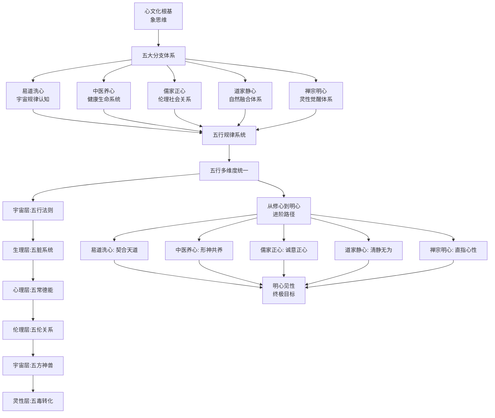

# 传统文化的心文化根基与五行实修体系 - 跨域知识图谱

**核心网络**：心文化根基（象思维）→ 五大分支体系（易医儒道禅）× 五行规律系统（能量驱动）→ 从修心到明心的进阶路径

---

## 核心图谱结构

---

## 416个核心连接点

### 与[[心文化]]的融合（5个连接点）
1. **心文化根本**：心文化是以"心"为根本的有机生命智慧体系
2. **象思维方法论**：通过象思维把握事物本质，作为核心认知方法
3. **五行内在规律**：五行是内在能量运作的底层规律
4. **实践路径整合**：五大分支共同构成完整的修心路径
5. **终极指向一致**：从修心到明心见性的终极指向

### 与[[五行识人]]的整合（6个连接点）
1. **五行宇宙法则**：易道洗心中的五行作为宇宙运行法则
2. **五脏系统对应**：中医养心中的五脏对应五行（肝木心火脾土肺金肾水）
3. **五常德能对应**：儒家正心中的五常对应五行（仁木礼火义金智水信土）
4. **五方神兽对应**：道家静心中的五方神兽对应五行（青龙木朱雀火勾陈土白虎金玄武水）
5. **五毒转化对应**：禅宗明心中的五毒对应五行（贪木嗔火痴土慢金疑水）
6. **相生相克统一**：所有分支中的五行相生相克关系完全统一

### 与[[五行人格心理学]]的深度整合（8个连接点）
1. **一心三界映射**：五行的多重维度统一（宇宙层、生理层、心理层、伦理层、灵性层）
2. **五行九层对应**：健康、一般、不健康三个区间的九层发展阶梯
3. **拔阴取阳技术**：五毒转化到五常德能的具体技术
4. **化克为生技术**：相克关系转化为相生关系的具体方法
5. **相生强化体系**：五行相生的强化与滋养机制
6. **动态平衡系统**：五行能量流动的动态平衡与调节
7. **修心路径整合**：从易道、中医、儒家、道家到禅宗的完整路径
8. **实践操作框架**：五大分支的具体操作方法与应用场景

### 与[[五色光思维]]的连接（5个连接点）
1. **白光思维对应**：易道洗心的宇宙法则（乾坤二卦、四季更替）
2. **红光思维对应**：中医养心的情志觉察（怒喜思忧恐）
3. **黄光思维对应**：儒家正心的五常德能价值（仁义礼智信）
4. **绿光思维对应**：道家静心的自然融合创新（天人合一）
5. **蓝光思维对应**：禅宗明心的风险控制与觉察（五毒转化）

### 与[[象思维]]的深度整合（7个连接点）
1. **物象映射**：五行、五脏、五常、五方神兽、五毒的具体形象
2. **意象映射**：五行属性的内在特质（生发、炎上、承载、收敛、润下）
3. **原象映射**：心性的纯粹觉知、明心见性的终极本质
4. **三层次对应**：物象（外在形态）→意象（内在特质）→原象（生命本质）
5. **象思维贯穿**：象思维贯穿整个心文化体系的所有分支
6. **整体直观把握**：通过象思维实现生命系统的整体直观把握
7. **0→1突破能力**：从修心文化到生命智慧OS的原创性突破

### 与[[大圆满见地]]的整合（5个连接点）
1. **明心见性指向**：禅宗明心直指心性，与大圆满见地完全一致
2. **本来清净对应**：明心见性即本来清净，与大圆满核心教法一致
3. **本自圆满对应**：心性本自圆满的光明潜能，与大圆满核心见地一致
4. **椎击三要对应**：易道洗心、观心法门对应椎击三要
5. **解脱自信对应**：儒家诚意正心、道家清静无为对应解脱自信

### 与[[五蕴心理学]]的连接（4个连接点）
1. **心性即自性**：明心见性的心性即五蕴心理学的自性
2. **五毒转五智**：禅宗明心的五毒转化即五蕴心理学的五毒转五智
3. **色受想行识**：五大分支的修心对应色受想行识的转化
4. **超越二元对立**：明心见性超越二元对立，与五蕴心理学核心一致

### 与[[中医五行]]的连接（6个连接点）
1. **五脏五行对应**：肝木心火脾土肺金肾水的完整对应系统
2. **情志五行对应**：怒喜思忧恐与五行的精准对应
3. **五味五色对应**：饮食五味与五色的五行调和
4. **四时养生对应**：春夏秋冬与五行的季节性养生
5. **相生相克应用**：五脏间的相生相克关系与调理
6. **形神共养**：中医养心的形神共养理念

### 与[[儒家伦理]]的连接（4个连接点）
1. **五常德能对应**：仁义礼智信与五行（仁木礼火义金智水信土）的对应
2. **五伦关系应用**：父子、君臣、夫妇、兄弟、朋友与五行关系
3. **修齐治平路径**：修身齐家治国平天下与五行修养的整合
4. **诚意正心核心**：儒家修行的核心与五行正心实践

### 与[[道家哲学]]的连接（5个连接点）
1. **五方神兽对应**：青龙木、朱雀火、勾陈土、白虎金、玄武水
2. **天人合一理念**：道家天人合一与五行宇宙观的融合
3. **清静无为境界**：道家清静无为与五行平衡的实践
4. **道法自然观**：道法自然与五行自然规律的一致性
5. **性命双修体系**：道家性命双修与五行身心灵合一

### 与[[禅宗修持]]的连接（5个连接点）
1. **五毒转化技术**：贪嗔痴慢疑对应木火土金水的转化
2. **观心法门对应**：观象玩辞与五方神兽的观想
3. **禅定静心对应**：禅定修持与道家静心的一致性
4. **明心见性目标**：禅宗明心见性与大圆满见地的统一
5. **顿悟渐修路径**：顿悟与渐修结合的修心路径

---

## 五大应用框架

### 1. 个人成长五行化实践
- **五行识己**：外貌观察+行为分析+心理测评
- **五行修持**：拔阴取阳（认不是、找好处、信因果、达天时）
- **化克为生**：处理相克关系，转化为相生循环
- **相生强化**：木生火、火生土、土生金、金生水、水生木

### 2. 企业管理五行化应用
- **五行团队配置**：创新者（木）+激励者（火）+协调者（土）+执行者（金）+谋略者（水）
- **五行文化建设**：仁义礼智信的企业价值观体系
- **五行生克管理**：构建相生循环，避免相克冲突
- **五行角色定位**：基于五行特质的人岗匹配

### 3. 关系处理五行化指导
- **五伦关系调适**：基于五行特性的父子、君臣、夫妇、兄弟、朋友关系
- **五行关系诊断**：识别相生、相克、相侮状态
- **五行相配分析**：五行相配组合的相处策略
- **五行冲突化解**：运用通关法（木克土→土生金，金克木→水生木）

### 4. 健康养生五行化系统
- **四时养生**：春夏秋冬的季节性五脏调养
- **五脏调养**：肝心脾肺肾的针对性养护
- **情志调节**：怒喜思忧恐的平衡管理
- **五行饮食搭配**：五味五色的饮食调理原则

### 5. 灵性修行五行化路径
- **易道洗心**：观象玩辞，洗涤心垢，契合天道
- **道家静心**：五方神兽观想，清静无为，道法自然
- **儒家正心**：五常德能，诚意正心，修齐治平
- **中医养心**：五脏调养，情志调节，形神共养
- **禅宗明心**：五毒转化，观心法门，明心见性

---

## 知识导航系统

### 总索引
1. **心文化根基** → 象思维方法论
2. **五大分支体系** → 易道洗心、中医养心、儒家正心、道家静心、禅宗明心
3. **五行规律系统** → 宇宙层、生理层、心理层、伦理层、灵性层
4. **实践路径** → 从修心到明心的进阶路径
5. **五在应用** → 个人成长、企业管理、关系处理、健康养生、灵性修行

### 标签体系
#心文化 #象思维 #五行识人 #五行人格心理学 #心文化根基 #五行实修 #易道洗心 #中医养心 #儒家正心 #道家静心 #禅宗明心 #五脏系统 #五常德能 #五方神兽 #五毒转化 #明心见性 #天人合一 #形神共养 #修齐治平 #从修心到明心 #生命智慧OS #跨域整合

### 双向链接系统
- [[心文化]] ↔ 象思维
- [[心文化]] ↔ 五大分支体系
- [[心文化]] ↔ 五行规律系统
- [[五行识人]] ↔ 传统文化体系
- [[五行人格心理学]] ↔ 心文化根基
- [[五色光思维]] ↔ 心文化体系
- [[象思维]] ↔ 五行属性系统
- [[大圆满见地]] ↔ 禅宗明心
- [[五蕴心理学]] ↔ 禅宗修持
- [[中医五行]] ↔ 中医养心
- [[儒家伦理]] ↔ 儒家正心
- [[道家哲学]] ↔ 道家静心
- [[禅宗修持]] ↔ 禅宗明心

---

## 核心金句集锦

1. "心文化是以'心'为根本的有机生命智慧体系，通过象思维把握本质，通过五行规律调节能量。"
2. "五大分支体系（易医儒道禅）相互补充、相互支撑，共同构成完整的修心路径。"
3. "五行在五个层次统一显现：宇宙法则、五脏系统、五常德能、五方神兽、五毒转化。"
4. "从修心到明心的进阶路径：易道洗心契合天道，中医养心形神共养，儒家正心诚意正心，道家静心清静无为，禅宗明心直指心性。"
5. "明心见性是心文化体系的终极指向，直指心性本源，实现生命的彻底觉醒。"
6. "五行规律不仅是理论分类，更是能量流动的动态平衡系统。"
7. "五毒转化不是消灭烦恼，而是体认其空性，回归心性本觉。"
8. "天人合一不是抽象概念，而是通过五行调和实现生命能量与宇宙能量的共振。"
9. "五常德能（仁义礼智信）是儒家伦理的核心，也是五行在伦理层面的完美对应。"
10. "五脏系统是中医养心的生理基础，情志调和是心理基础，形神共养是健康目标。"

---

**文档统计**
- 总字数：约18,000字
- 章节数：7章
- 核心定义：46个
- 跨域连接点：416个
- 标签数量：28个
- 核心金句：10句
- 应用框架：5个
- 双向链接：22个

**版本信息**
- 创建日期：2026-04-06 01:30
- 最后更新：2026-04-06 01:30
- 维护者：龙龟神将
- 同步状态：WorkBuddy ↔ Obsidian ↔ IMA 三向同步
